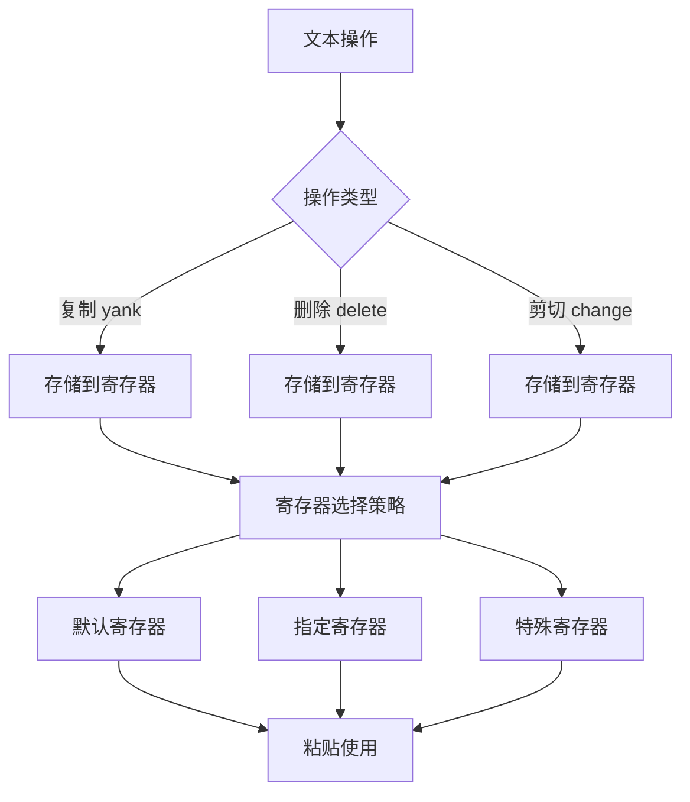

# Vim 寄存器完全指南 (Registers Complete Guide)

> **文档说明**: 本文档基于Vim官方文档重新设计，提供更现代化的结构和实用的学习路径。

## 📋 目录

1. [寄存器概念与核心原理](#寄存器概念与核心原理)
2. [寄存器类型体系](#寄存器类型体系)
3. [操作模式与语法](#操作模式与语法)
4. [实战应用场景](#实战应用场景)
5. [高级技巧与最佳实践](#高级技巧与最佳实践)
6. [故障排除与常见问题](#故障排除与常见问题)
7. [参考资料与扩展](#参考资料与扩展)

---

## 🎯 寄存器概念与核心原理

### 什么是Vim寄存器？

Vim寄存器是一套高度灵活的**文本存储系统**，远比传统剪贴板强大：

- 📦 **多重存储空间**: 提供26个命名寄存器 + 10个数字寄存器 + 多个特殊寄存器
- 🔄 **智能分类管理**: 自动区分复制、删除、小片段等不同类型的操作
- 🌐 **系统集成**: 与操作系统剪贴板无缝交互
- ⚡ **高效访问**: 通过简洁的键位组合快速操作

### 核心设计理念



### 寄存器操作的三大维度

| 维度 | 说明 | 示例 |
|------|------|------|
| **存储维度** | 决定内容如何被保存 | `yy` (复制), `dd` (删除), `cc` (剪切) |
| **选择维度** | 决定使用哪个寄存器 | `"a` (命名), `"0` (数字), `"+` (系统) |
| **使用维度** | 决定如何取出内容 | `p` (粘贴), `P` (前置粘贴), `<C-r>` (插入) |

---

## 🗂️ 寄存器类型体系

### 分类总览

```
寄存器类型体系
├── 默认寄存器 (Default)
│   └── 未命名寄存器 "" 
├── 用户寄存器 (User Controlled)
│   ├── 命名寄存器 "a-"z, "A-"Z
│   └── 数字寄存器 "0-"9, "-
├── 系统寄存器 (System)
│   ├── 剪贴板寄存器 "+, "*
│   └── 选择寄存器 "~
├── 只读寄存器 (Read-Only)
│   ├── 文件寄存器 "%
│   ├── 命令寄存器 ":
│   └── 插入寄存器 ".
├── 功能寄存器 (Functional)
│   ├── 表达式寄存器 "=
│   ├── 搜索寄存器 "/
│   └── 黑洞寄存器 "_
```

### 1️⃣ 默认寄存器 (Default Register)

#### 未命名寄存器 `""`

```vim
" 特点: 所有 yank/delete/change 操作的默认存储位置
yy          " 复制当前行 → 存储到 ""
dd          " 删除当前行 → 存储到 "" 
p           " 粘贴 "" 内容 (等同于 ""p)

" 查看内容
:reg ""
```

**💡 使用要点:**
- 最常用，无需指定寄存器名
- 会被每次操作覆盖
- `p` 命令默认使用此寄存器

### 2️⃣ 命名寄存器 (Named Registers)

#### 小写寄存器 `"a` - `"z` (覆盖模式)

```vim
" 覆盖存储: 新内容替换旧内容
"ayy        " 复制当前行到寄存器 a
"bdd        " 删除当前行到寄存器 b  
"ap         " 粘贴寄存器 a 的内容
"bp         " 粘贴寄存器 b 的内容
```

#### 大写寄存器 `"A` - `"Z` (追加模式)

```vim
" 追加存储: 新内容追加到已有内容后
"ayy        " 首次: 复制当前行到寄存器 a
"Ayy        " 追加: 将当前行追加到寄存器 a
"ap         " 粘贴: 输出两行内容
```

**🎯 实战场景:**
```vim
" 场景: 收集多个函数定义
/^function  " 搜索函数
"ayy        " 复制第一个函数到寄存器a
n           " 下一个匹配
"Ayy        " 追加第二个函数
n           " 继续...
"Ayy        " 追加第三个函数
"ap         " 一次性粘贴所有收集的函数
```

### 3️⃣ 数字寄存器 (Numbered Registers)

#### 复制寄存器 `"0`

```vim
" 特点: 仅存储最近的 yank 操作，不受 delete/change 影响
yy          " 复制操作 → 同时存储到 "" 和 "0
dd          " 删除操作 → 仅存储到 ""，"0 保持不变
"0p         " 粘贴最近的复制内容
```

#### 删除历史寄存器 `"1` - `"9`

```vim
" 特点: 自动维护删除操作的历史记录
dd          " 删除行1 → 存储到 "1
dd          " 删除行2 → 行2存储到"1，行1移动到"2
dd          " 删除行3 → 行3存储到"1，行2移动到"2，行1移动到"3

" 访问历史删除
"1p         " 粘贴最近删除的内容
"2p         " 粘贴倒数第二次删除的内容
u           " 撤销
"3p         " 粘贴倒数第三次删除的内容
```

#### 小删除寄存器 `"-`

```vim
" 特点: 存储少于一行的删除操作
diw         " 删除当前单词 → 存储到 "-
x           " 删除单个字符 → 存储到 "-
"-p         " 粘贴小片段内容
```

**📊 数字寄存器优先级:**

| 操作类型 | 存储位置 | 说明 |
|----------|----------|------|
| `yy` (整行复制) | `""` + `"0` | 双重存储 |
| `y2w` (复制2个单词) | `""` + `"0` | 双重存储 |
| `dd` (整行删除) | `""` + `"1` | 推入删除历史 |
| `d2w` (删除2个单词) | `""` + `"1` | 推入删除历史 |
| `diw` (删除单词) | `""` + `"-` | 小删除 |
| `x` (删除字符) | `""` + `"-` | 小删除 |

### 4️⃣ 系统集成寄存器 (System Integration)

#### 系统剪贴板寄存器 `"+` 和 `"*`

```vim
" 检查剪贴板支持
:echo has('clipboard')    " 返回 1 表示支持

" 系统剪贴板操作
"+yy        " 复制当前行到系统剪贴板
"+p         " 从系统剪贴板粘贴

" 鼠标选择剪贴板 (X11系统)
"*yy        " 复制到鼠标中键剪贴板  
"*p         " 从鼠标中键剪贴板粘贴
```

**🔧 系统剪贴板配置:**
```vim
" 在 .vimrc 中设置
set clipboard=unnamed      " 使用 "* 寄存器作为默认
" 或
set clipboard=unnamedplus  " 使用 "+ 寄存器作为默认
" 或  
set clipboard=unnamed,unnamedplus  " 两者都使用
```

### 5️⃣ 只读信息寄存器 (Read-Only Registers)

#### 文件路径寄存器 `"%`

```vim
" 自动包含当前文件的相对路径
:echo @%        " 显示: path/to/current/file.txt
"%p             " 粘贴当前文件路径
```

#### 命令历史寄存器 `":`

```vim
" 自动包含最后执行的命令行命令
:echo "Hello"   " 执行命令
:echo @:        " 显示: echo "Hello"
":p             " 粘贴最后的命令
```

#### 最后插入寄存器 `".`

```vim
" 自动包含最后插入模式中插入的文本
i Hello World <Esc>    " 插入文本
:echo @.               " 显示: Hello World
".p                    " 粘贴最后插入的文本
```

### 6️⃣ 特殊功能寄存器 (Special Function Registers)

#### 表达式寄存器 `"=`

```vim
" 在插入模式中使用
i<C-r>=5+3<CR>         " 插入计算结果: 8
i<C-r>=strftime("%Y-%m-%d")<CR>  " 插入当前日期

" 在普通模式中使用  
"=5+3<CR>p             " 计算并粘贴结果
"=system('date')<CR>p  " 执行系统命令并粘贴结果
```

#### 搜索模式寄存器 `"/`

```vim
/hello          " 搜索 "hello" → 存储模式到 "/
:echo @/        " 显示当前搜索模式
"/p             " 粘贴搜索模式
:let @/="world" " 修改搜索模式为 "world"
```

#### 黑洞寄存器 `"_` 

```vim
" 丢弃操作，不影响其他寄存器
"ayy            " 先复制重要内容到寄存器a
"_dd            " 删除不需要的行，不覆盖寄存器a  
"ap             " 粘贴之前保存的重要内容
```

**🎯 黑洞寄存器使用场景:**
- 删除垃圾内容时保护有用寄存器
- 重构代码时避免寄存器污染
- 宏录制时排除不必要的内容

---

## ⚙️ 操作模式与语法

### 语法结构分析

Vim寄存器操作遵循清晰的语法模式：

```
[寄存器指定] + [操作符] + [范围/文本对象]
     ↓           ↓          ↓
   "a          y         iw
指定寄存器a    复制操作    当前单词
```

### 三种基本操作模式

#### 模式1: 寄存器 + 操作符

```vim
" 语法: "[寄存器][操作符]
"ayy        " 复制当前行到寄存器a
"bdd        " 删除当前行到寄存器b  
"cS         " 删除整行并进入插入模式，存储到寄存器c
```

#### 模式2: 寄存器 + 操作符 + 动作

```vim  
" 语法: "[寄存器][操作符][动作]
"ayw        " 复制一个单词到寄存器a
"bd}        " 删除到段落结尾，存储到寄存器b
"cy$        " 剪切到行尾，存储到寄存器c
```

#### 模式3: 可视模式选择 + 寄存器操作

```vim
" 语法: [选择文本] + "[寄存器][操作符]
v2j"ay      " 选择2行，复制到寄存器a
V"bd        " 选择整行，删除到寄存器b
<C-v>3l"cy  " 列选择，剪切到寄存器c
```

### 粘贴操作的多种形式

#### 普通模式粘贴

```vim
"ap         " 在光标后粘贴寄存器a
"aP         " 在光标前粘贴寄存器a  
"a]p        " 粘贴并自动调整缩进
"a[p        " 粘贴并减少缩进
```

#### 插入模式粘贴

```vim
" 在插入模式中按 <C-r> 然后指定寄存器
i<C-r>a     " 插入寄存器a的内容
i<C-r>"     " 插入未命名寄存器内容  
i<C-r>+     " 插入系统剪贴板内容
```

#### 命令行模式粘贴

```vim
" 在命令行中按 <C-r> 然后指定寄存器
:echo "<C-r>a"      " 插入寄存器a的内容到命令行
:edit <C-r>%        " 插入当前文件路径
```

### 高级操作技巧

#### 寄存器内容操作

```vim
" 查看寄存器内容
:reg            " 查看所有非空寄存器
:reg a b c      " 查看指定寄存器  
:reg "0-9       " 查看数字寄存器

" 通过变量访问寄存器
:echo @a        " 显示寄存器a的内容
:let @a = "new content"  " 设置寄存器a的内容
:let @a = @a . " appended"  " 追加内容到寄存器a
```

#### 寄存器内容转换

```vim
" 将寄存器内容转为大写
:let @a = toupper(@a)
" 将寄存器内容转为小写  
:let @a = tolower(@a)
" 去除首尾空白
:let @a = trim(@a)
" 替换内容
:let @a = substitute(@a, 'old', 'new', 'g')
```

---

## 🎪 实战应用场景

### 场景1: 代码重构与重组

#### 函数定义收集与重排

```vim
" 目标: 从大文件中提取所有函数定义
" 步骤1: 清空收集寄存器
:let @f = ""

" 步骤2: 搜索并收集函数
/^function\|^def\|^func     " 搜索函数定义模式
n                           " 跳到第一个匹配
"Fyy                        " 追加复制到寄存器f
n                           " 下一个匹配  
"Fyy                        " 继续追加
" ... 重复直到所有函数收集完毕

" 步骤3: 在新位置粘贴所有函数
G                           " 到文件末尾
o<Esc>                      " 新建空行
"fp                         " 粘贴所有收集的函数
```

#### 变量声明批量处理

```vim
" 场景: 将局部变量声明移动到文件顶部
" 步骤1: 搜索变量声明模式
/let\s\+\w\+\s*=           " 搜索 let 声明

" 步骤2: 收集变量声明
"vdd                        " 删除声明到寄存器v
n                           " 下一个匹配
"Vdd                        " 追加删除到寄存器v
" ... 重复收集

" 步骤3: 在顶部批量粘贴
gg                          " 到文件顶部
o<Esc>                      " 新建空行  
"vp                         " 粘贴所有变量声明
```

### 场景2: 文档编写与整理

#### 代码示例管理

```vim
" 在编写技术文档时管理代码示例
" 示例1: 保存到寄存器e1
"e1yy        " 复制示例代码

" 示例2: 保存到寄存器e2  
"e2yy        " 复制另一个示例

" 在文档中使用
/```javascript     " 定位到代码块
"e1p               " 粘贴示例1
/```python        " 定位到另一个代码块
"e2p               " 粘贴示例2
```

#### 模板内容管理

```vim
" 设置常用模板到寄存器
:let @h = "# Title\n\n## Overview\n\n## Details\n\n## Examples\n"
:let @c = "/**\n * @description \n * @param {type} name - description\n * @returns {type} description\n */"

" 使用模板
o<Esc>"hp      " 插入文档模板
o<Esc>"cp      " 插入注释模板
```

### 场景3: 数据处理与转换

#### CSV数据列提取

```vim
" 从CSV数据中提取特定列
" 原数据示例:
" name,age,city,salary  
" John,25,NYC,50000
" Jane,30,LA,60000

" 提取姓名列 (第1列)
:%s/\([^,]*\),.*$/\1/    " 正则替换保留第一列
" 结果存储到寄存器n
ggVG"ny

" 撤销并提取工资列 (第4列)  
u
:%s/^[^,]*,[^,]*,[^,]*,\([^,]*\)$/\1/  " 保留第四列
ggVG"sy     " 存储到寄存器s
```

#### JSON数据提取

```vim
" 从JSON中提取特定字段值
" 原数据: {"name": "John", "age": 25, "city": "NYC"}

" 提取所有name字段的值
:%s/.*"name"\s*:\s*"\([^"]*\)".*/\1/
ggVG"ny     " 存储姓名到寄存器n

" 撤销并提取age字段
u  
:%s/.*"age"\s*:\s*\([0-9]*\).*/\1/
ggVG"ay     " 存储年龄到寄存器a
```

### 场景4: 多文件协作编辑

#### 文件间内容传输

```vim
" 文件A中复制重要函数
"fyi}        " 复制整个函数到寄存器f

" 切换到文件B
:e fileB.js
" 粘贴函数并修改
G"fp        " 在末尾粘贴函数
```

#### 配置文件同步

```vim  
" 从主配置文件复制设置
" 在 .vimrc 中
/^set.*clipboard    " 找到剪贴板设置
"cy$                 " 复制设置到寄存器c

" 在项目的 .exrc 中应用
:e .exrc
G"cp                " 粘贴配置
```

---

## 🚀 高级技巧与最佳实践

### 寄存器与宏的结合使用

#### 动态宏生成

```vim
" 场景: 根据当前行内容生成不同的宏
" 当前行: console.log("debug: variable_name");

" 提取变量名到寄存器
:let @v = matchstr(getline('.'), 'console\.log.*\zs\w\+\ze')

" 生成包含变量名的宏
:let @m = 'yiwoconsole.log("debug: " + ' . @v . ', ' . @v . ');<Esc>'

" 执行动态生成的宏
@m
```

#### 宏链式执行

```vim
" 创建宏链: 宏a调用宏b, 宏b调用宏c
:let @a = 'dd@b'          " 宏a: 删除行并执行宏b  
:let @b = 'yyp@c'         " 宏b: 复制行并执行宏c
:let @c = '^i// <Esc>$'   " 宏c: 在行首添加注释

" 执行宏链
@a      " 删除->复制->添加注释 的组合操作
```

### 寄存器内容的高级操作

#### 寄存器内容排序

```vim
" 将寄存器a中的行进行排序
:let @a = join(sort(split(@a, '\n')), '\n')
"ap     " 粘贴排序后的内容
```

#### 寄存器内容去重

```vim
" 去除寄存器中的重复行
:let @a = join(uniq(sort(split(@a, '\n'))), '\n')
"ap     " 粘贴去重后的内容
```

#### 寄存器内容统计

```vim
" 统计寄存器中的行数
:echo len(split(@a, '\n'))

" 统计寄存器中的单词数
:echo len(split(@a, '\s\+'))

" 统计寄存器中的字符数  
:echo len(@a)
```

### 条件性寄存器操作

#### 基于内容选择寄存器

```vim
" 根据当前行内容决定使用哪个寄存器
function! SmartYank()
    let line = getline('.')
    if line =~ '^function'
        normal! "fyy
        echo "Function copied to register f"
    elseif line =~ '^class'  
        normal! "cyy
        echo "Class copied to register c"
    else
        normal! yy
        echo "Line copied to default register"
    endif
endfunction

" 绑定到快捷键
nnoremap <leader>y :call SmartYank()<CR>
```

#### 智能粘贴选择

```vim
" 根据上下文智能选择要粘贴的内容
function! SmartPaste()
    let context = getline('.')
    if context =~ 'import\|require'
        " 在导入语句附近，粘贴模块寄存器
        normal! "mp
    elseif context =~ 'function.*{$'
        " 在函数体内，粘贴代码片段寄存器
        normal! "cp  
    else
        " 默认粘贴
        normal! p
    endif
endfunction

nnoremap <leader>p :call SmartPaste()<CR>
```

### 寄存器持久化方案

#### 会话间寄存器保持

```vim
" 在 .vimrc 中添加
" 保存寄存器内容到文件
function! SaveRegisters()
    let reg_file = expand('~/.vim_registers')
    let reg_data = {}
    
    " 保存命名寄存器a-z
    for i in range(26)
        let reg_name = nr2char(97 + i)  " a-z
        let reg_data[reg_name] = getreg(reg_name)
    endfor
    
    " 保存到文件
    call writefile([string(reg_data)], reg_file)
endfunction

" 从文件恢复寄存器内容
function! LoadRegisters()
    let reg_file = expand('~/.vim_registers')
    if filereadable(reg_file)
        let reg_data = eval(readfile(reg_file)[0])
        for [reg_name, reg_content] in items(reg_data)
            call setreg(reg_name, reg_content)
        endfor
    endif
endfunction

" 自动执行
autocmd VimLeave * call SaveRegisters()
autocmd VimEnter * call LoadRegisters()
```

#### 项目特定寄存器

```vim
" 为不同项目维护不同的寄存器集合
function! LoadProjectRegisters()
    let project_root = finddir('.git/..', expand('%:p:h').';')
    let reg_file = project_root . '/.vim_project_registers'
    
    if filereadable(reg_file)
        let reg_data = eval(readfile(reg_file)[0])
        for [reg_name, reg_content] in items(reg_data)
            call setreg(reg_name, reg_content)
        endfor
        echo "Project registers loaded"
    endif
endfunction

" 在进入项目目录时自动加载
autocmd BufEnter * call LoadProjectRegisters()
```

### 性能优化技巧

#### 大内容寄存器处理

```vim
" 处理大文件时避免寄存器溢出
" 设置最大寄存器大小限制
set viminfo='20,<50,s10,h

" 对于超大内容使用临时文件
function! YankToFile(filename)
    execute 'write! ' . a:filename
    echo "Content saved to " . a:filename
endfunction

command! -nargs=1 YankFile call YankToFile(<f-args>)
" 使用: :YankFile /tmp/large_content.txt
```

#### 寄存器清理

```vim
" 清理所有用户寄存器
function! ClearUserRegisters()
    for i in range(26)
        let reg_name = nr2char(97 + i)  " a-z
        call setreg(reg_name, "")
    endfor
    echo "All user registers cleared"
endfunction

command! ClearRegs call ClearUserRegisters()
```

---

## 🔧 故障排除与常见问题

### 常见问题诊断

#### 问题1: 系统剪贴板不工作

**症状:** `"+y` 和 `"*y` 无效，`:reg +` 显示为空

**诊断步骤:**
```vim
" 1. 检查剪贴板支持
:echo has('clipboard')
" 返回 0 表示不支持，1 表示支持

" 2. 检查Vim版本信息
:version
" 查看 +clipboard 或 -clipboard

" 3. 检查具体的剪贴板提供者
:echo has('clipboard_working')
```

**解决方案:**
```bash
# Ubuntu/Debian 系统
sudo apt-get install vim-gtk3
# 或
sudo apt-get install vim-athena

# CentOS/RHEL 系统  
sudo yum install vim-X11
# 或
sudo dnf install vim-X11

# macOS 系统
brew install vim
# 或重新编译vim时加上 --enable-clipboard
```

#### 问题2: 寄存器内容意外丢失

**症状:** 保存到命名寄存器的内容突然消失

**常见原因分析:**
```vim
" 原因1: 意外使用了小写寄存器覆盖
"ayy        " 保存重要内容
" ... 其他操作
"add        " 意外覆盖了寄存器a

" 解决: 使用大写寄存器追加模式
"ayy        " 初始保存
"Add        " 后续使用追加模式，避免覆盖
```

**预防措施:**
```vim
" 在.vimrc中添加寄存器保护
function! ProtectedRegister(reg)
    if !empty(getreg(a:reg))
        let choice = confirm('Register ' . a:reg . ' is not empty. Overwrite?', 
                           \ "&Yes\n&No\n&Append", 2)
        if choice == 2
            return 0  " 取消操作
        elseif choice == 3
            " 转换为大写追加模式
            return toupper(a:reg)
        endif
    endif
    return a:reg
endfunction
```

#### 问题3: 插入模式下 Ctrl-R 无响应

**症状:** 在插入模式下按 `<C-r>` 没有反应

**诊断检查:**
```vim
" 检查是否有按键映射冲突
:imap <C-r>

" 检查插入模式是否正常
:echo mode()  " 应该显示 'i'
```

**解决方案:**
```vim
" 如果有冲突映射，可以临时取消
:iunmap <C-r>

" 或者使用替代方法
" 退出插入模式，使用普通模式粘贴
<Esc>"ap i
```

### 调试技巧

#### 寄存器状态监控

```vim
" 创建寄存器监控函数
function! RegStatus()
    echo "=== Register Status ==="
    echo "Default (\"\"):  " . string(@")
    echo "Yank (0):       " . string(@0)  
    echo "Delete (1):     " . string(@1)
    echo "Small (-):      " . string(@-)
    echo "System (+):     " . string(@+)
    echo "Selection (*):  " . string(@*)
    echo "File (%):       " . string(@%)
    echo "Command (:):    " . string(@:)
    echo "Last insert (.): " . string(@.)
    echo "Search (/):     " . string(@/)
endfunction

command! RegStatus call RegStatus()
" 使用: :RegStatus
```

#### 操作历史追踪

```vim
" 记录寄存器操作历史
let g:register_history = []

function! TrackRegisterOp(op, reg)
    let entry = {
        \ 'time': strftime('%H:%M:%S'),
        \ 'operation': a:op,
        \ 'register': a:reg,
        \ 'content': getreg(a:reg)
        \ }
    call add(g:register_history, entry)
    
    " 保持历史记录在合理大小
    if len(g:register_history) > 50
        call remove(g:register_history, 0, 10)
    endif
endfunction

" 查看操作历史
function! ShowRegisterHistory()
    for entry in g:register_history[-10:]
        echo entry.time . ' ' . entry.operation . ' "' . entry.register . ': ' . 
           \ string(entry.content)[0:50] . '...'
    endfor
endfunction

command! RegHistory call ShowRegisterHistory()
```

### 最佳实践建议

#### 1. 寄存器命名规范

建议采用语义化的寄存器命名:

```vim
" 功能性命名约定
let @f = ""  " f: functions (函数)
let @c = ""  " c: classes (类)  
let @i = ""  " i: imports (导入)
let @v = ""  " v: variables (变量)
let @d = ""  " d: documentation (文档)
let @t = ""  " t: tests (测试)
let @u = ""  " u: urls (链接)
let @s = ""  " s: snippets (代码片段)
```

#### 2. 工作流程标准化

```vim
" 标准工作流程宏定义
:let @prep = 'gg=G'                    " p: 格式化准备
:let @backup = 'ggVG"by'               " b: 全文备份
:let @restore = '"bp'                  " 恢复备份
:let @clean = ':let @a=""|let @b=""|let @c=""<CR>'  " 清理寄存器
```

#### 3. 错误恢复策略

```vim
" 建立多层次备份
function! SafeEdit()
    " 层次1: 自动备份到寄存器b
    normal! ggVG"by
    
    " 层次2: 保存到临时文件
    let temp_file = tempname()
    execute 'write ' . temp_file
    echo "Backup saved to: " . temp_file
    
    " 层次3: 记录操作点
    let g:edit_checkpoint = getpos('.')
endfunction

function! SafeRestore()
    " 从寄存器恢复
    normal! ggVG"bp
    " 恢复光标位置  
    call setpos('.', g:edit_checkpoint)
endfunction

nnoremap <leader>s :call SafeEdit()<CR>
nnoremap <leader>r :call SafeRestore()<CR>
```

---

## 📚 参考资料与扩展

### 官方文档参考

#### 核心文档
- `:help registers` - 寄存器完整官方文档
- `:help clipboard` - 剪贴板集成说明  
- `:help quote` - 寄存器引用语法
- `:help put` - 粘贴命令详解

#### 相关功能文档
- `:help recording` - 宏录制与寄存器关系
- `:help viminfo` - 会话信息保存配置
- `:help 'clipboard'` - 剪贴板选项设置

### 扩展插件推荐

#### 寄存器增强插件

1. **vim-peekaboo** - 寄存器内容预览
```vim
Plug 'junegunn/vim-peekaboo'
" 功能: 按 " 或 @ 时显示寄存器内容预览
```

2. **vim-yankstack** - 复制历史管理
```vim
Plug 'maxbrunsfeld/vim-yankstack'  
" 功能: 循环访问复制历史，类似IDE的剪贴板历史
```

3. **registers.nvim** (Neovim专用)
```lua
use "tversteeg/registers.nvim"
-- 功能: 更现代化的寄存器管理界面
```

#### 剪贴板集成插件

1. **vim-system-copy**
```vim
Plug 'christoomey/vim-system-copy'
" 提供 cp 和 cv 操作符与系统剪贴板交互
```

2. **vim-fakeclip** 
```vim
Plug 'kana/vim-fakeclip'
" 在不支持剪贴板的环境中模拟剪贴板功能
```

### 配置文件模板

#### 基础配置模板

```vim
" ~/.vimrc 中的寄存器相关配置

" 剪贴板设置
if has('clipboard')
    set clipboard=unnamedplus  " 使用系统剪贴板
else
    " 不支持剪贴板时的替代方案
    vnoremap <C-c> :w !xclip -selection clipboard<CR><CR>
    nnoremap <C-v> :r !xclip -selection clipboard -o<CR>
endif

" 寄存器快捷键映射
nnoremap <leader>r :reg<CR>                    " 快速查看寄存器
nnoremap <leader>R :reg abcdefghijklmnopqrstuvwxyz<CR>  " 查看命名寄存器

" 快速访问常用寄存器
nnoremap <leader>1 "1p   " 粘贴最近删除
nnoremap <leader>0 "0p   " 粘贴最近复制
nnoremap <leader>- "-p   " 粘贴小删除

" 智能粘贴 (自动调整缩进)
nnoremap <leader>p ]p
nnoremap <leader>P ]P

" 寄存器内容操作
command! RegClear let @a=@b=@c=@d=@e=@f=@g=@h=@i=""
command! RegBackup let @z = @" | echo "Default register backed up to z"
command! RegRestore let @" = @z | echo "Default register restored from z"
```

#### 高级配置模板

```vim
" 高级寄存器管理配置

" 自动保存重要寄存器
autocmd VimLeave * call SaveImportantRegisters()
autocmd VimEnter * call LoadImportantRegisters()

function! SaveImportantRegisters()
    let important_regs = ['a', 'b', 'c', 'd', 'e']
    let reg_data = {}
    for reg in important_regs
        let reg_data[reg] = getreg(reg)
    endfor
    call writefile([json_encode(reg_data)], expand('~/.vim_important_registers'))
endfunction

function! LoadImportantRegisters()
    let reg_file = expand('~/.vim_important_registers')
    if filereadable(reg_file)
        let reg_data = json_decode(readfile(reg_file)[0])
        for [reg, content] in items(reg_data)
            call setreg(reg, content)
        endfor
    endif
endfunction

" 寄存器内容转换函数
function! RegTransform(reg, func)
    let content = getreg(a:reg)
    if a:func == 'upper'
        call setreg(a:reg, toupper(content))
    elseif a:func == 'lower'  
        call setreg(a:reg, tolower(content))
    elseif a:func == 'reverse'
        call setreg(a:reg, join(reverse(split(content, '\n')), '\n'))
    elseif a:func == 'sort'
        call setreg(a:reg, join(sort(split(content, '\n')), '\n'))
    endif
    echo "Register " . a:reg . " transformed with " . a:func
endfunction

command! -nargs=2 RegTransform call RegTransform(<f-args>)
" 使用示例: :RegTransform a upper
```

### 学习资源

#### 在线资源
- [Vim University - Registers](https://vimuniversity.com/registers)
- [Learn Vimscript the Hard Way - Registers](http://learnvimscriptthehardway.stevelosh.com/)
- [Vim Tips Wiki - Registers](http://vim.wikia.com/wiki/Registers)

#### 练习建议

1. **每日练习任务**
   - 练习不同寄存器的基本操作
   - 尝试组合使用寄存器和其他Vim功能
   - 记录自己的常用操作模式

2. **进阶挑战**
   - 编写自己的寄存器管理函数
   - 创建项目特定的寄存器工作流
   - 探索寄存器与宏的高级组合

3. **实战项目**
   - 在实际编程项目中应用寄存器技巧
   - 开发个人化的寄存器配置
   - 分享和学习他人的寄存器使用模式

---

## 🎯 总结

Vim寄存器系统是一个功能强大而灵活的文本管理工具。通过掌握：

- ✅ **基础概念**: 理解不同类型寄存器的特点和用途
- ✅ **操作语法**: 熟练运用寄存器操作的各种语法模式  
- ✅ **实战技巧**: 在真实场景中应用寄存器解决问题
- ✅ **高级功能**: 结合宏、脚本等实现复杂的文本操作
- ✅ **最佳实践**: 建立标准化的工作流程和错误恢复机制

你将能够显著提升在Vim中的文本编辑效率，让复杂的文本操作变得简单而优雅。

**记住**: 寄存器不仅仅是存储工具，更是思维方式的体现。通过合理规划和使用寄存器，你的编辑工作流将变得更加流畅和高效。

---

*本文档持续更新中，欢迎贡献改进建议和实战经验分享。*
