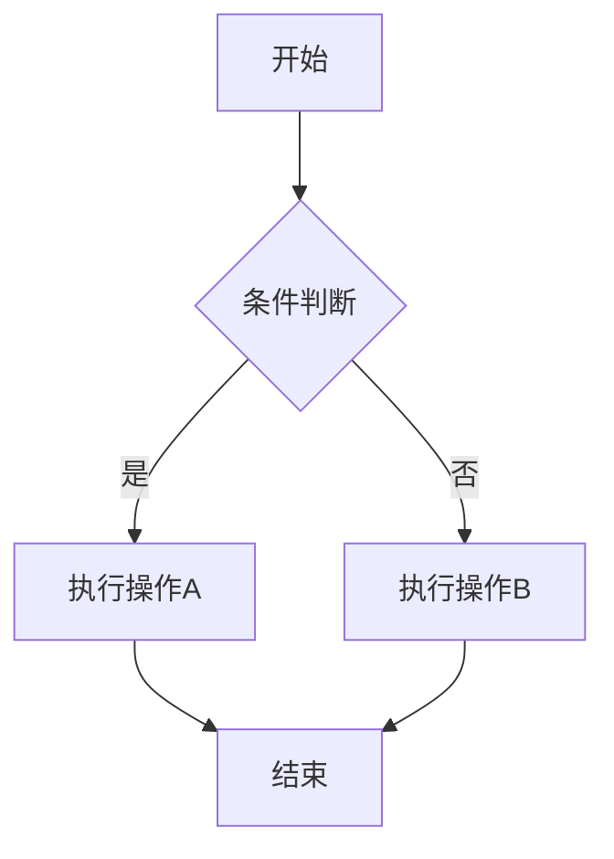
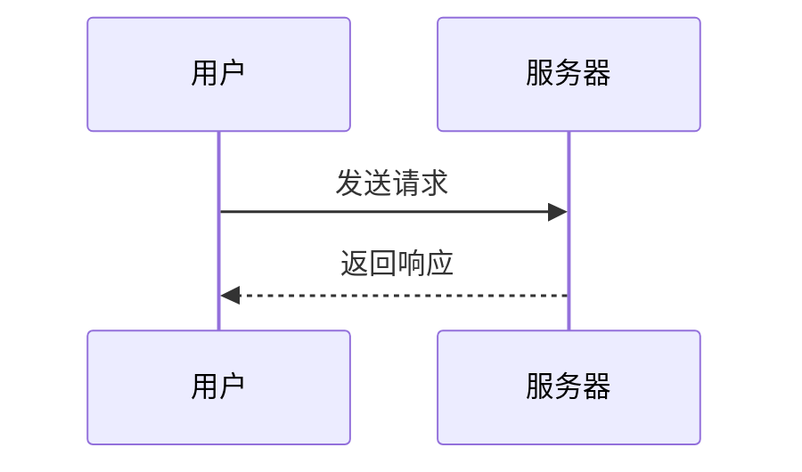
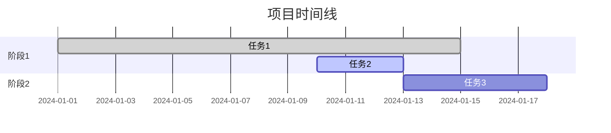
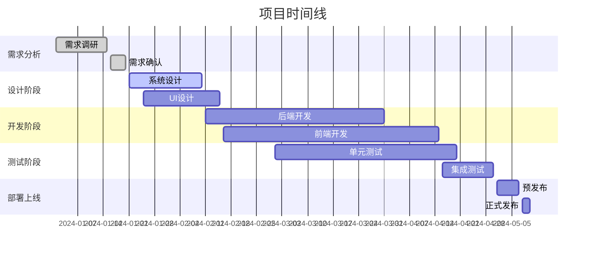
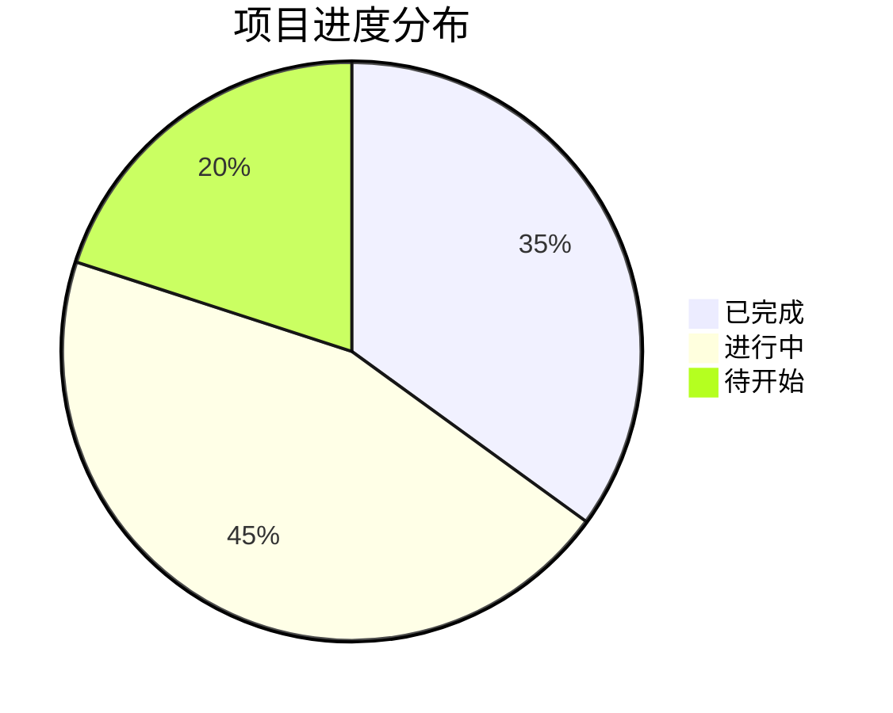

# Markdown 完整指南

> *轻量级标记语言的艺术*

## 目录

- [1. 概述](#1-概述)
- [2. 基础语法](#2-基础语法)
- [3. 高级特性](#3-高级特性)
- [4. 扩展功能](#4-扩展功能)
- [5. 最佳实践](#5-最佳实践)
- [6. 工具生态](#6-工具生态)
- [7. 实际应用](#7-实际应用)

---

## 1. 概述

### 1.1 什么是 Markdown

Markdown 是一种轻量级标记语言，由 [John Gruber](https://daringfireball.net/) 在 2004 年创建。它使用简单的语法来格式化纯文本，可以轻松转换为 HTML 和其他格式。

**核心理念：**
- **可读性优先**：即使在源代码形式下也保持良好的可读性
- **简单易学**：使用直观的符号来表示格式
- **跨平台兼容**：纯文本格式，可在任何系统上使用

### 1.2 历史与发展

```timeline
2004: John Gruber 发布 Markdown 初版
2012: CommonMark 项目启动，旨在标准化 Markdown
2014: GitHub Flavored Markdown (GFM) 发布
2016: CommonMark 0.27 规范发布
2021: Markdown 在各大平台广泛采用
```

### 1.3 标准与变种

| 标准/变种 | 描述 | 主要特性 |
|-----------|------|----------|
| **Original Markdown** | John Gruber 的原始实现 | 基础语法，简单实用 |
| **CommonMark** | 标准化规范 | 消除歧义，增强兼容性 |
| **GitHub Flavored Markdown (GFM)** | GitHub 扩展版本 | 表格、代码块、任务列表 |
| **Markdown Extra** | PHP 扩展版本 | 脚注、定义列表、表格 |
| **MultiMarkdown** | 增强功能版本 | 元数据、数学公式、引用 |

---

## 2. 基础语法

### 2.1 标题

Markdown 支持两种标题语法：

#### ATX 风格标题（推荐）
```markdown
# 一级标题
## 二级标题
### 三级标题
#### 四级标题
##### 五级标题
###### 六级标题
```

#### Setext 风格标题
```markdown
一级标题
========

二级标题
--------
```

**输出效果：**

# 一级标题
## 二级标题
### 三级标题

### 2.2 文本格式

#### 基础格式

| 语法 | 效果 | 示例 |
|------|------|------|
| `*斜体*` 或 `_斜体_` | *斜体* | *这是斜体文本* |
| `**粗体**` 或 `__粗体__` | **粗体** | **这是粗体文本** |
| `***粗斜体***` | ***粗斜体*** | ***这是粗斜体文本*** |
| `~~删除线~~` | ~~删除线~~ | ~~这是删除线文本~~ |
| `` `行内代码` `` | `行内代码` | 这是 `console.log()` 函数 |

#### 高级格式
```markdown
- ==高亮文本==（部分编辑器支持）
- H~2~O 下标（部分编辑器支持）
- X^2^ 上标（部分编辑器支持）
```

### 2.3 段落与换行

#### 段落
段落由一个或多个连续的文本行组成，通过一个或多个空行分隔。

```markdown
这是第一个段落。

这是第二个段落。
```

#### 换行
- **硬换行**：行尾添加两个或更多空格，然后按回车
- **软换行**：直接按回车（在某些渲染器中不会产生换行）

```markdown
第一行内容  
第二行内容（硬换行）

第三行内容
第四行内容（软换行，可能不生效）
```

### 2.4 列表

#### 无序列表
```markdown
- 项目一
- 项目二
  - 子项目 2.1
  - 子项目 2.2
- 项目三

* 使用星号
+ 使用加号
- 使用减号
```

#### 有序列表
```markdown
1. 第一项
2. 第二项
   1. 子项目 2.1
   2. 子项目 2.2
3. 第三项

1. 数字可以不连续
8. 渲染时会自动纠正
3. 但建议保持连续
```

#### 任务列表（GFM 扩展）
```markdown
- [x] 已完成任务
- [ ] 未完成任务
- [ ] 另一个未完成任务
```

### 2.5 链接

#### 行内链接
```markdown
[显示文本](URL "可选标题")
[GitHub](https://github.com "全球最大代码托管平台")
```

#### 引用链接
```markdown
[显示文本][引用标识]

[引用标识]: URL "可选标题"

示例：
[GitHub][gh] 是一个很好的平台。

[gh]: https://github.com "GitHub"
```

#### 自动链接
```markdown
<https://github.com>
<email@example.com>
```

### 2.6 图像

#### 基础语法
```markdown


```

#### 引用式图像
```markdown
![alt文本][图像标识]

[图像标识]: 图片URL "可选标题"
```

#### 带链接的图像
```markdown
[](链接URL)
```

### 2.7 引用

#### 基础引用
```markdown
> 这是一个引用块。
> 可以包含多行内容。
>
> 引用块可以包含其他 Markdown 元素。
```

#### 嵌套引用
```markdown
> 第一级引用
>
> > 第二级引用
> >
> > > 第三级引用
```

#### 引用中的其他元素
```markdown
> ## 引用中的标题
>
> - 引用中的列表项
> - 另一个列表项
>
> **引用中的粗体文本**
```

---

## 3. 高级特性

### 3.1 代码块

#### 缩进代码块
```markdown
    function hello() {
        console.log("Hello, World!");
    }
```

#### 围栏代码块
```markdown
```javascript
function hello() {
    console.log("Hello, World!");
}
```
```

#### 语法高亮支持的语言
```markdown
```python
def hello():
    print("Hello, Python!")
```

```rust
fn main() {
    println!("Hello, Rust!");
}
```

```sql
SELECT * FROM users WHERE active = 1;
```

```json
{
  "name": "example",
  "version": "1.0.0"
}
```
```

### 3.2 表格（GFM 扩展）

#### 基础表格
```markdown
| 姓名 | 年龄 | 城市 |
|------|------|------|
| 张三 | 25   | 北京 |
| 李四 | 30   | 上海 |
| 王五 | 28   | 广州 |
```

#### 对齐方式
```markdown
| 左对齐 | 居中对齐 | 右对齐 |
|:-------|:--------:|-------:|
| 左     | 中       | 右     |
| Left   | Center   | Right  |
```

#### 表格中的格式
```markdown
| 功能 | 语法 | 示例 |
|------|------|------|
| **粗体** | `**文本**` | **重要信息** |
| *斜体* | `*文本*` | *强调内容* |
| `代码` | `` `代码` `` | `console.log()` |
| [链接](https://github.com) | `[文本](URL)` | [GitHub](https://github.com) |
```

### 3.3 数学公式（扩展支持）

#### 行内公式
```markdown
这是行内公式：$E = mc^2$
```

#### 块级公式
```markdown
$$
\int_{-\infty}^{\infty} e^{-x^2} dx = \sqrt{\pi}
$$
```

#### 常用数学符号
```markdown
- 分数：$\frac{1}{2}$
- 求和：$\sum_{i=1}^{n} x_i$
- 积分：$\int_a^b f(x)dx$
- 矩阵：$\begin{bmatrix} a & b \\ c & d \end{bmatrix}$
```

### 3.4 脚注（Markdown Extra）

```markdown
这是一个有脚注的句子[^1]。

这是另一个脚注[^note]。

[^1]: 这是第一个脚注的内容。

[^note]: 这是命名脚注的内容。
    可以包含多行。
    
    甚至可以包含代码块：
    
        代码内容
```

### 3.5 定义列表（Markdown Extra）

```markdown
术语 1
:   定义 1

术语 2
:   定义 2a
:   定义 2b

HTML
:   超文本标记语言
:   用于创建网页的标准标记语言

CSS
:   层叠样式表
:   用于描述 HTML 元素样式的语言
```

---

## 4. 扩展功能

### 4.1 Mermaid 图表

#### 流程图


#### 序列图


#### 甘特图


### 4.2 HTML 集成

Markdown 允许直接使用 HTML 标签：

```html
<div align="center">
  
  <br>
  <em>图片说明文字</em>
</div>

<details>
<summary>点击展开详情</summary>

这里是隐藏的内容，可以包含：

- 列表项
- **格式化文本**
- `代码`

</details>
```

### 4.3 徽章和图标

```markdown


<!-- GitHub 统计 -->


```

---

## 5. 最佳实践

### 5.1 文档结构设计

#### 标准文档结构
```markdown
# 项目标题

> 简短描述

## 目录

- [安装](#安装)
- [使用方法](#使用方法)
- [API 文档](#api-文档)
- [贡献指南](#贡献指南)

## 安装

### 前置要求

### 安装步骤

## 使用方法

### 快速开始

### 高级用法

## API 文档

## 常见问题

## 贡献指南

## 许可证
```

#### README.md 模板
```markdown
# 项目名称

[](https://github.com/user/repo)
[](LICENSE)
[](https://github.com/user/repo/actions)

> 🚀 一句话描述你的项目

[English](README_EN.md) | 中文

## ✨ 特性

- 🎯 特性一
- 📦 特性二
- 🔧 特性三

## 📦 安装

```bash
npm install package-name
```

## 🚀 快速开始

```javascript
import { feature } from 'package-name';

feature.doSomething();
```

## 📚 文档

详细文档请访问 [项目文档](https://docs.example.com)

## 🤝 贡献

欢迎贡献代码！请查看 [贡献指南](CONTRIBUTING.md)

## 📄 许可证

[MIT](LICENSE) © [作者姓名](https://github.com/username)
```

### 5.2 写作规范

#### 1. 标题层级
- 使用一致的标题层级
- 避免跳跃式层级（如从 # 直接到 ###）
- 每个文档只使用一个一级标题

#### 2. 链接处理
```markdown
<!-- 好的做法 -->
[GitHub](https://github.com)
[相对链接](./docs/guide.md)

<!-- 避免 -->
点击这里: https://github.com
```

#### 3. 图片优化
```markdown
<!-- 提供 alt 文本 -->


<!-- 使用相对路径 -->


<!-- 考虑图片大小 -->

```

#### 4. 代码规范
```markdown
<!-- 指定语言获得语法高亮 -->
```python
def hello_world():
    print("Hello, World!")
```

<!-- 提供上下文 -->
在 `config.js` 文件中配置：

```javascript
module.exports = {
  port: 3000,
  host: 'localhost'
};
```
```

### 5.3 可访问性考虑

#### 1. 描述性链接文本
```markdown
<!-- 好 -->
查看我们的 [用户指南](./user-guide.md)

<!-- 不好 -->
[点击这里](./user-guide.md) 查看用户指南
```

#### 2. 表格标题
```markdown
| 属性名 | 类型 | 必需 | 描述 |
|--------|------|------|------|
| name   | string | 是 | 用户名称 |
| age    | number | 否 | 用户年龄 |
```

#### 3. 图片替代文本
```markdown

```

---

## 6. 工具生态

### 6.1 编辑器与IDE

#### 专业编辑器
| 编辑器 | 特点 | 推荐插件 |
|--------|------|----------|
| **VS Code** | 功能强大，扩展丰富 | Markdown All in One, Markdown Preview Enhanced |
| **Typora** | 所见即所得 | 内置功能完整 |
| **Mark Text** | 实时预览 | 无需插件 |
| **Obsidian** | 知识管理 | 丰富的社区插件 |
| **Notion** | 协作平台 | 在线协作功能 |

#### VS Code 推荐配置
```json
{
  "markdown.preview.fontSize": 14,
  "markdown.preview.lineHeight": 1.6,
  "markdown.preview.fontFamily": "'SF Mono', Consolas, 'Liberation Mono', Menlo, monospace",
  "[markdown]": {
    "editor.wordWrap": "on",
    "editor.quickSuggestions": false
  }
}
```

### 6.2 静态站点生成器

#### 主流工具对比
| 工具 | 语言 | 特点 | 适用场景 |
|------|------|------|----------|
| **GitBook** | JavaScript | 文档专用，功能全面 | 技术文档、书籍 |
| **VuePress** | Vue.js | Vue 生态，主题丰富 | Vue 项目文档 |
| **Gatsby** | React | 性能优异，插件多 | 复杂站点 |
| **Jekyll** | Ruby | GitHub 原生支持 | GitHub Pages |
| **Hugo** | Go | 构建速度快 | 博客、企业站 |
| **Hexo** | Node.js | 中文社区活跃 | 个人博客 |
| **Docusaurus** | React | Facebook 出品 | 开源项目文档 |

#### GitBook 示例配置
```javascript
// .gitbook.yaml
root: ./

structure:
  readme: README.md
  summary: SUMMARY.md

plugins:
  - search
  - highlight
  - sharing
```

### 6.3 转换工具

#### Pandoc - 通用文档转换器
```bash
# Markdown 转 PDF
pandoc document.md -o document.pdf

# Markdown 转 Word
pandoc document.md -o document.docx

# Markdown 转 HTML
pandoc document.md -o document.html --standalone

# 带样式转换
pandoc document.md -o document.html --css=style.css
```

#### 其他转换工具
```bash
# markdown-pdf (Node.js)
npm install -g markdown-pdf
markdown-pdf document.md

# grip - GitHub 风格预览
pip install grip
grip README.md
```

### 6.4 质量检查工具

#### markdownlint
```bash
# 安装
npm install -g markdownlint-cli

# 检查文件
markdownlint README.md

# 配置文件 .markdownlint.json
{
  "default": true,
  "MD013": false,  # 禁用行长度检查
  "MD033": false   # 允许HTML标签
}
```

#### 写作助手
```bash
# alex - 包容性语言检查
npm install -g alex
alex document.md

# write-good - 写作建议
npm install -g write-good
write-good document.md
```

---

## 7. 实际应用

### 7.1 技术文档

#### API 文档模板
```markdown
# API 文档

## 概述

此 API 提供用户管理功能。

### 基础信息

- **基础 URL**: `https://api.example.com/v1`
- **认证**: Bearer Token
- **请求格式**: JSON
- **响应格式**: JSON

### 认证

所有 API 请求都需要在 Header 中包含认证信息：

```http
Authorization: Bearer YOUR_ACCESS_TOKEN
```

## 端点

### 获取用户列表

```http
GET /users
```

#### 参数

| 参数名 | 类型 | 必需 | 描述 |
|--------|------|------|------|
| `page` | integer | 否 | 页码，默认为 1 |
| `limit` | integer | 否 | 每页数量，默认为 20 |
| `search` | string | 否 | 搜索关键词 |

#### 响应示例

```json
{
  "data": [
    {
      "id": 1,
      "name": "张三",
      "email": "zhangsan@example.com",
      "created_at": "2024-01-01T00:00:00Z"
    }
  ],
  "pagination": {
    "page": 1,
    "limit": 20,
    "total": 100
  }
}
```

#### 错误响应

| HTTP 状态码 | 错误代码 | 描述 |
|-------------|----------|------|
| 400 | `BAD_REQUEST` | 请求参数错误 |
| 401 | `UNAUTHORIZED` | 认证失败 |
| 500 | `INTERNAL_ERROR` | 服务器内部错误 |

### 创建用户

```http
POST /users
```

#### 请求体

```json
{
  "name": "李四",
  "email": "lisi@example.com",
  "password": "secure_password"
}
```

#### 响应

```json
{
  "id": 2,
  "name": "李四",
  "email": "lisi@example.com",
  "created_at": "2024-01-02T00:00:00Z"
}
```
```

### 7.2 项目管理

#### 需求文档模板
```markdown
# 需求规格说明书

## 1. 项目概述

### 1.1 项目背景
描述项目的业务背景和价值。

### 1.2 项目目标
- 目标1：具体可衡量的目标
- 目标2：具体可衡量的目标
- 目标3：具体可衡量的目标

### 1.3 项目范围
明确项目的边界和限制。

## 2. 功能需求

### 2.1 用户管理模块

#### 用户故事
> 作为一个系统管理员，我希望能够管理用户账户，以便控制系统访问权限。

#### 功能点
- [ ] 用户注册
- [ ] 用户登录
- [ ] 密码重置
- [ ] 权限管理

#### 详细描述

##### 用户注册
**输入条件**：
- 用户名（3-20个字符）
- 邮箱地址（有效格式）
- 密码（8-20个字符，包含数字和字母）

**处理逻辑**：
1. 验证输入格式
2. 检查用户名和邮箱唯一性
3. 密码加密存储
4. 发送验证邮件

**输出结果**：
- 成功：返回用户ID和成功消息
- 失败：返回错误码和错误信息

### 2.2 数据管理模块
...

## 3. 非功能需求

### 3.1 性能要求
- 响应时间：页面加载时间 < 2秒
- 并发用户：支持1000个并发用户
- 可用性：99.9%

### 3.2 安全要求
- 数据传输加密（HTTPS）
- 用户认证和授权
- 数据备份和恢复

## 4. 技术约束

### 4.1 技术栈
- 前端：React + TypeScript
- 后端：Node.js + Express
- 数据库：PostgreSQL
- 部署：Docker + Kubernetes

### 4.2 兼容性
- 浏览器：Chrome 90+, Firefox 88+, Safari 14+
- 移动端：iOS 14+, Android 10+

## 5. 项目计划

### 5.1 里程碑



## 6. 风险评估

| 风险 | 影响程度 | 发生概率 | 应对策略 |
|------|----------|----------|----------|
| 技术难点 | 高 | 中 | 技术预研，寻求专家支持 |
| 需求变更 | 中 | 高 | 版本控制，变更管理流程 |
| 人员流失 | 高 | 低 | 知识共享，文档完善 |

## 7. 验收标准

### 7.1 功能测试
- [ ] 所有功能点按需求实现
- [ ] 异常情况正确处理
- [ ] 数据完整性验证

### 7.2 性能测试
- [ ] 负载测试通过
- [ ] 压力测试通过
- [ ] 响应时间达标

### 7.3 安全测试
- [ ] 渗透测试通过
- [ ] 数据加密验证
- [ ] 权限控制测试
```

### 7.3 学习笔记

#### 技术学习模板
```markdown
# React Hooks 学习笔记

## 📚 学习目标

- [ ] 理解 Hooks 的基本概念
- [ ] 掌握 useState 的使用
- [ ] 掌握 useEffect 的使用
- [ ] 了解自定义 Hooks

## 📖 核心概念

### 什么是 Hooks

Hooks 是 React 16.8 引入的特性，允许在函数组件中使用状态和其他 React 特性。

**设计动机**：
1. 在组件之间复用状态逻辑很难
2. 复杂组件变得难以理解
3. 难以理解的 class

### Hooks 规则

1. **只在最顶层调用 Hook**
   ```javascript
   // ✅ 正确
   function MyComponent() {
     const [count, setCount] = useState(0);
     const [name, setName] = useState('');
     // ...
   }
   
   // ❌ 错误
   function MyComponent() {
     if (condition) {
       const [count, setCount] = useState(0); // 违反规则
     }
   }
   ```

2. **只在 React 函数中调用 Hook**

## 🔧 常用 Hooks

### useState

用于在函数组件中添加状态。

```javascript
import React, { useState } from 'react';

function Counter() {
  // 声明状态变量
  const [count, setCount] = useState(0);

  return (
    <div>
      <p>You clicked {count} times</p>
      <button onClick={() => setCount(count + 1)}>
        Click me
      </button>
    </div>
  );
}
```

**关键点**：
- `useState` 返回一个数组：`[状态值, 更新函数]`
- 状态更新是异步的
- 可以传入初始值或初始化函数

```javascript
// 传入初始值
const [count, setCount] = useState(0);

// 传入初始化函数（仅在首次渲染时执行）
const [count, setCount] = useState(() => {
  return someExpensiveComputation();
});
```

### useEffect

用于执行副作用操作。

```javascript
import React, { useState, useEffect } from 'react';

function Example() {
  const [count, setCount] = useState(0);

  // 相当于 componentDidMount 和 componentDidUpdate
  useEffect(() => {
    document.title = `You clicked ${count} times`;
  });

  // 带清理的 Effect
  useEffect(() => {
    const subscription = subscribeToSomething();
    
    // 清理函数
    return () => {
      subscription.unsubscribe();
    };
  }, []); // 空依赖数组，只执行一次

  return (
    <div>
      <p>You clicked {count} times</p>
      <button onClick={() => setCount(count + 1)}>
        Click me
      </button>
    </div>
  );
}
```

**依赖数组的使用**：
```javascript
// 每次渲染都执行
useEffect(() => {
  // ...
});

// 只执行一次（组件挂载时）
useEffect(() => {
  // ...
}, []);

// 只在 count 变化时执行
useEffect(() => {
  // ...
}, [count]);

// 多个依赖
useEffect(() => {
  // ...
}, [count, name]);
```

## 🎯 实践练习

### 练习1：计数器组件

```javascript
// TODO: 实现一个带有增加、减少、重置功能的计数器
function Counter() {
  // 你的代码
}
```

### 练习2：数据获取

```javascript
// TODO: 实现一个从 API 获取用户列表的组件
function UserList() {
  // 你的代码
}
```

## 💡 最佳实践

### 1. 合理使用依赖数组
```javascript
// ❌ 缺少依赖
useEffect(() => {
  fetchUser(userId);
}, []); // 缺少 userId

// ✅ 包含所有依赖
useEffect(() => {
  fetchUser(userId);
}, [userId]);
```

### 2. 自定义 Hook
```javascript
// 自定义 Hook：useLocalStorage
function useLocalStorage(key, initialValue) {
  const [storedValue, setStoredValue] = useState(() => {
    try {
      const item = window.localStorage.getItem(key);
      return item ? JSON.parse(item) : initialValue;
    } catch (error) {
      return initialValue;
    }
  });

  const setValue = (value) => {
    try {
      setStoredValue(value);
      window.localStorage.setItem(key, JSON.stringify(value));
    } catch (error) {
      console.error(error);
    }
  };

  return [storedValue, setValue];
}

// 使用自定义 Hook
function MyComponent() {
  const [name, setName] = useLocalStorage('name', '');
  // ...
}
```

## 📝 学习总结

### 今日收获
- [x] 理解了 Hooks 的基本概念
- [x] 掌握了 useState 的基本用法
- [ ] 需要继续练习 useEffect 的依赖管理

### 下次学习计划
- [ ] 学习 useContext
- [ ] 学习 useReducer
- [ ] 实践更复杂的自定义 Hooks

### 疑问记录
1. **Q**: useEffect 的清理函数什么时候执行？
   **A**: 在组件卸载时或者下次 effect 执行前

2. **Q**: 为什么不能在条件语句中使用 Hooks？
   **A**: React 依赖于 Hooks 调用的顺序来正确地保存状态

## 🔗 参考资料

- [React 官方文档 - Hooks](https://react.dev/learn)
- [Hooks FAQ](https://react.dev/learn/hooks-faq)
- [自定义 Hook 最佳实践](https://usehooks.com/)
```

### 7.4 会议记录

#### 会议模板
```markdown
# 项目周会 - 2024年1月15日

## 📋 会议信息

- **时间**：2024年1月15日 14:00-15:30
- **地点**：会议室A / 腾讯会议
- **主持人**：张三
- **记录员**：李四
- **参会人员**：张三、李四、王五、赵六

## 📌 会议议程

1. [项目进展汇报](#项目进展汇报)
2. [问题讨论](#问题讨论)
3. [下周计划](#下周计划)
4. [其他事项](#其他事项)

---

## 📊 项目进展汇报

### 前端组（负责人：李四）
- ✅ **已完成**
  - 用户登录页面开发
  - 响应式布局适配
  - 单元测试编写

- 🔄 **进行中**
  - 用户管理界面开发（预计本周三完成）
  - API 集成测试

- ⏰ **计划中**
  - 数据可视化组件开发

### 后端组（负责人：王五）
- ✅ **已完成**
  - 用户认证 API
  - 数据库设计优化
  - 性能测试

- 🔄 **进行中**
  - 权限管理模块开发
  - 第三方服务集成

- ⚠️ **风险点**
  - 第三方 API 响应不稳定，可能影响进度

### 测试组（负责人：赵六）
- ✅ **已完成**
  - 测试环境搭建
  - 自动化测试框架配置

- 🔄 **进行中**
  - 接口测试用例编写
  - UI 自动化测试

---

## 🔍 问题讨论

### 问题1：第三方 API 不稳定
- **描述**：支付接口偶尔出现超时
- **影响**：可能延迟发布计划
- **解决方案**：
  1. 联系第三方技术支持
  2. 添加重试机制和降级方案
  3. 寻找备用服务商
- **责任人**：王五
- **截止日期**：本周五

### 问题2：UI 设计规范不一致
- **描述**：不同页面的按钮样式存在差异
- **解决方案**：
  1. 制定统一的 UI 规范文档
  2. 创建组件库
- **责任人**：李四
- **截止日期**：下周二

---

## 📅 下周计划

### 前端组
- [ ] 完成用户管理界面开发
- [ ] 开始数据可视化组件开发
- [ ] 修复已知 Bug

### 后端组
- [ ] 完成权限管理模块
- [ ] 解决第三方 API 稳定性问题
- [ ] 开始性能优化

### 测试组
- [ ] 完成接口测试用例
- [ ] 开始集成测试
- [ ] 准备压力测试环境

---

## 📋 行动项

| 任务 | 负责人 | 截止日期 | 状态 |
|------|--------|----------|------|
| 联系第三方技术支持 | 王五 | 1月17日 | 🔄 进行中 |
| 制定 UI 规范文档 | 李四 | 1月21日 | 📋 待开始 |
| 搭建压力测试环境 | 赵六 | 1月19日 | 📋 待开始 |
| 性能优化方案设计 | 王五 | 1月22日 | 📋 待开始 |

---

## 📈 项目健康度



### 关键指标
- **整体进度**：65% ✅
- **预算使用**：58% ✅
- **团队满意度**：8.5/10 ✅
- **风险等级**：中等 ⚠️

---

## 💭 其他事项

### 团队建设
- 计划下周五进行团队聚餐
- 下月安排技术分享会

### 培训计划
- React 18 新特性培训（1月25日）
- 安全测试培训（2月1日）

---

## 📝 下次会议

- **时间**：2024年1月22日 14:00-15:30
- **地点**：会议室B
- **主要议题**：
  1. 第三方 API 问题解决进展
  2. UI 规范执行情况
  3. 测试阶段启动准备

---

*会议记录由李四整理，如有遗漏或错误，请及时反馈。*
```

---

## 📚 总结

Markdown 作为一种轻量级标记语言，在现代软件开发和内容创作中发挥着重要作用。通过本指南，您应该能够：

1. **掌握基础语法**：熟练使用标题、格式、列表、链接等基础元素
2. **运用高级特性**：使用代码块、表格、数学公式等高级功能
3. **了解扩展功能**：集成图表、HTML、徽章等扩展内容
4. **遵循最佳实践**：编写结构清晰、易读的文档
5. **选择合适工具**：根据需求选择编辑器和生成工具
6. **应用实际场景**：在技术文档、项目管理、学习笔记等场景中运用

### 持续学习建议

1. **多实践**：在日常工作中多使用 Markdown
2. **关注规范**：了解 CommonMark 和 GFM 的最新发展
3. **探索工具**：尝试不同的编辑器和生成工具
4. **分享交流**：与团队成员分享最佳实践

### 学习资源

- [CommonMark 规范](https://commonmark.org/)
- [GitHub Flavored Markdown 规范](https://github.github.com/gfm/)
- [Markdown Guide](https://www.markdownguide.org/)
- [Awesome Markdown](https://github.com/mundimark/awesome-markdown)

---

> 💡 **提示**：Markdown 的美在于简单。不要过度追求复杂的格式，保持内容的可读性和实用性才是最重要的。

*本指南将持续更新，欢迎提供反馈和建议。*