# Mermaid 完整学习指南

## 目录

- [简介](#简介)
- [快速开始](#快速开始)
- [核心概念](#核心概念)
- [基础语法](#基础语法)
- [图表类型详解](#图表类型详解)
  - [流程图 (Flowcharts)](#流程图-flowcharts)
  - [时序图 (Sequence Diagrams)](#时序图-sequence-diagrams)
  - [类图 (Class Diagrams)](#类图-class-diagrams)
  - [ER图 (Entity Relationship Diagrams)](#er图-entity-relationship-diagrams)
  - [甘特图 (Gantt Charts)](#甘特图-gantt-charts)
  - [状态图 (State Diagrams)](#状态图-state-diagrams)
  - [用户旅程图 (User Journey)](#用户旅程图-user-journey)
  - [饼图 (Pie Charts)](#饼图-pie-charts)
  - [思维导图 (Mindmaps)](#思维导图-mindmaps)
  - [时间线图 (Timeline)](#时间线图-timeline)
  - [象限图 (Quadrant Chart)](#象限图-quadrant-chart)
  - [需求图 (Requirement Diagram)](#需求图-requirement-diagram)
  - [Git图 (Gitgraph)](#git图-gitgraph)
  - [块图 (Block Diagram)](#块图-block-diagram)
  - [架构图 (Architecture Diagram)](#架构图-architecture-diagram)
- [高级特性](#高级特性)
  - [主题和样式](#主题和样式)
  - [配置选项](#配置选项)
  - [交互功能](#交互功能)
  - [自定义图标和图片](#自定义图标和图片)
- [最佳实践](#最佳实践)
- [常见问题和故障排除](#常见问题和故障排除)
- [工具和集成](#工具和集成)
- [参考资源](#参考资源)

---

## 简介

### 什么是 Mermaid？

Mermaid 是一个基于 JavaScript 的图表和可视化工具，它使用类似 Markdown 的语法来创建和修改复杂的图表。Mermaid 让开发者能够通过简单的文本描述生成美观的图表，无需使用复杂的绘图工具。

### 核心优势

- **📝 简洁语法**: 类似 Markdown 的直观语法
- **🎨 美观输出**: 自动生成专业级图表
- **🔄 版本控制**: 文本格式便于版本管理和协作
- **🌐 广泛支持**: 支持多种平台和编辑器
- **🎯 多图表类型**: 支持15+种不同类型的图表
- **🎨 可定制化**: 丰富的主题和样式选项

### 适用场景

- 📋 项目文档和技术说明
- 🏗️ 系统架构设计
- 📊 业务流程图
- 🔄 软件开发流程
- 📈 数据关系可视化
- 📚 教学和培训材料

---

## 快速开始

### 基本语法结构

所有 Mermaid 图表都遵循以下基本结构：

```mermaid
图表类型
    图表内容
    配置选项（可选）
```

### 第一个图表

创建一个简单的流程图：

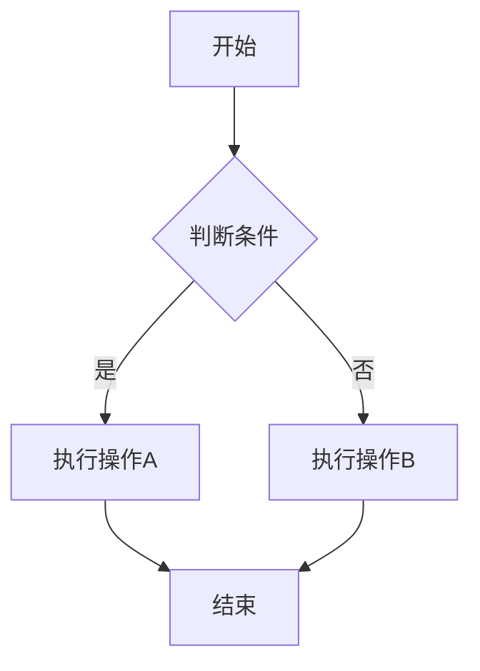

### 在线编辑器

推荐使用以下在线工具来练习和测试：

- 🔗 [Mermaid Live Editor](https://mermaid.live/)
- 🔗 [GitHub Gist](https://gist.github.com/)
- 🔗 [GitLab Snippets](https://gitlab.com/explore/snippets)

---

## 核心概念

### 图表标识符

每种图表类型都有唯一的标识符：

| 图表类型 | 标识符 | 用途 |
|----------|--------|------|
| 流程图 | `flowchart` / `graph` | 业务流程、逻辑流程 |
| 时序图 | `sequenceDiagram` | 系统交互、API调用 |
| 类图 | `classDiagram` | 面向对象设计 |
| ER图 | `erDiagram` | 数据库设计 |
| 甘特图 | `gantt` | 项目管理 |
| 状态图 | `stateDiagram` | 状态机设计 |

### 配置语法

使用 `---` 包裹的YAML配置：

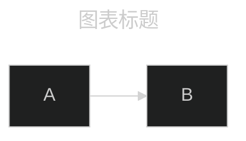

### 注释语法

使用 `%%` 添加注释（不会在图表中显示）：

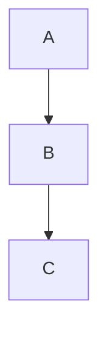

---

## 基础语法

### 通用语法规则

1. **大小写敏感**: 所有关键字区分大小写
2. **空格处理**: 合理使用空格提高可读性
3. **特殊字符**: 使用引号包含特殊字符
4. **实体编码**: 支持HTML实体编码

### 字符转义

```mermaid
flowchart LR
    A["包含 (特殊) 字符"] --> B["使用 &quot;引号&quot;"]
    C["HTML实体: &#9829;"] --> D["Unicode: &#128512;"]
```

### 文本格式化

支持Markdown格式的文本：

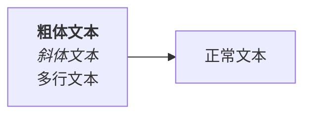

---

## 图表类型详解

## 流程图 (Flowcharts)

### 基本语法

流程图使用 `flowchart` 或 `graph` 关键字开始：

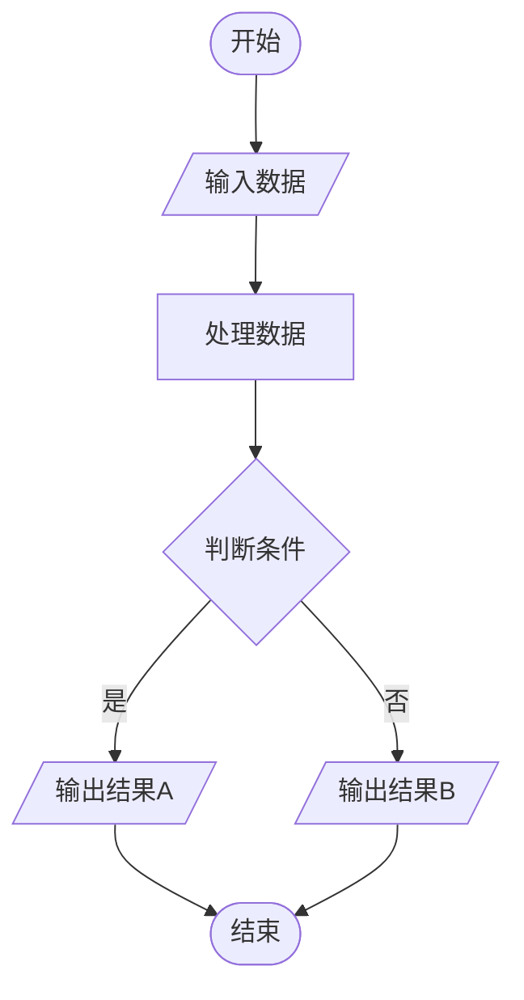

### 图表方向

| 方向 | 代码 | 说明 |
|------|------|------|
| 从上到下 | `TD` / `TB` | Top Down / Top Bottom |
| 从下到上 | `BT` | Bottom Top |
| 从左到右 | `LR` | Left Right |
| 从右到左 | `RL` | Right Left |

### 节点形状

#### 基础形状

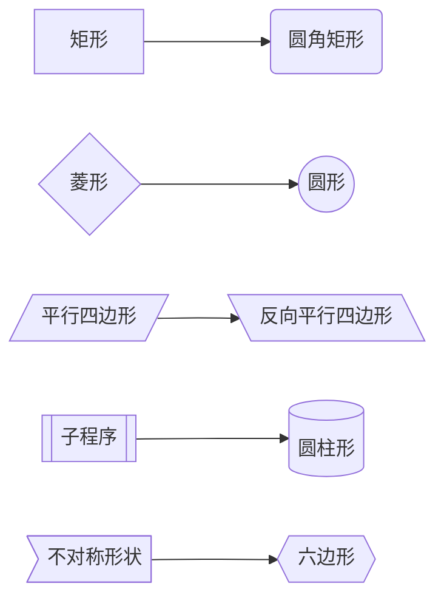

#### 高级形状 (v11.3.0+)

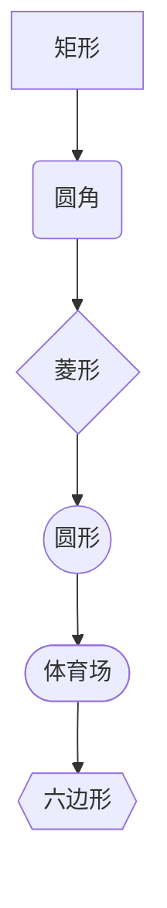

### 连接线类型

#### 箭头类型

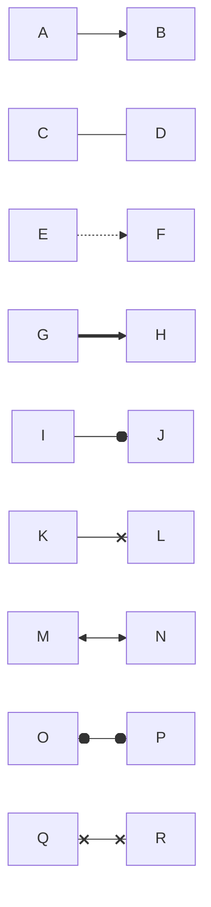

#### 连接线说明

| 语法 | 说明 | 示例 |
|------|------|------|
| `-->` | 实线箭头 | A --> B |
| `---` | 实线无箭头 | A --- B |
| `-.->` | 虚线箭头 | A -.-> B |
| `==>` | 加粗箭头 | A ==> B |
| `--o` | 圆形结尾 | A --o B |
| `--x` | 叉形结尾 | A --x B |
| `<-->` | 双向箭头 | A <--> B |

#### 带标签的连接

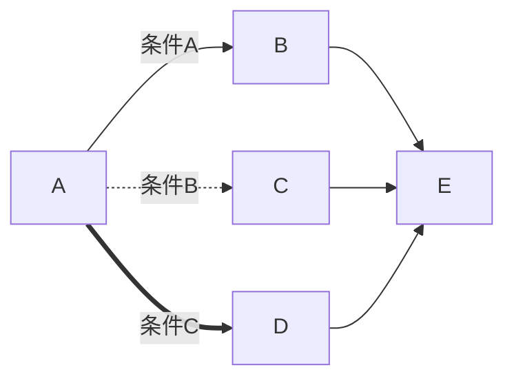

### 子图

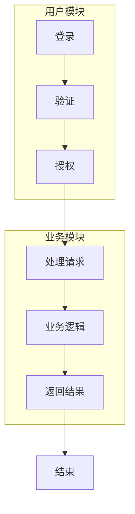

### 样式定义

#### 单个节点样式


#### 样式类

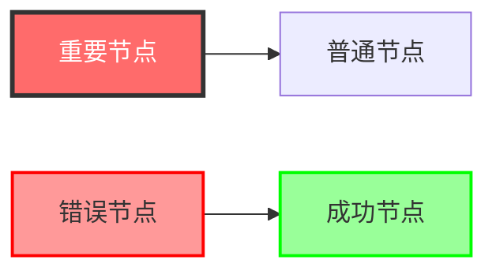

## 时序图 (Sequence Diagrams)

### 基本语法

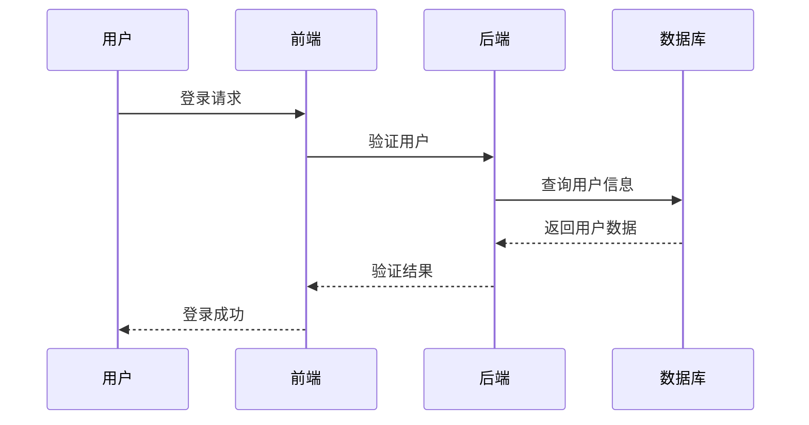

### 参与者定义

```mermaid
sequenceDiagram
    %% 定义参与者
    participant U as 用户
    actor Admin as 管理员
    participant API as API服务器
    
    %% 创建和销毁参与者
    U->>API: 请求数据
    create participant DB as 数据库连接
    API->>DB: 查询
    DB-->>API: 结果
    destroy DB
    API->>API: 关闭连接
    API-->>U: 响应
```

### 消息类型

| 语法 | 说明 | 线型 |
|------|------|------|
| `->` | 实线无箭头 | 实线 |
| `-->` | 虚线无箭头 | 虚线 |
| `->>` | 实线箭头 | 实线 |
| `-->>` | 虚线箭头 | 虚线 |
| `-x` | 实线X结尾 | 实线 |
| `--x` | 虚线X结尾 | 虚线 |
| `-)` | 异步消息 | 实线 |
| `--)` | 异步虚线 | 虚线 |

### 激活框

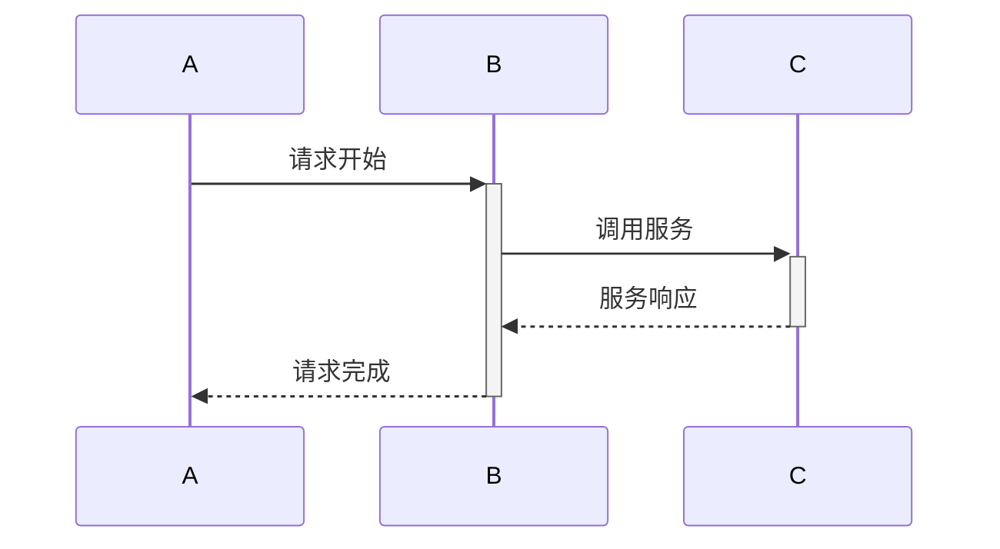

### 注释和标注

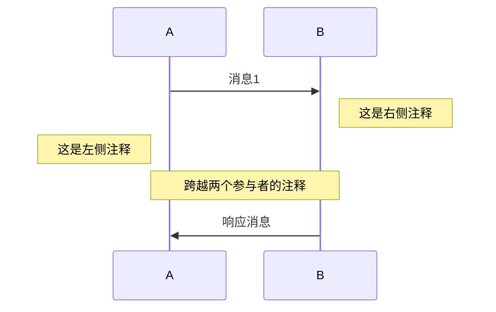

### 循环和条件

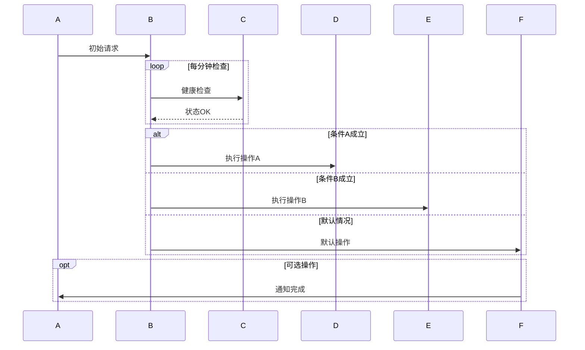

### 并行处理

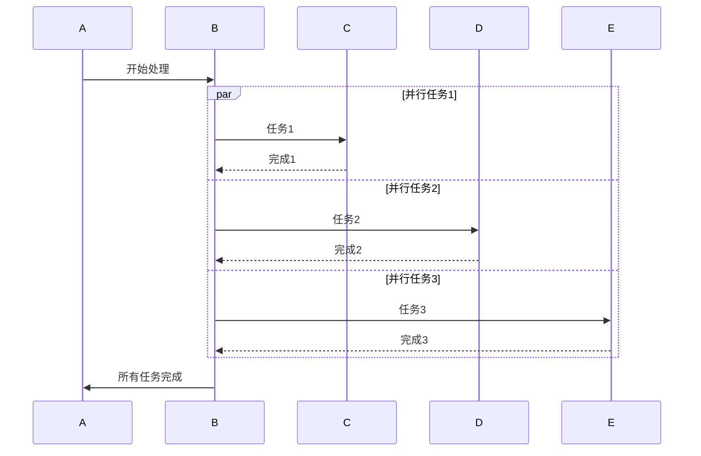

### 关键区域

```mermaid
sequenceDiagram
    A->>B: 开始事务
    
    critical 数据库操作
        B->>DB: 写入数据
        DB-->>B: 确认写入
    option 网络超时
        B->>B: 记录超时错误
    option 数据冲突
        B->>B: 处理冲突
    end
    
    B->>A: 事务完成
```

### 背景高亮

```mermaid
sequenceDiagram
    A->>B: 开始
    
    rect rgb(191, 223, 255)
    note right of B: 重要操作区域
    B->>C: 关键操作1
    
    rect rgb(200, 150, 255)
    B->>D: 关键操作2
    D-->>B: 操作结果
    end
    
    C-->>B: 操作完成
    end
    
    B->>A: 全部完成
```

## 类图 (Class Diagrams)

### 基本语法

```mermaid
classDiagram
    class Animal {
        +String name
        +int age
        +String gender
        +isMammal() bool
        +mate() void
    }
    
    class Dog {
        +String breed
        +bark() void
        +wagTail() void
    }
    
    class Cat {
        +bool indoor
        +meow() void
        +purr() void
    }
    
    Animal <|-- Dog : 继承
    Animal <|-- Cat : 继承
```

### 类定义语法

#### 属性和方法

```mermaid
classDiagram
    class BankAccount {
        +String owner
        +BigDecimal balance
        -String accountNumber
        #Date createdDate
        ~int transactionCount
        
        +deposit(amount: BigDecimal) bool
        +withdraw(amount: BigDecimal) bool
        +getBalance() BigDecimal
        -calculateInterest() BigDecimal$
        #validateTransaction() bool*
    }
```

#### 可见性修饰符

| 符号 | 含义 | 说明 |
|------|------|------|
| `+` | Public | 公共访问 |
| `-` | Private | 私有访问 |
| `#` | Protected | 保护访问 |
| `~` | Package | 包访问 |
| `$` | Static | 静态成员 |
| `*` | Abstract | 抽象成员 |

### 关系类型

```mermaid
classDiagram
    ClassA <|-- ClassB : 继承
    ClassC *-- ClassD : 组合
    ClassE o-- ClassF : 聚合
    ClassG --> ClassH : 关联
    ClassI -- ClassJ : 链接
    ClassK <.. ClassL : 依赖
    ClassM <|.. ClassN : 实现
    ClassO .. ClassP : 虚线链接
```

### 关系说明

| 语法 | 关系类型 | 说明 |
|------|----------|------|
| `<\|--` | 继承 | is-a 关系 |
| `*--` | 组合 | 强拥有关系 |
| `o--` | 聚合 | 弱拥有关系 |
| `-->` | 关联 | 使用关系 |
| `--` | 链接 | 一般连接 |
| `<..` | 依赖 | 依赖关系 |
| `<\|..` | 实现 | 实现接口 |
| `..` | 虚线链接 | 弱连接 |

### 基数和多重性

```mermaid
classDiagram
    Customer "1" --> "0..*" Order : places
    Order "1" --> "1..*" LineItem : contains
    Product "1" --> "0..*" LineItem : featured in
    Customer "1" --> "0..1" Account : has
```

### 注解和标签

```mermaid
classDiagram
    class Shape {
        <<interface>>
        +draw() void
        +calculateArea() double
    }
    
    class Rectangle {
        <<concrete>>
        +width: double
        +height: double
        +draw() void
        +calculateArea() double
    }
    
    class Circle {
        <<concrete>>
        +radius: double
        +draw() void
        +calculateArea() double
    }
    
    Shape <|.. Rectangle
    Shape <|.. Circle
    
    note for Shape "图形接口定义了基本操作"
    note "所有图形都必须实现draw方法"
```

### 泛型支持

```mermaid
classDiagram
    class List~T~ {
        +add(item: T) void
        +get(index: int) T
        +size() int
    }
    
    class ArrayList~E~ {
        -E[] elements
        +add(item: E) void
        +get(index: int) E
        +size() int
    }
    
    List~T~ <|-- ArrayList~E~
```

## ER图 (Entity Relationship Diagrams)

### 基本语法

```mermaid
erDiagram
    CUSTOMER {
        string customer_id PK
        string name
        string email
        string phone UK
        date created_at
    }
    
    ORDER {
        string order_id PK
        string customer_id FK
        date order_date
        decimal total_amount
        string status
    }
    
    PRODUCT {
        string product_id PK
        string name
        decimal price
        string description
        int stock_quantity
    }
    
    ORDER_ITEM {
        string order_id PK,FK
        string product_id PK,FK
        int quantity
        decimal unit_price
    }
    
    CUSTOMER ||--o{ ORDER : places
    ORDER ||--o{ ORDER_ITEM : contains
    PRODUCT ||--o{ ORDER_ITEM : includes
```

### 基数表示

| 符号 | 含义 |
|------|------|
| `\|o` | 零或一 |
| `\|\|` | 恰好一个 |
| `}o` | 零或多个 |
| `}\|` | 一个或多个 |

### 关系类型

```mermaid
erDiagram
    EMPLOYEE ||--o{ PROJECT : works_on
    EMPLOYEE {
        int employee_id PK
        string name
        string department
        date hire_date
    }
    
    PROJECT {
        int project_id PK
        string name
        date start_date
        date end_date
        string status
    }
    
    ASSIGNMENT {
        int employee_id PK,FK
        int project_id PK,FK
        int hours_assigned
        string role
    }
    
    EMPLOYEE ||--o{ ASSIGNMENT : has
    PROJECT ||--o{ ASSIGNMENT : requires
```

### 属性定义

```mermaid
erDiagram
    USER {
        uuid id PK "主键ID"
        varchar(50) username UK "用户名，唯一"
        varchar(255) email UK "邮箱地址"
        varchar(255) password "加密密码"
        timestamp created_at "创建时间"
        timestamp updated_at "更新时间"
        boolean is_active "是否激活"
    }
    
    PROFILE {
        uuid id PK
        uuid user_id FK "关联用户ID"
        varchar(100) first_name "名"
        varchar(100) last_name "姓"
        date birth_date "生日"
        text bio "个人简介"
    }
    
    USER ||--|| PROFILE : has
```

### 键类型说明

| 键类型 | 说明 |
|--------|------|
| `PK` | 主键 (Primary Key) |
| `FK` | 外键 (Foreign Key) |
| `UK` | 唯一键 (Unique Key) |
| `PK, FK` | 复合键 |

## 甘特图 (Gantt Charts)

### 基本语法

```mermaid
gantt
    title 项目开发计划
    dateFormat  YYYY-MM-DD
    section 需求分析
    需求收集           :done, des1, 2024-01-01,2024-01-05
    需求分析           :done, des2, after des1, 5d
    需求评审           :done, des3, after des2, 2d
    
    section 设计阶段
    系统设计           :active, design1, 2024-01-08, 10d
    数据库设计         :design2, after design1, 5d
    UI设计            :design3, 2024-01-15, 8d
    
    section 开发阶段
    后端开发           :dev1, 2024-01-20, 20d
    前端开发           :dev2, 2024-01-25, 15d
    API集成           :dev3, after dev1, 5d
    
    section 测试阶段
    单元测试           :test1, after dev2, 5d
    集成测试           :test2, after dev3, 3d
    用户测试           :crit, test3, after test2, 5d
    
    section 部署
    生产环境部署        :deploy, after test3, 2d
```

### 日期格式

```mermaid
gantt
    title 支持的日期格式示例
    dateFormat YYYY-MM-DD
    
    section 绝对日期
    任务1     :2024-01-01, 2024-01-05
    任务2     :2024-01-06, 5d
    
    section 相对日期
    任务3     :after 任务1, 3d
    任务4     :after 任务2, 2024-01-15
```

### 任务状态

| 状态 | 说明 | 示例 |
|------|------|------|
| `done` | 已完成 | `:done, task1, 2024-01-01, 5d` |
| `active` | 进行中 | `:active, task2, 2024-01-06, 3d` |
| `crit` | 关键路径 | `:crit, task3, 2024-01-10, 4d` |
| 无状态 | 计划中 | `:task4, 2024-01-15, 2d` |

## 状态图 (State Diagrams)

### 基本语法

```mermaid
stateDiagram-v2
    [*] --> 登录页面
    登录页面 --> 验证中 : 点击登录
    验证中 --> 首页 : 验证成功
    验证中 --> 登录页面 : 验证失败
    首页 --> 个人中心 : 点击头像
    首页 --> 设置页面 : 点击设置
    个人中心 --> 首页 : 返回
    设置页面 --> 首页 : 保存设置
    首页 --> [*] : 登出
```

### 复杂状态图

```mermaid
stateDiagram-v2
    [*] --> 空闲
    
    空闲 --> 工作中 : 开始工作
    
    state 工作中 {
        [*] --> 编码
        编码 --> 测试 : 代码完成
        测试 --> 编码 : 发现问题
        测试 --> 提交 : 测试通过
        
        state 测试 {
            [*] --> 单元测试
            单元测试 --> 集成测试
            集成测试 --> [*]
        }
    }
    
    工作中 --> 休息 : 暂停工作
    休息 --> 工作中 : 恢复工作
    工作中 --> [*] : 完成工作
```

### 并行状态

```mermaid
stateDiagram-v2
    [*] --> 活动状态
    
    state 活动状态 {
        --
        [*] --> 音乐播放
        音乐播放 --> 暂停 : 点击暂停
        暂停 --> 音乐播放 : 点击播放
        --
        [*] --> 界面显示
        界面显示 --> 最小化 : 最小化
        最小化 --> 界面显示 : 还原
    }
    
    活动状态 --> [*] : 退出程序
```

## 用户旅程图 (User Journey)

```mermaid
journey
    title 用户购物体验旅程
    section 发现商品
      访问网站: 5: 用户
      浏览商品: 3: 用户
      搜索商品: 4: 用户
      查看详情: 4: 用户
    section 购买决策
      比较价格: 2: 用户
      查看评价: 3: 用户
      咨询客服: 1: 用户, 客服
      加入购物车: 5: 用户
    section 购买流程
      结算订单: 3: 用户
      选择支付: 4: 用户
      确认订单: 5: 用户
    section 售后体验
      物流跟踪: 3: 用户
      收货确认: 5: 用户
      商品评价: 4: 用户
```

## 饼图 (Pie Charts)

```mermaid
pie title 市场份额分布
    "产品A" : 42.96
    "产品B" : 50.05
    "产品C" : 10.01
    "其他" : 5
```

## 思维导图 (Mindmaps)

```mermaid
mindmap
  root((项目管理))
    需求管理
      需求收集
        用户访谈
        问卷调查
        竞品分析
      需求分析
        业务建模
        用例分析
        原型设计
      需求跟踪
        需求变更
        影响分析
        版本控制
    
    项目计划
      范围定义
      时间估算
      资源配置
      风险评估
    
    团队协作
      角色分工
      沟通机制
      进度跟踪
      质量保证
    
    交付管理
      版本发布
      部署流程
      用户培训
      维护支持
```

## 时间线图 (Timeline)

```mermaid
timeline
    title 公司发展历程
    
    section 创业阶段
        2020年1月 : 公司成立
                  : 获得天使投资
        2020年6月 : 产品原型完成
                  : 招聘核心团队
        2020年12月 : 产品正式发布
                   : 获得首批用户
    
    section 成长阶段
        2021年6月 : 用户突破1万
                  : A轮融资成功
        2021年12月 : 推出新功能
                   : 团队扩张至50人
    
    section 扩展阶段
        2022年6月 : 国际化布局
                  : 用户突破10万
        2022年12月 : B轮融资
                   : 开设海外办公室
    
    section 成熟阶段
        2023年 : 产品矩阵完善
               : 上市筹备
        2024年 : IPO成功
               : 行业领导地位
```

## 象限图 (Quadrant Chart)

```mermaid
quadrantChart
    title 产品功能优先级矩阵
    
    x-axis 实现难度低 --> 实现难度高
    y-axis 用户价值低 --> 用户价值高
    
    quadrant-1 高价值易实现
    quadrant-2 高价值难实现
    quadrant-3 低价值难实现
    quadrant-4 低价值易实现
    
    用户登录: [0.2, 0.9]
    商品搜索: [0.3, 0.8]
    购物车: [0.4, 0.85]
    在线支付: [0.8, 0.9]
    社交分享: [0.6, 0.3]
    数据分析: [0.9, 0.7]
    推荐系统: [0.85, 0.75]
    多语言: [0.7, 0.4]
```

## 需求图 (Requirement Diagram)

```mermaid
requirementDiagram

    requirement 用户管理 {
        id: 1
        text: 系统应支持用户注册和登录功能
        risk: medium
        verifymethod: test
    }

    element 用户界面 {
        type: interface
    }
    
    element 用户数据库 {
        type: database  
    }
    
    requirement 数据安全 {
        id: 2
        text: 用户数据必须加密存储
        risk: high
        verifymethod: inspection
    }
    
    用户管理 - contains -> 用户界面
    用户管理 - contains -> 用户数据库
    数据安全 - refines -> 用户管理
```

## Git图 (Gitgraph)

```mermaid
gitgraph
    commit id: "初始提交"
    commit id: "添加基础功能"
    
    branch feature/login
    checkout feature/login
    commit id: "实现登录页面"
    commit id: "添加验证逻辑"
    
    checkout main
    commit id: "修复主分支bug"
    
    checkout feature/login
    commit id: "完善登录功能"
    
    checkout main
    merge feature/login
    commit id: "发布v1.0版本"
    
    branch hotfix/security
    checkout hotfix/security
    commit id: "安全补丁"
    
    checkout main
    merge hotfix/security
    commit id: "紧急发布v1.0.1"
```

## 块图 (Block Diagram)

```mermaid
block-beta
    columns 3
    
    Frontend["前端应用"]:3
    
    space:1
    API["API网关"]
    space:1
    
    AuthService["认证服务"]
    UserService["用户服务"]  
    OrderService["订单服务"]
    
    space:1
    Database[("数据库")]
    space:1
    
    Frontend --> API
    API --> AuthService
    API --> UserService
    API --> OrderService
    AuthService --> Database
    UserService --> Database
    OrderService --> Database
```

## 架构图 (Architecture Diagram)

```mermaid
architecture-beta
    service user(internet)[用户]
    service cdn(server)[CDN]
    service lb(server)[负载均衡器]
    
    service web1(server)[Web服务器1]
    service web2(server)[Web服务器2]
    service web3(server)[Web服务器3]
    
    service app1(server)[应用服务器1]  
    service app2(server)[应用服务器2]
    
    service cache(database)[Redis缓存]
    service db_master(database)[主数据库]
    service db_slave(database)[从数据库]
    
    user:L -- R:cdn
    cdn:L -- R:lb
    lb:L -- R:web1
    lb:L -- R:web2  
    lb:L -- R:web3
    
    web1:L -- R:app1
    web2:L -- R:app1
    web3:L -- R:app2
    
    app1:L -- R:cache
    app2:L -- R:cache
    
    app1:L -- R:db_master
    app2:L -- R:db_master
    db_master:L -- R:db_slave
```

---

## 高级特性

### 主题和样式

#### 内置主题

Mermaid 提供多种内置主题：

```mermaid
%%{init: {'theme':'dark'}}%%
flowchart LR
    A[深色主题] --> B[专业外观]
    B --> C[适合演示]
```

主题选项：
- `default` - 默认主题
- `dark` - 深色主题  
- `forest` - 森林主题
- `neutral` - 中性主题
- `base` - 基础主题

#### 自定义主题变量

```mermaid
%%{init: {
  'theme': 'base',
  'themeVariables': {
    'primaryColor': '#ff6b6b',
    'primaryTextColor': '#ffffff',
    'primaryBorderColor': '#ff5252',
    'lineColor': '#4ecdc4',
    'sectionBkgColor': '#ffe0b2',
    'altSectionBkgColor': '#fff3e0',
    'gridColor': '#e0e0e0',
    'secondaryColor': '#4ecdc4',
    'tertiaryColor': '#fff'
  }
}}%%
flowchart TD
    A[自定义主题] --> B[个性化配置]
    B --> C[品牌色彩]
```

### 配置选项

#### 全局配置

```javascript
%%{init: {
  'theme': 'dark',
  'themeVariables': {
    'darkMode': true,
    'background': '#1e1e1e',
    'primaryColor': '#bb2649',
    'primaryTextColor': '#fff'
  },
  'flowchart': {
    'curve': 'basis',
    'htmlLabels': true,
    'nodeSpacing': 50,
    'rankSpacing': 50
  },
  'sequence': {
    'diagramMarginX': 50,
    'diagramMarginY': 10,
    'actorMargin': 50,
    'width': 150,
    'height': 65,
    'boxMargin': 10,
    'boxTextMargin': 5,
    'noteMargin': 10,
    'messageMargin': 35
  }
}}%%
```

#### 流程图配置

```mermaid
%%{init: {
  'flowchart': {
    'curve': 'cardinal',
    'htmlLabels': true,
    'nodeSpacing': 30,
    'rankSpacing': 40,
    'padding': 10
  }
}}%%
flowchart TD
    A[配置示例] --> B[自定义样式]
    B --> C[优化布局]
```

### 交互功能

#### 点击事件

```mermaid
flowchart LR
    A[点击我] --> B[链接页面]
    A --> C[执行函数]
    
    click A "https://www.example.com" "访问官网"
    click B call alert("Hello Mermaid!") "显示提示"
```

#### 工具提示

```mermaid
flowchart TD
    A[鼠标悬停显示提示] --> B[链接到外部资源]
    
    click A "https://mermaid.js.org" "Mermaid官方文档" _blank
    click B callback "showTooltip" "点击显示详细信息"
```

### 自定义图标和图片

#### 图标形状 (v11.3.0+)

```mermaid
flowchart TD
    A@{ icon: "fa:user", form: "square", label: "用户", pos: "t", h: 60 }
    B@{ icon: "fa:cog", form: "circle", label: "设置", pos: "b", h: 60 }
    C@{ icon: "fa:heart", form: "rounded", label: "收藏", h: 60 }
    
    A --> B --> C
```

#### 图片形状

```mermaid
flowchart LR
    A@{ img: "https://via.placeholder.com/60", label: "用户头像", pos: "t", w: 60, h: 60, constraint: "on" }
    B@{ img: "https://via.placeholder.com/60", label: "产品图片", pos: "b" }
    
    A --> B
```

---

## 最佳实践

### 1. 图表设计原则

#### 简洁明了
- 避免过度复杂的图表
- 使用清晰的标签和命名
- 保持适当的空白空间

```mermaid
flowchart TD
    A[简洁的开始] --> B{是否复杂?}
    B -->|否| C[继续保持]
    B -->|是| D[简化设计]
    D --> C
    C --> E[优秀的图表]
```

#### 一致性
- 统一的命名规范
- 一致的样式风格
- 相同类型的图表使用相同的布局

#### 可读性
- 合理的字体大小
- 适当的颜色对比
- 清晰的层次结构

### 2. 性能优化

#### 大型图表优化
```mermaid
flowchart TD
    A[大型图表] --> B[分解为子图]
    A --> C[使用简化符号]
    A --> D[避免深层嵌套]
    B --> E[提高可读性]
    C --> E
    D --> E
```

#### 渲染性能
- 避免过多的样式定义
- 合理使用子图分组
- 控制图表元素数量

### 3. 协作最佳实践

#### 版本控制
```mermaid
gitgraph
    commit id: "初始图表版本"
    branch feature/updates
    commit id: "添加新流程"
    commit id: "优化布局"
    checkout main
    merge feature/updates
    commit id: "发布最终版本"
```

#### 文档化
- 添加必要的注释
- 提供图表说明
- 维护更新日志

### 4. 响应式设计

```mermaid
%%{init: {'flowchart': {'useMaxWidth': true}}}%%
flowchart LR
    A[响应式图表] --> B[自适应宽度]
    B --> C[移动端友好]
    C --> D[多屏幕适配]
```

---

## 常见问题和故障排除

### 1. 语法错误

#### 常见语法问题

❌ **错误示例**:
```mermaid
flowchart TD
    A[Start --> B[End]  // 缺少闭合括号
```

✅ **正确示例**:
```mermaid
flowchart TD
    A[Start] --> B[End]
```

#### 特殊字符处理

❌ **错误示例**:
```mermaid
flowchart TD
    A[User's Data] --> B[Process]  // 单引号可能造成问题
```

✅ **正确示例**:
```mermaid
flowchart TD
    A["User's Data"] --> B[Process]
```

### 2. 渲染问题

#### 图表不显示
1. 检查语法是否正确
2. 确认图表类型标识符
3. 验证配置选项
4. 检查浏览器控制台错误

#### 布局问题

**解决方案**:
```mermaid
%%{init: {
  'flowchart': {
    'nodeSpacing': 100,
    'rankSpacing': 100,
    'curve': 'basis'
  }
}}%%
flowchart TD
    A[调整间距] --> B[优化布局]
    B --> C[完美显示]
```

### 3. 性能问题

#### 大型图表优化策略

```mermaid
flowchart TD
    A[大型图表] --> B[性能问题]
    B --> C[分解策略]
    C --> D[子图分组]
    C --> E[简化元素]  
    C --> F[延迟加载]
    D --> G[性能提升]
    E --> G
    F --> G
```

### 4. 兼容性问题

#### 浏览器兼容性
- 现代浏览器支持良好
- IE浏览器需要polyfill
- 移动端浏览器注意触摸交互

#### 导出格式支持
- SVG: 最佳质量和兼容性
- PNG: 适合嵌入文档
- PDF: 适合打印输出

---

## 工具和集成

### 1. 开发工具集成

#### VS Code 扩展
- **Mermaid Preview**: 实时预览
- **Mermaid Markdown Syntax Highlighting**: 语法高亮
- **Mermaid Editor**: 专用编辑器

#### JetBrains IDE
- **Mermaid Plugin**: 支持IntelliJ系列IDE
- 语法检查和自动完成
- 实时预览功能

### 2. 文档系统集成

#### GitBook
```markdown

graph TD
    A[GitBook] --> B[Mermaid集成]
    B --> C[美观图表]

```

#### Notion
- 支持代码块中的Mermaid语法
- 自动渲染图表
- 协作编辑支持

#### GitHub/GitLab
````markdown
```mermaid
graph TD
    A[GitHub] --> B[原生支持]
    B --> C[README展示]
```
````

### 3. 构建工具集成

#### Webpack集成
```javascript
const MermaidPlugin = require('mermaid-webpack-plugin');

module.exports = {
  plugins: [
    new MermaidPlugin({
      // 配置选项
    })
  ]
};
```

#### Vite集成
```javascript
import { defineConfig } from 'vite';
import mermaid from 'vite-plugin-mermaid';

export default defineConfig({
  plugins: [mermaid()]
});
```

### 4. 在线工具

#### Mermaid Live Editor
- 🔗 [mermaid.live](https://mermaid.live)
- 实时编辑和预览
- 多种导出格式
- 分享功能

#### Draw.io集成
- 导入Mermaid代码
- 可视化编辑
- 导出多种格式

---

## 参考资源

### 1. 官方资源

#### 官方文档
- 🔗 [Mermaid官方文档](https://mermaid.js.org/)
- 🔗 [GitHub仓库](https://github.com/mermaid-js/mermaid)
- 🔗 [发布说明](https://github.com/mermaid-js/mermaid/releases)

#### 在线工具
- 🔗 [Mermaid Live Editor](https://mermaid.live/)
- 🔗 [在线文档](https://mermaid.js.org/intro/)

### 2. 社区资源

#### 学习资源
- 📚 [Mermaid教程集合](https://github.com/mermaid-js/mermaid#tutorials)
- 🎥 [视频教程](https://www.youtube.com/results?search_query=mermaid+diagram+tutorial)
- 📖 [最佳实践指南](https://mermaid.js.org/config/Tutorials.html)

#### 示例和模板
- 🔗 [Mermaid示例库](https://github.com/mermaid-js/mermaid/tree/develop/demos)
- 🔗 [社区示例](https://github.com/topics/mermaid-diagrams)

### 3. 技术支持

#### 问题反馈
- 🔗 [GitHub Issues](https://github.com/mermaid-js/mermaid/issues)
- 🔗 [讨论区](https://github.com/mermaid-js/mermaid/discussions)

#### 社区交流
- 💬 [Discord频道](https://discord.gg/AgrbSrBer3)
- 🐦 [Twitter](https://twitter.com/mermaidjs_)

### 4. 扩展阅读

#### 图表理论
- 📖 《数据可视化基础》
- 📖 《信息图形设计原理》
- 📖 《系统分析与设计》

#### 相关技术
- 🔧 [D3.js](https://d3js.org/) - 数据可视化库
- 🔧 [Graphviz](https://graphviz.org/) - 图形可视化软件
- 🔧 [PlantUML](https://plantuml.com/) - UML图表工具

---

## 总结

Mermaid 是一个功能强大、语法简洁的图表生成工具，适合用于：

### 核心优势
- ✅ **简单易学**: 类似Markdown的直观语法
- ✅ **功能丰富**: 支持15+种图表类型
- ✅ **高度可定制**: 主题、样式、配置选项丰富
- ✅ **广泛集成**: 支持各种编辑器和平台
- ✅ **版本友好**: 文本格式便于版本控制

### 应用场景
- 📋 **技术文档**: API文档、架构设计、流程说明
- 🎓 **教育培训**: 课程材料、概念解释、知识图谱  
- 💼 **商业分析**: 业务流程、组织架构、项目管理
- 🛠️ **软件开发**: 系统设计、数据建模、工作流程

### 学习建议
1. **从简单开始**: 掌握基本语法和常用图表
2. **实践应用**: 在实际项目中使用和改进
3. **探索高级特性**: 学习样式定制和交互功能
4. **参与社区**: 关注更新和最佳实践分享

通过本指南的学习，您应该能够：
- 熟练使用各种图表类型
- 理解高级配置和定制选项
- 解决常见问题和性能优化
- 在实际项目中有效应用Mermaid

继续探索和实践，让 Mermaid 成为您可视化表达的得力工具！

---

*最后更新: 2024年7月20日*
*版本: v11.3.0+*

---

