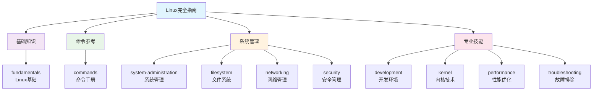
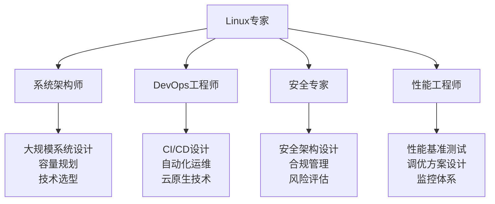

# Linux 文档完整索引

## 📖 文档导航总览

这是Linux系统完全指南的详细索引，帮助您快速定位所需内容。文档按照Linux系统架构和管理流程组织，涵盖从基础知识到高级管理的完整技能体系。

---

## 🏗️ 文档架构图

---

## 📚 详细目录索引

### 1️⃣ 基础知识模块 (Fundamentals)
**适合对象**: Linux初学者、需要系统化学习的用户  
**预计学习时间**: 2-3周

| 文档 | 内容概要 | 重要程度 | 前置要求 |
|------|----------|----------|----------|
| [📖 模块导航](fundamentals/) | 基础知识学习路径和目标 | ⭐⭐⭐ | 无 |
| [🐧 Linux介绍](fundamentals/introduction.md) | Linux历史、发行版、应用场景 | ⭐⭐⭐ | 无 |
| [🏗️ 系统架构](fundamentals/system-architecture.md) | 内核结构、用户空间、启动流程 | ⭐⭐⭐ | 基础概念 |
| [💻 Shell基础](fundamentals/shell-basics.md) | Bash环境、命令行、脚本基础 | ⭐⭐⭐ | Linux介绍 |
| [👤 用户权限](fundamentals/users-permissions.md) | 用户管理、权限系统、安全模型 | ⭐⭐⭐ | 系统架构 |

### 2️⃣ 命令参考模块 (Commands)
**适合对象**: 所有Linux用户  
**预计学习时间**: 持续参考

| 文档 | 内容概要 | 重要程度 | 使用频率 |
|------|----------|----------|----------|
| [📖 命令总览](commands/) | 命令分类和学习路径 | ⭐⭐⭐ | 高 |
| [📋 速查表](commands/CHEAT-SHEET.md) | 常用命令快速参考 | ⭐⭐⭐ | 极高 |
| [📑 完整索引](commands/INDEX.md) | 按功能分类的命令索引 | ⭐⭐ | 高 |
| **基础命令** |
| [📁 文件系统](commands/basic/filesystem.md) | pwd, cd, ls, mkdir, cp, mv, rm等 | ⭐⭐⭐ | 极高 |
| [📝 文本处理](commands/basic/text-processing.md) | cat, grep, sed, awk, sort等 | ⭐⭐⭐ | 高 |
| [ℹ️ 系统信息](commands/basic/system-info.md) | uname, df, free, ps, top等 | ⭐⭐⭐ | 高 |
| **文件管理** |
| [🔐 权限管理](commands/file-management/permissions.md) | chmod, chown, umask, ACL | ⭐⭐⭐ | 高 |
| [🗜️ 压缩归档](commands/file-management/compression.md) | tar, gzip, zip, 7z等 | ⭐⭐ | 中 |
| **系统管理** |
| [⚙️ 进程管理](commands/system-admin/process-management.md) | ps, kill, jobs, nohup等 | ⭐⭐⭐ | 高 |
| **网络工具** |
| [🌐 网络诊断](commands/networking/diagnostics.md) | ping, traceroute, netstat等 | ⭐⭐⭐ | 高 |

### 3️⃣ 系统管理模块 (System Administration)
**适合对象**: 系统管理员、运维工程师  
**预计学习时间**: 1-2个月

| 文档 | 内容概要 | 重要程度 | 难度等级 |
|------|----------|----------|----------|
| [📖 管理总览](system-administration/) | 系统管理技能体系和路径 | ⭐⭐⭐ | 初级 |
| [👥 用户管理](system-administration/user-management.md) | 用户创建、权限分配、sudo配置 | ⭐⭐⭐ | 初级 |
| [⚙️ 服务管理](system-administration/service-management.md) | Systemd、进程管理、任务调度 | ⭐⭐⭐ | 中级 |
| [📦 软件包管理](system-administration/package-management.md) | APT、YUM、源码安装、容器部署 | ⭐⭐⭐ | 中级 |
| [📊 系统监控](system-administration/system-monitoring.md) | 性能监控、日志管理、告警系统 | ⭐⭐⭐ | 中级 |
| [🔄 备份恢复](system-administration/backup-recovery.md) | 备份策略、数据恢复、灾难恢复 | ⭐⭐⭐ | 中级 |
| [🔧 配置管理](system-administration/configuration-management.md) | 配置文件管理、自动化配置 | ⭐⭐ | 高级 |

### 4️⃣ 文件系统模块 (Filesystem)
**适合对象**: 系统管理员、存储管理员  
**预计学习时间**: 2-3周

| 文档 | 内容概要 | 重要程度 | 难度等级 |
|------|----------|----------|----------|
| [📖 文件系统总览](filesystem/) | 文件系统管理完整指南 | ⭐⭐⭐ | 初级 |
| [💾 文件系统基础](filesystem/filesystem-basics.md) | VFS、文件系统类型、FHS标准 | ⭐⭐⭐ | 初级 |
| [🔧 磁盘分区](filesystem/disk-partitioning.md) | 分区工具、LVM、RAID配置 | ⭐⭐⭐ | 中级 |
| [🔗 挂载管理](filesystem/mounting.md) | mount命令、fstab、网络文件系统 | ⭐⭐⭐ | 中级 |
| [🔐 权限与ACL](filesystem/permissions-acl.md) | 高级权限管理、访问控制列表 | ⭐⭐⭐ | 中级 |
| [📊 存储监控](filesystem/storage-monitoring.md) | 磁盘监控、性能分析、维护 | ⭐⭐ | 中级 |
| [🔄 备份同步](filesystem/backup-sync.md) | 数据同步、快照技术、归档 | ⭐⭐⭐ | 中级 |

### 5️⃣ 网络管理模块 (Networking)
**适合对象**: 网络管理员、系统管理员  
**预计学习时间**: 2-3周

| 文档 | 内容概要 | 重要程度 | 难度等级 |
|------|----------|----------|----------|
| [📖 网络管理总览](networking/) | 网络管理完整指南 | ⭐⭐⭐ | 初级 |
| [🔧 网络配置](networking/network-configuration.md) | 接口配置、IP地址、路由、DNS | ⭐⭐⭐ | 初级 |
| [🔀 路由交换](networking/routing-switching.md) | 路由管理、网桥、VLAN配置 | ⭐⭐ | 中级 |
| [🛡️ 防火墙安全](networking/firewall-security.md) | iptables、firewalld、网络安全 | ⭐⭐⭐ | 中级 |
| [🚀 网络服务](networking/network-services.md) | SSH、Web、DNS、DHCP服务 | ⭐⭐⭐ | 中级 |
| [📊 网络监控](networking/network-monitoring.md) | 流量监控、性能分析、安全监控 | ⭐⭐ | 中级 |
| [🔍 故障诊断](networking/network-troubleshooting.md) | 网络故障排除方法和工具 | ⭐⭐⭐ | 中级 |

### 6️⃣ 安全管理模块 (Security)
**适合对象**: 安全管理员、系统管理员  
**预计学习时间**: 3-4周

| 文档 | 内容概要 | 重要程度 | 难度等级 |
|------|----------|----------|----------|
| [📖 安全管理总览](security/) | Linux安全管理完整体系 | ⭐⭐⭐ | 初级 |
| [🛡️ 系统安全基础](security/system-security-basics.md) | 威胁模型、安全策略、风险评估 | ⭐⭐⭐ | 初级 |
| [🔐 访问控制](security/access-control.md) | 身份认证、权限管理、MAC | ⭐⭐⭐ | 中级 |
| [🔑 加密密钥](security/encryption-key-management.md) | 加密技术、PKI、密钥管理 | ⭐⭐⭐ | 中级 |
| [🚨 入侵检测](security/intrusion-detection.md) | IDS/IPS、异常检测、事件响应 | ⭐⭐ | 高级 |
| [🔍 安全审计](security/security-auditing.md) | 审计配置、日志分析、合规检查 | ⭐⭐⭐ | 中级 |
| [🛠️ 安全工具](security/security-tools.md) | 漏洞扫描、渗透测试、SIEM | ⭐⭐ | 高级 |

### 7️⃣ 开发环境模块 (Development)
**适合对象**: 开发者、DevOps工程师  
**预计学习时间**: 2-3周

| 文档 | 内容概要 | 重要程度 | 难度等级 |
|------|----------|----------|----------|
| [📖 开发环境总览](development/) | 现代开发环境完整指南 | ⭐⭐⭐ | 初级 |
| [🛠️ 开发工具链](development/development-toolchain.md) | 编程环境、编译器、调试工具 | ⭐⭐⭐ | 初级 |
| [📦 版本控制](development/version-control.md) | Git、分支策略、协作开发 | ⭐⭐⭐ | 初级 |
| [🐳 容器化技术](development/containerization.md) | Docker、Kubernetes基础 | ⭐⭐⭐ | 中级 |
| [🔄 CI/CD](development/ci-cd.md) | 持续集成、持续部署 | ⭐⭐⭐ | 中级 |
| [📈 监控日志](development/monitoring-logging.md) | APM、日志管理、指标监控 | ⭐⭐ | 中级 |
| [🤖 自动化运维](development/automation.md) | IaC、配置管理、服务网格 | ⭐⭐ | 高级 |

### 8️⃣ 内核技术模块 (Kernel)
**适合对象**: 内核开发者、系统底层研究者  
**预计学习时间**: 1-2个月

| 文档 | 内容概要 | 重要程度 | 难度等级 |
|------|----------|----------|----------|
| [📖 内核技术总览](kernel/) | Linux内核深度学习指南 | ⭐⭐ | 初级 |
| [🏗️ 内核架构](kernel/kernel-architecture.md) | 内核结构、内存管理、调度 | ⭐⭐⭐ | 高级 |
| [📞 系统调用](kernel/system-calls.md) | 系统调用接口、性能分析 | ⭐⭐ | 高级 |
| [🔌 设备驱动](kernel/device-drivers.md) | 驱动开发、字符设备、块设备 | ⭐⭐ | 专家 |
| [🧩 内核模块](kernel/kernel-modules.md) | LKM开发、模块编程 | ⭐⭐ | 高级 |
| [🔍 内核调试](kernel/kernel-debugging.md) | 调试技术、性能分析、eBPF | ⭐⭐ | 专家 |
| [⚡ 内核优化](kernel/kernel-optimization.md) | 内核参数调优、性能优化 | ⭐⭐ | 专家 |

### 9️⃣ 性能优化模块 (Performance)
**适合对象**: 性能工程师、高级系统管理员  
**预计学习时间**: 3-4周

| 文档 | 内容概要 | 重要程度 | 难度等级 |
|------|----------|----------|----------|
| [📖 性能优化总览](performance/) | Linux性能优化完整体系 | ⭐⭐⭐ | 中级 |
| [📊 性能监控](performance/performance-monitoring.md) | 监控工具、基线建立、瓶颈识别 | ⭐⭐⭐ | 中级 |
| [🔧 CPU优化](performance/cpu-optimization.md) | CPU调度、亲和性、中断优化 | ⭐⭐⭐ | 高级 |
| [💾 内存优化](performance/memory-optimization.md) | 内存管理、大页、NUMA优化 | ⭐⭐⭐ | 高级 |
| [💿 存储优化](performance/storage-optimization.md) | I/O调度、文件系统、SSD优化 | ⭐⭐⭐ | 高级 |
| [🌐 网络优化](performance/network-optimization.md) | 网络栈调优、高性能网络配置 | ⭐⭐ | 高级 |
| [🔍 应用分析](performance/application-analysis.md) | 应用性能剖析、数据库调优 | ⭐⭐ | 高级 |

### 🔟 故障排除模块 (Troubleshooting)
**适合对象**: 系统管理员、运维工程师  
**预计学习时间**: 2-3周

| 文档 | 内容概要 | 重要程度 | 难度等级 |
|------|----------|----------|----------|
| [📖 故障排除总览](troubleshooting/) | 系统化故障诊断方法 | ⭐⭐⭐ | 中级 |
| [🔍 诊断方法论](troubleshooting/diagnostic-methodology.md) | 5W1H分析法、故障分类 | ⭐⭐⭐ | 中级 |
| [🔄 启动故障](troubleshooting/boot-issues.md) | GRUB、内核、文件系统故障 | ⭐⭐⭐ | 中级 |
| [⚡ 性能问题](troubleshooting/performance-issues.md) | CPU、内存、I/O性能故障 | ⭐⭐⭐ | 中级 |
| [🌐 网络故障](troubleshooting/network-issues.md) | 连通性、DNS、防火墙故障 | ⭐⭐⭐ | 中级 |
| [💾 存储故障](troubleshooting/storage-issues.md) | 磁盘、文件系统、权限故障 | ⭐⭐⭐ | 中级 |
| [🐛 应用故障](troubleshooting/application-issues.md) | 进程异常、资源占用、配置错误 | ⭐⭐ | 中级 |

---

## 🎯 学习路径推荐

### 🔰 新手入门路径 (4-6周)

1. **第1周**: [Linux介绍](fundamentals/introduction.md) + [系统架构](fundamentals/system-architecture.md)
2. **第2周**: [Shell基础](fundamentals/shell-basics.md) + [基础命令](commands/basic/)
3. **第3周**: [用户权限](fundamentals/users-permissions.md) + [权限管理](commands/file-management/permissions.md)
4. **第4周**: [文件系统基础](filesystem/filesystem-basics.md) + [文件操作实践](commands/basic/filesystem.md)

### 🔸 系统管理路径 (6-8周)

1. **第1-2周**: [系统管理基础](system-administration/) + [用户管理](system-administration/user-management.md)
2. **第3-4周**: [服务管理](system-administration/service-management.md) + [软件包管理](system-administration/package-management.md)
3. **第5-6周**: [网络管理](networking/) + [防火墙配置](networking/firewall-security.md)
4. **第7-8周**: [安全管理](security/) + [监控配置](system-administration/system-monitoring.md)

### 🔺 高级技能路径 (8-12周)

1. **第1-3周**: [性能优化](performance/) - 全面掌握性能调优
2. **第4-6周**: [故障排除](troubleshooting/) - 系统化故障处理
3. **第7-9周**: [内核技术](kernel/) - 深入内核原理
4. **第10-12周**: [开发环境](development/) - 现代开发实践

### 🎓 专业发展路径 (持续学习)

---

## 📊 文档统计信息

### 内容覆盖度
- **基础知识**: 4个核心主题，覆盖Linux入门必备知识
- **命令参考**: 500+ Linux命令详细说明和示例
- **系统管理**: 6个专业领域，涵盖企业级管理技能
- **高级技能**: 4个专业方向，面向专家级用户

### 学习时间估算
- **快速入门**: 2-4周（基础知识 + 常用命令）
- **系统管理**: 2-3个月（完整管理技能）
- **专业技能**: 3-6个月（专业方向深入）
- **专家水平**: 1-2年（持续学习和实践）

### 适用人群分布
| 用户类型 | 占比 | 推荐模块 |
|----------|------|----------|
| Linux初学者 | 30% | fundamentals + commands |
| 系统管理员 | 25% | system-administration + filesystem + networking |
| 开发者 | 20% | development + commands + performance |
| 安全管理员 | 15% | security + troubleshooting + networking |
| 高级用户 | 10% | kernel + performance + troubleshooting |

---

## 🔗 快速导航链接

### 📚 核心模块入口
- [🐧 Linux基础知识](fundamentals/) - 从零开始学习Linux
- [⌨️ 命令参考手册](commands/) - 最全面的命令指南
- [⚙️ 系统管理指南](system-administration/) - 专业系统管理技能
- [🔒 安全管理手册](security/) - 企业级安全配置

### 🛠️ 专业技能模块
- [💻 开发环境配置](development/) - 现代开发工具链
- [🔬 内核深度探索](kernel/) - Linux内核技术
- [⚡ 性能优化指南](performance/) - 系统性能调优
- [🔍 故障排除手册](troubleshooting/) - 问题诊断解决

### 🎯 快速查找
- [📋 命令速查表](commands/CHEAT-SHEET.md) - 最常用命令参考
- [📑 完整命令索引](commands/INDEX.md) - 按功能分类查找
- [🚨 故障处理清单](troubleshooting/) - 紧急故障响应
- [📊 性能监控指南](performance/performance-monitoring.md) - 系统监控配置

---

## 💡 使用建议

### 初学者建议
1. **循序渐进** - 按照推荐的学习路径逐步学习
2. **动手实践** - 在虚拟机或测试环境中实际操作
3. **笔记记录** - 记录重要命令和配置方法
4. **定期复习** - 巩固已学知识，查漏补缺

### 管理员建议
1. **关注安全** - 每个操作都要考虑安全影响
2. **备份重要** - 重要操作前要有备份
3. **文档记录** - 建立自己的操作手册
4. **持续学习** - 跟上技术发展趋势

### 专家用户建议
1. **源码学习** - 深入理解底层实现原理
2. **社区贡献** - 参与开源项目和社区讨论
3. **经验分享** - 分享经验和最佳实践
4. **技术创新** - 探索新技术和解决方案

---

*🚀 准备好开始您的Linux学习之旅了吗？选择适合的模块开始学习吧！*

**最后更新**: 2024年7月  
**文档版本**: v1.0  
**基于**: Linux 6.x内核系列
