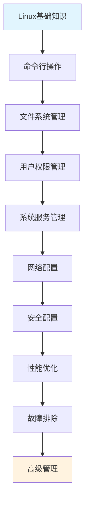

# Linux 系统完全指南

## 📖 文档概述

这是一个基于Linux官方文档、IEEE POSIX标准和权威技术资料编写的综合性Linux学习指南。文档涵盖从基础概念到高级系统管理的完整知识体系，适合初学者到专家级用户。

## 🏗️ 文档结构

### 📚 [基础知识 (Fundamentals)](/fundamentals/)
- **Linux历史与发展** - Linux发展历程和生态系统
- **系统架构** - 内核架构、用户空间和系统组件
- **Shell基础** - Bash、Shell脚本和命令行环境
- **用户与权限** - 用户管理、权限系统和访问控制

### 🛠️ [命令参考 (Commands)](/commands/)
- **基础命令** - 文件系统操作、文本处理、系统信息
- **文件管理** - 权限管理、压缩解压、高级操作
- **系统管理** - 进程管理、服务管理、系统监控
- **网络工具** - 网络诊断、连接管理、安全工具
- **开发工具** - 编译工具、调试工具、版本控制
- **性能工具** - 性能分析、优化工具、监控系统

### 🗂️ [文件系统 (Filesystem)](/filesystem/)
- **文件系统类型** - ext4、XFS、Btrfs等文件系统特性
- **分区管理** - 磁盘分区、LVM、RAID配置
- **挂载与fstab** - 挂载管理、自动挂载配置
- **权限与ACL** - 高级权限管理和访问控制列表

### 🔧 [系统管理 (System Administration)](/system-administration/)
- **用户管理** - 用户和组的管理、sudo配置
- **服务管理** - Systemd、服务配置和管理
- **软件包管理** - APT、YUM、DNF等包管理器
- **系统监控** - 日志分析、性能监控、资源管理
- **备份恢复** - 数据备份策略和灾难恢复

### 🌐 [网络管理 (Networking)](/networking/)
- **网络基础** - TCP/IP、网络协议栈
- **网络配置** - 网络接口、路由配置
- **防火墙** - iptables、firewalld、网络安全
- **网络服务** - SSH、DNS、DHCP配置和管理

### 🔒 [安全管理 (Security)](/security/)
- **系统安全** - 安全基线、加固指南
- **加密技术** - 文件加密、传输加密、密钥管理
- **访问控制** - SELinux、AppArmor、权限管理
- **安全审计** - 日志审计、入侵检测、安全评估

### 💻 [开发环境 (Development)](/development/)
- **编程环境** - 编译器、调试器、开发工具
- **版本控制** - Git、版本管理最佳实践
- **容器技术** - Docker基础、容器管理
- **自动化工具** - Shell脚本、Ansible、自动化部署

### 🔬 [内核与底层 (Kernel)](/kernel/)
- **内核架构** - Linux内核结构和模块系统
- **系统调用** - 系统调用接口和编程
- **驱动开发** - 设备驱动基础和开发
- **内核调试** - 内核调试技术和工具

### ⚡ [性能优化 (Performance)](/performance/)
- **性能分析** - 性能瓶颈识别和分析工具
- **系统调优** - 内核参数调优、系统优化
- **监控工具** - 性能监控和指标分析
- **负载测试** - 压力测试和性能评估

### 🔍 [故障排除 (Troubleshooting)](/troubleshooting/)
- **系统故障** - 启动问题、系统崩溃诊断
- **网络故障** - 网络连接问题排查
- **性能问题** - 性能下降原因分析
- **日志分析** - 系统日志分析和问题定位

## 🎯 学习路径

### 🔰 初级路径 (Foundation)
1. **Linux基础** → 系统概述和基本概念
2. **命令行入门** → 基础命令和Shell操作
3. **文件系统** → 文件操作和权限管理
4. **用户管理** → 用户和组的管理

### 🔸 中级路径 (Intermediate)
1. **系统管理** → 服务管理和系统监控
2. **网络管理** → 网络配置和故障排除
3. **Shell脚本** → 自动化脚本编写
4. **软件包管理** → 软件安装和更新

### 🔺 高级路径 (Advanced)
1. **性能优化** → 系统调优和性能分析
2. **安全管理** → 系统安全和访问控制
3. **内核研究** → 内核架构和模块开发
4. **企业应用** → 大规模部署和管理

### 🎓 专家路径 (Expert)
1. **系统架构设计** → 企业级系统架构
2. **自动化运维** → DevOps和自动化部署
3. **容器和云** → 容器化和云原生技术
4. **内核开发** → 内核模块和驱动开发

## 📋 快速索引

### 常用命令速查
- [命令速查表](/commands/CHEAT-SHEET.md) - 最常用命令的快速参考
- [命令索引](/commands/INDEX.md) - 按功能分类的完整命令索引

### 配置文件参考
- [重要配置文件](/system-administration/config-files.md) - 系统重要配置文件详解
- [网络配置](/networking/configuration.md) - 网络配置文件和参数

### 故障排除指南
- [启动问题](/troubleshooting/boot-issues.md) - 系统启动故障排除
- [性能问题](/troubleshooting/performance.md) - 系统性能问题分析
- [网络问题](/troubleshooting/network.md) - 网络连接问题诊断

## 🔧 使用说明

### 文档约定
- 🟢 **普通用户权限** - 可以以普通用户身份执行
- 🔴 **管理员权限** - 需要root或sudo权限
- 🟡 **注意事项** - 执行时需要特别注意
- ⚪ **安全操作** - 对系统无害的操作
- 🟠 **有风险** - 可能影响系统稳定性
- 🔴 **高危险** - 可能造成数据丢失或系统损坏

### 代码示例约定
```bash
# 这是注释说明
command --option value    # 命令示例

# 需要替换的变量用尖括号表示
command <variable>

# 可选参数用方括号表示
command [optional_argument]
```

### 环境说明
- **测试环境**: Ubuntu 22.04 LTS、CentOS 8、RHEL 9
- **内核版本**: Linux 5.x和6.x系列
- **Shell环境**: Bash 5.x、Zsh兼容

## 📚 参考文档

### 官方文档
- [Linux内核文档](https://www.kernel.org/doc/html/latest/) - Linux内核官方文档
- [GNU核心工具](https://www.gnu.org/software/coreutils/manual/) - GNU Coreutils手册
- [Systemd文档](https://systemd.io/) - Systemd官方文档
- [POSIX标准](https://pubs.opengroup.org/onlinepubs/9699919799/) - IEEE POSIX.1-2017

### 权威资料
- [Linux系统编程](http://man7.org/linux/man-pages/) - Linux手册页
- [内核源码](https://github.com/torvalds/linux) - Linux内核源代码
- [Arch Linux Wiki](https://wiki.archlinux.org/) - 详细的技术文档
- [Red Hat文档](https://access.redhat.com/documentation/) - 企业级Linux文档

### 技术标准
- **文件系统标准**: FHS 3.0 (Filesystem Hierarchy Standard)
- **网络协议**: RFC标准和IEEE 802系列
- **安全标准**: Common Criteria、CVE标准
- **编程接口**: POSIX.1、Single UNIX Specification

## 🤝 贡献指南

### 文档贡献
- 遵循Markdown格式规范
- 提供准确的技术信息和示例
- 包含适当的警告和安全提示
- 引用权威文档和标准

### 质量标准
- **准确性**: 所有信息基于官方文档验证
- **完整性**: 涵盖主题的各个方面
- **实用性**: 提供可操作的示例和指导
- **安全性**: 强调安全最佳实践

## 📄 许可证

本文档基于 **MIT 许可证** 开源，可自由使用、修改和分发。

---

## 🚀 快速开始

1. **新手用户**: 从[Linux基础](/fundamentals/introduction.md)开始
2. **有经验用户**: 直接查看[命令参考](/commands/)
3. **系统管理员**: 重点关注[系统管理](/system-administration/)
4. **开发者**: 查看[开发环境](/development/)配置

### 推荐学习顺序



---

*最后更新: 2024年7月*
*基于: Linux 6.x内核, Ubuntu 22.04 LTS, CentOS Stream 9*
