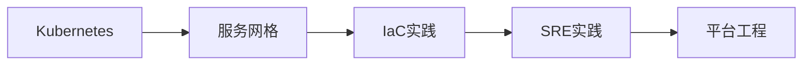
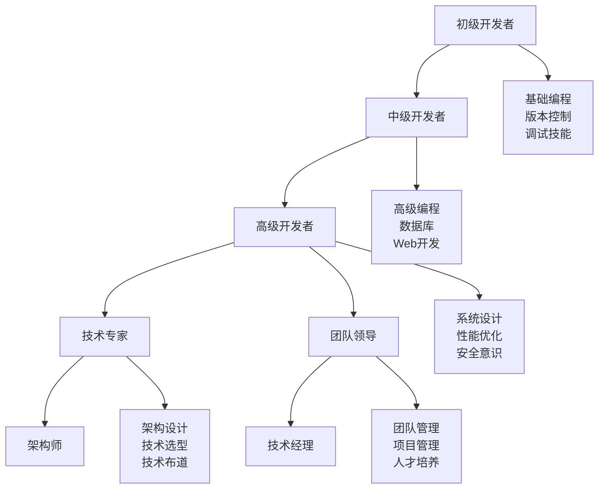

# Linux 开发环境管理

## 💻 模块概述

Linux开发环境管理涵盖编程工具链、版本控制、容器技术、自动化构建等现代开发必备技能。本模块面向开发者和DevOps工程师，基于业界最佳实践编写。

## 📚 核心内容

### 🛠️ [开发工具链](development-toolchain.md)
- **编程语言环境** - C/C++、Python、Java、Node.js等环境配置
- **编译器和构建工具** - GCC、Clang、Make、CMake配置
- **调试工具** - GDB、Valgrind、strace调试技术
- **IDE和编辑器** - VSCode、Vim、Emacs开发环境

### 📦 [版本控制](version-control.md)
- **Git基础** - Git核心概念和基本操作
- **分支策略** - Git Flow、GitHub Flow工作流
- **协作开发** - 多人协作和代码审查
- **高级功能** - Submodule、Hooks、自动化

### 🐳 [容器化技术](containerization.md)
- **Docker基础** - 容器概念和Docker使用
- **镜像制作** - Dockerfile编写和最佳实践
- **容器编排** - Docker Compose多容器应用
- **Kubernetes入门** - K8s集群管理基础

### 🔄 [持续集成/持续部署](ci-cd.md)
- **CI/CD概念** - 持续集成和持续部署原理
- **Jenkins** - Jenkins pipeline配置
- **GitLab CI/CD** - GitLab自动化流程
- **GitHub Actions** - GitHub原生CI/CD

### 📈 [监控与日志](monitoring-logging.md)
- **应用监控** - APM工具和性能监控
- **日志管理** - 结构化日志和日志聚合
- **指标收集** - Prometheus、Grafana监控栈
- **告警系统** - 监控告警和通知系统

### 🤖 [自动化运维](automation.md)
- **基础设施即代码** - Terraform、Ansible自动化
- **配置管理** - 系统配置自动化管理
- **部署自动化** - 自动化部署策略
- **服务网格** - Istio、Linkerd微服务治理

## 🎯 学习路径

### 🔰 初级开发者


### 🔸 中级开发者  


### 🔺 高级开发者/DevOps


## 🛠️ 核心工具

### 开发工具
```bash
# 编译工具
gcc --version          # GNU编译器
clang --version        # LLVM编译器
make --version         # 构建工具
cmake --version        # 现代构建系统

# 调试工具
gdb --version          # GNU调试器
valgrind --version     # 内存调试
strace --version       # 系统调用跟踪
ltrace --version       # 库函数跟踪
```

### 版本控制
```bash
# Git版本控制
git --version          # Git版本
git config --list      # Git配置
git log --oneline -10  # 提交历史
git status             # 工作区状态
```

### 容器技术
```bash
# Docker容器
docker --version       # Docker版本
docker ps              # 运行中容器
docker images          # 镜像列表
docker-compose --version # Compose版本

# Kubernetes
kubectl version        # K8s客户端版本
kubectl get nodes      # 集群节点
kubectl get pods       # Pod状态
```

## 📋 开发环境清单

### 基础开发环境
- [ ] 操作系统更新到最新版本
- [ ] 安装基础开发工具包
- [ ] 配置包管理器和源
- [ ] 安装和配置Git
- [ ] 设置SSH密钥
- [ ] 选择和配置代码编辑器
- [ ] 安装必要的编程语言
- [ ] 配置Shell环境

### 高级开发环境
- [ ] 容器运行时安装配置
- [ ] CI/CD工具安装配置
- [ ] 监控和日志工具
- [ ] 自动化脚本和工具
- [ ] 安全扫描工具
- [ ] 性能分析工具
- [ ] 文档生成工具
- [ ] 测试框架配置

## 🎯 实践项目

### 1. 全栈应用开发环境
```bash
# 创建项目目录结构
mkdir -p myapp/{frontend,backend,database,deployment}

# 前端环境 (Node.js)
curl -o- https://raw.githubusercontent.com/nvm-sh/nvm/v0.39.0/install.sh | bash
nvm install --lts
npm install -g @angular/cli

# 后端环境 (Python)
python3 -m venv myapp/backend/venv
source myapp/backend/venv/bin/activate
pip install flask gunicorn

# 数据库环境 (PostgreSQL)
docker run -d --name myapp-db \
  -e POSTGRES_PASSWORD=password \
  -p 5432:5432 postgres:13
```

### 2. 微服务开发环境
```yaml
# docker-compose.yml
version: '3.8'
services:
  api-gateway:
    image: nginx:alpine
    ports:
      - "80:80"
    volumes:
      - ./nginx.conf:/etc/nginx/nginx.conf

  user-service:
    build: ./services/user-service
    environment:
      - DATABASE_URL=postgres://user:pass@db:5432/users
    depends_on:
      - db

  order-service:
    build: ./services/order-service
    environment:
      - DATABASE_URL=postgres://user:pass@db:5432/orders
    depends_on:
      - db

  db:
    image: postgres:13
    environment:
      POSTGRES_PASSWORD: password
    volumes:
      - postgres_data:/var/lib/postgresql/data

volumes:
  postgres_data:
```

### 3. CI/CD Pipeline配置
```yaml
# .github/workflows/ci.yml
name: CI/CD Pipeline

on:
  push:
    branches: [main, develop]
  pull_request:
    branches: [main]

jobs:
  test:
    runs-on: ubuntu-latest
    steps:
    - uses: actions/checkout@v2
    
    - name: Setup Python
      uses: actions/setup-python@v2
      with:
        python-version: '3.9'
    
    - name: Install dependencies
      run: |
        pip install -r requirements.txt
        pip install pytest pytest-cov
    
    - name: Run tests
      run: pytest --cov=src tests/
    
    - name: Build Docker image
      run: docker build -t myapp:${{ github.sha }} .
    
    - name: Deploy to staging
      if: github.ref == 'refs/heads/develop'
      run: |
        docker tag myapp:${{ github.sha }} myapp:staging
        # 部署到测试环境
```

## 📊 开发效率指标

### 关键指标
| 指标 | 目标值 | 测量方法 |
|------|--------|----------|
| 构建时间 | <5分钟 | CI/CD管道 |
| 测试覆盖率 | >80% | 代码覆盖率工具 |
| 部署频率 | 每日多次 | 部署统计 |
| 故障恢复时间 | <1小时 | 监控告警 |
| 代码审查时间 | <24小时 | Git统计 |

### 质量门禁
```bash
# 代码质量检查脚本
#!/bin/bash

echo "Running quality gates..."

# 1. 代码格式检查
echo "Checking code formatting..."
if ! black --check src/; then
    echo "❌ Code formatting failed"
    exit 1
fi

# 2. 静态分析
echo "Running static analysis..."
if ! flake8 src/; then
    echo "❌ Static analysis failed"  
    exit 1
fi

# 3. 安全扫描
echo "Running security scan..."
if ! bandit -r src/; then
    echo "❌ Security scan failed"
    exit 1
fi

# 4. 测试执行
echo "Running tests..."
if ! pytest --cov=src --cov-min=80; then
    echo "❌ Tests failed or coverage too low"
    exit 1
fi

echo "✅ All quality gates passed"
```

## 🔧 开发工具配置

### VSCode配置示例
```json
// .vscode/settings.json
{
    "python.defaultInterpreterPath": "./venv/bin/python",
    "python.linting.enabled": true,
    "python.linting.flake8Enabled": true,
    "python.formatting.provider": "black",
    "editor.formatOnSave": true,
    "editor.rulers": [88],
    "files.exclude": {
        "**/__pycache__": true,
        "**/.pytest_cache": true,
        "**/venv": true,
        "**/.coverage": true
    },
    "docker.containers.showFiles": true,
    "kubernetes.defaultNamespace": "development"
}
```

### Git配置最佳实践
```bash
# 全局Git配置
git config --global user.name "Your Name"
git config --global user.email "your.email@example.com"
git config --global init.defaultBranch main
git config --global pull.rebase true
git config --global push.default current

# 提交模板
cat > ~/.gitmessage << EOF
# Type: feat|fix|docs|style|refactor|test|chore
# Subject (50 chars max)

# Body (72 chars per line)

# Footer
# Fixes #issue_number
EOF

git config --global commit.template ~/.gitmessage
```

## 🔐 开发安全实践

### 代码安全扫描
```bash
# Python项目安全扫描
pip install bandit safety
bandit -r src/                    # 安全漏洞扫描
safety check                     # 依赖漏洞扫描

# Docker镜像安全扫描
docker run --rm -v /var/run/docker.sock:/var/run/docker.sock \
  aquasec/trivy image myapp:latest

# 代码质量分析
pip install sonarqube-scanner
sonar-scanner -Dsonar.projectKey=myapp
```

### 秘钥管理
```bash
# 使用.env文件管理环境变量
cat > .env << EOF
DATABASE_URL=postgresql://localhost/myapp
REDIS_URL=redis://localhost:6379
SECRET_KEY=your-secret-key-here
EOF

# 添加到.gitignore
echo ".env" >> .gitignore

# 在应用中使用
pip install python-dotenv
```

## 📚 学习资源

### 官方文档
- [Docker官方文档](https://docs.docker.com/)
- [Kubernetes文档](https://kubernetes.io/docs/)
- [Git官方教程](https://git-scm.com/docs)
- [Jenkins文档](https://www.jenkins.io/doc/)

### 在线课程和资源
- [Linux Academy](https://linuxacademy.com/) - Linux和云技术
- [Pluralsight](https://www.pluralsight.com/) - 技术培训
- [Coursera DevOps](https://www.coursera.org/) - DevOps课程
- [KodeKloud](https://kodekloud.com/) - 实践性学习平台

### 开源项目参与
- [Kubernetes](https://github.com/kubernetes/kubernetes)
- [Docker](https://github.com/docker)
- [Jenkins](https://github.com/jenkinsci/jenkins)
- [Prometheus](https://github.com/prometheus/prometheus)

## 🚀 职业发展路径

### 技能发展阶梯


### 认证建议
- **云平台认证**: AWS、Azure、GCP专业认证
- **容器认证**: CKA、CKAD、CKS Kubernetes认证
- **DevOps认证**: Jenkins、Ansible、Terraform认证
- **编程认证**: 各语言相关的专业认证

---

*开始您的现代开发之旅：[开发工具链](development-toolchain.md)*
