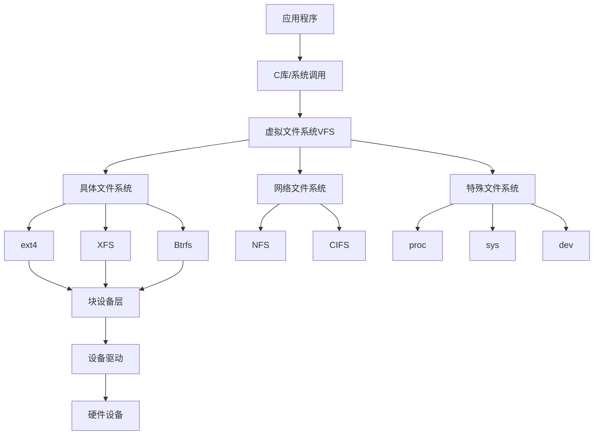

# Linux 文件系统管理

## 📁 模块概述

Linux文件系统管理是系统管理的基础技能，涵盖文件系统类型、磁盘分区、挂载管理、权限控制等核心内容。本模块基于Linux官方文档和文件系统标准编写。

## 📚 核心内容

### 💾 [文件系统基础](filesystem-basics.md)
- **文件系统概念** - VFS、Inode、目录树结构
- **常用文件系统** - ext4、XFS、Btrfs特性对比
- **文件系统层次标准** - FHS标准目录结构
- **特殊文件系统** - proc、sys、dev等虚拟文件系统

### 🔧 [磁盘分区管理](disk-partitioning.md)
- **分区方案** - MBR、GPT分区表对比
- **分区工具** - fdisk、parted、cfdisk使用
- **LVM管理** - 逻辑卷管理和动态扩容
- **RAID配置** - 软件RAID配置和管理

### 🔗 [挂载与自动挂载](mounting.md)
- **挂载基础** - mount命令和挂载点
- **fstab配置** - 系统启动自动挂载
- **网络文件系统** - NFS、CIFS/SMB挂载
- **USB和移动设备** - 可移动设备管理

### 🔐 [文件权限与ACL](permissions-acl.md)
- **标准权限** - rwx权限模型和八进制表示
- **特殊权限** - SUID、SGID、Sticky Bit
- **扩展属性** - 文件属性和扩展权限
- **访问控制列表** - ACL高级权限管理

### 📊 [存储监控与维护](storage-monitoring.md)
- **磁盘使用监控** - df、du命令和空间分析
- **文件系统检查** - fsck工具和错误修复
- **性能监控** - iostat、iotop存储性能分析
- **维护工具** - 文件系统优化和碎片整理

### 🔄 [备份与同步](backup-sync.md)
- **备份策略** - 完整备份、增量备份、镜像备份
- **同步工具** - rsync高效数据同步
- **快照技术** - LVM、Btrfs快照功能
- **归档工具** - tar、cpio等归档格式

## 🏗️ 文件系统架构

### Linux文件系统栈


### 目录结构标准（FHS）
```bash
# 查看根目录结构
ls -la /

# 标准目录说明
/bin        # 基本用户命令
/sbin       # 系统管理命令
/etc        # 配置文件
/var        # 可变数据
/tmp        # 临时文件
/usr        # 用户程序
/home       # 用户主目录
/root       # root用户主目录
/lib        # 共享库
/dev        # 设备文件
/proc       # 进程信息
/sys        # 系统信息
```

## 🔧 核心工具命令

### 文件系统管理
```bash
# 文件系统信息
df -h           # 磁盘使用情况
du -sh *        # 目录大小统计
lsblk           # 块设备树形显示
findmnt         # 挂载点信息

# 文件系统操作
mkfs.ext4       # 创建ext4文件系统
mkfs.xfs        # 创建XFS文件系统
tune2fs         # 调整ext2/3/4参数
xfs_admin       # XFS管理工具
```

### 磁盘分区工具
```bash
# 分区操作
fdisk           # MBR分区工具
gdisk           # GPT分区工具
parted          # 通用分区工具
cfdisk          # 菜单式分区工具

# LVM管理
pvcreate        # 创建物理卷
vgcreate        # 创建卷组
lvcreate        # 创建逻辑卷
lvextend        # 扩展逻辑卷
```

### 权限管理工具
```bash
# 权限操作
chmod           # 修改文件权限
chown           # 修改文件所有者
chgrp           # 修改文件组
umask           # 默认权限掩码

# ACL管理
setfacl         # 设置ACL
getfacl         # 查看ACL
```

## 📋 管理检查清单

### 日常监控任务
- [ ] 检查磁盘空间使用情况
- [ ] 监控文件系统错误和警告
- [ ] 验证挂载点状态
- [ ] 检查权限设置合规性
- [ ] 清理临时文件和日志
- [ ] 监控磁盘I/O性能
- [ ] 检查备份任务状态
- [ ] 审查文件访问日志

### 维护任务
- [ ] 文件系统一致性检查
- [ ] 磁盘碎片整理（如需要）
- [ ] 权限审计和清理
- [ ] 备份验证和恢复测试
- [ ] 存储容量规划
- [ ] 性能基准测试
- [ ] 配置文件更新
- [ ] 文档更新维护

## 🎯 最佳实践

### 1. 分区规划策略
```bash
# 推荐分区方案（服务器）
/boot       # 500MB-1GB，启动分区
/           # 20-50GB，根分区
/usr        # 10-30GB，用户程序
/var        # 根据需求，日志和数据
/home       # 用户数据分区
/tmp        # 2-5GB，临时文件
swap        # 内存1-2倍或根据需求
```

### 2. 文件系统选择指南
| 用途 | 推荐文件系统 | 原因 |
|------|-------------|------|
| 根分区 | ext4 | 稳定可靠，广泛支持 |
| 大文件存储 | XFS | 高性能，支持大文件 |
| 数据库 | XFS或ext4 | 性能优化，支持extent |
| 备份存储 | Btrfs | 快照功能，数据校验 |
| 临时文件 | tmpfs | 内存文件系统，高速 |

### 3. 权限管理原则
```bash
# 最小权限原则
# 目录权限：755 (rwxr-xr-x)
# 配置文件：644 (rw-r--r--)
# 执行文件：755 (rwxr-xr-x)
# 敏感文件：600 (rw-------)

# 示例：Web服务器权限
chown -R www-data:www-data /var/www/html/
find /var/www/html/ -type d -exec chmod 755 {} \;
find /var/www/html/ -type f -exec chmod 644 {} \;
```

### 4. 挂载选项优化
```bash
# /etc/fstab优化配置示例
UUID=xxx / ext4 defaults,noatime,errors=remount-ro 0 1
UUID=yyy /var xfs defaults,noatime,largeio,inode64 0 2
tmpfs /tmp tmpfs defaults,noatime,mode=1777,size=2G 0 0

# 常用挂载选项
noatime     # 不更新访问时间，提高性能
nodev       # 不解析设备文件，安全性
nosuid      # 不允许SUID/SGID，安全性
ro          # 只读挂载
rw          # 读写挂载
```

## 🔍 故障排除指南

### 常见问题诊断

#### 1. 磁盘空间不足
```bash
# 快速定位大文件
du -sh /* | sort -hr | head -20

# 查找大文件
find / -type f -size +100M -exec ls -lh {} \; 2>/dev/null

# 清理系统垃圾
apt autoremove && apt autoclean  # Debian/Ubuntu
dnf autoremove && dnf clean all  # Fedora/RHEL

# 清理日志文件
journalctl --vacuum-time=7d
rm -f /var/log/*.log.1 /var/log/*.log.*.gz
```

#### 2. 文件系统错误
```bash
# 检查文件系统
fsck -f /dev/sdb1  # 强制检查
fsck -y /dev/sdb1  # 自动修复

# 只读模式修复
mount -o remount,ro /
fsck -f /dev/sda1
mount -o remount,rw /
```

#### 3. 挂载问题
```bash
# 查看挂载状态
mount | grep /target/mount/point
findmnt /target/mount/point

# 强制卸载
umount -f /target/mount/point
fuser -km /target/mount/point  # 终止占用进程

# 检查fstab语法
mount -fav  # 测试fstab配置
```

## 📊 性能监控

### 存储性能指标
```bash
# I/O统计
iostat -x 1        # 扩展I/O统计
iotop -o           # 实时I/O监控
dstat -d           # 磁盘统计

# 文件系统性能测试
dd if=/dev/zero of=testfile bs=1G count=1 oflag=direct
hdparm -t /dev/sda  # 磁盘读取测试
bonnie++ -r 1024    # 综合性能测试
```

### 监控阈值设置
| 指标 | 警告阈值 | 严重阈值 |
|------|----------|----------|
| 磁盘使用率 | 80% | 90% |
| Inode使用率 | 80% | 90% |
| I/O等待时间 | 20% | 40% |
| 磁盘队列长度 | 5 | 10 |
| 读写错误数 | 1/小时 | 5/小时 |

## 🔐 安全配置

### 文件系统安全
```bash
# 设置noexec挂载选项
/dev/sdb1 /tmp ext4 defaults,noexec,nosuid,nodev 0 2

# 隐藏进程信息
mount -o remount,hidepid=2 /proc

# 设置文件属性
chattr +i /etc/passwd     # 设置不可修改
lsattr /etc/passwd        # 查看文件属性
```

### 权限审计
```bash
# 查找SUID文件
find / -perm -4000 -type f 2>/dev/null

# 查找可写文件
find / -perm -2 -type f 2>/dev/null

# 查找无主文件
find / -nouser -o -nogroup 2>/dev/null
```

## 📚 学习资源

### 官方文档
- [Linux文件系统文档](https://www.kernel.org/doc/html/latest/filesystems/)
- [ext4文件系统](https://ext4.wiki.kernel.org/)
- [XFS文档](https://xfs.wiki.kernel.org/)
- [Btrfs文档](https://btrfs.wiki.kernel.org/)

### 标准文档
- [文件系统层次标准(FHS)](https://refspecs.linuxfoundation.org/fhs.shtml)
- [Linux标准基础(LSB)](https://refspecs.linuxfoundation.org/lsb.shtml)

### 实用指南
- [文件系统性能调优指南](https://access.redhat.com/documentation/en-us/red_hat_enterprise_linux/8/html/managing_file_systems/)
- [存储管理最佳实践](https://ubuntu.com/server/docs/device-mapper-multipathing-introduction)

## 🚀 实践建议

### 环境准备
1. **虚拟机环境** - 使用多个虚拟磁盘练习
2. **容器环境** - 练习容器存储管理
3. **云环境** - 体验云存储服务

### 实践项目
1. **多用户文件服务器** - 配置共享存储和权限
2. **数据库存储优化** - 针对数据库的存储配置
3. **备份系统搭建** - 完整的备份恢复方案
4. **高可用存储** - RAID和LVM高可用配置

---

*开始您的文件系统管理学习之路：[文件系统基础](filesystem-basics.md)*
