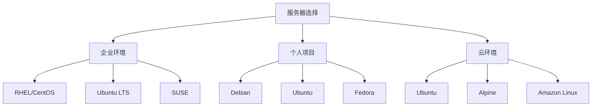

# Linux 系统介绍

## 🐧 Linux的诞生与发展

### Linux的起源

Linux操作系统诞生于1991年，由芬兰赫尔辛基大学的学生**Linus Torvalds**创建。这一切始于他对当时流行的UNIX系统的学习需求，但由于UNIX系统的高昂成本，他决定自己开发一个类UNIX的操作系统。

#### 重要时间节点

| 年份 | 重要事件 | 意义 |
|------|----------|------|
| 1991年8月 | Linus发布Linux 0.01版本 | Linux内核诞生 |
| 1991年10月 | Linux 0.02版本发布 | 首个可用版本 |
| 1992年 | 采用GPL许可证 | 确立开源基础 |
| 1994年 | Linux 1.0版本发布 | 第一个稳定版本 |
| 1996年 | Linux 2.0版本发布 | 支持多处理器 |
| 2003年 | Linux 2.6版本发布 | 现代Linux基础 |
| 2011年 | Linux 3.0版本发布 | 内核版本重新编号 |
| 2015年 | Linux 4.0版本发布 | 持续演进 |
| 2019年 | Linux 5.0版本发布 | 现代化特性 |
| 2021年 | Linux 5.15 LTS发布 | 长期支持版本 |

### Linux的核心理念

#### 1. 开源自由
```bash
# 查看GPL许可证
cat /usr/share/common-licenses/GPL-3
```
- **四大自由**：使用、研究、修改、分发的自由
- **源码开放**：任何人都可以查看和修改源代码
- **社区驱动**：全球开发者共同参与开发

#### 2. UNIX哲学
- **做好一件事**：每个程序专注于做好一件事
- **组合使用**：通过管道和重定向组合程序
- **文本接口**：一切皆文件，文本是通用接口

#### 3. 模块化设计
- **微内核思想**：核心功能最小化
- **可扩展性**：通过模块扩展功能
- **可移植性**：支持多种硬件架构

## 🌍 Linux发行版生态

### 主流发行版分类

#### 1. 企业级发行版

**Red Hat Enterprise Linux (RHEL)**
- **定位**：企业级商业发行版
- **特点**：稳定性高，商业支持
- **包管理**：RPM + YUM/DNF
- **应用**：服务器、企业环境

```bash
# 查看RHEL版本
cat /etc/redhat-release

# 查看系统信息
hostnamectl
```

**SUSE Linux Enterprise**
- **定位**：欧洲主流企业版
- **特点**：YaST配置工具
- **包管理**：RPM + Zypper
- **应用**：企业服务器

#### 2. 社区驱动发行版

**Ubuntu**
- **基于**：Debian
- **发布周期**：6个月，LTS版本2年
- **特点**：用户友好，软件丰富
- **包管理**：APT + Snap

```bash
# 查看Ubuntu版本
lsb_release -a

# 查看可用版本
ubuntu-distro-info
```

**Debian**
- **定位**：稳定性至上
- **特点**：严格的自由软件政策
- **包管理**：APT + dpkg
- **分支**：stable、testing、unstable

**Fedora**
- **定位**：RHEL的上游社区版
- **特点**：最新技术，快速更新
- **包管理**：DNF + RPM
- **创新**：新特性的试验场

**CentOS/Rocky Linux**
- **定位**：RHEL的免费重构版
- **特点**：与RHEL二进制兼容
- **应用**：服务器部署

#### 3. 专业用途发行版

**Arch Linux**
- **哲学**：简洁、用户中心、自己动手
- **特点**：滚动更新，最小化安装
- **包管理**：Pacman + AUR
- **用户**：高级用户

```bash
# Arch系统信息
cat /etc/arch-release

# 滚动更新
sudo pacman -Syu
```

**Gentoo**
- **特点**：源码编译，高度定制
- **包管理**：Portage
- **优势**：性能优化

**Alpine Linux**
- **特点**：安全、简洁、资源高效
- **应用**：容器、嵌入式系统
- **包管理**：APK

### 发行版选择指南

#### 服务器环境


#### 桌面环境
- **新手用户**：Ubuntu、Linux Mint、Elementary OS
- **高级用户**：Fedora、Arch Linux、Manjaro
- **开发者**：Ubuntu、Fedora、Debian

#### 嵌入式/容器
- **容器镜像**：Alpine Linux、Distroless
- **嵌入式系统**：Buildroot、Yocto Project
- **IoT设备**：Raspberry Pi OS、Ubuntu Core

## 🔧 Linux在不同领域的应用

### 1. 服务器和数据中心

**Web服务器统计**
```bash
# 查看Web服务器进程
ps aux | grep -E "(apache2|nginx|httpd)"

# 查看监听端口
netstat -tlnp | grep -E ":80|:443"
```

- **市场份额**：超过70%的Web服务器运行Linux
- **主要优势**：稳定性、安全性、成本效益
- **典型应用**：Apache、Nginx、数据库服务器

### 2. 云计算平台

**主要云平台Linux使用**
- **Amazon AWS**：Amazon Linux、Ubuntu、CentOS
- **Google Cloud**：Container-Optimized OS、Ubuntu
- **Microsoft Azure**：Ubuntu、RHEL、SUSE
- **阿里云**：Alibaba Cloud Linux、CentOS、Ubuntu

```bash
# 云实例信息查看
cloud-init query --all

# 查看云提供商
dmidecode -s system-manufacturer
```

### 3. 容器和微服务

**容器生态**
```bash
# Docker基础镜像
docker images | grep -E "(alpine|ubuntu|debian|centos)"

# Kubernetes节点信息
kubectl get nodes -o wide
```

- **容器运行时**：Docker、Podman、containerd
- **编排系统**：Kubernetes、Docker Swarm
- **基础镜像**：Alpine、Ubuntu、Debian minimized

### 4. 嵌入式系统

**嵌入式Linux应用**
- **消费电子**：路由器、智能电视、智能手机
- **工业控制**：PLC、工业网关、传感器
- **汽车电子**：车载信息系统、自动驾驶
- **IoT设备**：智能家居、可穿戴设备

```bash
# 嵌入式系统信息
cat /proc/cpuinfo
cat /proc/meminfo
df -h
```

### 5. 高性能计算

**超级计算机**
- **Top500统计**：95%以上运行Linux
- **科学计算**：天气预报、基因组学、物理模拟
- **机器学习**：TensorFlow、PyTorch、CUDA支持

```bash
# 查看CPU信息
lscpu

# 查看内存信息
free -h

# 查看GPU信息（如果有NVIDIA GPU）
nvidia-smi
```

### 6. 移动和边缘计算

**Android系统**
- **基础**：Android基于Linux内核
- **特点**：针对移动设备优化
- **生态**：Google Play服务、应用框架

**边缘计算**
- **设备**：边缘网关、CDN节点
- **特点**：低延迟、本地处理
- **技术**：容器化部署、微服务架构

## 🎯 Linux的技术优势

### 1. 系统架构优势

#### 内核设计
```bash
# 查看内核信息
uname -a

# 查看内核模块
lsmod | head -10

# 查看系统调用
strace ls /tmp 2>&1 | head -10
```

- **单体内核**：高性能，模块化
- **抢占式多任务**：公平的资源分配
- **虚拟内存**：有效的内存管理
- **多用户支持**：安全的用户隔离

#### 文件系统
- **一切皆文件**：统一的接口设计
- **多种文件系统**：ext4、XFS、Btrfs等
- **高级特性**：快照、压缩、加密

### 2. 安全特性

#### 访问控制
```bash
# 查看文件权限
ls -la /etc/passwd

# 查看用户组
groups

# 查看sudo权限
sudo -l
```

- **多层权限模型**：用户、组、其他
- **强制访问控制**：SELinux、AppArmor
- **审计系统**：系统调用审计
- **加密支持**：文件系统加密、传输加密

#### 网络安全
- **防火墙**：iptables、firewalld、nftables
- **访问控制**：TCP Wrappers、fail2ban
- **加密通信**：SSH、TLS/SSL

### 3. 性能特性

#### 多处理器支持
```bash
# 查看CPU核心
nproc

# 查看负载均衡
top
htop

# 查看进程调度
ps -eo pid,ppid,cmd,policy,nice,pri,psr
```

- **SMP支持**：对称多处理
- **NUMA优化**：非一致性内存访问
- **CPU亲和性**：进程绑定到特定CPU

#### 内存管理
- **虚拟内存**：分页、交换机制
- **内存映射**：mmap高效文件访问
- **缓存机制**：页缓存、buffer缓存

## 📊 Linux生态系统

### 开发工具链

#### 编程语言支持
```bash
# 查看已安装编译器
gcc --version
python3 --version
java -version
node --version

# 查看开发库
dpkg -l | grep -E "dev|devel" | head -10
```

#### 开发环境
- **文本编辑器**：Vim、Emacs、VSCode
- **IDE**：Eclipse、IntelliJ IDEA、Qt Creator
- **版本控制**：Git、SVN、Mercurial
- **构建工具**：Make、CMake、Autotools

### 软件生态

#### 包管理系统
```bash
# Debian/Ubuntu系统
apt list --installed | wc -l

# Red Hat系统  
rpm -qa | wc -l

# Arch系统
pacman -Q | wc -l
```

#### 软件仓库
- **官方仓库**：发行版维护的软件包
- **第三方仓库**：PPA、EPEL、AUR
- **Flatpak/Snap**：通用包管理格式
- **容器镜像**：Docker Hub、Quay.io

## 🌟 Linux的未来趋势

### 技术发展方向

#### 1. 云原生技术
- **容器技术**：Docker、Podman的持续发展
- **编排系统**：Kubernetes生态完善
- **服务网格**：Istio、Linkerd等微服务治理
- **无服务器**：Serverless计算模式

#### 2. 边缘计算
```bash
# 边缘设备信息查看
# 通常在ARM设备上
cat /proc/device-tree/model 2>/dev/null || echo "Not ARM device"

# 查看网络接口（边缘设备通常有多个）
ip link show
```

- **边缘网关**：本地数据处理
- **IoT集成**：物联网设备管理
- **5G网络**：网络切片、移动边缘计算

#### 3. 人工智能和机器学习
- **GPU支持**：CUDA、ROCm驱动优化
- **容器化AI**：TensorFlow Serving、PyTorch容器
- **分布式训练**：多节点机器学习

#### 4. 安全增强
- **零信任架构**：身份验证和授权
- **硬件安全**：TPM、Secure Boot
- **容器安全**：镜像扫描、运行时保护

### 社区发展

#### 开源社区
- **内核开发**：全球协作的开发模式
- **发行版社区**：用户驱动的特性开发
- **企业参与**：Red Hat、SUSE、Canonical等

#### 标准化工作
- **LSB标准**：Linux标准基础
- **FHS标准**：文件系统层次标准
- **OCI标准**：开放容器倡议

## 📚 学习资源推荐

### 基础学习
1. **《Linux系统管理技术手册》** - 系统管理经典
2. **《鸟哥的Linux私房菜》** - 中文入门经典
3. **《Linux命令行大全》** - 命令行详解

### 进阶学习
1. **《Linux内核设计与实现》** - 内核原理
2. **《Linux设备驱动程序》** - 驱动开发
3. **《Linux系统编程》** - 系统编程接口

### 在线资源
- **Linux From Scratch** - 从源码构建Linux
- **Arch Linux Wiki** - 详细的技术文档
- **The Linux Documentation Project** - 官方文档项目

### 认证体系
- **Linux Professional Institute (LPI)**
- **Red Hat Certified Engineer (RHCE)**
- **Ubuntu Certified Professional**

---

## 🎓 本章总结

通过本章学习，您应该了解：

1. **Linux历史**：从1991年诞生到现在的发展历程
2. **发行版生态**：主要发行版特点和应用场景
3. **技术优势**：Linux在性能、安全、稳定性方面的优势
4. **应用领域**：服务器、云计算、嵌入式等广泛应用
5. **未来趋势**：云原生、边缘计算、AI等发展方向

**下一步**：继续学习 [系统架构](system-architecture.md) 了解Linux内部结构。

---

*参考资料*:
- [Linux内核官网](https://www.kernel.org/)
- [Linux基金会](https://www.linuxfoundation.org/)
- [GNU项目](https://www.gnu.org/)
- [Open Source Initiative](https://opensource.org/)
