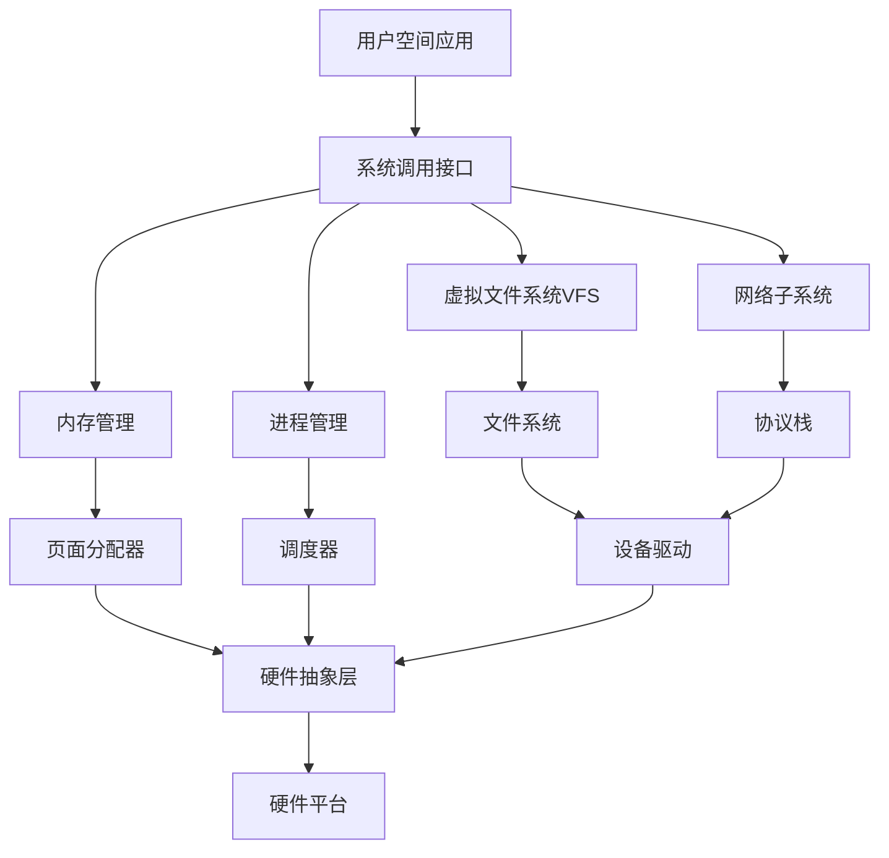
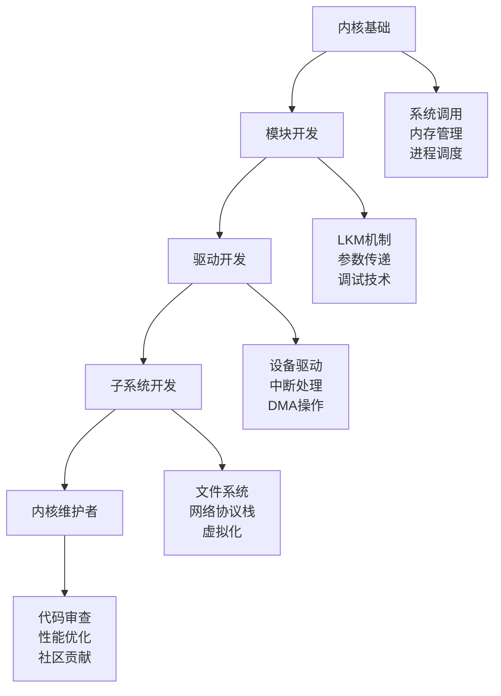

# Linux 内核与底层技术

## 🔬 模块概述

Linux内核是操作系统的核心，理解内核机制对于系统管理员、驱动开发者和性能调优专家至关重要。本模块深入探讨内核架构、系统调用、设备驱动等底层技术。

## 📚 核心内容

### 🏗️ [内核架构](kernel-architecture.md)
- **内核结构** - 单体内核架构和子系统组织
- **内存管理** - 虚拟内存、分页机制、内存分配
- **进程调度** - CFS调度器、实时调度、负载均衡
- **中断处理** - 中断机制、软中断、工作队列

### 📞 [系统调用](system-calls.md)
- **系统调用接口** - 用户空间与内核空间交互
- **系统调用表** - 系统调用号和处理函数映射
- **参数传递** - 系统调用参数和返回值机制
- **性能分析** - 系统调用性能监控和优化

### 🔌 [设备驱动开发](device-drivers.md)
- **驱动框架** - Linux设备驱动模型
- **字符设备驱动** - 简单字符设备驱动开发
- **块设备驱动** - 存储设备驱动开发
- **网络设备驱动** - 网卡驱动开发基础

### 🧩 [内核模块](kernel-modules.md)
- **模块机制** - 可加载内核模块(LKM)
- **模块开发** - 内核模块编写和编译
- **符号导出** - 模块间符号共享
- **模块参数** - 运行时参数配置

### 🔍 [内核调试](kernel-debugging.md)
- **调试技术** - KGDB、crash工具使用
- **内核日志** - printk、ftrace跟踪系统
- **内存调试** - KASAN、SLUB调试
- **性能分析** - perf、eBPF程序开发

### ⚡ [性能优化](kernel-optimization.md)
- **内核参数调优** - sysctl参数优化
- **内存优化** - 大页内存、NUMA优化
- **I/O优化** - 调度器选择、队列深度调优
- **网络优化** - 网络栈性能优化

## 🏗️ Linux内核架构图

### 内核子系统


### 内核空间布局
```bash
# 查看内核版本和架构
uname -a

# 查看内核配置
zcat /proc/config.gz | grep -E "CONFIG_.*=y" | head -20

# 查看内核模块
lsmod | head -10

# 查看内核符号表
cat /proc/kallsyms | head -10

# 查看系统调用表
cat /proc/sys/kernel/ostype
cat /proc/sys/kernel/osrelease
```

## 🔧 内核开发工具

### 内核构建工具
```bash
# 内核源码获取
wget https://cdn.kernel.org/pub/linux/kernel/v6.x/linux-6.1.tar.xz
tar xf linux-6.1.tar.xz
cd linux-6.1

# 配置内核
make menuconfig      # 图形化配置
make defconfig       # 默认配置
make localmodconfig  # 基于当前模块配置

# 编译内核
make -j$(nproc)      # 编译内核
make modules         # 编译模块
make modules_install # 安装模块
make install         # 安装内核
```

### 调试工具
```bash
# 内核日志查看
dmesg | tail -20     # 内核消息
journalctl -k        # systemd内核日志

# 内核跟踪
cd /sys/kernel/debug/tracing
echo function > current_tracer
echo 1 > tracing_on
cat trace | head -20

# 性能分析
perf list            # 可用事件
perf record -g sleep 5  # 记录性能数据
perf report          # 分析性能数据
```

### 模块开发工具
```bash
# 模块信息查看
modinfo ext4         # 模块信息
modprobe -l | grep usb  # 可用模块

# 模块操作
insmod module.ko     # 插入模块
rmmod module         # 移除模块
modprobe module      # 智能模块加载
```

## 📋 内核开发清单

### 开发环境准备
- [ ] 安装内核开发包和头文件
- [ ] 配置交叉编译工具链（如需要）
- [ ] 准备虚拟机测试环境
- [ ] 安装调试和分析工具
- [ ] 配置版本控制系统
- [ ] 准备文档和参考资料
- [ ] 设置持续集成环境
- [ ] 配置静态分析工具

### 模块开发流程
- [ ] 需求分析和设计规划
- [ ] 创建基础模块框架
- [ ] 实现核心功能代码
- [ ] 添加错误处理和日志
- [ ] 编写测试用例
- [ ] 进行代码审查
- [ ] 性能测试和优化
- [ ] 文档编写和维护

## 🎯 实践项目

### 1. 简单字符设备驱动
```c
// hello.c - 简单内核模块示例
#include <linux/init.h>
#include <linux/module.h>
#include <linux/kernel.h>

static int __init hello_init(void)
{
    printk(KERN_INFO "Hello, Linux Kernel!\n");
    return 0;
}

static void __exit hello_exit(void)
{
    printk(KERN_INFO "Goodbye, Linux Kernel!\n");
}

module_init(hello_init);
module_exit(hello_exit);

MODULE_LICENSE("GPL");
MODULE_AUTHOR("Your Name");
MODULE_DESCRIPTION("A simple hello world kernel module");
MODULE_VERSION("1.0");
```

```makefile
# Makefile
obj-m := hello.o

KERNELDIR := /lib/modules/$(shell uname -r)/build
PWD := $(shell pwd)

default:
	$(MAKE) -C $(KERNELDIR) M=$(PWD) modules

clean:
	$(MAKE) -C $(KERNELDIR) M=$(PWD) clean

install:
	$(MAKE) -C $(KERNELDIR) M=$(PWD) modules_install

.PHONY: default clean install
```

### 2. proc文件系统接口
```c
// proc_example.c - proc文件系统示例
#include <linux/init.h>
#include <linux/module.h>
#include <linux/proc_fs.h>
#include <linux/uaccess.h>

#define PROC_NAME "hello_proc"
#define BUFFER_SIZE 1024

static struct proc_dir_entry *proc_entry;
static char proc_buffer[BUFFER_SIZE];
static unsigned long proc_buffer_size = 0;

static ssize_t proc_read(struct file *file, char __user *buffer, 
                        size_t count, loff_t *pos)
{
    if (*pos > 0 || count < proc_buffer_size)
        return 0;
    
    if (copy_to_user(buffer, proc_buffer, proc_buffer_size))
        return -EFAULT;
    
    *pos = proc_buffer_size;
    return proc_buffer_size;
}

static ssize_t proc_write(struct file *file, const char __user *buffer,
                         size_t count, loff_t *pos)
{
    if (count > BUFFER_SIZE - 1)
        count = BUFFER_SIZE - 1;
    
    if (copy_from_user(proc_buffer, buffer, count))
        return -EFAULT;
    
    proc_buffer[count] = '\0';
    proc_buffer_size = count;
    return count;
}

static const struct proc_ops proc_fops = {
    .proc_read = proc_read,
    .proc_write = proc_write,
};

static int __init proc_init(void)
{
    proc_entry = proc_create(PROC_NAME, 0666, NULL, &proc_fops);
    if (proc_entry == NULL) {
        printk(KERN_ERR "Failed to create proc entry\n");
        return -ENOMEM;
    }
    
    strcpy(proc_buffer, "Hello from kernel!\n");
    proc_buffer_size = strlen(proc_buffer);
    
    printk(KERN_INFO "Proc module loaded\n");
    return 0;
}

static void __exit proc_exit(void)
{
    proc_remove(proc_entry);
    printk(KERN_INFO "Proc module unloaded\n");
}

module_init(proc_init);
module_exit(proc_exit);
MODULE_LICENSE("GPL");
```

### 3. 简单的网络过滤器
```c
// netfilter_example.c - 网络过滤器示例
#include <linux/init.h>
#include <linux/module.h>
#include <linux/kernel.h>
#include <linux/netfilter.h>
#include <linux/netfilter_ipv4.h>
#include <linux/ip.h>
#include <linux/tcp.h>

static struct nf_hook_ops nfho;

static unsigned int hook_func(void *priv,
                             struct sk_buff *skb,
                             const struct nf_hook_state *state)
{
    struct iphdr *iph;
    struct tcphdr *tcph;
    
    if (!skb)
        return NF_ACCEPT;
    
    iph = ip_hdr(skb);
    if (iph->protocol == IPPROTO_TCP) {
        tcph = tcp_hdr(skb);
        
        // 阻止到端口80的连接
        if (ntohs(tcph->dest) == 80) {
            printk(KERN_INFO "Blocking HTTP traffic to %pI4\n", 
                   &iph->daddr);
            return NF_DROP;
        }
    }
    
    return NF_ACCEPT;
}

static int __init netfilter_init(void)
{
    nfho.hook = hook_func;
    nfho.hooknum = NF_INET_PRE_ROUTING;
    nfho.pf = PF_INET;
    nfho.priority = NF_IP_PRI_FIRST;
    
    nf_register_net_hook(&init_net, &nfho);
    printk(KERN_INFO "Netfilter module loaded\n");
    return 0;
}

static void __exit netfilter_exit(void)
{
    nf_unregister_net_hook(&init_net, &nfho);
    printk(KERN_INFO "Netfilter module unloaded\n");
}

module_init(netfilter_init);
module_exit(netfilter_exit);
MODULE_LICENSE("GPL");
```

## 📊 内核性能分析

### 关键性能指标
```bash
# CPU调度延迟
perf sched record sleep 10
perf sched latency

# 内存分配跟踪
echo 1 > /proc/sys/vm/drop_caches
perf record -e kmem:* sleep 5
perf report

# I/O性能分析
perf record -e block:* -a sleep 10
perf report

# 网络栈性能
perf record -e net:* -a sleep 10
perf report
```

### 内核参数优化
```bash
# /etc/sysctl.d/99-kernel-tuning.conf
# 虚拟内存管理
vm.swappiness = 10
vm.dirty_ratio = 15
vm.dirty_background_ratio = 5

# 网络栈调优
net.core.rmem_max = 16777216
net.core.wmem_max = 16777216
net.ipv4.tcp_rmem = 4096 65536 16777216
net.ipv4.tcp_wmem = 4096 65536 16777216

# 进程调度
kernel.sched_migration_cost_ns = 5000000
kernel.sched_autogroup_enabled = 0

# 文件系统
fs.file-max = 1000000
fs.inotify.max_user_watches = 524288

# 应用设置
sysctl -p /etc/sysctl.d/99-kernel-tuning.conf
```

## 🔍 内核调试技术

### 内核崩溃分析
```bash
# 安装调试工具
apt install crash linux-crashdump  # Ubuntu
dnf install crash kexec-tools       # Fedora

# 配置内核转储
echo 'kernel.panic_on_oops = 1' >> /etc/sysctl.conf
echo 'kernel.panic = 10' >> /etc/sysctl.conf

# 分析崩溃转储
crash /usr/lib/debug/boot/vmlinux-$(uname -r) /var/crash/*/vmcore

# crash命令示例
(crash) bt      # 显示调用栈
(crash) log     # 显示内核日志
(crash) ps      # 显示进程列表
(crash) files   # 显示打开的文件
```

### eBPF程序开发
```c
// hello_ebpf.c - 简单的eBPF程序
#include <linux/bpf.h>
#include <bpf/bpf_helpers.h>

SEC("tracepoint/syscalls/sys_enter_openat")
int trace_openat(struct trace_event_raw_sys_enter *ctx)
{
    char msg[] = "openat syscall called\n";
    bpf_trace_printk(msg, sizeof(msg));
    return 0;
}

char _license[] SEC("license") = "GPL";
```

```bash
# 编译和加载eBPF程序
clang -O2 -target bpf -c hello_ebpf.c -o hello_ebpf.o
bpftool prog load hello_ebpf.o /sys/fs/bpf/hello_ebpf

# 查看输出
cat /sys/kernel/debug/tracing/trace_pipe
```

## 📚 学习资源

### 官方文档
- [Linux内核文档](https://www.kernel.org/doc/html/latest/)
- [内核API参考](https://www.kernel.org/doc/htmldocs/)
- [Linux设备驱动](https://lwn.net/Kernel/LDD3/)

### 重要书籍
- **《Linux内核设计与实现》** - Robert Love
- **《深入理解Linux内核》** - Daniel Bovet & Marco Cesati
- **《Linux设备驱动程序》** - Jonathan Corbet等
- **《Linux内核完全注释》** - 赵炯

### 在线资源
- [Linux Weekly News](https://lwn.net/) - 内核开发新闻
- [Kernel Newbies](https://kernelnewbies.org/) - 内核学习资源
- [Linux Foundation Training](https://training.linuxfoundation.org/)

## 🚀 进阶发展

### 技能发展路径


### 专业认证
- **Linux内核开发认证** - Linux Foundation
- **嵌入式Linux认证** - CELF认证
- **设备驱动开发认证** - 厂商特定认证

---

*深入探索Linux内核世界：[内核架构](kernel-architecture.md)*
