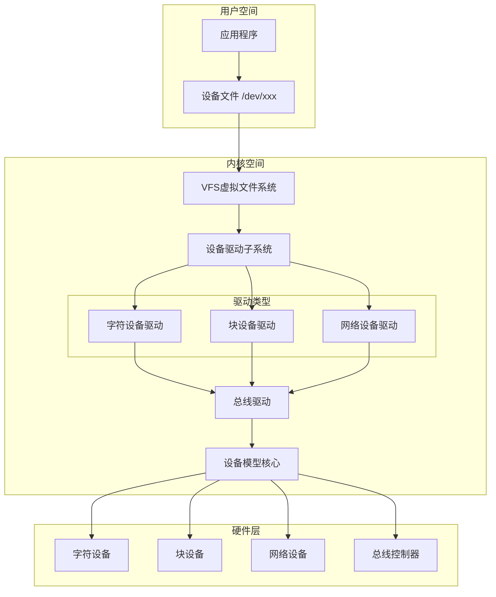

# Linux 设备驱动开发详解

## 🔌 概述

Linux设备驱动程序是内核的重要组成部分，负责管理和控制硬件设备。本文档基于Linux内核官方驱动开发文档、《Linux Device Drivers》和内核源码，全面介绍设备驱动的开发技术。

---

## 🏗️ Linux设备驱动模型

### 设备驱动架构



### 设备驱动分类

| 驱动类型 | 设备特性 | 访问方式 | 典型设备 |
|----------|----------|----------|----------|
| **字符设备** | 按字节流顺序访问 | read/write | 串口、键盘、鼠标 |
| **块设备** | 按块随机访问 | 缓存I/O | 硬盘、SSD、CD-ROM |
| **网络设备** | 网络数据包传输 | 套接字接口 | 网卡、WiFi、蓝牙 |

---

## 📝 字符设备驱动开发

### 1. 字符设备基本结构

```c
// 字符设备核心数据结构
// 内核源码: include/linux/cdev.h
struct cdev {
    struct kobject kobj;           /* 内核对象 */
    struct module *owner;          /* 所属模块 */
    const struct file_operations *ops;  /* 文件操作函数集 */
    struct list_head list;         /* 设备链表 */
    dev_t dev;                     /* 设备号 */
    unsigned int count;            /* 设备数量 */
};

// 文件操作结构体
// 内核源码: include/linux/fs.h  
struct file_operations {
    struct module *owner;
    loff_t (*llseek) (struct file *, loff_t, int);
    ssize_t (*read) (struct file *, char __user *, size_t, loff_t *);
    ssize_t (*write) (struct file *, const char __user *, size_t, loff_t *);
    ssize_t (*read_iter) (struct kiocb *, struct iov_iter *);
    ssize_t (*write_iter) (struct kiocb *, struct iov_iter *);
    int (*iopoll)(struct kiocb *kiocb, bool spin);
    int (*iterate) (struct file *, struct dir_context *);
    int (*iterate_shared) (struct file *, struct dir_context *);
    __poll_t (*poll) (struct file *, struct poll_table_struct *);
    long (*unlocked_ioctl) (struct file *, unsigned int, unsigned long);
    long (*compat_ioctl) (struct file *, unsigned int, unsigned long);
    int (*mmap) (struct file *, struct vm_area_struct *);
    int (*open) (struct inode *, struct file *);
    int (*flush) (struct file *, fl_owner_t id);
    int (*release) (struct inode *, struct file *);
    int (*fsync) (struct file *, loff_t, loff_t, int datasync);
    int (*fasync) (int, struct file *, int);
    int (*lock) (struct file *, int, struct file_lock *);
    /* ... 更多操作函数 ... */
};
```

### 2. 完整的字符设备驱动示例

```c
// char_device_example.c - 完整字符设备驱动
#include <linux/init.h>
#include <linux/module.h>
#include <linux/kernel.h>
#include <linux/fs.h>
#include <linux/cdev.h>
#include <linux/device.h>
#include <linux/slab.h>
#include <linux/uaccess.h>
#include <linux/mutex.h>

#define DEVICE_NAME "mychar"
#define CLASS_NAME  "mychar_class"
#define BUFFER_SIZE 1024

// 设备私有数据结构
struct mychar_dev {
    struct cdev cdev;              /* 字符设备结构 */
    char *buffer;                  /* 设备缓冲区 */
    size_t buffer_size;            /* 缓冲区大小 */
    size_t data_size;              /* 当前数据大小 */
    struct mutex mutex;            /* 互斥锁 */
    struct device *device;         /* 设备对象 */
};

static dev_t dev_num;              /* 设备号 */
static struct class *device_class; /* 设备类 */
static struct mychar_dev *mychar_device; /* 设备实例 */

/* 打开设备 */
static int mychar_open(struct inode *inode, struct file *file)
{
    struct mychar_dev *dev;
    
    /* 从inode获取设备结构 */
    dev = container_of(inode->i_cdev, struct mychar_dev, cdev);
    file->private_data = dev;
    
    printk(KERN_INFO "MyChar: Device opened\n");
    return 0;
}

/* 关闭设备 */
static int mychar_release(struct inode *inode, struct file *file)
{
    printk(KERN_INFO "MyChar: Device closed\n");
    return 0;
}

/* 读取设备 */
static ssize_t mychar_read(struct file *file, char __user *user_buffer,
                          size_t count, loff_t *pos)
{
    struct mychar_dev *dev = file->private_data;
    ssize_t bytes_read = 0;
    
    /* 加锁保护 */
    if (mutex_lock_interruptible(&dev->mutex))
        return -ERESTARTSYS;
    
    /* 检查读取位置 */
    if (*pos >= dev->data_size)
        goto out;
    
    /* 计算实际读取字节数 */
    if (*pos + count > dev->data_size)
        count = dev->data_size - *pos;
    
    /* 复制数据到用户空间 */
    if (copy_to_user(user_buffer, dev->buffer + *pos, count)) {
        bytes_read = -EFAULT;
        goto out;
    }
    
    *pos += count;
    bytes_read = count;
    
    printk(KERN_INFO "MyChar: Read %zu bytes\n", bytes_read);

out:
    mutex_unlock(&dev->mutex);
    return bytes_read;
}

/* 写入设备 */
static ssize_t mychar_write(struct file *file, const char __user *user_buffer,
                           size_t count, loff_t *pos)
{
    struct mychar_dev *dev = file->private_data;
    ssize_t bytes_written = 0;
    
    /* 加锁保护 */
    if (mutex_lock_interruptible(&dev->mutex))
        return -ERESTARTSYS;
    
    /* 检查写入位置和大小 */
    if (*pos >= dev->buffer_size) {
        bytes_written = -ENOSPC;
        goto out;
    }
    
    if (*pos + count > dev->buffer_size)
        count = dev->buffer_size - *pos;
    
    /* 从用户空间复制数据 */
    if (copy_from_user(dev->buffer + *pos, user_buffer, count)) {
        bytes_written = -EFAULT;
        goto out;
    }
    
    *pos += count;
    if (*pos > dev->data_size)
        dev->data_size = *pos;
    
    bytes_written = count;
    printk(KERN_INFO "MyChar: Written %zu bytes\n", bytes_written);

out:
    mutex_unlock(&dev->mutex);
    return bytes_written;
}

/* 设备控制 */
static long mychar_ioctl(struct file *file, unsigned int cmd, unsigned long arg)
{
    struct mychar_dev *dev = file->private_data;
    int retval = 0;
    
    /* 检查命令的有效性 */
    if (_IOC_TYPE(cmd) != 'M') return -ENOTTY;
    if (_IOC_NR(cmd) > 2) return -ENOTTY;
    
    switch (cmd) {
        case _IOR('M', 1, int):  /* 获取数据大小 */
            if (put_user(dev->data_size, (int __user *)arg))
                retval = -EFAULT;
            break;
            
        case _IO('M', 2):        /* 清空缓冲区 */
            mutex_lock(&dev->mutex);
            memset(dev->buffer, 0, dev->buffer_size);
            dev->data_size = 0;
            mutex_unlock(&dev->mutex);
            printk(KERN_INFO "MyChar: Buffer cleared\n");
            break;
            
        default:
            retval = -ENOTTY;
    }
    
    return retval;
}

/* 文件操作结构体 */
static struct file_operations mychar_fops = {
    .owner = THIS_MODULE,
    .open = mychar_open,
    .release = mychar_release,
    .read = mychar_read,
    .write = mychar_write,
    .unlocked_ioctl = mychar_ioctl,
    .llseek = generic_file_llseek,
};

/* 模块初始化 */
static int __init mychar_init(void)
{
    int result;
    
    printk(KERN_INFO "MyChar: Initializing module\n");
    
    /* 1. 分配设备号 */
    result = alloc_chrdev_region(&dev_num, 0, 1, DEVICE_NAME);
    if (result < 0) {
        printk(KERN_ERR "MyChar: Failed to allocate device number\n");
        return result;
    }
    
    printk(KERN_INFO "MyChar: Device number allocated - Major: %d, Minor: %d\n",
           MAJOR(dev_num), MINOR(dev_num));
    
    /* 2. 创建设备类 */
    device_class = class_create(THIS_MODULE, CLASS_NAME);
    if (IS_ERR(device_class)) {
        unregister_chrdev_region(dev_num, 1);
        return PTR_ERR(device_class);
    }
    
    /* 3. 分配设备结构 */
    mychar_device = kzalloc(sizeof(struct mychar_dev), GFP_KERNEL);
    if (!mychar_device) {
        result = -ENOMEM;
        goto cleanup_class;
    }
    
    /* 4. 分配缓冲区 */
    mychar_device->buffer = kzalloc(BUFFER_SIZE, GFP_KERNEL);
    if (!mychar_device->buffer) {
        result = -ENOMEM;
        goto cleanup_device;
    }
    
    mychar_device->buffer_size = BUFFER_SIZE;
    mychar_device->data_size = 0;
    mutex_init(&mychar_device->mutex);
    
    /* 5. 初始化字符设备 */
    cdev_init(&mychar_device->cdev, &mychar_fops);
    mychar_device->cdev.owner = THIS_MODULE;
    
    /* 6. 添加设备到系统 */
    result = cdev_add(&mychar_device->cdev, dev_num, 1);
    if (result) {
        printk(KERN_ERR "MyChar: Failed to add character device\n");
        goto cleanup_buffer;
    }
    
    /* 7. 创建设备节点 */
    mychar_device->device = device_create(device_class, NULL, dev_num,
                                         NULL, DEVICE_NAME);
    if (IS_ERR(mychar_device->device)) {
        result = PTR_ERR(mychar_device->device);
        goto cleanup_cdev;
    }
    
    printk(KERN_INFO "MyChar: Module initialized successfully\n");
    printk(KERN_INFO "MyChar: Device created at /dev/%s\n", DEVICE_NAME);
    
    return 0;

cleanup_cdev:
    cdev_del(&mychar_device->cdev);
cleanup_buffer:
    kfree(mychar_device->buffer);
cleanup_device:
    kfree(mychar_device);
cleanup_class:
    class_destroy(device_class);
    unregister_chrdev_region(dev_num, 1);
    return result;
}

/* 模块清理 */
static void __exit mychar_exit(void)
{
    printk(KERN_INFO "MyChar: Cleaning up module\n");
    
    /* 销毁设备 */
    if (mychar_device->device)
        device_destroy(device_class, dev_num);
    
    /* 删除字符设备 */
    cdev_del(&mychar_device->cdev);
    
    /* 释放内存 */
    if (mychar_device->buffer)
        kfree(mychar_device->buffer);
    kfree(mychar_device);
    
    /* 销毁设备类 */
    class_destroy(device_class);
    
    /* 释放设备号 */
    unregister_chrdev_region(dev_num, 1);
    
    printk(KERN_INFO "MyChar: Module removed successfully\n");
}

module_init(mychar_init);
module_exit(mychar_exit);

MODULE_LICENSE("GPL");
MODULE_AUTHOR("Linux Kernel Developer");
MODULE_DESCRIPTION("A complete character device driver example");
MODULE_VERSION("1.0");
```

### 3. 驱动编译和测试

**Makefile**:
```makefile
# Makefile for character device driver
obj-m := char_device_example.o

KERNELDIR := /lib/modules/$(shell uname -r)/build
PWD := $(shell pwd)

default:
	$(MAKE) -C $(KERNELDIR) M=$(PWD) modules

clean:
	$(MAKE) -C $(KERNELDIR) M=$(PWD) clean

install:
	$(MAKE) -C $(KERNELDIR) M=$(PWD) modules_install
	depmod -a

load:
	sudo insmod char_device_example.ko
	sudo chmod 666 /dev/mychar

unload:
	sudo rmmod char_device_example

.PHONY: default clean install load unload
```

**测试程序**:
```c
// test_char_device.c - 测试程序
#include <stdio.h>
#include <stdlib.h>
#include <string.h>
#include <unistd.h>
#include <fcntl.h>
#include <sys/ioctl.h>

#define DEVICE_PATH "/dev/mychar"
#define BUFFER_SIZE 1024

int main()
{
    int fd;
    char write_buffer[] = "Hello, Linux Kernel Driver!";
    char read_buffer[BUFFER_SIZE];
    int data_size;
    
    printf("=== Linux字符设备驱动测试程序 ===\n");
    
    /* 打开设备 */
    fd = open(DEVICE_PATH, O_RDWR);
    if (fd < 0) {
        perror("Failed to open device");
        return -1;
    }
    printf("设备打开成功: %s\n", DEVICE_PATH);
    
    /* 写入数据 */
    ssize_t bytes_written = write(fd, write_buffer, strlen(write_buffer));
    if (bytes_written < 0) {
        perror("Failed to write to device");
        close(fd);
        return -1;
    }
    printf("成功写入 %zd 字节: %s\n", bytes_written, write_buffer);
    
    /* 重置文件位置 */
    lseek(fd, 0, SEEK_SET);
    
    /* 读取数据 */
    ssize_t bytes_read = read(fd, read_buffer, sizeof(read_buffer) - 1);
    if (bytes_read < 0) {
        perror("Failed to read from device");
        close(fd);
        return -1;
    }
    read_buffer[bytes_read] = '\0';
    printf("成功读取 %zd 字节: %s\n", bytes_read, read_buffer);
    
    /* 使用ioctl获取数据大小 */
    if (ioctl(fd, _IOR('M', 1, int), &data_size) == 0) {
        printf("当前数据大小: %d 字节\n", data_size);
    }
    
    /* 清空缓冲区 */
    if (ioctl(fd, _IO('M', 2), 0) == 0) {
        printf("缓冲区已清空\n");
    }
    
    /* 关闭设备 */
    close(fd);
    printf("设备关闭\n");
    
    printf("=== 测试完成 ===\n");
    return 0;
}
```

---

## 💾 块设备驱动开发

### 1. 块设备基本概念

```c
// 块设备核心数据结构
// 内核源码: include/linux/blkdev.h
struct request_queue {
    struct request      *last_merge;    /* 最后合并的请求 */
    struct elevator_queue *elevator;    /* I/O调度器 */
    
    make_request_fn     *make_request_fn;  /* 生成请求函数 */
    
    struct bio_set      bio_split;      /* Bio分割器 */
    
    spinlock_t          queue_lock;     /* 队列锁 */
    
    struct kobject      kobj;           /* sysfs对象 */
    
    struct device       *dev;           /* 关联设备 */
    
    unsigned int        nr_requests;    /* 请求队列深度 */
    unsigned int        dma_drain_size; /* DMA排空大小 */
    
    /* 队列限制 */
    struct queue_limits limits;
    
    /* 统计信息 */
    struct disk_stats   *disk_stats;
    
    /* 拥塞控制 */
    atomic_t            nr_active_requests_shared_sbitmap;
    
    /* 超时处理 */
    unsigned int        rq_timeout;
    struct timer_list   timeout;
    struct work_struct  timeout_work;
};

// 块设备操作结构
struct block_device_operations {
    int (*open) (struct block_device *, fmode_t);
    void (*release) (struct gendisk *, fmode_t);
    int (*rw_page)(struct block_device *, sector_t, struct page *, bool);
    int (*ioctl) (struct block_device *, fmode_t, unsigned, unsigned long);
    int (*compat_ioctl) (struct block_device *, fmode_t, unsigned, unsigned long);
    unsigned int (*check_events) (struct gendisk *disk,
                                  unsigned int clearing);
    void (*unlock_native_capacity) (struct gendisk *);
    int (*revalidate_disk) (struct gendisk *);
    int (*getgeo)(struct block_device *, struct hd_geometry *);
    /* 交换槽操作 */
    void (*swap_slot_free_notify) (struct block_device *, unsigned long);
    int (*report_zones)(struct gendisk *, sector_t sector,
                       unsigned int nr_zones, report_zones_cb cb, void *data);
    struct module *owner;
};
```

### 2. 简单RAM块设备示例

```c
// ram_block_device.c - RAM块设备驱动
#include <linux/init.h>
#include <linux/module.h>
#include <linux/kernel.h>
#include <linux/fs.h>
#include <linux/bio.h>
#include <linux/genhd.h>
#include <linux/blkdev.h>
#include <linux/buffer_head.h>
#include <linux/blk-mq.h>
#include <linux/hdreg.h>

#define DEVICE_NAME "ramblock"
#define SECTOR_SIZE 512
#define NSECTORS (1024 * 1024)  /* 512MB设备 */
#define HARDSECT_SIZE 512

static int major_num = 0;

/* 设备结构 */
struct ramblock_dev {
    int size;                    /* 设备大小(扇区) */
    u8 *data;                    /* 数据存储区域 */
    short users;                 /* 用户数 */
    short media_change;          /* 媒体更改标志 */
    spinlock_t lock;             /* 自旋锁 */
    struct blk_mq_tag_set tag_set; /* 块设备多队列标签集 */
    struct request_queue *queue;  /* 请求队列 */
    struct gendisk *gd;          /* 通用磁盘结构 */
};

static struct ramblock_dev *device = NULL;

/* 块设备操作函数 */
static int ramblock_open(struct block_device *bdev, fmode_t mode)
{
    struct ramblock_dev *dev = bdev->bd_disk->private_data;
    
    spin_lock(&dev->lock);
    dev->users++;
    spin_unlock(&dev->lock);
    
    printk(KERN_INFO "RamBlock: Device opened\n");
    return 0;
}

static void ramblock_release(struct gendisk *disk, fmode_t mode)
{
    struct ramblock_dev *dev = disk->private_data;
    
    spin_lock(&dev->lock);
    dev->users--;
    spin_unlock(&dev->lock);
    
    printk(KERN_INFO "RamBlock: Device released\n");
}

/* 获取设备几何信息 */
static int ramblock_getgeo(struct block_device *bdev, struct hd_geometry *geo)
{
    struct ramblock_dev *dev = bdev->bd_disk->private_data;
    
    geo->cylinders = (dev->size & ~0x3f) >> 6;
    geo->heads = 4;
    geo->sectors = 16;
    geo->start = 0;
    
    return 0;
}

/* 块设备操作结构 */
static struct block_device_operations ramblock_ops = {
    .owner = THIS_MODULE,
    .open = ramblock_open,
    .release = ramblock_release,
    .getgeo = ramblock_getgeo,
};

/* 数据传输函数 */
static void ramblock_transfer(struct ramblock_dev *dev, unsigned long sector,
                             unsigned long nsect, char *buffer, int write)
{
    unsigned long offset = sector * SECTOR_SIZE;
    unsigned long nbytes = nsect * SECTOR_SIZE;
    
    if ((offset + nbytes) > dev->size * SECTOR_SIZE) {
        printk(KERN_NOTICE "RamBlock: Beyond-end write (%ld %ld)\n",
               offset, nbytes);
        return;
    }
    
    if (write)
        memcpy(dev->data + offset, buffer, nbytes);
    else
        memcpy(buffer, dev->data + offset, nbytes);
}

/* 处理Bio请求 */
static int ramblock_xfer_bio(struct ramblock_dev *dev, struct bio *bio)
{
    struct bio_vec bvec;
    struct bvec_iter iter;
    sector_t sector = bio->bi_iter.bi_sector;
    
    /* 遍历bio中的所有段 */
    bio_for_each_segment(bvec, bio, iter) {
        char *buffer = kmap_atomic(bvec.bv_page) + bvec.bv_offset;
        
        ramblock_transfer(dev, sector, bio_cur_bytes(bio) / SECTOR_SIZE,
                         buffer, bio_data_dir(bio) == WRITE);
        
        kunmap_atomic(buffer);
        sector += bio_cur_bytes(bio) / SECTOR_SIZE;
    }
    
    return 0;
}

/* 请求处理函数 */
static blk_status_t ramblock_queue_rq(struct blk_mq_hw_ctx *hctx,
                                      const struct blk_mq_queue_data *bd)
{
    struct ramblock_dev *dev = hctx->queue->queuedata;
    struct request *req = bd->rq;
    struct bio *bio;
    
    blk_mq_start_request(req);
    
    /* 处理请求中的所有bio */
    __rq_for_each_bio(bio, req) {
        ramblock_xfer_bio(dev, bio);
    }
    
    blk_mq_end_request(req, BLK_STS_OK);
    return BLK_STS_OK;
}

/* 块设备多队列操作 */
static struct blk_mq_ops ramblock_mq_ops = {
    .queue_rq = ramblock_queue_rq,
};

/* 设备初始化 */
static int setup_device(struct ramblock_dev *dev)
{
    /* 分配数据存储空间 */
    dev->size = NSECTORS;
    dev->data = vmalloc(dev->size * SECTOR_SIZE);
    if (dev->data == NULL) {
        printk(KERN_NOTICE "RamBlock: vmalloc failure\n");
        return -ENOMEM;
    }
    
    spin_lock_init(&dev->lock);
    
    /* 初始化块设备多队列标签集 */
    memset(&dev->tag_set, 0, sizeof(dev->tag_set));
    dev->tag_set.ops = &ramblock_mq_ops;
    dev->tag_set.nr_hw_queues = 1;
    dev->tag_set.queue_depth = 128;
    dev->tag_set.numa_node = NUMA_NO_NODE;
    dev->tag_set.cmd_size = 0;
    dev->tag_set.flags = BLK_MQ_F_SHOULD_MERGE;
    dev->tag_set.driver_data = dev;
    
    if (blk_mq_alloc_tag_set(&dev->tag_set)) {
        printk(KERN_NOTICE "RamBlock: Unable to allocate tag set\n");
        goto out_vfree;
    }
    
    /* 创建请求队列 */
    dev->queue = blk_mq_init_queue(&dev->tag_set);
    if (IS_ERR(dev->queue)) {
        printk(KERN_NOTICE "RamBlock: Unable to initialize queue\n");
        goto out_tag_set;
    }
    dev->queue->queuedata = dev;
    
    /* 分配gendisk结构 */
    dev->gd = alloc_disk(16);
    if (!dev->gd) {
        printk(KERN_NOTICE "RamBlock: alloc_disk failure\n");
        goto out_queue;
    }
    
    /* 设置gendisk参数 */
    dev->gd->major = major_num;
    dev->gd->first_minor = 0;
    dev->gd->fops = &ramblock_ops;
    dev->gd->private_data = dev;
    dev->gd->queue = dev->queue;
    strcpy(dev->gd->disk_name, DEVICE_NAME);
    set_capacity(dev->gd, NSECTORS);
    
    /* 注册磁盘 */
    add_disk(dev->gd);
    
    return 0;

out_queue:
    blk_cleanup_queue(dev->queue);
out_tag_set:
    blk_mq_free_tag_set(&dev->tag_set);
out_vfree:
    if (dev->data)
        vfree(dev->data);
    return -ENOMEM;
}

/* 模块初始化 */
static int __init ramblock_init(void)
{
    printk(KERN_INFO "RamBlock: Initializing RAM block device\n");
    
    /* 注册块设备 */
    major_num = register_blkdev(0, DEVICE_NAME);
    if (major_num < 0) {
        printk(KERN_WARNING "RamBlock: Unable to register block device\n");
        return major_num;
    }
    
    printk(KERN_INFO "RamBlock: Registered device with major number %d\n", major_num);
    
    /* 分配设备结构 */
    device = kzalloc(sizeof(struct ramblock_dev), GFP_KERNEL);
    if (!device) {
        unregister_blkdev(major_num, DEVICE_NAME);
        return -ENOMEM;
    }
    
    /* 初始化设备 */
    if (setup_device(device) < 0) {
        kfree(device);
        unregister_blkdev(major_num, DEVICE_NAME);
        return -ENOMEM;
    }
    
    printk(KERN_INFO "RamBlock: Device initialized successfully\n");
    printk(KERN_INFO "RamBlock: Device size: %d sectors (%d KB)\n",
           NSECTORS, NSECTORS * SECTOR_SIZE / 1024);
    
    return 0;
}

/* 模块清理 */
static void __exit ramblock_exit(void)
{
    printk(KERN_INFO "RamBlock: Cleaning up module\n");
    
    if (device) {
        if (device->gd) {
            del_gendisk(device->gd);
            put_disk(device->gd);
        }
        
        if (device->queue) {
            blk_cleanup_queue(device->queue);
            blk_mq_free_tag_set(&device->tag_set);
        }
        
        if (device->data)
            vfree(device->data);
        
        kfree(device);
    }
    
    unregister_blkdev(major_num, DEVICE_NAME);
    
    printk(KERN_INFO "RamBlock: Module removed successfully\n");
}

module_init(ramblock_init);
module_exit(ramblock_exit);

MODULE_LICENSE("GPL");
MODULE_AUTHOR("Linux Kernel Developer");
MODULE_DESCRIPTION("A simple RAM-based block device driver");
MODULE_VERSION("1.0");
```

---

## 🌐 网络设备驱动开发

### 1. 网络设备基本结构

```c
// 网络设备核心数据结构
// 内核源码: include/linux/netdevice.h
struct net_device {
    char                name[IFNAMSIZ];      /* 接口名称 */
    struct hlist_node   name_hlist;          /* 名称哈希链表 */
    struct hlist_node   index_hlist;         /* 索引哈希链表 */
    
    unsigned long       state;               /* 设备状态 */
    
    struct list_head    dev_list;            /* 设备链表 */
    struct list_head    napi_list;           /* NAPI链表 */
    
    unsigned int        flags;               /* 接口标志 */
    unsigned int        priv_flags;          /* 私有标志 */
    
    const struct net_device_ops *netdev_ops; /* 网络设备操作 */
    const struct ethtool_ops *ethtool_ops;   /* ethtool操作 */
    
    unsigned int        mtu;                 /* 最大传输单元 */
    unsigned short      type;                /* 硬件类型 */
    unsigned short      hard_header_len;     /* 硬件头长度 */
    unsigned short      needed_headroom;     /* 需要的头部空间 */
    unsigned short      needed_tailroom;     /* 需要的尾部空间 */
    
    unsigned char       perm_addr[MAX_ADDR_LEN]; /* 永久地址 */
    unsigned char       addr_assign_type;    /* 地址分配类型 */
    unsigned char       addr_len;            /* 地址长度 */
    unsigned char       dev_addr[MAX_ADDR_LEN];  /* 硬件地址 */
    
    struct netdev_rx_queue  *_rx;            /* 接收队列 */
    unsigned int        num_rx_queues;       /* 接收队列数量 */
    unsigned int        real_num_rx_queues;  /* 实际接收队列数量 */
    
    struct netdev_queue *_tx ____cacheline_aligned_in_smp; /* 发送队列 */
    unsigned int        num_tx_queues;       /* 发送队列数量 */
    unsigned int        real_num_tx_queues;  /* 实际发送队列数量 */
    
    struct Qdisc        *qdisc;              /* 队列规程 */
    
    unsigned long       tx_queue_len;        /* 发送队列长度 */
    spinlock_t          tx_global_lock;      /* 发送全局锁 */
    
    struct xps_dev_maps __rcu *xps_cpus_map; /* XPS CPU映射 */
    struct xps_dev_maps __rcu *xps_rxqs_map; /* XPS接收队列映射 */
    
    /* 统计信息 */
    struct net_device_stats stats;
    atomic_long_t       rx_dropped;
    atomic_long_t       tx_dropped;
    atomic_long_t       rx_nohandler;
    
    /* 设备特定数据 */
    const struct header_ops *header_ops;     /* 头部操作 */
    
    unsigned char       operstate;           /* 操作状态 */
    unsigned char       link_mode;           /* 链路模式 */
    
    unsigned char       if_port;             /* 端口选择 */
    unsigned char       dma;                 /* DMA通道 */
    
    /* 功能特性 */
    netdev_features_t   features;            /* 设备功能 */
    netdev_features_t   hw_features;         /* 硬件功能 */
    netdev_features_t   wanted_features;     /* 期望功能 */
    netdev_features_t   vlan_features;       /* VLAN功能 */
    netdev_features_t   hw_enc_features;     /* 硬件加密功能 */
    
    int                 watchdog_timeo;      /* 看门狗超时 */
    struct timer_list   watchdog_timer;      /* 看门狗定时器 */
    
    void                *priv;               /* 私有数据指针 */
};

// 网络设备操作结构
struct net_device_ops {
    int         (*ndo_init)(struct net_device *dev);
    void        (*ndo_uninit)(struct net_device *dev);
    int         (*ndo_open)(struct net_device *dev);
    int         (*ndo_stop)(struct net_device *dev);
    netdev_tx_t (*ndo_start_xmit)(struct sk_buff *skb,
                                  struct net_device *dev);
    netdev_features_t (*ndo_features_check)(struct sk_buff *skb,
                                            struct net_device *dev,
                                            netdev_features_t features);
    u16         (*ndo_select_queue)(struct net_device *dev,
                                   struct sk_buff *skb,
                                   struct net_device *sb_dev);
    void        (*ndo_change_rx_flags)(struct net_device *dev,
                                      int flags);
    void        (*ndo_set_rx_mode)(struct net_device *dev);
    int         (*ndo_set_mac_address)(struct net_device *dev,
                                      void *addr);
    int         (*ndo_validate_addr)(struct net_device *dev);
    int         (*ndo_do_ioctl)(struct net_device *dev,
                               struct ifreq *ifr, int cmd);
    int         (*ndo_set_config)(struct net_device *dev,
                                 struct ifmap *map);
    int         (*ndo_change_mtu)(struct net_device *dev,
                                 int new_mtu);
    int         (*ndo_neigh_setup)(struct net_device *dev,
                                  struct neigh_parms *);
    void        (*ndo_tx_timeout)(struct net_device *dev);
    void        (*ndo_get_stats64)(struct net_device *dev,
                                  struct rtnl_link_stats64 *storage);
    bool        (*ndo_has_offload_stats)(const struct net_device *dev,
                                        int attr_id);
    int         (*ndo_get_offload_stats)(int attr_id,
                                        const struct net_device *dev,
                                        void *attr_data);
    struct net_device_stats* (*ndo_get_stats)(struct net_device *dev);
    
    /* 更多操作函数... */
};
```

### 2. 虚拟网络设备示例

```c
// vnet_device.c - 虚拟网络设备驱动
#include <linux/init.h>
#include <linux/module.h>
#include <linux/kernel.h>
#include <linux/netdevice.h>
#include <linux/etherdevice.h>
#include <linux/skbuff.h>
#include <linux/in.h>
#include <linux/ip.h>
#include <net/checksum.h>

#define VNET_DEVICE_NAME "vnet0"
#define VNET_TIMEOUT (5*HZ)

/* 设备私有数据结构 */
struct vnet_priv {
    struct net_device_stats stats;          /* 统计信息 */
    int status;                              /* 状态 */
    struct sk_buff *skb;                     /* 当前处理的skb */
    spinlock_t lock;                         /* 自旋锁 */
    struct net_device *dev;                  /* 关联的网络设备 */
    struct napi_struct napi;                 /* NAPI结构 */
    int rx_int_enabled;                      /* 接收中断使能 */
    struct timer_list timer;                 /* 模拟中断的定时器 */
};

static struct net_device *vnet_dev;

/* 模拟硬件中断 */
static void vnet_hw_interrupt(struct timer_list *t)
{
    struct vnet_priv *priv = from_timer(priv, t, timer);
    
    if (priv->rx_int_enabled) {
        priv->rx_int_enabled = 0;
        napi_schedule(&priv->napi);
    }
    
    /* 重新设置定时器 */
    mod_timer(&priv->timer, jiffies + VNET_TIMEOUT);
}

/* NAPI轮询函数 */
static int vnet_poll(struct napi_struct *napi, int budget)
{
    struct vnet_priv *priv = container_of(napi, struct vnet_priv, napi);
    struct net_device *dev = priv->dev;
    struct sk_buff *skb;
    int received = 0;
    
    while (received < budget && (skb = priv->skb)) {
        priv->skb = NULL;
        
        /* 设置skb参数 */
        skb->dev = dev;
        skb->protocol = eth_type_trans(skb, dev);
        skb->ip_summed = CHECKSUM_UNNECESSARY;
        
        /* 更新统计信息 */
        priv->stats.rx_packets++;
        priv->stats.rx_bytes += skb->len;
        
        /* 将数据包传递给网络栈 */
        netif_receive_skb(skb);
        received++;
    }
    
    if (received < budget) {
        napi_complete_done(napi, received);
        priv->rx_int_enabled = 1;
    }
    
    return received;
}

/* 数据包传输函数 */
static netdev_tx_t vnet_start_xmit(struct sk_buff *skb, struct net_device *dev)
{
    struct vnet_priv *priv = netdev_priv(dev);
    struct iphdr *ih;
    u32 *saddr, *daddr, tmp;
    unsigned char *data;
    int len;
    
    len = skb->len < ETH_ZLEN ? ETH_ZLEN : skb->len;
    data = skb->data;
    
    /* 保存传输时间戳 */
    dev->trans_start = jiffies;
    
    /* 模拟处理IP数据包 - 交换源和目标地址 */
    if (skb->len >= sizeof(struct ethhdr) + sizeof(struct iphdr)) {
        ih = (struct iphdr *)(data + sizeof(struct ethhdr));
        saddr = &ih->saddr;
        daddr = &ih->daddr;
        
        tmp = *saddr;
        *saddr = *daddr;
        *daddr = tmp;
        
        /* 重新计算校验和 */
        ih->check = 0;
        ih->check = ip_fast_csum((unsigned char *)ih, ih->ihl);
    }
    
    /* 创建新的接收数据包 */
    if (priv->skb == NULL) {
        struct sk_buff *rx_skb = dev_alloc_skb(len + 2);
        if (rx_skb) {
            skb_reserve(rx_skb, 2); /* 对齐到16字节边界 */
            skb_put(rx_skb, len);
            memcpy(rx_skb->data, data, len);
            priv->skb = rx_skb;
        }
    }
    
    /* 更新发送统计信息 */
    priv->stats.tx_packets++;
    priv->stats.tx_bytes += len;
    
    /* 释放原始数据包 */
    dev_kfree_skb(skb);
    
    return NETDEV_TX_OK;
}

/* 打开网络设备 */
static int vnet_open(struct net_device *dev)
{
    struct vnet_priv *priv = netdev_priv(dev);
    
    printk(KERN_INFO "VNet: Opening device %s\n", dev->name);
    
    /* 分配MAC地址 */
    memcpy(dev->dev_addr, "\0VNET0", ETH_ALEN);
    
    /* 启动发送队列 */
    netif_start_queue(dev);
    
    /* 启用NAPI */
    napi_enable(&priv->napi);
    priv->rx_int_enabled = 1;
    
    /* 启动模拟中断定时器 */
    mod_timer(&priv->timer, jiffies + VNET_TIMEOUT);
    
    return 0;
}

/* 关闭网络设备 */
static int vnet_stop(struct net_device *dev)
{
    struct vnet_priv *priv = netdev_priv(dev);
    
    printk(KERN_INFO "VNet: Closing device %s\n", dev->name);
    
    /* 停止发送队列 */
    netif_stop_queue(dev);
    
    /* 禁用NAPI */
    napi_disable(&priv->napi);
    
    /* 停止定时器 */
    del_timer_sync(&priv->timer);
    
    /* 释放接收缓冲区 */
    if (priv->skb) {
        dev_kfree_skb(priv->skb);
        priv->skb = NULL;
    }
    
    return 0;
}

/* 获取网络统计信息 */
static struct net_device_stats *vnet_get_stats(struct net_device *dev)
{
    struct vnet_priv *priv = netdev_priv(dev);
    return &priv->stats;
}

/* 网络设备操作结构 */
static const struct net_device_ops vnet_netdev_ops = {
    .ndo_open = vnet_open,
    .ndo_stop = vnet_stop,
    .ndo_start_xmit = vnet_start_xmit,
    .ndo_get_stats = vnet_get_stats,
    .ndo_set_mac_address = eth_mac_addr,
    .ndo_validate_addr = eth_validate_addr,
};

/* 设备初始化 */
static void vnet_setup(struct net_device *dev)
{
    struct vnet_priv *priv = netdev_priv(dev);
    
    /* 以太网设备初始化 */
    ether_setup(dev);
    
    /* 设置设备操作 */
    dev->netdev_ops = &vnet_netdev_ops;
    dev->flags |= IFF_NOARP;
    dev->features |= NETIF_F_HW_CSUM;
    
    /* 初始化私有数据 */
    memset(priv, 0, sizeof(struct vnet_priv));
    spin_lock_init(&priv->lock);
    priv->dev = dev;
    
    /* 初始化NAPI */
    netif_napi_add(dev, &priv->napi, vnet_poll, 16);
    
    /* 初始化定时器 */
    timer_setup(&priv->timer, vnet_hw_interrupt, 0);
    
    printk(KERN_INFO "VNet: Device setup completed\n");
}

/* 模块初始化 */
static int __init vnet_init(void)
{
    int result;
    
    printk(KERN_INFO "VNet: Initializing virtual network device\n");
    
    /* 分配网络设备 */
    vnet_dev = alloc_netdev(sizeof(struct vnet_priv), VNET_DEVICE_NAME,
                           NET_NAME_UNKNOWN, vnet_setup);
    if (!vnet_dev) {
        printk(KERN_ERR "VNet: Failed to allocate network device\n");
        return -ENOMEM;
    }
    
    /* 注册网络设备 */
    result = register_netdev(vnet_dev);
    if (result) {
        printk(KERN_ERR "VNet: Failed to register network device\n");
        free_netdev(vnet_dev);
        return result;
    }
    
    printk(KERN_INFO "VNet: Device registered successfully as %s\n",
           vnet_dev->name);
    
    return 0;
}

/* 模块清理 */
static void __exit vnet_exit(void)
{
    printk(KERN_INFO "VNet: Cleaning up module\n");
    
    if (vnet_dev) {
        unregister_netdev(vnet_dev);
        free_netdev(vnet_dev);
    }
    
    printk(KERN_INFO "VNet: Module removed successfully\n");
}

module_init(vnet_init);
module_exit(vnet_exit);

MODULE_LICENSE("GPL");
MODULE_AUTHOR("Linux Kernel Developer");
MODULE_DESCRIPTION("A virtual network device driver example");
MODULE_VERSION("1.0");
```

---

## 🔧 设备驱动调试技术

### 调试工具和技术

```bash
# 1. 内核日志调试
# 查看驱动加载/卸载消息
dmesg | tail -20
journalctl -k | grep -i "mydevice"

# 动态调试
echo 'module mydriver +p' > /sys/kernel/debug/dynamic_debug/control
cat /sys/kernel/debug/dynamic_debug/control | grep mydriver

# 2. 设备信息查看
# 查看字符设备
ls -l /dev/mychar*
cat /proc/devices | grep mychar

# 查看块设备
lsblk
cat /proc/partitions
fdisk -l /dev/ramblock

# 查看网络设备
ip link show
ethtool vnet0
cat /proc/net/dev

# 3. sysfs调试
# 查看设备属性
ls -la /sys/class/misc/mydevice/
cat /sys/class/block/ramblock/size
cat /sys/class/net/vnet0/operstate

# 4. proc文件系统调试
cat /proc/modules | grep mydriver
cat /proc/interrupts | grep mydevice
cat /proc/iomem | grep mydevice

# 5. 性能分析
perf record -e block:* -a sleep 10  # 块设备I/O
perf record -e net:* -a sleep 10     # 网络设备
perf report

# 6. 内存调试 (KASAN)
echo 1 > /proc/sys/kernel/panic_on_warn  # 开启内存错误恐慌
```

### 驱动测试脚本

```bash
#!/bin/bash
# driver_test.sh - 设备驱动测试脚本

DEVICE_NAME="mychar"
DEVICE_PATH="/dev/$DEVICE_NAME"
TEST_DATA="Hello, Linux Driver World!"

echo "=== Linux设备驱动测试脚本 ==="

# 检查驱动模块是否加载
if ! lsmod | grep -q "$DEVICE_NAME"; then
    echo "错误: 驱动模块未加载"
    exit 1
fi

# 检查设备文件是否存在
if [[ ! -e "$DEVICE_PATH" ]]; then
    echo "错误: 设备文件不存在: $DEVICE_PATH"
    exit 1
fi

echo "设备驱动测试开始..."

# 测试写入
echo "1. 测试写入操作..."
echo "$TEST_DATA" > "$DEVICE_PATH"
if [[ $? -eq 0 ]]; then
    echo "✓ 写入测试成功"
else
    echo "✗ 写入测试失败"
    exit 1
fi

# 测试读取
echo "2. 测试读取操作..."
READ_DATA=$(cat "$DEVICE_PATH")
if [[ "$READ_DATA" == "$TEST_DATA" ]]; then
    echo "✓ 读取测试成功: $READ_DATA"
else
    echo "✗ 读取测试失败: 期望=$TEST_DATA, 实际=$READ_DATA"
    exit 1
fi

# 测试设备属性
echo "3. 测试设备属性..."
if [[ -r "$DEVICE_PATH" && -w "$DEVICE_PATH" ]]; then
    echo "✓ 设备权限正确"
else
    echo "✗ 设备权限错误"
fi

# 检查内核日志
echo "4. 检查内核日志..."
RECENT_LOGS=$(dmesg | tail -10 | grep -i "$DEVICE_NAME")
if [[ -n "$RECENT_LOGS" ]]; then
    echo "✓ 发现相关内核日志:"
    echo "$RECENT_LOGS"
else
    echo "⚠ 未发现相关内核日志"
fi

echo "=== 测试完成 ==="
```

---

## 📚 学习资源和最佳实践

### 官方文档
- [Linux内核驱动模型](https://www.kernel.org/doc/html/latest/driver-api/driver-model/) - 设备模型官方文档
- [字符设备驱动](https://www.kernel.org/doc/html/latest/driver-api/basics.html) - 字符设备API文档
- [块设备驱动](https://www.kernel.org/doc/html/latest/block/) - 块设备子系统文档

### 权威书籍
- **《Linux Device Drivers, 3rd Edition》** - Corbet, Rubini & Kroah-Hartman
- **《Essential Linux Device Drivers》** - Venkateswaran
- **《Linux Kernel Development》** - Robert Love
- **《Understanding the Linux Kernel》** - Bovet & Cesati

### 开发最佳实践

```c
/* 驱动开发最佳实践清单 */

// 1. 内存管理
// ✓ 使用适当的内存分配函数
char *buffer = kmalloc(size, GFP_KERNEL);  // 进程上下文
char *atomic_buffer = kmalloc(size, GFP_ATOMIC);  // 中断上下文

// ✓ 及时释放内存
kfree(buffer);

// ✓ 检查内存分配是否成功
if (!buffer) {
    return -ENOMEM;
}

// 2. 错误处理
// ✓ 使用标准错误码
return -EINVAL;  // 无效参数
return -ENOMEM;  // 内存不足
return -EBUSY;   // 设备忙

// ✓ 实现清理路径
cleanup_error:
    kfree(buffer);
    unregister_chrdev(major, DEVICE_NAME);
    return ret;

// 3. 并发控制
// ✓ 使用合适的锁机制
static DEFINE_MUTEX(device_mutex);  // 可睡眠上下文
static DEFINE_SPINLOCK(device_lock); // 中断上下文

// 4. 用户空间数据访问
// ✓ 使用安全的拷贝函数
if (copy_from_user(kernel_buffer, user_buffer, size)) {
    return -EFAULT;
}

// 5. 模块参数
// ✓ 提供可配置参数
static int buffer_size = 1024;
module_param(buffer_size, int, 0644);
MODULE_PARM_DESC(buffer_size, "Buffer size in bytes");
```

---

**下一章**: [内核模块开发](kernel-modules.md) - 深入了解可加载内核模块

*基于Linux 6.x内核系列 | 参考《Linux Device Drivers》和Linux内核官方文档*
