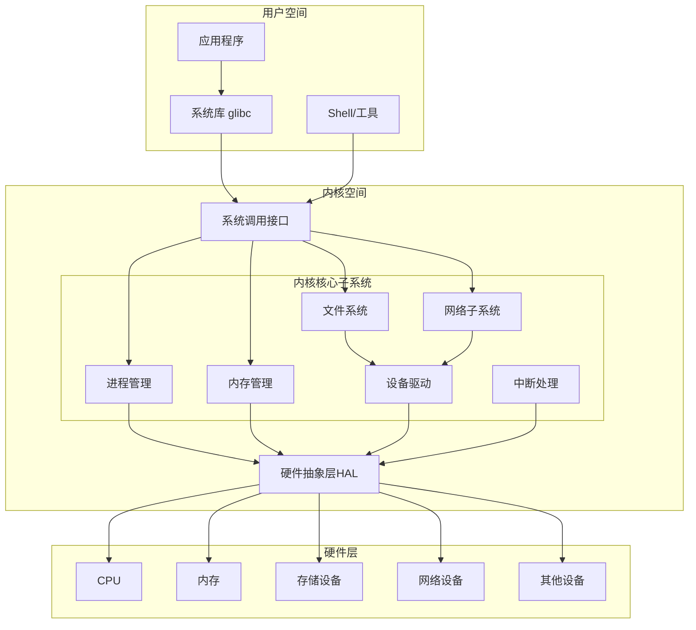
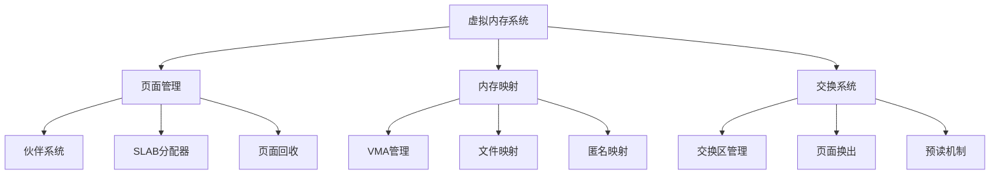
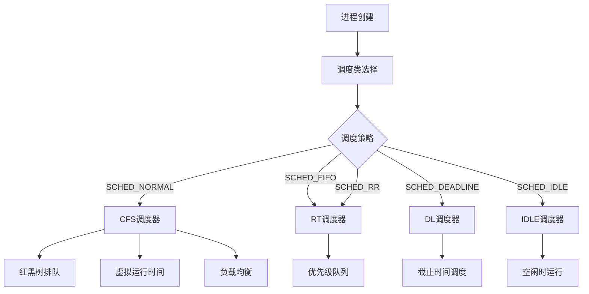
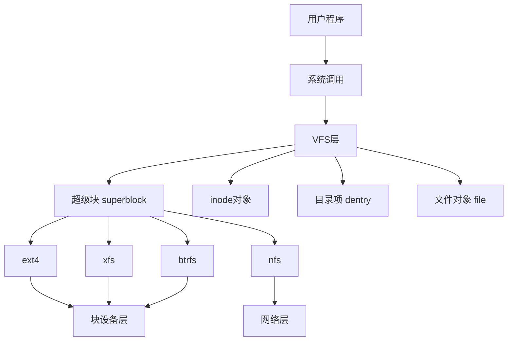
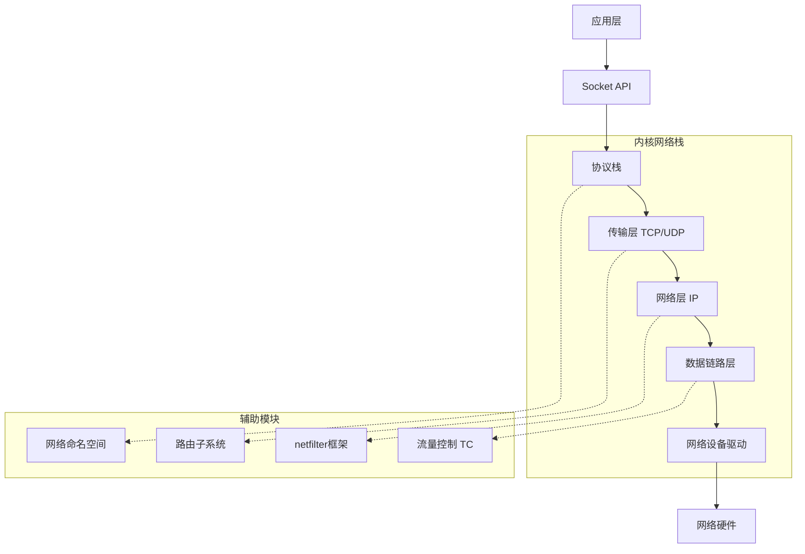
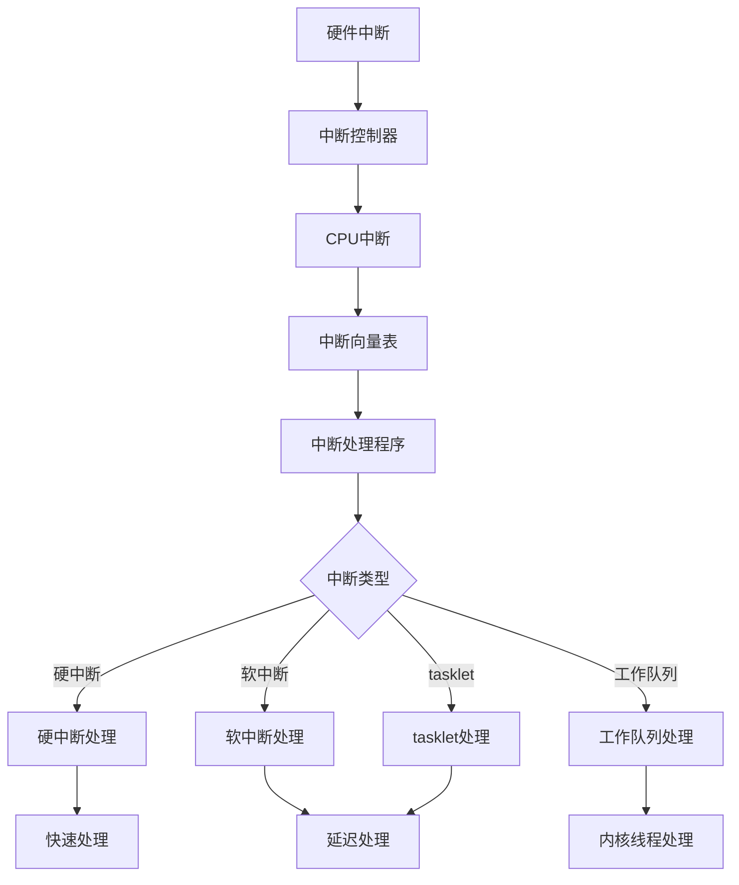

# Linux 内核架构深度解析

## 🏗️ 概述

Linux内核采用单体(Monolithic)内核架构，但通过模块化设计实现了良好的可扩展性。本文档基于Linux官方内核文档和《Understanding the Linux Kernel》等权威资料，深入分析内核的核心架构。

---

## 🔧 内核架构层次

### 整体架构图



### 内核空间内存布局

```bash
# 查看内核内存布局 (x86_64)
cat /proc/iomem | grep -E "(Kernel|System RAM)" | head -10

# 查看内核模块内存分布
cat /proc/modules | awk '{printf "%-20s %8s %s\n", $1, $2, $6}' | head -10

# 查看内核符号表
grep -E "(start_kernel|init_task)" /proc/kallsyms

# 查看虚拟内存布局
cat /proc/self/maps | head -10
```

**x86_64内核空间布局**:
```
ffffffff80000000 - ffffffffa0000000 (512 MB)  kernel text mapping
ffffffffa0000000 - ffffffffff5fffff (1366 MB) module mapping space
ffffffffff600000 - ffffffffff601000 (4 kB)   vsyscall page
ffffffffffe00000 - ffffffffffffffff (2 MB)   unused hole
```

---

## 🧠 内存管理子系统

### 内存管理架构



#### 1. 页面管理器 (Page Allocator)

**伙伴系统算法**:
```c
// 内核源码: mm/page_alloc.c
struct page *__alloc_pages_nodemask(gfp_t gfp_mask, unsigned int order,
                                   int preferred_nid,
                                   nodemask_t *nodemask)
{
    struct page *page;
    unsigned int alloc_flags = ALLOC_WMARK_LOW;
    gfp_t alloc_mask = gfp_mask;
    struct alloc_context ac = { };
    
    // 快速路径分配
    page = get_page_from_freelist(gfp_mask, order, alloc_flags, &ac);
    if (likely(page))
        return page;
    
    // 慢速路径分配，可能触发页面回收
    return __alloc_pages_slowpath(alloc_mask, order, &ac);
}
```

**查看内存分配统计**:
```bash
# 查看内存碎片信息
cat /proc/buddyinfo

# 查看内存区域信息  
cat /proc/zoneinfo | head -30

# 查看slab分配器统计
cat /proc/slabinfo | head -10

# 查看内存映射统计
cat /proc/meminfo | grep -E "(Active|Inactive|Cached|Buffers)"
```

#### 2. SLAB/SLUB分配器

**SLUB分配器实现**:
```c
// 内核源码: mm/slub.c  
void *kmalloc(size_t size, gfp_t flags)
{
    struct kmem_cache *s;
    void *ret;
    
    if (unlikely(size > KMALLOC_MAX_CACHE_SIZE))
        return kmalloc_large(size, flags);
    
    s = kmalloc_slab(size, flags);
    if (unlikely(ZERO_OR_NULL_PTR(s)))
        return s;
    
    ret = slab_alloc(s, flags, _RET_IP_);
    trace_kmalloc(_RET_IP_, ret, size, s->size, flags);
    
    return ret;
}
```

**查看SLAB统计信息**:
```bash
# 查看活动的slab缓存
slabtop

# 查看特定slab的详细信息
cat /sys/kernel/slab/kmalloc-1024/objects
cat /sys/kernel/slab/kmalloc-1024/object_size

# 查看内存使用最多的slab
cat /proc/slabinfo | sort -k3 -nr | head -10
```

#### 3. 虚拟内存区域 (VMA)

**VMA数据结构**:
```c
// 内核源码: include/linux/mm_types.h
struct vm_area_struct {
    unsigned long vm_start;     /* 虚拟地址开始 */
    unsigned long vm_end;       /* 虚拟地址结束 */
    struct vm_area_struct *vm_next, *vm_prev;
    struct rb_node vm_rb;
    
    pgprot_t vm_page_prot;      /* 页面保护标志 */
    unsigned long vm_flags;     /* VMA标志 */
    
    struct anon_vma *anon_vma;  /* 匿名VMA信息 */
    struct file *vm_file;       /* 映射的文件 */
    
    const struct vm_operations_struct *vm_ops;
};
```

---

## ⚙️ 进程调度子系统

### 完全公平调度器 (CFS)



#### 1. CFS核心算法

**虚拟运行时间计算**:
```c
// 内核源码: kernel/sched/fair.c
static void update_curr(struct cfs_rq *cfs_rq)
{
    struct sched_entity *curr = cfs_rq->curr;
    u64 now = rq_clock_task(rq_of(cfs_rq));
    u64 delta_exec;
    
    if (unlikely(!curr))
        return;
    
    delta_exec = now - curr->exec_start;
    if (unlikely((s64)delta_exec <= 0))
        return;
    
    curr->exec_start = now;
    curr->sum_exec_runtime += delta_exec;
    
    curr->vruntime += calc_delta_fair(delta_exec, curr);
    update_min_vruntime(cfs_rq);
}
```

**进程选择算法**:
```c
// 选择下一个要运行的进程
static struct sched_entity *pick_next_entity(struct cfs_rq *cfs_rq)
{
    struct sched_entity *se = __pick_first_entity(cfs_rq);
    struct sched_entity *left = __pick_first_entity(cfs_rq);
    
    // 从红黑树最左节点选择vruntime最小的进程
    if (left) {
        se = left;
        // 更新调度实体的状态
        update_stats_curr_start(cfs_rq, se);
    }
    
    return se;
}
```

#### 2. 负载均衡

**查看CPU调度统计**:
```bash
# 查看CPU调度延迟
perf sched record -a sleep 10
perf sched latency

# 查看各CPU运行队列长度
cat /proc/schedstat | awk '{if(NF==9) printf "CPU%d: runqueue=%s context_switches=%s\n", NR-1, $7, $8}'

# 查看进程调度信息
cat /proc/self/sched | head -10

# 查看系统负载
uptime
cat /proc/loadavg
```

**NUMA负载均衡**:
```bash
# 查看NUMA拓扑
numactl --hardware

# 查看进程NUMA绑定
numastat -p $$

# 设置NUMA策略
numactl --cpunodebind=0 --membind=0 your_program
```

---

## 📁 虚拟文件系统 (VFS)

### VFS架构



#### 1. VFS核心数据结构

**超级块结构**:
```c
// 内核源码: include/linux/fs.h
struct super_block {
    struct list_head    s_list;         /* 超级块链表 */
    dev_t              s_dev;           /* 设备标识符 */
    unsigned char      s_blocksize_bits; /* 块大小(位数) */
    unsigned long      s_blocksize;     /* 块大小(字节) */
    loff_t             s_maxbytes;      /* 最大文件大小 */
    struct file_system_type *s_type;    /* 文件系统类型 */
    const struct super_operations *s_op; /* 超级块操作 */
    
    struct dentry      *s_root;         /* 根目录项 */
    struct rw_semaphore s_umount;       /* 卸载信号量 */
    int                s_count;         /* 引用计数 */
    
    unsigned long      s_flags;         /* 挂载标志 */
    unsigned long      s_magic;         /* 文件系统魔数 */
    
    struct list_head   s_inodes;        /* inode链表 */
    struct list_head   s_dirty;         /* 脏inode链表 */
};
```

**inode结构**:
```c
struct inode {
    umode_t            i_mode;          /* 文件类型和权限 */
    unsigned short     i_opflags;       /* 操作标志 */
    kuid_t             i_uid;           /* 用户ID */
    kgid_t             i_gid;           /* 组ID */
    unsigned int       i_flags;         /* 文件系统标志 */
    
    loff_t             i_size;          /* 文件大小 */
    struct timespec64  i_atime;         /* 访问时间 */
    struct timespec64  i_mtime;         /* 修改时间 */
    struct timespec64  i_ctime;         /* 创建时间 */
    
    const struct inode_operations *i_op; /* inode操作 */
    struct file_operations *i_fop;      /* 文件操作 */
    struct super_block *i_sb;           /* 超级块 */
    
    union {
        struct block_device *i_bdev;    /* 块设备 */
        struct cdev         *i_cdev;    /* 字符设备 */
    };
};
```

#### 2. 文件操作实现

**文件读写路径**:
```c
// 内核源码: fs/read_write.c
ssize_t vfs_read(struct file *file, char __user *buf,
                size_t count, loff_t *pos)
{
    ssize_t ret;
    
    if (!(file->f_mode & FMODE_READ))
        return -EBADF;
    if (!(file->f_mode & FMODE_CAN_READ))
        return -EINVAL;
    if (unlikely(!access_ok(buf, count)))
        return -EFAULT;
        
    ret = rw_verify_area(READ, file, pos, count);
    if (!ret) {
        if (count > MAX_RW_COUNT)
            count =  MAX_RW_COUNT;
        ret = __vfs_read(file, buf, count, pos);
        if (ret > 0) {
            fsnotify_access(file);
            add_rchar(current, ret);
        }
        inc_syscr(current);
    }
    
    return ret;
}
```

---

## 🌐 网络子系统

### 网络栈架构



#### 1. Socket缓冲区 (sk_buff)

**sk_buff数据结构**:
```c
// 内核源码: include/linux/skbuff.h
struct sk_buff {
    union {
        struct {
            struct sk_buff      *next;
            struct sk_buff      *prev;
            union {
                struct net_device *dev;
                unsigned long     dev_scratch;
            };
        };
        struct rb_node  rbnode;
        struct list_head list;
    };
    
    sock_write_tx_timestamp(sk, skb);
    
    union {
        ktime_t     tstamp;
        u64         skb_mstamp_ns;
    };
    
    char            cb[48] __aligned(8);  /* 控制缓冲区 */
    
    union {
        struct {
            unsigned long   _skb_refdst;
            void            (*destructor)(struct sk_buff *skb);
        };
        struct list_head    tcp_tsorted_anchor;
    };
    
    unsigned int    len,        /* 数据长度 */
                    data_len;   /* 非线性数据长度 */
    __u16           mac_len,    /* MAC头长度 */
                    hdr_len;    /* 可写头部长度 */
    
    /* 数据指针 */
    sk_buff_data_t  tail;
    sk_buff_data_t  end;
    unsigned char   *head,      /* 缓冲区头部 */
                    *data;      /* 数据起始位置 */
    unsigned int    truesize;   /* 缓冲区总大小 */
    refcount_t      users;      /* 引用计数 */
};
```

#### 2. 网络设备模型

**网络设备注册**:
```c
// 内核源码: net/core/dev.c
int register_netdev(struct net_device *dev)
{
    int err;
    
    rtnl_lock();
    err = register_netdevice(dev);
    rtnl_unlock();
    return err;
}

static int register_netdevice(struct net_device *dev)
{
    int ret;
    struct net *net = dev_net(dev);
    
    // 设备名称检查
    ret = dev_get_valid_name(net, dev, dev->name);
    if (ret < 0)
        goto out;
    
    // 设备初始化
    ret = netdev_register_kobject(dev);
    if (ret)
        goto out;
    
    dev->reg_state = NETREG_REGISTERED;
    
    // 添加到设备列表
    list_netdevice(dev);
    add_device_randomness(dev, sizeof(dev));
    
    return ret;
out:
    return ret;
}
```

---

## ⚡ 中断处理机制

### 中断处理架构



#### 1. 中断处理流程

**中断描述符**:
```c
// 内核源码: include/linux/irqdesc.h
struct irq_desc {
    struct irq_common_data  irq_common_data;
    struct irq_data         irq_data;
    unsigned int __percpu   *kstat_irqs;
    irq_flow_handler_t      handle_irq;
    
    struct irqaction        *action;     /* 中断处理程序链表 */
    unsigned int            status_use_accessors;
    unsigned int            core_internal_state__do_not_mess_with_it;
    unsigned int            depth;       /* 嵌套深度 */
    unsigned int            wake_depth;
    unsigned int            irq_count;   /* 中断计数 */
    unsigned long           last_unhandled;
    unsigned int            irqs_unhandled;
    atomic_t                threads_handled;
    int                     threads_handled_last;
    raw_spinlock_t          lock;
    struct cpumask          *percpu_enabled;
    const struct cpumask    *percpu_affinity;
    
    const char              *name;
} ____cacheline_internodealigned_in_smp;
```

**中断处理函数注册**:
```c
// 内核源码: kernel/irq/manage.c
int request_irq(unsigned int irq, irq_handler_t handler,
               unsigned long flags, const char *name, void *dev)
{
    return request_threaded_irq(irq, handler, NULL, flags, name, dev);
}

int request_threaded_irq(unsigned int irq, irq_handler_t handler,
                        irq_handler_t thread_fn, unsigned long irqflags,
                        const char *devname, void *dev_id)
{
    struct irqaction *action;
    struct irq_desc *desc;
    int retval;
    
    // 分配irqaction结构
    action = kzalloc(sizeof(struct irqaction), GFP_KERNEL);
    if (!action)
        return -ENOMEM;
    
    action->handler = handler;
    action->thread_fn = thread_fn;
    action->flags = irqflags;
    action->name = devname;
    action->dev_id = dev_id;
    
    desc = irq_to_desc(irq);
    if (!desc) {
        kfree(action);
        return -EINVAL;
    }
    
    retval = __setup_irq(irq, desc, action);
    
    if (retval) {
        kfree(action);
        return retval;
    }
    
    return 0;
}
```

#### 2. 软中断机制

**软中断类型定义**:
```c
// 内核源码: include/linux/interrupt.h
enum {
    HI_SOFTIRQ=0,      /* 高优先级软中断 */
    TIMER_SOFTIRQ,     /* 定时器软中断 */
    NET_TX_SOFTIRQ,    /* 网络发送软中断 */
    NET_RX_SOFTIRQ,    /* 网络接收软中断 */
    BLOCK_SOFTIRQ,     /* 块设备软中断 */
    IRQ_POLL_SOFTIRQ,  /* IO轮询软中断 */
    TASKLET_SOFTIRQ,   /* Tasklet软中断 */
    SCHED_SOFTIRQ,     /* 调度软中断 */
    HRTIMER_SOFTIRQ,   /* 高精度定时器软中断 */
    RCU_SOFTIRQ,       /* RCU软中断 */
    NR_SOFTIRQS
};
```

---

## 🔧 内核调试和分析工具

### 调试工具集合

```bash
# 1. 内核日志分析
dmesg -T | tail -50                    # 带时间戳的内核消息
journalctl -k -f                       # 实时内核日志
cat /proc/kmsg                         # 内核消息环形缓冲区

# 2. 系统调用跟踪
strace -c ls                           # 统计系统调用
strace -e trace=openat ls              # 跟踪特定系统调用
ltrace ls                              # 跟踪库函数调用

# 3. 内核函数跟踪 (ftrace)
cd /sys/kernel/debug/tracing
echo function > current_tracer         # 设置函数跟踪
echo 1 > tracing_on                    # 开启跟踪
cat trace | head -20                   # 查看跟踪结果
echo 0 > tracing_on                    # 关闭跟踪

# 4. 动态调试
echo 'module usbcore +p' > /sys/kernel/debug/dynamic_debug/control
dmesg | grep -i usb

# 5. 性能分析
perf list                              # 列出可用事件
perf record -g -a sleep 10             # 记录性能数据
perf report                            # 分析性能报告
perf top                              # 实时性能监控
```

### 内核崩溃分析

```bash
# 配置内核转储
echo '|/usr/share/apport/apport %p %s %c %d %P %E' > /proc/sys/kernel/core_pattern

# 使用crash工具分析vmcore
crash /usr/lib/debug/boot/vmlinux-$(uname -r) vmcore

# crash命令示例
(crash) bt                             # 显示调用栈
(crash) log                            # 显示内核消息
(crash) ps | grep -E "(RU|UN)"         # 显示运行/不可中断进程
(crash) files -d <pid>                 # 显示进程打开文件
(crash) vm <pid>                       # 显示进程虚拟内存
(crash) sys                            # 显示系统信息
```

---

## 📊 内核性能优化

### 关键性能参数

```bash
# /etc/sysctl.d/99-kernel-performance.conf

# === 内核调度优化 ===
# 调度域负载均衡间隔 (微秒)
kernel.sched_migration_cost_ns = 5000000
# 禁用自动分组调度
kernel.sched_autogroup_enabled = 0
# 唤醒粒度 (纳秒)
kernel.sched_wakeup_granularity_ns = 15000000
# 最小粒度 (纳秒)
kernel.sched_min_granularity_ns = 10000000

# === 内存管理优化 ===
# 虚拟内存统计间隔
vm.stat_interval = 10
# 脏页写回阈值
vm.dirty_ratio = 15
vm.dirty_background_ratio = 5
# 大页内存
vm.nr_hugepages = 1024
# 透明大页
echo always > /sys/kernel/mm/transparent_hugepage/enabled

# === I/O调度优化 ===
# 设置I/O调度器
echo mq-deadline > /sys/block/sda/queue/scheduler
# 读取预读大小
echo 4096 > /sys/block/sda/queue/read_ahead_kb
# 队列深度
echo 32 > /sys/block/sda/queue/nr_requests

# === 网络栈优化 ===
# 接收缓冲区大小
net.core.rmem_max = 16777216
net.core.wmem_max = 16777216
# TCP缓冲区
net.ipv4.tcp_rmem = 4096 65536 16777216
net.ipv4.tcp_wmem = 4096 65536 16777216
# 并发连接数
net.core.somaxconn = 32768
net.core.netdev_max_backlog = 5000

# 应用配置
sysctl -p /etc/sysctl.d/99-kernel-performance.conf
```

### 性能监控脚本

```bash
#!/bin/bash
# kernel_perf_monitor.sh - 内核性能监控脚本

echo "=== Linux内核性能监控报告 ==="
echo "时间: $(date)"
echo "内核版本: $(uname -r)"
echo

# 1. CPU调度统计
echo "=== CPU调度统计 ==="
echo "负载均衡: $(cat /proc/loadavg)"
echo "上下文切换: $(grep ctxt /proc/stat | awk '{print $2}')"
echo "进程创建: $(grep processes /proc/stat | awk '{print $2}')"

# 2. 内存使用统计
echo -e "\n=== 内存使用统计 ==="
free -h
echo "页面错误: $(grep -E 'pgfault|pgmajfault' /proc/vmstat)"
echo "交换使用: $(grep -E 'swap.*' /proc/vmstat)"

# 3. I/O统计
echo -e "\n=== I/O统计 ==="
iostat -x 1 1 | tail -n +4

# 4. 网络统计
echo -e "\n=== 网络统计 ==="
cat /proc/net/dev | head -3
ss -s

# 5. 中断统计
echo -e "\n=== 中断统计 (TOP 10) ==="
cat /proc/interrupts | head -1
grep -v CPU /proc/interrupts | sort -k2 -nr | head -10

# 6. 内核模块内存使用
echo -e "\n=== 内核模块内存使用 (TOP 10) ==="
cat /proc/modules | sort -k2 -nr | head -10 | awk '{printf "%-20s %8s KB\n", $1, int($2/1024)}'

echo -e "\n=== 监控完成 ==="
```

---

## 📚 学习资源

### 官方文档
- [Linux内核文档](https://www.kernel.org/doc/html/latest/) - 官方最权威文档
- [内核源码在线](https://elixir.bootlin.com/linux/latest/source) - 内核源码浏览
- [Linux内核邮件列表](https://lkml.org/) - 内核开发讨论

### 权威书籍
- **《Understanding the Linux Kernel》** - Bovet & Cesati
- **《Linux Kernel Development》** - Robert Love  
- **《Professional Linux Kernel Architecture》** - Wolfgang Mauerer
- **《Linux Device Drivers》** - Corbet, Rubini & Kroah-Hartman

### 实验环境
```bash
# 搭建内核开发环境
sudo apt install build-essential libncurses-dev bison flex libssl-dev libelf-dev
git clone https://github.com/torvalds/linux.git
cd linux
make defconfig
make menuconfig
make -j$(nproc)
```

---

**下一章**: [系统调用深度解析](system-calls.md) - 深入理解用户空间与内核空间的桥梁

*基于Linux 6.x内核系列 | 参考Linux官方文档和《Understanding the Linux Kernel》*
