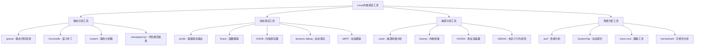

# Linux 内核调试技术详解

## 🔍 概述

内核调试是Linux系统开发和维护中的重要技能。本文档基于Linux内核官方调试文档、《Linux内核调试技术》和实际调试经验，全面介绍内核调试的方法和工具。

---

## 🛠️ 内核调试工具生态

### 调试工具分类图



---

## 📝 基础调试技术

### 1. printk调试

```c
// printk_debug.c - printk调试示例
#include <linux/init.h>
#include <linux/module.h>
#include <linux/kernel.h>
#include <linux/slab.h>
#include <linux/delay.h>

/* 定义调试宏 */
#define DEBUG_PREFIX "DEBUG_MODULE"

// 不同级别的调试输出
#define debug_emergency(fmt, args...) \
    printk(KERN_EMERG DEBUG_PREFIX ": [EMERGENCY] " fmt, ##args)

#define debug_alert(fmt, args...) \
    printk(KERN_ALERT DEBUG_PREFIX ": [ALERT] " fmt, ##args)

#define debug_critical(fmt, args...) \
    printk(KERN_CRIT DEBUG_PREFIX ": [CRITICAL] " fmt, ##args)

#define debug_error(fmt, args...) \
    printk(KERN_ERR DEBUG_PREFIX ": [ERROR] " fmt, ##args)

#define debug_warning(fmt, args...) \
    printk(KERN_WARNING DEBUG_PREFIX ": [WARNING] " fmt, ##args)

#define debug_notice(fmt, args...) \
    printk(KERN_NOTICE DEBUG_PREFIX ": [NOTICE] " fmt, ##args)

#define debug_info(fmt, args...) \
    printk(KERN_INFO DEBUG_PREFIX ": [INFO] " fmt, ##args)

#define debug_debug(fmt, args...) \
    printk(KERN_DEBUG DEBUG_PREFIX ": [DEBUG] " fmt, ##args)

/* 使用pr_*宏的现代方式 */
#define pr_fmt(fmt) DEBUG_PREFIX ": " fmt

/* 条件调试宏 */
static int debug_enabled = 1;
module_param(debug_enabled, int, 0644);

#define conditional_debug(fmt, args...) \
    do { \
        if (debug_enabled) \
            pr_info(fmt, ##args); \
    } while(0)

/* 函数跟踪宏 */
#define FUNC_ENTER() \
    pr_debug("Entering %s() at line %d\n", __func__, __LINE__)

#define FUNC_EXIT() \
    pr_debug("Exiting %s() at line %d\n", __func__, __LINE__)

#define FUNC_EXIT_VALUE(val) \
    do { \
        pr_debug("Exiting %s() at line %d, return value: %d\n", \
                __func__, __LINE__, (int)(val)); \
        return (val); \
    } while(0)

/* 内存分配调试 */
static void debug_memory_allocation(void)
{
    void *ptr1, *ptr2, *ptr3;
    
    FUNC_ENTER();
    
    pr_info("开始内存分配测试\n");
    
    // 正常分配
    ptr1 = kmalloc(1024, GFP_KERNEL);
    if (ptr1) {
        pr_info("成功分配1024字节内存，地址：%p\n", ptr1);
    } else {
        pr_err("分配1024字节内存失败\n");
        return;
    }
    
    // 大内存分配
    ptr2 = vmalloc(1024 * 1024);
    if (ptr2) {
        pr_info("成功分配1MB虚拟内存，地址：%p\n", ptr2);
    } else {
        pr_err("分配1MB虚拟内存失败\n");
        kfree(ptr1);
        return;
    }
    
    // 尝试分配过大内存（可能失败）
    ptr3 = kmalloc(1024 * 1024 * 1024, GFP_KERNEL); // 1GB
    if (ptr3) {
        pr_info("意外成功分配1GB内存，地址：%p\n", ptr3);
        kfree(ptr3);
    } else {
        pr_warning("预期中的大内存分配失败（这是正常的）\n");
    }
    
    // 释放内存
    vfree(ptr2);
    pr_debug("释放虚拟内存：%p\n", ptr2);
    
    kfree(ptr1);
    pr_debug("释放内核内存：%p\n", ptr1);
    
    pr_info("内存分配测试完成\n");
    
    FUNC_EXIT();
}

/* 错误路径调试 */
static int debug_error_paths(void)
{
    int ret = 0;
    void *ptr = NULL;
    
    FUNC_ENTER();
    
    pr_info("测试错误处理路径\n");
    
    // 模拟错误条件
    if (jiffies % 3 == 0) {
        pr_err("模拟错误：时间戳能被3整除\n");
        ret = -EINVAL;
        goto error_exit;
    }
    
    // 分配内存
    ptr = kmalloc(512, GFP_KERNEL);
    if (!ptr) {
        pr_err("内存分配失败\n");
        ret = -ENOMEM;
        goto error_exit;
    }
    
    pr_info("内存分配成功，地址：%p\n", ptr);
    
    // 模拟另一个错误
    if (jiffies % 5 == 0) {
        pr_err("模拟错误：时间戳能被5整除\n");
        ret = -EBUSY;
        goto error_cleanup;
    }
    
    pr_info("所有操作成功完成\n");
    kfree(ptr);
    FUNC_EXIT_VALUE(0);
    
error_cleanup:
    pr_debug("清理路径：释放内存\n");
    kfree(ptr);
    
error_exit:
    pr_debug("错误退出路径，返回值：%d\n", ret);
    FUNC_EXIT_VALUE(ret);
}

/* 性能调试 */
static void debug_performance(void)
{
    unsigned long start_time, end_time;
    int i;
    
    FUNC_ENTER();
    
    pr_info("开始性能测试\n");
    
    start_time = jiffies;
    
    // 模拟一些工作
    for (i = 0; i < 1000000; i++) {
        // 简单的计算
        volatile int dummy = i * i + i / 2;
        (void)dummy; // 避免编译器优化
    }
    
    end_time = jiffies;
    
    pr_info("性能测试完成，耗时：%lu jiffies (%lu ms)\n", 
            end_time - start_time, 
            (end_time - start_time) * 1000 / HZ);
    
    // 测试延迟
    pr_info("测试1秒延迟...\n");
    start_time = jiffies;
    msleep(1000);
    end_time = jiffies;
    
    pr_info("实际延迟：%lu jiffies (%lu ms)\n",
            end_time - start_time,
            (end_time - start_time) * 1000 / HZ);
    
    FUNC_EXIT();
}

/* 模块初始化 */
static int __init printk_debug_init(void)
{
    int ret;
    
    pr_info("=== printk调试模块初始化 ===\n");
    pr_info("内核版本：%s\n", UTS_RELEASE);
    pr_info("模块参数 debug_enabled = %d\n", debug_enabled);
    
    // 测试不同级别的输出
    debug_emergency("这是紧急消息\n");
    debug_alert("这是警报消息\n");
    debug_critical("这是严重错误消息\n");
    debug_error("这是错误消息\n");
    debug_warning("这是警告消息\n");
    debug_notice("这是通知消息\n");
    debug_info("这是信息消息\n");
    debug_debug("这是调试消息\n");
    
    // 条件调试测试
    conditional_debug("条件调试消息（debug_enabled=%d）\n", debug_enabled);
    
    // 运行测试函数
    debug_memory_allocation();
    
    ret = debug_error_paths();
    pr_info("错误路径测试返回：%d\n", ret);
    
    debug_performance();
    
    pr_info("=== 模块初始化完成 ===\n");
    
    return 0;
}

/* 模块清理 */
static void __exit printk_debug_exit(void)
{
    pr_info("=== printk调试模块清理 ===\n");
    pr_info("模块运行时间：%lu秒\n", (jiffies - INITIAL_JIFFIES) / HZ);
    pr_info("=== 模块卸载完成 ===\n");
}

module_init(printk_debug_init);
module_exit(printk_debug_exit);

MODULE_LICENSE("GPL");
MODULE_AUTHOR("Linux Kernel Developer");
MODULE_DESCRIPTION("Comprehensive printk debugging demonstration");
MODULE_VERSION("1.0");
```

### 2. 动态调试 (Dynamic Debug)

```bash
# 动态调试配置和使用

# 1. 开启内核动态调试支持
# CONFIG_DYNAMIC_DEBUG=y

# 2. 查看动态调试控制文件
cat /sys/kernel/debug/dynamic_debug/control | head -10

# 3. 为特定模块开启调试
echo 'module printk_debug +p' > /sys/kernel/debug/dynamic_debug/control

# 4. 为特定文件开启调试
echo 'file printk_debug.c +p' > /sys/kernel/debug/dynamic_debug/control

# 5. 为特定函数开启调试
echo 'func debug_memory_allocation +p' > /sys/kernel/debug/dynamic_debug/control

# 6. 为特定行开启调试
echo 'file printk_debug.c line 50-100 +p' > /sys/kernel/debug/dynamic_debug/control

# 7. 使用格式过滤
echo 'format "memory" +p' > /sys/kernel/debug/dynamic_debug/control

# 8. 组合条件
echo 'module printk_debug func debug_* +p' > /sys/kernel/debug/dynamic_debug/control

# 9. 关闭调试
echo 'module printk_debug -p' > /sys/kernel/debug/dynamic_debug/control

# 10. 查看当前调试设置
grep printk_debug /sys/kernel/debug/dynamic_debug/control
```

---

## 🔬 高级调试技术

### 1. ftrace跟踪系统

```bash
# ftrace使用指南

# 进入ftrace目录
cd /sys/kernel/debug/tracing

# 1. 查看可用的跟踪器
cat available_tracers

# 2. 设置函数跟踪器
echo function > current_tracer

# 3. 设置要跟踪的函数
echo sys_open > set_ftrace_filter
echo sys_close >> set_ftrace_filter
echo sys_read >> set_ftrace_filter
echo sys_write >> set_ftrace_filter

# 4. 开始跟踪
echo 1 > tracing_on

# 5. 执行一些操作来触发跟踪
ls > /dev/null

# 6. 查看跟踪结果
head -20 trace

# 7. 停止跟踪
echo 0 > tracing_on

# 8. 清空跟踪缓冲区
echo > trace

# 9. 函数调用图跟踪
echo function_graph > current_tracer
echo sys_open > set_graph_function
echo 1 > tracing_on
ls > /dev/null
echo 0 > tracing_on
cat trace | head -30

# 10. 事件跟踪
echo nop > current_tracer
echo 1 > events/syscalls/sys_enter_openat/enable
echo 1 > events/syscalls/sys_exit_openat/enable
echo 1 > tracing_on
ls > /dev/null
echo 0 > tracing_on
cat trace | head -20
```

### 2. ftrace内核模块集成

```c
// ftrace_debug.c - ftrace集成示例
#include <linux/init.h>
#include <linux/module.h>
#include <linux/kernel.h>
#include <linux/ftrace.h>
#include <linux/sched.h>
#include <linux/delay.h>

/* 函数跟踪点定义 */
static void my_function_1(void);
static void my_function_2(int param);
static int my_function_3(const char *str);

/* ftrace探针函数 */
static void my_function_probe(unsigned long ip, unsigned long parent_ip,
                             struct ftrace_ops *op, struct pt_regs *pt_regs)
{
    /* 这个函数会在被探测函数执行时调用 */
    printk(KERN_INFO "FTrace: Function called at IP=0x%lx, parent=0x%lx, PID=%d\n",
           ip, parent_ip, current->pid);
}

/* ftrace操作结构 */
static struct ftrace_ops my_ftrace_ops = {
    .func = my_function_probe,
    .flags = FTRACE_OPS_FL_SAVE_REGS,  /* 保存寄存器 */
};

/* 要跟踪的函数列表 */
static unsigned long target_funcs[] = {
    (unsigned long)my_function_1,
    (unsigned long)my_function_2,
    (unsigned long)my_function_3,
};

/* 自定义跟踪点 */
#define CREATE_TRACE_POINTS
#include "ftrace_debug_trace.h"

/* 测试函数 */
static void my_function_1(void)
{
    trace_my_function_1_entry();  /* 自定义跟踪点 */
    
    printk(KERN_INFO "FTrace: Executing my_function_1\n");
    msleep(10);
    
    trace_my_function_1_exit();   /* 自定义跟踪点 */
}

static void my_function_2(int param)
{
    trace_my_function_2_entry(param);  /* 带参数的跟踪点 */
    
    printk(KERN_INFO "FTrace: Executing my_function_2 with param=%d\n", param);
    msleep(20);
    
    trace_my_function_2_exit(param);
}

static int my_function_3(const char *str)
{
    int result = 0;
    
    trace_my_function_3_entry(str);
    
    printk(KERN_INFO "FTrace: Executing my_function_3 with str='%s'\n", str);
    
    if (str)
        result = strlen(str);
    
    msleep(5);
    
    trace_my_function_3_exit(str, result);
    
    return result;
}

/* 性能测试函数 */
static void performance_test(void)
{
    unsigned long start, end;
    int i;
    
    printk(KERN_INFO "FTrace: 开始性能测试\n");
    
    start = jiffies;
    
    for (i = 0; i < 100; i++) {
        my_function_1();
        my_function_2(i);
        my_function_3("test string");
    }
    
    end = jiffies;
    
    printk(KERN_INFO "FTrace: 性能测试完成，耗时：%lu ms\n",
           (end - start) * 1000 / HZ);
}

/* 注册ftrace探针 */
static int register_ftrace_probes(void)
{
    int ret, i;
    
    /* 为每个目标函数注册探针 */
    for (i = 0; i < ARRAY_SIZE(target_funcs); i++) {
        ret = ftrace_set_filter_ip(&my_ftrace_ops, target_funcs[i], 0, 0);
        if (ret) {
            printk(KERN_ERR "FTrace: Failed to set filter for function %d: %d\n",
                   i, ret);
            return ret;
        }
    }
    
    /* 注册ftrace操作 */
    ret = register_ftrace_function(&my_ftrace_ops);
    if (ret) {
        printk(KERN_ERR "FTrace: Failed to register ftrace function: %d\n", ret);
        return ret;
    }
    
    printk(KERN_INFO "FTrace: Probes registered successfully\n");
    return 0;
}

/* 注销ftrace探针 */
static void unregister_ftrace_probes(void)
{
    int ret;
    
    ret = unregister_ftrace_function(&my_ftrace_ops);
    if (ret)
        printk(KERN_ERR "FTrace: Failed to unregister ftrace function: %d\n", ret);
    else
        printk(KERN_INFO "FTrace: Probes unregistered successfully\n");
}

/* 模块初始化 */
static int __init ftrace_debug_init(void)
{
    int ret;
    
    printk(KERN_INFO "FTrace: 模块初始化开始\n");
    
    /* 注册ftrace探针 */
    ret = register_ftrace_probes();
    if (ret) {
        printk(KERN_ERR "FTrace: 探针注册失败\n");
        return ret;
    }
    
    /* 运行测试 */
    performance_test();
    
    printk(KERN_INFO "FTrace: 模块初始化完成\n");
    printk(KERN_INFO "FTrace: 使用以下命令查看跟踪结果：\n");
    printk(KERN_INFO "FTrace:   cat /sys/kernel/debug/tracing/trace\n");
    
    return 0;
}

/* 模块清理 */
static void __exit ftrace_debug_exit(void)
{
    printk(KERN_INFO "FTrace: 模块清理开始\n");
    
    /* 注销ftrace探针 */
    unregister_ftrace_probes();
    
    printk(KERN_INFO "FTrace: 模块清理完成\n");
}

module_init(ftrace_debug_init);
module_exit(ftrace_debug_exit);

MODULE_LICENSE("GPL");
MODULE_AUTHOR("Linux Kernel Developer");
MODULE_DESCRIPTION("ftrace integration demonstration");
MODULE_VERSION("1.0");
```

### 3. KGDB内核调试器

```bash
# KGDB配置和使用指南

# 1. 内核配置要求
# CONFIG_KGDB=y
# CONFIG_KGDB_SERIAL_CONSOLE=y
# CONFIG_KGDB_KDB=y
# CONFIG_DEBUG_INFO=y

# 2. 启动参数配置
# 在内核启动参数中添加：
# kgdboc=ttyS0,115200
# kgdbwait

# 3. 使用串口连接KGDB
# 在目标机器上：
echo ttyS0 > /sys/module/kgdboc/parameters/kgdboc
echo g > /proc/sysrq-trigger  # 进入KGDB模式

# 4. 在宿主机上使用GDB连接
gdb vmlinux
(gdb) set serial baud 115200
(gdb) target remote /dev/ttyUSB0

# 5. GDB调试命令
(gdb) info registers      # 查看寄存器
(gdb) bt                  # 查看调用栈
(gdb) info threads        # 查看线程信息
(gdb) thread 2            # 切换线程
(gdb) break sys_open      # 设置断点
(gdb) continue            # 继续执行
(gdb) step                # 单步执行
(gdb) next                # 下一行
(gdb) print variable      # 打印变量
(gdb) x/10x 0xc0000000   # 查看内存内容

# 6. KDB命令模式
# 按ESC进入KDB命令行
kdb> help                 # 帮助信息
kdb> ps                   # 进程列表
kdb> bt                   # 调用栈
kdb> lsmod                # 模块列表
kdb> dmesg                # 内核消息
kdb> cpu 1                # 切换CPU
kdb> go                   # 继续执行
```

---

## 🔧 内存调试技术

### 1. KASAN (Kernel Address Sanitizer)

```c
// kasan_debug.c - KASAN内存错误检测示例
#include <linux/init.h>
#include <linux/module.h>
#include <linux/kernel.h>
#include <linux/slab.h>
#include <linux/string.h>

/* KASAN配置要求：
 * CONFIG_KASAN=y
 * CONFIG_KASAN_INLINE=y (可选，提高性能)
 * CONFIG_SLUB_DEBUG=y
 */

/* 缓冲区溢出测试 */
static void test_buffer_overflow(void)
{
    char *buffer;
    
    pr_info("KASAN: 测试缓冲区溢出\n");
    
    buffer = kmalloc(10, GFP_KERNEL);
    if (!buffer) {
        pr_err("KASAN: 内存分配失败\n");
        return;
    }
    
    pr_info("KASAN: 分配了10字节缓冲区，地址：%p\n", buffer);
    
    /* 正常写入 */
    memset(buffer, 0x41, 10);
    pr_info("KASAN: 正常写入10字节\n");
    
    /* 缓冲区溢出 - KASAN应该检测到这个错误 */
    pr_info("KASAN: 故意制造缓冲区溢出...\n");
    buffer[10] = 0x42;  /* 越界写入，KASAN会报告错误 */
    
    kfree(buffer);
    pr_info("KASAN: 缓冲区已释放\n");
}

/* Use-after-free测试 */
static void test_use_after_free(void)
{
    char *buffer;
    
    pr_info("KASAN: 测试use-after-free\n");
    
    buffer = kmalloc(100, GFP_KERNEL);
    if (!buffer) {
        pr_err("KASAN: 内存分配失败\n");
        return;
    }
    
    pr_info("KASAN: 分配了100字节缓冲区，地址：%p\n", buffer);
    
    /* 正常使用 */
    strcpy(buffer, "Hello, KASAN!");
    pr_info("KASAN: 正常写入字符串：%s\n", buffer);
    
    /* 释放内存 */
    kfree(buffer);
    pr_info("KASAN: 缓冲区已释放\n");
    
    /* Use-after-free - KASAN应该检测到这个错误 */
    pr_info("KASAN: 故意制造use-after-free错误...\n");
    buffer[0] = 'X';  /* 访问已释放的内存，KASAN会报告错误 */
    
    pr_info("KASAN: use-after-free测试完成\n");
}

/* Double-free测试 */
static void test_double_free(void)
{
    char *buffer;
    
    pr_info("KASAN: 测试double-free\n");
    
    buffer = kmalloc(50, GFP_KERNEL);
    if (!buffer) {
        pr_err("KASAN: 内存分配失败\n");
        return;
    }
    
    pr_info("KASAN: 分配了50字节缓冲区，地址：%p\n", buffer);
    
    /* 第一次释放 */
    kfree(buffer);
    pr_info("KASAN: 缓冲区首次释放\n");
    
    /* Double-free - KASAN/SLUB应该检测到这个错误 */
    pr_info("KASAN: 故意制造double-free错误...\n");
    kfree(buffer);  /* 重复释放，KASAN会报告错误 */
    
    pr_info("KASAN: double-free测试完成\n");
}

/* 全局变量溢出测试 */
static char global_buffer[10];

static void test_global_overflow(void)
{
    pr_info("KASAN: 测试全局变量溢出\n");
    
    /* 正常访问 */
    global_buffer[0] = 'A';
    global_buffer[9] = 'B';
    pr_info("KASAN: 正常访问全局缓冲区\n");
    
    /* 全局变量溢出 - KASAN应该检测到这个错误 */
    pr_info("KASAN: 故意制造全局变量溢出...\n");
    global_buffer[10] = 'C';  /* 越界访问，KASAN会报告错误 */
    
    pr_info("KASAN: 全局变量溢出测试完成\n");
}

/* 栈溢出测试 */
static void test_stack_overflow(void)
{
    char stack_buffer[20];
    
    pr_info("KASAN: 测试栈溢出\n");
    
    /* 正常访问 */
    memset(stack_buffer, 0, sizeof(stack_buffer));
    strcpy(stack_buffer, "Stack test");
    pr_info("KASAN: 正常访问栈缓冲区：%s\n", stack_buffer);
    
    /* 栈溢出 - KASAN应该检测到这个错误 */
    pr_info("KASAN: 故意制造栈溢出...\n");
    stack_buffer[20] = 'X';  /* 越界访问，KASAN会报告错误 */
    
    pr_info("KASAN: 栈溢出测试完成\n");
}

/* 模块初始化 */
static int __init kasan_debug_init(void)
{
    pr_info("=== KASAN调试模块初始化 ===\n");
    pr_info("KASAN: 开始内存错误检测测试\n");
    pr_info("KASAN: 注意：以下测试会故意产生内存错误\n");
    pr_info("KASAN: 这些错误应该被KASAN检测并报告\n\n");
    
    /* 运行各种内存错误测试 */
    test_buffer_overflow();
    pr_info("\n");
    
    test_use_after_free();
    pr_info("\n");
    
    test_double_free();
    pr_info("\n");
    
    test_global_overflow();
    pr_info("\n");
    
    test_stack_overflow();
    pr_info("\n");
    
    pr_info("=== KASAN测试完成 ===\n");
    pr_info("KASAN: 如果KASAN正常工作，上述错误应该被检测并报告\n");
    pr_info("KASAN: 查看dmesg获取详细错误报告\n");
    
    return 0;
}

/* 模块清理 */
static void __exit kasan_debug_exit(void)
{
    pr_info("KASAN: 调试模块卸载\n");
}

module_init(kasan_debug_init);
module_exit(kasan_debug_exit);

MODULE_LICENSE("GPL");
MODULE_AUTHOR("Linux Kernel Developer");
MODULE_DESCRIPTION("KASAN memory error detection demonstration");
MODULE_VERSION("1.0");
```

### 2. SLUB调试

```bash
# SLUB调试器配置和使用

# 1. 内核配置
# CONFIG_SLUB=y
# CONFIG_SLUB_DEBUG=y
# CONFIG_SLUB_DEBUG_ON=y

# 2. 启动参数
# slub_debug=FZPU  # 全面调试
# slub_debug=FZ    # 基本调试
# slub_debug=FZ,kmalloc-64  # 针对特定slab

# 3. 运行时配置
echo 1 > /sys/kernel/slab/kmalloc-64/validate
echo 1 > /sys/kernel/slab/kmalloc-64/trace

# 4. 查看SLUB信息
cat /proc/slabinfo
cat /sys/kernel/slab/kmalloc-64/alloc_calls
cat /sys/kernel/slab/kmalloc-64/free_calls

# 5. SLUB调试选项
# F - 启用sanity检查
# Z - 启用红区检测
# P - 启用中毒检测
# U - 启用用户跟踪
# T - 启用跟踪
# A - 启用failslab
```

---

## 💥 崩溃分析工具

### 1. crash工具使用

```bash
# crash工具安装和使用

# 1. 安装crash工具
sudo apt install crash linux-crashdump    # Ubuntu
sudo dnf install crash kexec-tools         # Fedora

# 2. 配置kdump
sudo vim /etc/default/grub
# 添加：GRUB_CMDLINE_LINUX="crashkernel=256M"
sudo update-grub
sudo reboot

# 3. 启用kdump服务
sudo systemctl enable kdump
sudo systemctl start kdump

# 4. 测试崩溃转储
echo c > /proc/sysrq-trigger  # 故意触发内核崩溃

# 5. 分析崩溃转储
crash /usr/lib/debug/boot/vmlinux-$(uname -r) /var/crash/*/vmcore

# 6. crash命令示例
crash> help          # 帮助信息
crash> bt            # 显示调用栈
crash> log           # 显示内核日志
crash> ps            # 显示进程列表
crash> mount         # 显示挂载信息
crash> files         # 显示打开文件
crash> net           # 显示网络信息
crash> vm            # 显示虚拟内存
crash> kmem -i       # 显示内存统计
crash> mod           # 显示加载的模块
crash> sys           # 显示系统信息
crash> dis sys_open  # 反汇编函数
crash> struct task_struct # 显示结构体定义
crash> p init_task   # 打印变量值
crash> rd 0xc0000000 10  # 读取内存
crash> sym sys_open  # 查找符号
crash> quit          # 退出
```

### 2. 崩溃分析脚本

```bash
#!/bin/bash
# crash_analysis.sh - 自动化崩溃分析脚本

VMLINUX="/usr/lib/debug/boot/vmlinux-$(uname -r)"
VMCORE_DIR="/var/crash"
OUTPUT_DIR="/tmp/crash_analysis"

echo "=== Linux内核崩溃分析工具 ==="

# 检查crash工具
if ! command -v crash &> /dev/null; then
    echo "错误: crash工具未安装"
    echo "安装命令: sudo apt install crash linux-crashdump"
    exit 1
fi

# 检查vmlinux文件
if [[ ! -f "$VMLINUX" ]]; then
    echo "错误: 找不到vmlinux文件: $VMLINUX"
    echo "安装命令: sudo apt install linux-image-$(uname -r)-dbg"
    exit 1
fi

# 查找最新的vmcore文件
LATEST_VMCORE=$(find "$VMCORE_DIR" -name "vmcore" -type f -printf '%T@ %p\n' 2>/dev/null | sort -n | tail -1 | cut -d' ' -f2-)

if [[ -z "$LATEST_VMCORE" ]]; then
    echo "错误: 找不到vmcore文件"
    echo "请确保kdump已正确配置并有崩溃转储文件"
    exit 1
fi

echo "使用vmcore文件: $LATEST_VMCORE"

# 创建输出目录
mkdir -p "$OUTPUT_DIR"

# 生成crash分析脚本
cat > "$OUTPUT_DIR/crash_commands.txt" << 'EOF'
# 系统基本信息
sys
# 内核日志
log > kernel_log.txt
# 调用栈
bt > backtrace.txt
# 进程列表
ps > process_list.txt
# 内存信息  
kmem -i > memory_info.txt
# 模块信息
mod > module_list.txt
# 网络信息
net > network_info.txt
# 文件系统信息
mount > mount_info.txt
files > files_info.txt
# CPU信息
set > cpu_info.txt
# 任务信息
foreach bt > all_backtraces.txt
# 退出
quit
EOF

echo "开始崩溃分析..."
cd "$OUTPUT_DIR"

# 运行crash分析
crash "$VMLINUX" "$LATEST_VMCORE" < crash_commands.txt > analysis_output.txt 2>&1

echo "崩溃分析完成，结果保存在: $OUTPUT_DIR"

# 生成分析报告
cat > "$OUTPUT_DIR/analysis_report.md" << EOF
# 内核崩溃分析报告

## 基本信息
- 分析时间: $(date)
- vmlinux: $VMLINUX  
- vmcore: $LATEST_VMCORE
- 内核版本: $(uname -r)

## 文件说明
- analysis_output.txt - 完整的crash分析输出
- kernel_log.txt - 内核日志
- backtrace.txt - 调用栈
- process_list.txt - 进程列表
- memory_info.txt - 内存信息
- module_list.txt - 模块信息
- network_info.txt - 网络信息
- mount_info.txt - 挂载信息
- files_info.txt - 文件信息
- cpu_info.txt - CPU信息
- all_backtraces.txt - 所有任务的调用栈

## 分析建议
1. 首先查看kernel_log.txt了解崩溃前的系统状态
2. 检查backtrace.txt确定崩溃位置
3. 查看memory_info.txt检查内存使用情况
4. 检查module_list.txt查看相关内核模块

## 常见问题排查
- 如果是空指针解引用，检查相关代码逻辑
- 如果是内存不足，检查内存使用和泄漏
- 如果是模块相关，检查模块加载顺序和依赖
- 如果是死锁，检查锁的获取顺序

EOF

echo "分析报告已生成: $OUTPUT_DIR/analysis_report.md"
```

---

## 📊 性能调试工具

### 1. perf性能分析

```bash
# perf使用指南

# 1. 基本性能统计
perf stat ls                          # 统计ls命令的性能
perf stat -a sleep 10                 # 统计整个系统10秒的性能
perf stat -e cache-misses,cache-references ls  # 指定事件

# 2. 性能记录和分析
perf record -g ./your_program         # 记录程序性能（包含调用图）
perf record -a -g sleep 10            # 记录整个系统10秒
perf record -e cpu-cycles -a sleep 5  # 记录特定事件

perf report                           # 分析性能记录
perf report --stdio                   # 文本格式报告
perf report --sort comm,dso           # 按指定字段排序

# 3. 实时性能监控
perf top                              # 实时性能监控
perf top -e cache-misses              # 监控特定事件
perf top -p 1234                      # 监控特定进程

# 4. 内核函数分析
perf record -e cpu-clock -a -g sleep 10
perf report --sort symbol --stdio | grep kernel

# 5. 系统调用分析
perf trace ls                         # 跟踪系统调用
perf trace -p 1234                    # 跟踪特定进程
perf trace -e openat ls               # 跟踪特定系统调用

# 6. 内存分析
perf record -e cache-misses,cache-references -a sleep 10
perf mem record ./your_program        # 内存访问分析
perf mem report

# 7. 脚本分析
perf script                           # 显示详细跟踪数据
perf script | head -100               # 查看前100行

# 8. 差异分析
perf diff perf.data.old perf.data.new # 比较两次性能数据
```

### 2. SystemTap动态跟踪

```bash
# SystemTap安装和使用

# 1. 安装SystemTap
sudo apt install systemtap systemtap-dev # Ubuntu
sudo dnf install systemtap kernel-devel  # Fedora

# 2. 基本脚本示例
# hello.stp
stap -e 'probe begin { print("Hello, SystemTap!"); exit() }'

# 3. 系统调用跟踪
# trace_syscalls.stp
cat > trace_syscalls.stp << 'EOF'
probe syscall.open {
    printf("Process %d (%s) opening: %s\n", 
           pid(), execname(), filename)
}
EOF
sudo stap trace_syscalls.stp

# 4. 函数跟踪
# trace_functions.stp  
cat > trace_functions.stp << 'EOF'
probe kernel.function("sys_open") {
    printf("sys_open called by %s[%d]\n", execname(), pid())
}

probe kernel.function("sys_open").return {
    printf("sys_open returned: %d\n", $return)
}
EOF
sudo stap trace_functions.stp

# 5. 性能分析
# profile_functions.stp
cat > profile_functions.stp << 'EOF'
global func_time

probe kernel.function("*@fs/open.c").call {
    func_time[probefunc()] = gettimeofday_us()
}

probe kernel.function("*@fs/open.c").return {
    if (probefunc() in func_time) {
        elapsed = gettimeofday_us() - func_time[probefunc()]
        printf("%s: %d us\n", probefunc(), elapsed)
        delete func_time[probefunc()]
    }
}

probe timer.s(10) {
    exit()
}
EOF
sudo stap profile_functions.stp

# 6. 内存使用跟踪
# trace_memory.stp
cat > trace_memory.stp << 'EOF'
global kmalloc_sizes

probe kernel.function("__kmalloc") {
    kmalloc_sizes <<< $size
}

probe timer.s(5) {
    printf("kmalloc statistics:\n")
    printf("Count: %d\n", @count(kmalloc_sizes))
    printf("Sum: %d bytes\n", @sum(kmalloc_sizes))
    printf("Average: %d bytes\n", @avg(kmalloc_sizes))
    printf("Min: %d bytes\n", @min(kmalloc_sizes))
    printf("Max: %d bytes\n", @max(kmalloc_sizes))
    print(@hist_log(kmalloc_sizes))
    exit()
}
EOF
sudo stap trace_memory.stp
```

---

## 📚 调试工具集成和自动化

### 综合调试脚本

```bash
#!/bin/bash
# kernel_debug_suite.sh - 内核调试工具集

DEBUG_DIR="/tmp/kernel_debug"
MODULE_NAME=""
DEBUG_MODE=""

usage() {
    echo "Linux内核调试工具集"
    echo "用法: $0 [选项]"
    echo "选项:"
    echo "  -m MODULE    指定要调试的模块名称"
    echo "  -d MODE      调试模式: ftrace|perf|systemtap|all"
    echo "  -t TIME      监控时间（秒，默认10）"
    echo "  -o DIR       输出目录（默认/tmp/kernel_debug）"
    echo "  -h           显示帮助信息"
}

setup_debug_env() {
    mkdir -p "$DEBUG_DIR"
    echo "调试环境设置完成：$DEBUG_DIR"
}

enable_dynamic_debug() {
    if [[ -n "$MODULE_NAME" ]]; then
        echo "module $MODULE_NAME +p" > /sys/kernel/debug/dynamic_debug/control
        echo "已为模块 $MODULE_NAME 开启动态调试"
    fi
}

setup_ftrace() {
    local trace_dir="/sys/kernel/debug/tracing"
    
    echo "设置ftrace跟踪..."
    cd "$trace_dir"
    
    # 清空之前的跟踪
    echo > trace
    
    # 设置跟踪器
    echo function_graph > current_tracer
    
    # 设置要跟踪的函数
    if [[ -n "$MODULE_NAME" ]]; then
        echo "*${MODULE_NAME}*" > set_ftrace_filter
    else
        echo sys_* > set_ftrace_filter
    fi
    
    # 开始跟踪
    echo 1 > tracing_on
    
    echo "ftrace设置完成，跟踪已开始"
}

collect_ftrace_data() {
    local trace_dir="/sys/kernel/debug/tracing"
    
    echo "收集ftrace数据..."
    
    cd "$trace_dir"
    echo 0 > tracing_on
    
    cp trace "$DEBUG_DIR/ftrace_output.txt"
    
    # 生成统计报告
    cat trace | grep -o '[a-zA-Z_][a-zA-Z0-9_]*()' | sort | uniq -c | sort -nr > "$DEBUG_DIR/function_calls.txt"
    
    echo "ftrace数据已保存到 $DEBUG_DIR/ftrace_output.txt"
}

run_perf_analysis() {
    local duration=${1:-10}
    
    echo "运行perf性能分析 ${duration}秒..."
    
    # 记录性能数据
    perf record -a -g -o "$DEBUG_DIR/perf.data" sleep "$duration"
    
    # 生成报告
    perf report -i "$DEBUG_DIR/perf.data" --stdio > "$DEBUG_DIR/perf_report.txt"
    
    # 生成调用图
    perf script -i "$DEBUG_DIR/perf.data" > "$DEBUG_DIR/perf_script.txt"
    
    echo "perf分析完成，结果保存在 $DEBUG_DIR/"
}

run_systemtap_trace() {
    local duration=${1:-10}
    
    echo "运行SystemTap跟踪 ${duration}秒..."
    
    # 创建SystemTap脚本
    cat > "$DEBUG_DIR/trace.stp" << 'EOF'
global syscall_count, func_time

probe syscall.* {
    syscall_count[name]++
}

probe kernel.function("*").call ? {
    func_time[probefunc(), pid()] = gettimeofday_us()
}

probe kernel.function("*").return ? {
    if ([probefunc(), pid()] in func_time) {
        elapsed = gettimeofday_us() - func_time[probefunc(), pid()]
        if (elapsed > 1000) {  # 只记录超过1ms的函数
            printf("%s[%d]: %s took %d us\n", 
                   execname(), pid(), probefunc(), elapsed)
        }
        delete func_time[probefunc(), pid()]
    }
}

probe timer.s(DURATION) {
    printf("\nSystem call statistics:\n")
    foreach (syscall in syscall_count- limit 20) {
        printf("%-20s: %d\n", syscall, syscall_count[syscall])
    }
    exit()
}
EOF

    # 运行SystemTap
    stap -D DURATION="$duration" "$DEBUG_DIR/trace.stp" > "$DEBUG_DIR/systemtap_output.txt" &
    local stap_pid=$!
    
    # 等待完成
    wait $stap_pid
    
    echo "SystemTap跟踪完成，结果保存在 $DEBUG_DIR/systemtap_output.txt"
}

collect_system_info() {
    echo "收集系统信息..."
    
    {
        echo "=== 系统基本信息 ==="
        uname -a
        cat /proc/version
        
        echo -e "\n=== 内核模块信息 ==="
        lsmod
        
        echo -e "\n=== 内存信息 ==="
        cat /proc/meminfo | head -20
        
        echo -e "\n=== CPU信息 ==="
        cat /proc/cpuinfo | head -30
        
        echo -e "\n=== 中断信息 ==="
        cat /proc/interrupts | head -10
        
        echo -e "\n=== 最近内核消息 ==="
        dmesg | tail -50
        
    } > "$DEBUG_DIR/system_info.txt"
    
    echo "系统信息已保存到 $DEBUG_DIR/system_info.txt"
}

generate_report() {
    local report_file="$DEBUG_DIR/debug_report.md"
    
    echo "生成调试报告..."
    
    cat > "$report_file" << EOF
# 内核调试报告

## 调试信息
- 调试时间: $(date)
- 目标模块: ${MODULE_NAME:-"全系统"}
- 调试模式: ${DEBUG_MODE:-"未指定"}
- 内核版本: $(uname -r)

## 生成的文件
EOF

    # 列出生成的文件
    ls -la "$DEBUG_DIR" >> "$report_file"
    
    echo -e "\n## 建议分析步骤" >> "$report_file"
    cat >> "$report_file" << 'EOF'
1. 查看system_info.txt了解系统基本状态
2. 检查ftrace_output.txt分析函数调用
3. 查看perf_report.txt了解性能瓶颈
4. 检查systemtap_output.txt分析系统调用
5. 分析function_calls.txt了解调用频率

## 常用分析命令
```bash
# 查看最频繁的函数调用
head -20 function_calls.txt

# 分析perf热点
grep -A 20 "overhead" perf_report.txt

# 查看系统调用统计
grep "statistics" systemtap_output.txt -A 20
```
EOF

    echo "调试报告已生成: $report_file"
}

main() {
    local duration=10
    
    while getopts "m:d:t:o:h" opt; do
        case $opt in
            m) MODULE_NAME="$OPTARG";;
            d) DEBUG_MODE="$OPTARG";;
            t) duration="$OPTARG";;
            o) DEBUG_DIR="$OPTARG";;
            h) usage; exit 0;;
            *) usage; exit 1;;
        esac
    done
    
    echo "=== Linux内核调试工具集 ==="
    echo "调试模块: ${MODULE_NAME:-"全系统"}"
    echo "调试模式: ${DEBUG_MODE:-"all"}"
    echo "监控时间: ${duration}秒"
    echo "输出目录: $DEBUG_DIR"
    echo
    
    # 设置调试环境
    setup_debug_env
    
    # 收集系统信息
    collect_system_info
    
    # 根据调试模式执行相应操作
    case "$DEBUG_MODE" in
        "ftrace"|"")
            enable_dynamic_debug
            setup_ftrace
            sleep "$duration"
            collect_ftrace_data
            ;;
        "perf")
            run_perf_analysis "$duration"
            ;;
        "systemtap")
            run_systemtap_trace "$duration"
            ;;
        "all")
            enable_dynamic_debug
            setup_ftrace
            run_perf_analysis "$duration" &
            perf_pid=$!
            
            sleep "$duration"
            
            collect_ftrace_data
            wait $perf_pid
            
            if command -v stap &> /dev/null; then
                run_systemtap_trace 5
            fi
            ;;
        *)
            echo "错误：未知的调试模式 $DEBUG_MODE"
            usage
            exit 1
            ;;
    esac
    
    # 生成报告
    generate_report
    
    echo "=== 调试完成 ==="
    echo "所有文件已保存到: $DEBUG_DIR"
}

# 检查root权限
if [[ $EUID -ne 0 ]]; then
    echo "错误：此脚本需要root权限运行"
    exit 1
fi

main "$@"
```

---

**下一章**: [内核性能优化](kernel-optimization.md) - 深入学习内核参数调优和性能优化技术

*基于Linux 6.x内核系列 | 参考Linux内核调试文档和《Linux内核调试技术》*
