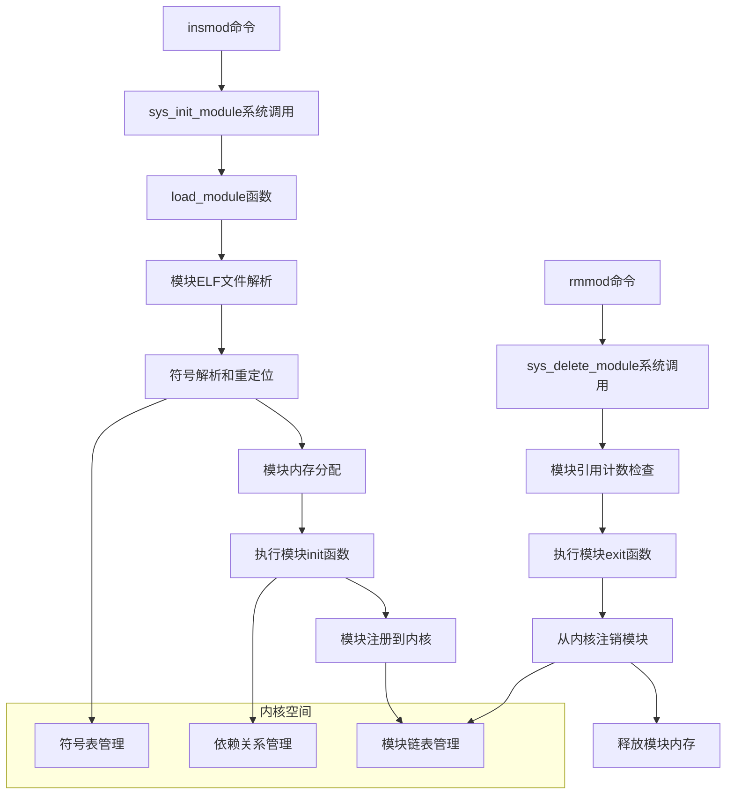

# Linux 内核模块开发指南

## 🧩 概述

Linux内核模块(Loadable Kernel Module, LKM)是一种可以在运行时动态加载到内核中的代码片段，无需重新编译和重启内核。本文档基于Linux内核官方文档和《Linux内核模块编程指南》详细介绍内核模块开发技术。

---

## 🏗️ 内核模块架构

### 模块加载机制



### 模块数据结构

```c
// 内核源码: include/linux/module.h
struct module {
    enum module_state state;        /* 模块状态 */
    
    /* 成员列表和链接 */
    struct list_head list;          /* 模块链表 */
    char name[MODULE_NAME_LEN];     /* 模块名称 */
    
    /* 符号表 */
    struct kernel_symbol *syms;     /* 导出符号表 */
    const s32 *crcs;                /* 符号CRC校验 */
    unsigned int num_syms;          /* 符号数量 */
    
    /* 内核参数 */
    struct kernel_param *kp;        /* 内核参数数组 */
    unsigned int num_kp;            /* 参数数量 */
    
    /* GPL符号表 */
    struct kernel_symbol *gpl_syms; /* GPL导出符号 */
    const s32 *gpl_crcs;           /* GPL符号CRC */
    unsigned int num_gpl_syms;      /* GPL符号数量 */
    
    /* 版本信息 */
    struct modversion_info *versions; /* 版本信息 */
    unsigned int num_versions;      /* 版本数量 */
    
    /* 模块加载信息 */
    void *module_init;              /* 初始化函数 */
    void *module_core;              /* 核心代码 */
    unsigned int init_size, core_size; /* 代码段大小 */
    
    /* 引用计数 */
    struct module_ref {
        unsigned long incs;         /* 增加计数 */
        unsigned long decs;         /* 减少计数 */
    } __percpu *refptr;
    
    /* 构造和析构 */
    ctor_fn_t *ctors;               /* 构造函数 */
    unsigned int num_ctors;         /* 构造函数数量 */
    
    /* 跟踪信息 */
    struct module_kobject mkobj;    /* kobject结构 */
    struct module_attribute *modinfo_attrs; /* 模块属性 */
    
    const char *srcversion;         /* 源代码版本 */
    
    /* 依赖关系 */
    struct list_head source_list;   /* 依赖此模块的列表 */
    struct list_head target_list;   /* 此模块依赖的列表 */
    
    /* 异常处理表 */
    const struct exception_table_entry *extable; /* 异常表 */
    unsigned int num_exentries;     /* 异常表项数量 */
    
    /* 跟踪点和探针点 */
    struct tracepoint * const *tracepoints_ptrs;
    unsigned int num_tracepoints;
    
    /* 许可证信息 */
    const char *license;            /* 许可证字符串 */
    bool sig_ok;                    /* 签名验证状态 */
    
    /* 模块参数结构 */
    struct mod_kallsyms *kallsyms;  /* 内核符号信息 */
    char *args;                     /* 模块参数字符串 */
};
```

---

## 📝 基础内核模块开发

### 1. 最简单的内核模块

```c
// hello_module.c - 最基本的内核模块
#include <linux/init.h>
#include <linux/module.h>
#include <linux/kernel.h>

/* 模块初始化函数 */
static int __init hello_init(void)
{
    printk(KERN_INFO "Hello: Module loaded successfully\n");
    printk(KERN_INFO "Hello: Kernel version: %s\n", UTS_RELEASE);
    return 0;  /* 成功返回0 */
}

/* 模块清理函数 */
static void __exit hello_exit(void)
{
    printk(KERN_INFO "Hello: Module unloaded successfully\n");
}

/* 注册初始化和清理函数 */
module_init(hello_init);
module_exit(hello_exit);

/* 模块元信息 */
MODULE_LICENSE("GPL");                    /* 许可证 */
MODULE_AUTHOR("Linux Kernel Developer"); /* 作者 */
MODULE_DESCRIPTION("A simple hello world kernel module"); /* 描述 */
MODULE_VERSION("1.0");                   /* 版本 */
MODULE_ALIAS("hello");                   /* 别名 */

/* 模块信息 */
static char *module_info = "Hello World Kernel Module";
MODULE_INFO(info, module_info);
```

### 2. 带参数的内核模块

```c
// param_module.c - 带参数的内核模块
#include <linux/init.h>
#include <linux/module.h>
#include <linux/kernel.h>
#include <linux/moduleparam.h>
#include <linux/stat.h>
#include <linux/string.h>

/* 模块参数定义 */
static int int_param = 42;
static char *string_param = "default_string";
static bool bool_param = false;
static int array_param[5] = {1, 2, 3, 4, 5};
static int array_argc = 5;

/* 注册模块参数 */
module_param(int_param, int, S_IRUGO | S_IWUSR);
MODULE_PARM_DESC(int_param, "An integer parameter (default: 42)");

module_param(string_param, charp, S_IRUGO | S_IWUSR);
MODULE_PARM_DESC(string_param, "A string parameter");

module_param(bool_param, bool, S_IRUGO | S_IWUSR);
MODULE_PARM_DESC(bool_param, "A boolean parameter");

module_param_array(array_param, int, &array_argc, S_IRUGO | S_IWUSR);
MODULE_PARM_DESC(array_param, "An integer array parameter");

/* 参数验证函数 */
static int param_set_custom_int(const char *val, const struct kernel_param *kp)
{
    int ret;
    int *custom_int = (int *)kp->arg;
    
    ret = kstrtoint(val, 0, custom_int);
    if (ret)
        return ret;
    
    /* 参数范围检查 */
    if (*custom_int < 0 || *custom_int > 100) {
        printk(KERN_ERR "ParamModule: Invalid parameter value %d (must be 0-100)\n", 
               *custom_int);
        return -EINVAL;
    }
    
    printk(KERN_INFO "ParamModule: Parameter set to %d\n", *custom_int);
    return 0;
}

static int param_get_custom_int(char *buffer, const struct kernel_param *kp)
{
    int *custom_int = (int *)kp->arg;
    return scnprintf(buffer, PAGE_SIZE, "%d\n", *custom_int);
}

/* 自定义参数操作结构 */
static const struct kernel_param_ops custom_int_ops = {
    .set = param_set_custom_int,
    .get = param_get_custom_int,
};

static int custom_param = 50;
module_param_cb(custom_param, &custom_int_ops, &custom_param, S_IRUGO | S_IWUSR);
MODULE_PARM_DESC(custom_param, "A custom validated integer parameter (0-100)");

/* 模块初始化 */
static int __init param_module_init(void)
{
    int i;
    
    printk(KERN_INFO "ParamModule: Initializing with parameters:\n");
    printk(KERN_INFO "ParamModule: int_param = %d\n", int_param);
    printk(KERN_INFO "ParamModule: string_param = %s\n", string_param);
    printk(KERN_INFO "ParamModule: bool_param = %s\n", bool_param ? "true" : "false");
    printk(KERN_INFO "ParamModule: custom_param = %d\n", custom_param);
    
    printk(KERN_INFO "ParamModule: array_param = [");
    for (i = 0; i < array_argc; i++) {
        printk(KERN_CONT "%d", array_param[i]);
        if (i < array_argc - 1)
            printk(KERN_CONT ", ");
    }
    printk(KERN_CONT "]\n");
    
    return 0;
}

/* 模块清理 */
static void __exit param_module_exit(void)
{
    printk(KERN_INFO "ParamModule: Module unloaded\n");
}

module_init(param_module_init);
module_exit(param_module_exit);

MODULE_LICENSE("GPL");
MODULE_AUTHOR("Linux Kernel Developer");
MODULE_DESCRIPTION("Kernel module with various parameter types");
MODULE_VERSION("1.0");
```

### 3. 符号导出和依赖管理

```c
// symbol_export_module.c - 符号导出模块
#include <linux/init.h>
#include <linux/module.h>
#include <linux/kernel.h>
#include <linux/slab.h>
#include <linux/mutex.h>

/* 全局变量导出 */
int exported_variable = 1234;
EXPORT_SYMBOL(exported_variable);

/* 互斥锁导出 */
static DEFINE_MUTEX(exported_mutex);
EXPORT_SYMBOL(exported_mutex);

/* 导出函数 - 普通符号 */
int exported_function(int param)
{
    printk(KERN_INFO "SymbolExport: exported_function called with param = %d\n", param);
    return param * 2;
}
EXPORT_SYMBOL(exported_function);

/* 导出函数 - GPL符号 */
void exported_gpl_function(const char *message)
{
    printk(KERN_INFO "SymbolExport: GPL function called: %s\n", message);
}
EXPORT_SYMBOL_GPL(exported_gpl_function);

/* 内存管理包装函数 */
void *my_kmalloc(size_t size)
{
    void *ptr = kmalloc(size, GFP_KERNEL);
    if (ptr)
        printk(KERN_INFO "SymbolExport: Allocated %zu bytes at %p\n", size, ptr);
    else
        printk(KERN_ERR "SymbolExport: Failed to allocate %zu bytes\n", size);
    return ptr;
}
EXPORT_SYMBOL(my_kmalloc);

void my_kfree(void *ptr)
{
    if (ptr) {
        printk(KERN_INFO "SymbolExport: Freeing memory at %p\n", ptr);
        kfree(ptr);
    }
}
EXPORT_SYMBOL(my_kfree);

/* 字符串处理函数 */
int my_string_length(const char *str)
{
    if (!str)
        return -EINVAL;
    return strlen(str);
}
EXPORT_SYMBOL(my_string_length);

/* 模块初始化 */
static int __init symbol_export_init(void)
{
    printk(KERN_INFO "SymbolExport: Module loaded, exporting symbols\n");
    printk(KERN_INFO "SymbolExport: exported_variable = %d\n", exported_variable);
    
    /* 测试导出的函数 */
    int result = exported_function(21);
    printk(KERN_INFO "SymbolExport: Self-test result = %d\n", result);
    
    return 0;
}

/* 模块清理 */
static void __exit symbol_export_exit(void)
{
    printk(KERN_INFO "SymbolExport: Module unloaded, symbols no longer available\n");
}

module_init(symbol_export_init);
module_exit(symbol_export_exit);

MODULE_LICENSE("GPL");
MODULE_AUTHOR("Linux Kernel Developer");
MODULE_DESCRIPTION("Module demonstrating symbol export");
MODULE_VERSION("1.0");
```

```c
// symbol_import_module.c - 符号导入模块
#include <linux/init.h>
#include <linux/module.h>
#include <linux/kernel.h>

/* 声明外部符号 */
extern int exported_variable;
extern int exported_function(int param);
extern void exported_gpl_function(const char *message);
extern void *my_kmalloc(size_t size);
extern void my_kfree(void *ptr);
extern int my_string_length(const char *str);

/* 模块初始化 */
static int __init symbol_import_init(void)
{
    void *test_ptr;
    int length;
    const char *test_string = "Hello from imported module!";
    
    printk(KERN_INFO "SymbolImport: Module loading, using imported symbols\n");
    
    /* 使用导入的变量 */
    printk(KERN_INFO "SymbolImport: imported variable = %d\n", exported_variable);
    
    /* 使用导入的函数 */
    int result = exported_function(100);
    printk(KERN_INFO "SymbolImport: function result = %d\n", result);
    
    /* 使用GPL函数 */
    exported_gpl_function("Testing GPL function from imported module");
    
    /* 使用内存管理函数 */
    test_ptr = my_kmalloc(1024);
    if (test_ptr) {
        strcpy((char *)test_ptr, test_string);
        printk(KERN_INFO "SymbolImport: Stored string: %s\n", (char *)test_ptr);
        my_kfree(test_ptr);
    }
    
    /* 使用字符串函数 */
    length = my_string_length(test_string);
    printk(KERN_INFO "SymbolImport: String length = %d\n", length);
    
    return 0;
}

/* 模块清理 */
static void __exit symbol_import_exit(void)
{
    printk(KERN_INFO "SymbolImport: Module unloaded\n");
}

module_init(symbol_import_init);
module_exit(symbol_import_exit);

MODULE_LICENSE("GPL");
MODULE_AUTHOR("Linux Kernel Developer");  
MODULE_DESCRIPTION("Module demonstrating symbol import");
MODULE_VERSION("1.0");
```

---

## 🔧 高级模块开发技术

### 1. 模块版本控制和依赖

```c
// version_module.c - 版本控制示例
#include <linux/init.h>
#include <linux/module.h>
#include <linux/kernel.h>
#include <linux/version.h>
#include <linux/vermagic.h>

/* 编译时版本检查 */
#if LINUX_VERSION_CODE < KERNEL_VERSION(5,0,0)
#error "This module requires Linux kernel version 5.0.0 or later"
#endif

/* 模块版本魔数检查 */
MODULE_INFO(vermagic, VERMAGIC_STRING);

/* 符号版本检查 */
#ifdef CONFIG_MODVERSIONS
#include <linux/modversions.h>
#endif

/* 模块依赖声明 */
MODULE_SOFTDEP("pre: symbol_export_module");  /* 软依赖 */

/* 运行时版本检查函数 */
static int check_kernel_version(void)
{
    printk(KERN_INFO "Version: Current kernel version: %s\n", UTS_RELEASE);
    printk(KERN_INFO "Version: Compiled for kernel version: %s\n", UTS_VERSION);
    
#if LINUX_VERSION_CODE >= KERNEL_VERSION(6,0,0)
    printk(KERN_INFO "Version: Running on modern kernel (6.0+)\n");
#elif LINUX_VERSION_CODE >= KERNEL_VERSION(5,0,0)  
    printk(KERN_INFO "Version: Running on supported kernel (5.0+)\n");
#else
    printk(KERN_ERR "Version: Unsupported kernel version\n");
    return -ENOTSUPP;
#endif

    return 0;
}

/* 功能特性检查 */
static int check_kernel_features(void)
{
    printk(KERN_INFO "Version: Checking kernel features:\n");
    
#ifdef CONFIG_SMP
    printk(KERN_INFO "Version: SMP support: enabled\n");
#else
    printk(KERN_INFO "Version: SMP support: disabled\n");
#endif

#ifdef CONFIG_PREEMPT
    printk(KERN_INFO "Version: Preemption support: enabled\n");
#else
    printk(KERN_INFO "Version: Preemption support: disabled\n");
#endif

#ifdef CONFIG_MODULE_UNLOAD
    printk(KERN_INFO "Version: Module unloading: enabled\n");
#else
    printk(KERN_INFO "Version: Module unloading: disabled\n");
#endif

    return 0;
}

/* 模块初始化 */
static int __init version_module_init(void)
{
    int ret;
    
    printk(KERN_INFO "Version: Initializing version-aware module\n");
    
    ret = check_kernel_version();
    if (ret)
        return ret;
        
    ret = check_kernel_features();
    if (ret)
        return ret;
    
    printk(KERN_INFO "Version: Module initialized successfully\n");
    return 0;
}

/* 模块清理 */
static void __exit version_module_exit(void)
{
    printk(KERN_INFO "Version: Module unloaded\n");
}

module_init(version_module_init);
module_exit(version_module_exit);

MODULE_LICENSE("GPL");
MODULE_AUTHOR("Linux Kernel Developer");
MODULE_DESCRIPTION("Module with version control and dependency management");
MODULE_VERSION("1.0");
MODULE_INFO(supported, "Test module for version checking");
```

### 2. 模块通信机制

```c
// communication_module.c - 模块间通信示例
#include <linux/init.h>
#include <linux/module.h>
#include <linux/kernel.h>
#include <linux/slab.h>
#include <linux/mutex.h>
#include <linux/list.h>
#include <linux/workqueue.h>
#include <linux/completion.h>

/* 消息结构定义 */
struct comm_message {
    struct list_head list;      /* 链表节点 */
    int sender_id;              /* 发送者ID */
    int receiver_id;            /* 接收者ID */
    size_t data_len;            /* 数据长度 */
    char data[0];               /* 可变长度数据 */
};

/* 通信管理结构 */
struct comm_manager {
    struct list_head msg_queue;  /* 消息队列 */
    struct mutex queue_mutex;    /* 队列互斥锁 */
    struct workqueue_struct *wq; /* 工作队列 */
    atomic_t msg_count;          /* 消息计数 */
    wait_queue_head_t wait_queue; /* 等待队列 */
};

static struct comm_manager *comm_mgr = NULL;

/* 工作项结构 */
struct comm_work {
    struct work_struct work;
    struct comm_message *msg;
};

/* 消息处理工作函数 */
static void process_message_work(struct work_struct *work)
{
    struct comm_work *comm_work = container_of(work, struct comm_work, work);
    struct comm_message *msg = comm_work->msg;
    
    printk(KERN_INFO "Comm: Processing message from %d to %d: %.*s\n",
           msg->sender_id, msg->receiver_id, (int)msg->data_len, msg->data);
    
    /* 模拟消息处理 */
    msleep(100);
    
    printk(KERN_INFO "Comm: Message processed successfully\n");
    
    /* 清理 */
    kfree(msg);
    kfree(comm_work);
}

/* 发送消息函数 */
int send_message(int sender_id, int receiver_id, const char *data, size_t len)
{
    struct comm_message *msg;
    struct comm_work *work;
    
    if (!comm_mgr) {
        printk(KERN_ERR "Comm: Communication manager not initialized\n");
        return -EINVAL;
    }
    
    /* 分配消息结构 */
    msg = kzalloc(sizeof(struct comm_message) + len + 1, GFP_KERNEL);
    if (!msg) {
        printk(KERN_ERR "Comm: Failed to allocate message\n");
        return -ENOMEM;
    }
    
    /* 填充消息 */
    INIT_LIST_HEAD(&msg->list);
    msg->sender_id = sender_id;
    msg->receiver_id = receiver_id;
    msg->data_len = len;
    memcpy(msg->data, data, len);
    msg->data[len] = '\0';
    
    /* 分配工作项 */
    work = kzalloc(sizeof(struct comm_work), GFP_KERNEL);
    if (!work) {
        kfree(msg);
        return -ENOMEM;
    }
    
    INIT_WORK(&work->work, process_message_work);
    work->msg = msg;
    
    /* 加入队列 */
    mutex_lock(&comm_mgr->queue_mutex);
    list_add_tail(&msg->list, &comm_mgr->msg_queue);
    atomic_inc(&comm_mgr->msg_count);
    mutex_unlock(&comm_mgr->queue_mutex);
    
    /* 提交工作项 */
    queue_work(comm_mgr->wq, &work->work);
    
    /* 唤醒等待进程 */
    wake_up_interruptible(&comm_mgr->wait_queue);
    
    printk(KERN_INFO "Comm: Message queued from %d to %d\n", sender_id, receiver_id);
    return 0;
}
EXPORT_SYMBOL(send_message);

/* 获取消息计数函数 */
int get_message_count(void)
{
    if (!comm_mgr)
        return -EINVAL;
    return atomic_read(&comm_mgr->msg_count);
}
EXPORT_SYMBOL(get_message_count);

/* 清空消息队列函数 */
void clear_message_queue(void)
{
    struct comm_message *msg, *tmp;
    
    if (!comm_mgr)
        return;
    
    mutex_lock(&comm_mgr->queue_mutex);
    list_for_each_entry_safe(msg, tmp, &comm_mgr->msg_queue, list) {
        list_del(&msg->list);
        kfree(msg);
        atomic_dec(&comm_mgr->msg_count);
    }
    mutex_unlock(&comm_mgr->queue_mutex);
    
    printk(KERN_INFO "Comm: Message queue cleared\n");
}
EXPORT_SYMBOL(clear_message_queue);

/* 模块初始化 */
static int __init comm_module_init(void)
{
    printk(KERN_INFO "Comm: Initializing communication module\n");
    
    /* 分配通信管理器 */
    comm_mgr = kzalloc(sizeof(struct comm_manager), GFP_KERNEL);
    if (!comm_mgr) {
        printk(KERN_ERR "Comm: Failed to allocate communication manager\n");
        return -ENOMEM;
    }
    
    /* 初始化管理器 */
    INIT_LIST_HEAD(&comm_mgr->msg_queue);
    mutex_init(&comm_mgr->queue_mutex);
    atomic_set(&comm_mgr->msg_count, 0);
    init_waitqueue_head(&comm_mgr->wait_queue);
    
    /* 创建工作队列 */
    comm_mgr->wq = alloc_workqueue("comm_wq", WQ_MEM_RECLAIM, 0);
    if (!comm_mgr->wq) {
        printk(KERN_ERR "Comm: Failed to create workqueue\n");
        kfree(comm_mgr);
        comm_mgr = NULL;
        return -ENOMEM;
    }
    
    printk(KERN_INFO "Comm: Communication module initialized\n");
    
    /* 自测试 */
    send_message(1, 2, "Hello from communication module!", 33);
    
    return 0;
}

/* 模块清理 */
static void __exit comm_module_exit(void)
{
    printk(KERN_INFO "Comm: Cleaning up communication module\n");
    
    if (comm_mgr) {
        /* 刷新并销毁工作队列 */
        if (comm_mgr->wq) {
            flush_workqueue(comm_mgr->wq);
            destroy_workqueue(comm_mgr->wq);
        }
        
        /* 清空消息队列 */
        clear_message_queue();
        
        /* 释放管理器 */
        kfree(comm_mgr);
        comm_mgr = NULL;
    }
    
    printk(KERN_INFO "Comm: Communication module unloaded\n");
}

module_init(comm_module_init);
module_exit(comm_module_exit);

MODULE_LICENSE("GPL");
MODULE_AUTHOR("Linux Kernel Developer");
MODULE_DESCRIPTION("Inter-module communication framework");
MODULE_VERSION("1.0");
```

---

## 🔍 模块调试和分析

### 1. 模块调试技术

```c
// debug_module.c - 调试功能演示
#include <linux/init.h>
#include <linux/module.h>
#include <linux/kernel.h>
#include <linux/debugfs.h>
#include <linux/proc_fs.h>
#include <linux/seq_file.h>
#include <linux/uaccess.h>
#include <linux/slab.h>

/* 调试级别定义 */
#define DEBUG_LEVEL_NONE    0
#define DEBUG_LEVEL_ERROR   1
#define DEBUG_LEVEL_WARN    2
#define DEBUG_LEVEL_INFO    3
#define DEBUG_LEVEL_DEBUG   4

static int debug_level = DEBUG_LEVEL_INFO;
module_param(debug_level, int, 0644);
MODULE_PARM_DESC(debug_level, "Debug level (0=none, 1=error, 2=warn, 3=info, 4=debug)");

/* 调试宏定义 */
#define debug_print(level, fmt, args...) \
    do { \
        if (debug_level >= level) { \
            printk(KERN_INFO "Debug[%d]: " fmt, level, ##args); \
        } \
    } while(0)

#define debug_error(fmt, args...)   debug_print(DEBUG_LEVEL_ERROR, fmt, ##args)
#define debug_warn(fmt, args...)    debug_print(DEBUG_LEVEL_WARN, fmt, ##args)  
#define debug_info(fmt, args...)    debug_print(DEBUG_LEVEL_INFO, fmt, ##args)
#define debug_debug(fmt, args...)   debug_print(DEBUG_LEVEL_DEBUG, fmt, ##args)

/* 调试统计信息 */
struct debug_stats {
    atomic_t function_calls;
    atomic_t memory_allocations;
    atomic_t errors;
    unsigned long last_activity;
};

static struct debug_stats stats;

/* debugfs相关变量 */
static struct dentry *debug_dir = NULL;
static struct dentry *stats_file = NULL;
static struct dentry *level_file = NULL;

/* proc文件系统相关 */
static struct proc_dir_entry *proc_entry = NULL;

/* debugfs文件操作 */
static int stats_show(struct seq_file *m, void *v)
{
    seq_printf(m, "Debug Module Statistics:\n");
    seq_printf(m, "Function calls: %d\n", atomic_read(&stats.function_calls));
    seq_printf(m, "Memory allocations: %d\n", atomic_read(&stats.memory_allocations));
    seq_printf(m, "Errors: %d\n", atomic_read(&stats.errors));
    seq_printf(m, "Last activity: %lu\n", stats.last_activity);
    seq_printf(m, "Current debug level: %d\n", debug_level);
    return 0;
}

static int stats_open(struct inode *inode, struct file *file)
{
    return single_open(file, stats_show, NULL);
}

static const struct file_operations stats_fops = {
    .owner = THIS_MODULE,
    .open = stats_open,
    .read = seq_read,
    .llseek = seq_lseek,
    .release = single_release,
};

/* proc文件操作 */
static int proc_show(struct seq_file *m, void *v)
{
    seq_printf(m, "Debug Module Control Panel\n");
    seq_printf(m, "Debug Level: %d\n", debug_level);
    seq_printf(m, "Available levels:\n");
    seq_printf(m, "  0 - None\n");
    seq_printf(m, "  1 - Error\n");
    seq_printf(m, "  2 - Warning\n");
    seq_printf(m, "  3 - Info\n");
    seq_printf(m, "  4 - Debug\n");
    return 0;
}

static int proc_open(struct inode *inode, struct file *file)
{
    return single_open(file, proc_show, NULL);
}

static ssize_t proc_write(struct file *file, const char __user *buffer,
                         size_t count, loff_t *pos)
{
    char input[16];
    int new_level;
    
    if (count >= sizeof(input))
        return -EINVAL;
        
    if (copy_from_user(input, buffer, count))
        return -EFAULT;
        
    input[count] = '\0';
    
    if (kstrtoint(input, 0, &new_level) == 0) {
        if (new_level >= 0 && new_level <= 4) {
            debug_level = new_level;
            debug_info("Debug level changed to %d\n", new_level);
        } else {
            debug_error("Invalid debug level %d\n", new_level);
            atomic_inc(&stats.errors);
            return -EINVAL;
        }
    } else {
        debug_error("Failed to parse debug level\n");
        atomic_inc(&stats.errors);
        return -EINVAL;
    }
    
    stats.last_activity = jiffies;
    return count;
}

static const struct file_operations proc_fops = {
    .owner = THIS_MODULE,
    .open = proc_open,
    .read = seq_read,
    .write = proc_write,
    .llseek = seq_lseek,
    .release = single_release,
};

/* 测试函数 */
static void test_debug_functions(void)
{
    void *test_ptr;
    
    atomic_inc(&stats.function_calls);
    stats.last_activity = jiffies;
    
    debug_debug("Entering test_debug_functions()\n");
    
    /* 测试内存分配 */
    test_ptr = kmalloc(1024, GFP_KERNEL);
    if (test_ptr) {
        atomic_inc(&stats.memory_allocations);
        debug_info("Allocated 1024 bytes at %p\n", test_ptr);
        kfree(test_ptr);
        debug_info("Freed memory at %p\n", test_ptr);
    } else {
        debug_error("Failed to allocate memory\n");
        atomic_inc(&stats.errors);
    }
    
    /* 测试警告 */
    debug_warn("This is a warning message\n");
    
    /* 测试错误 */
    debug_error("This is an error message (for testing)\n");
    
    debug_debug("Exiting test_debug_functions()\n");
}

/* 重置统计信息函数 */
void reset_debug_stats(void)
{
    atomic_set(&stats.function_calls, 0);
    atomic_set(&stats.memory_allocations, 0);
    atomic_set(&stats.errors, 0);
    stats.last_activity = jiffies;
    debug_info("Debug statistics reset\n");
}
EXPORT_SYMBOL(reset_debug_stats);

/* 模块初始化 */
static int __init debug_module_init(void)
{
    debug_info("Debug module initializing\n");
    
    /* 初始化统计信息 */
    atomic_set(&stats.function_calls, 0);
    atomic_set(&stats.memory_allocations, 0);
    atomic_set(&stats.errors, 0);
    stats.last_activity = jiffies;
    
    /* 创建debugfs目录和文件 */
    debug_dir = debugfs_create_dir("debug_module", NULL);
    if (debug_dir) {
        stats_file = debugfs_create_file("stats", 0444, debug_dir,
                                        NULL, &stats_fops);
        if (!stats_file) {
            debug_error("Failed to create debugfs stats file\n");
            atomic_inc(&stats.errors);
        }
        
        level_file = debugfs_create_u32("debug_level", 0644, debug_dir,
                                       (u32 *)&debug_level);
        if (!level_file) {
            debug_error("Failed to create debugfs level file\n");
            atomic_inc(&stats.errors);
        }
    } else {
        debug_error("Failed to create debugfs directory\n");
        atomic_inc(&stats.errors);
    }
    
    /* 创建proc文件 */
    proc_entry = proc_create("debug_module", 0644, NULL, &proc_fops);
    if (!proc_entry) {
        debug_error("Failed to create proc entry\n");
        atomic_inc(&stats.errors);
    }
    
    /* 运行测试 */
    test_debug_functions();
    
    debug_info("Debug module initialized successfully\n");
    debug_info("Access debug info via:\n");
    debug_info("  /sys/kernel/debug/debug_module/stats\n");
    debug_info("  /sys/kernel/debug/debug_module/debug_level\n");
    debug_info("  /proc/debug_module\n");
    
    return 0;
}

/* 模块清理 */
static void __exit debug_module_exit(void)
{
    debug_info("Debug module cleaning up\n");
    
    /* 移除proc文件 */
    if (proc_entry) {
        proc_remove(proc_entry);
        debug_debug("Proc entry removed\n");
    }
    
    /* 移除debugfs文件和目录 */
    if (level_file) {
        debugfs_remove(level_file);
        debug_debug("Level file removed\n");
    }
    
    if (stats_file) {
        debugfs_remove(stats_file);
        debug_debug("Stats file removed\n");
    }
    
    if (debug_dir) {
        debugfs_remove(debug_dir);
        debug_debug("Debug directory removed\n");
    }
    
    /* 显示最终统计信息 */
    debug_info("Final statistics:\n");
    debug_info("  Function calls: %d\n", atomic_read(&stats.function_calls));
    debug_info("  Memory allocations: %d\n", atomic_read(&stats.memory_allocations));
    debug_info("  Errors: %d\n", atomic_read(&stats.errors));
    
    debug_info("Debug module unloaded\n");
}

module_init(debug_module_init);
module_exit(debug_module_exit);

MODULE_LICENSE("GPL");
MODULE_AUTHOR("Linux Kernel Developer");
MODULE_DESCRIPTION("Kernel module debugging demonstration");
MODULE_VERSION("1.0");
```

### 2. 模块性能分析

```bash
#!/bin/bash
# module_analysis.sh - 模块性能分析脚本

MODULE_NAME="debug_module"
ANALYSIS_TIME=30

echo "=== Linux内核模块性能分析 ==="
echo "模块名称: $MODULE_NAME"
echo "分析时间: ${ANALYSIS_TIME}秒"
echo

# 检查模块是否加载
if ! lsmod | grep -q "$MODULE_NAME"; then
    echo "错误: 模块 $MODULE_NAME 未加载"
    exit 1
fi

echo "1. 模块基本信息"
echo "================"
modinfo $MODULE_NAME | head -10

echo -e "\n2. 内存使用分析"
echo "================"
cat /proc/modules | grep "$MODULE_NAME" | awk '{printf "模块大小: %d KB\n使用计数: %d\n", $2/1024, $3}'

echo -e "\n3. 符号导出分析"
echo "================"
cat /proc/kallsyms | grep -E "\[$MODULE_NAME\]" | wc -l | awk '{print "导出符号数量:", $1}'
cat /proc/kallsyms | grep -E "\[$MODULE_NAME\]" | head -5

echo -e "\n4. debugfs信息"
echo "================"
if [[ -d "/sys/kernel/debug/debug_module" ]]; then
    echo "统计信息:"
    cat /sys/kernel/debug/debug_module/stats
    echo "当前调试级别:"
    cat /sys/kernel/debug/debug_module/debug_level
else
    echo "debugfs信息不可用"
fi

echo -e "\n5. 内核日志分析"
echo "================"
echo "最近的模块相关消息:"
dmesg | grep -i "$MODULE_NAME" | tail -5

echo -e "\n6. 性能监控 (${ANALYSIS_TIME}秒)"
echo "================"
echo "开始监控..."

# 记录开始状态
start_time=$(date +%s)
initial_calls=$(cat /sys/kernel/debug/debug_module/stats 2>/dev/null | grep "Function calls" | awk '{print $3}' || echo "0")

# 等待指定时间
sleep $ANALYSIS_TIME

# 记录结束状态  
end_time=$(date +%s)
final_calls=$(cat /sys/kernel/debug/debug_module/stats 2>/dev/null | grep "Function calls" | awk '{print $3}' || echo "0")

# 计算性能指标
elapsed=$((end_time - start_time))
call_diff=$((final_calls - initial_calls))

echo "监控结果:"
echo "  监控时间: ${elapsed}秒"
echo "  函数调用增量: $call_diff"
if [[ $elapsed -gt 0 ]]; then
    calls_per_sec=$((call_diff / elapsed))
    echo "  平均调用频率: ${calls_per_sec} 次/秒"
fi

echo -e "\n=== 分析完成 ==="
```

---

## 📚 模块开发最佳实践

### 构建系统和Makefile

```makefile
# 完整的内核模块Makefile示例

# 定义模块对象
obj-m += hello_module.o
obj-m += param_module.o
obj-m += symbol_export_module.o
obj-m += symbol_import_module.o
obj-m += communication_module.o
obj-m += debug_module.o

# 多文件模块
complex_module-objs := main.o utils.o device.o
obj-m += complex_module.o

# 内核构建目录
KERNELDIR ?= /lib/modules/$(shell uname -r)/build
PWD := $(shell pwd)

# 编译标志
ccflags-y += -DDEBUG
ccflags-y += -Wall -Wextra
ccflags-y += -I$(PWD)/include

# 默认目标
default: modules

# 编译模块
modules:
	$(MAKE) -C $(KERNELDIR) M=$(PWD) modules

# 清理
clean:
	$(MAKE) -C $(KERNELDIR) M=$(PWD) clean
	rm -f *.symvers *.order

# 安装模块
install: modules
	$(MAKE) -C $(KERNELDIR) M=$(PWD) modules_install
	depmod -a

# 加载模块
load:
	@echo "Loading kernel modules..."
	sudo insmod hello_module.ko
	sudo insmod param_module.ko int_param=100 string_param="test"
	sudo insmod symbol_export_module.ko
	sudo insmod symbol_import_module.ko
	sudo insmod communication_module.ko
	sudo insmod debug_module.ko debug_level=3

# 卸载模块
unload:
	@echo "Unloading kernel modules..."
	-sudo rmmod debug_module
	-sudo rmmod communication_module  
	-sudo rmmod symbol_import_module
	-sudo rmmod symbol_export_module
	-sudo rmmod param_module
	-sudo rmmod hello_module

# 重新加载
reload: unload load

# 显示模块状态
status:
	@echo "=== Loaded modules ==="
	lsmod | head -1
	lsmod | grep -E "(hello|param|symbol|comm|debug)_module" || echo "No modules loaded"

# 显示内核日志
logs:
	dmesg | tail -20

# 代码检查
check:
	sparse $(src)/*.c
	scripts/checkpatch.pl --file $(src)/*.c

# 帮助信息
help:
	@echo "Available targets:"
	@echo "  modules  - Build kernel modules"
	@echo "  clean    - Clean build files"
	@echo "  install  - Install modules to system"
	@echo "  load     - Load modules"
	@echo "  unload   - Unload modules"
	@echo "  reload   - Unload and load modules"
	@echo "  status   - Show module status"
	@echo "  logs     - Show kernel logs"
	@echo "  check    - Run code analysis"
	@echo "  help     - Show this help"

.PHONY: default modules clean install load unload reload status logs check help
```

### 模块开发规范

```c
/* 
 * 内核模块开发规范和最佳实践
 */

// 1. 头文件包含规范
#include <linux/init.h>      /* 模块初始化 */
#include <linux/module.h>    /* 模块支持 */
#include <linux/kernel.h>    /* 内核函数 */
#include <linux/fs.h>        /* 文件系统 */
#include <linux/uaccess.h>   /* 用户空间访问 */
#include <linux/slab.h>      /* 内存分配 */
#include <linux/mutex.h>     /* 互斥锁 */

// 2. 错误处理规范
static int __init module_init_func(void)
{
    int ret;
    
    ret = setup_function();
    if (ret) {
        pr_err("Setup failed: %d\n", ret);
        goto err_setup;
    }
    
    ret = register_function();
    if (ret) {
        pr_err("Register failed: %d\n", ret);
        goto err_register;
    }
    
    return 0;

err_register:
    cleanup_setup();
err_setup:
    return ret;
}

// 3. 内存管理规范
static void safe_memory_management(void)
{
    void *ptr;
    
    /* 检查分配是否成功 */
    ptr = kmalloc(1024, GFP_KERNEL);
    if (!ptr) {
        pr_err("Memory allocation failed\n");
        return;
    }
    
    /* 使用内存 */
    memset(ptr, 0, 1024);
    
    /* 及时释放 */
    kfree(ptr);
    ptr = NULL;  /* 避免悬空指针 */
}

// 4. 并发控制规范
static DEFINE_MUTEX(device_mutex);
static DEFINE_SPINLOCK(device_lock);

static void concurrent_access_example(void)
{
    /* 可睡眠上下文使用mutex */
    if (mutex_lock_interruptible(&device_mutex))
        return;
    
    /* 临界区代码 */
    /* ... */
    
    mutex_unlock(&device_mutex);
    
    /* 中断上下文使用spinlock */
    unsigned long flags;
    spin_lock_irqsave(&device_lock, flags);
    
    /* 临界区代码 */
    /* ... */
    
    spin_unlock_irqrestore(&device_lock, flags);
}

// 5. 用户空间交互规范
static long device_ioctl(struct file *file, unsigned int cmd, unsigned long arg)
{
    int ret = 0;
    void __user *argp = (void __user *)arg;
    
    /* 检查命令有效性 */
    if (_IOC_TYPE(cmd) != DEVICE_IOC_MAGIC)
        return -ENOTTY;
    
    if (_IOC_NR(cmd) > DEVICE_IOC_MAXNR)
        return -ENOTTY;
    
    /* 检查访问权限 */
    if (_IOC_DIR(cmd) & _IOC_READ)
        ret = !access_ok(argp, _IOC_SIZE(cmd));
    else if (_IOC_DIR(cmd) & _IOC_WRITE)
        ret = !access_ok(argp, _IOC_SIZE(cmd));
    
    if (ret)
        return -EFAULT;
    
    /* 处理命令 */
    switch (cmd) {
        case DEVICE_IOCTL_CMD:
            /* 处理逻辑 */
            break;
        default:
            return -ENOTTY;
    }
    
    return 0;
}
```

---

**下一章**: [内核调试技术](kernel-debugging.md) - 深入学习内核调试方法和工具

*基于Linux 6.x内核系列 | 参考《Linux内核模块编程指南》和Linux内核文档*
