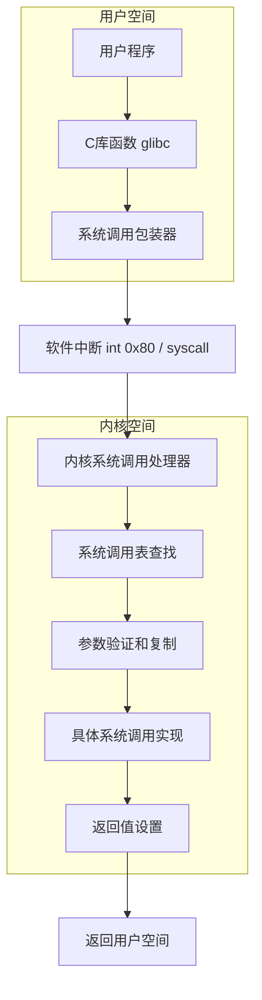

# Linux 系统调用深度解析

## 🔄 概述

系统调用(System Call)是用户空间程序访问内核服务的唯一合法途径，是用户态和内核态之间的桥梁。本文档基于Linux内核官方文档、POSIX标准和《Advanced Programming in the UNIX Environment》详细解析系统调用机制。

---

## 🏗️ 系统调用架构

### 系统调用流程图



### 系统调用表结构

**x86_64系统调用表定义**:
```c
// 内核源码: arch/x86/entry/syscalls/syscall_64.tbl
// 格式: <number> <abi> <name> <entry point>
0   common  read            sys_read
1   common  write           sys_write
2   common  open            sys_open
3   common  close           sys_close
4   common  stat            sys_newstat
5   common  fstat           sys_newfstat
...
334 common  rseq            sys_rseq
435 common  clone3          sys_clone3
...
```

**系统调用表数组**:
```c
// 内核源码: arch/x86/entry/syscall_64.c
#define __SYSCALL_64(nr, sym, qual) extern asmlinkage long sym(const struct pt_regs *);
#include <asm/syscalls_64.h>
#undef __SYSCALL_64

#define __SYSCALL_64(nr, sym, qual) [nr] = sym,

asmlinkage const sys_call_ptr_t sys_call_table[__NR_syscall_max+1] = {
    /*
     * 用指针表示系统调用处理函数
     */
    [0 ... __NR_syscall_max] = &sys_ni_syscall,
#include <asm/syscalls_64.h>
};
```

---

## ⚡ 系统调用机制实现

### 1. 系统调用入口

**x86_64汇编入口**:
```assembly
# 内核源码: arch/x86/entry/entry_64.S
ENTRY(entry_SYSCALL_64)
    swapgs                      # 切换GS寄存器
    movq    %rsp, PER_CPU_VAR(rsp_scratch)
    movq    PER_CPU_VAR(cpu_current_top_of_stack), %rsp
    
    # 构建pt_regs结构
    pushq   $__USER_DS          # ss
    pushq   PER_CPU_VAR(rsp_scratch)  # rsp  
    pushq   %r11                # rflags
    pushq   $__USER_CS          # cs
    pushq   %rcx                # ip (syscall指令会将返回地址保存在rcx)
    pushq   %rax                # 系统调用号
    
    PUSH_REGS
    CLEAR_REGS_NOSPEC
    
    movq    %rsp, %rdi          # pt_regs作为第一个参数
    call    do_syscall_64       # 调用C函数处理系统调用
    
    POP_REGS
    
    movq    RCX(%rsp), %rcx
    movq    RIP(%rsp), %r11
    
    cmpq    %rcx, %r11          # 检查返回地址
    jne     swapgs_restore_regs_and_return_to_usermode
    
    sysretq                     # 快速返回用户空间
```

**C语言处理函数**:
```c
// 内核源码: arch/x86/entry/common.c
__visible void do_syscall_64(unsigned long nr, struct pt_regs *regs)
{
    struct thread_info *ti;
    
    enter_from_user_mode();
    instrumentation_begin();
    
    local_irq_enable();
    ti = current_thread_info();
    
    if (READ_ONCE(ti->flags) & _TIF_WORK_SYSCALL_ENTRY) {
        nr = syscall_trace_enter(regs);
    }
    
    if (likely(nr < NR_syscalls)) {
        nr = array_index_nospec(nr, NR_syscalls);
        regs->ax = sys_call_table[nr](regs);
#ifdef CONFIG_X86_X32_ABI
    } else if (likely((nr & __X32_SYSCALL_BIT) &&
                     (nr & ~__X32_SYSCALL_BIT) < X32_NR_syscalls)) {
        nr = array_index_nospec(nr & ~__X32_SYSCALL_BIT,
                               X32_NR_syscalls);
        regs->ax = x32_sys_call_table[nr](regs);
#endif
    }
    
    instrumentation_end();
    syscall_return_slowpath(regs);
}
```

### 2. 参数传递机制

**x86_64参数传递约定**:
```
寄存器映射 (System V ABI):
rdi -> 第1个参数 (arg0)
rsi -> 第2个参数 (arg1) 
rdx -> 第3个参数 (arg2)
r10 -> 第4个参数 (arg3)  // 注意不是rcx
r8  -> 第5个参数 (arg4)
r9  -> 第6个参数 (arg5)

系统调用号: rax
返回值: rax
```

**参数提取函数**:
```c
// 内核源码: arch/x86/include/asm/syscall.h
static inline void syscall_get_arguments(struct task_struct *task,
                                        struct pt_regs *regs,
                                        unsigned long *args)
{
    if (task->thread.status & TS_COMPAT) {
        *args++ = regs->bx & 0xffffffff;
        *args++ = regs->cx & 0xffffffff;
        *args++ = regs->dx & 0xffffffff;
        *args++ = regs->si & 0xffffffff;
        *args++ = regs->di & 0xffffffff;
        *args   = regs->bp & 0xffffffff;
    } else {
        *args++ = regs->di;
        *args++ = regs->si;
        *args++ = regs->dx;
        *args++ = regs->r10;
        *args++ = regs->r8;
        *args   = regs->r9;
    }
}
```

### 3. 用户空间数据访问

**安全的内存访问函数**:
```c
// 内核源码: arch/x86/lib/usercopy_64.c
unsigned long copy_from_user(void *to, const void __user *from,
                             unsigned long n)
{
    might_fault();
    if (likely(access_ok(from, n))) {
        kasan_check_write(to, n);
        n = raw_copy_from_user(to, from, n);
    }
    return n;
}

unsigned long copy_to_user(void __user *to, const void *from,
                          unsigned long n)
{
    might_fault();
    if (likely(access_ok(to, n))) {
        kasan_check_read(from, n);
        n = raw_copy_to_user(to, from, n);
    }
    return n;
}

// 地址有效性检查
static inline bool access_ok(const void __user *addr, unsigned long size)
{
    return likely(!__range_not_ok(addr, size, user_addr_max()));
}
```

---

## 📝 重要系统调用实现

### 1. 文件I/O系统调用

#### open系统调用实现
```c
// 内核源码: fs/open.c
SYSCALL_DEFINE3(open, const char __user *, filename, int, flags, umode_t, mode)
{
    if (force_o_largefile())
        flags |= O_LARGEFILE;
        
    return do_sys_open(AT_FDCWD, filename, flags, mode);
}

static long do_sys_open(int dfd, const char __user *filename, int flags,
                       umode_t mode)
{
    struct open_how how = build_open_how(flags, mode);
    return do_sys_openat2(dfd, filename, &how);
}

static long do_sys_openat2(int dfd, const char __user *filename,
                          struct open_how *how)
{
    struct open_flags op;
    int fd = build_open_flags(how, &op);
    struct filename *tmp;
    
    if (fd)
        return fd;
        
    tmp = getname(filename);
    if (IS_ERR(tmp))
        return PTR_ERR(tmp);
        
    fd = get_unused_fd_flags(how->flags);
    if (fd >= 0) {
        struct file *f = do_filp_open(dfd, tmp, &op);
        if (IS_ERR(f)) {
            put_unused_fd(fd);
            fd = PTR_ERR(f);
        } else {
            fsnotify_open(f);
            fd_install(fd, f);
        }
    }
    
    putname(tmp);
    return fd;
}
```

#### read系统调用实现
```c
// 内核源码: fs/read_write.c
SYSCALL_DEFINE3(read, unsigned int, fd, char __user *, buf, size_t, count)
{
    return ksys_read(fd, buf, count);
}

ssize_t ksys_read(unsigned int fd, char __user *buf, size_t count)
{
    struct fd f = fdget_pos(fd);
    ssize_t ret = -EBADF;
    
    if (f.file) {
        loff_t pos = file_pos_read(f.file);
        ret = vfs_read(f.file, buf, count, &pos);
        if (ret >= 0)
            file_pos_write(f.file, pos);
        fdput_pos(f);
    }
    return ret;
}

ssize_t vfs_read(struct file *file, char __user *buf, size_t count, loff_t *pos)
{
    ssize_t ret;
    
    if (!(file->f_mode & FMODE_READ))
        return -EBADF;
    if (!(file->f_mode & FMODE_CAN_READ))
        return -EINVAL;
    if (unlikely(!access_ok(buf, count)))
        return -EFAULT;
        
    ret = rw_verify_area(READ, file, pos, count);
    if (ret)
        return ret;
    if (count > MAX_RW_COUNT)
        count =  MAX_RW_COUNT;
        
    if (file->f_op->read)
        ret = file->f_op->read(file, buf, count, pos);
    else if (file->f_op->read_iter)
        ret = new_sync_read(file, buf, count, pos);
    else
        ret = -EINVAL;
        
    if (ret > 0) {
        fsnotify_access(file);
        add_rchar(current, ret);
    }
    inc_syscr(current);
    
    return ret;
}
```

### 2. 进程管理系统调用

#### fork系统调用实现
```c
// 内核源码: kernel/fork.c
#ifdef __ARCH_WANT_SYS_FORK
SYSCALL_DEFINE0(fork)
{
    return _do_fork(SIGCHLD, 0, 0, NULL, NULL, 0);
}
#endif

#ifdef __ARCH_WANT_SYS_CLONE
SYSCALL_DEFINE5(clone, unsigned long, clone_flags, unsigned long, newsp,
         int __user *, parent_tidptr, unsigned long, tls,
         int __user *, child_tidptr)
{
    return _do_fork(clone_flags, newsp, 0, parent_tidptr, child_tidptr, tls);
}
#endif

long _do_fork(unsigned long clone_flags,
              unsigned long stack_start,
              unsigned long stack_size,
              int __user *parent_tidptr,
              int __user *child_tidptr,
              unsigned long tls)
{
    struct task_struct *p;
    int trace = 0;
    long nr;
    
    // 复制进程结构
    p = copy_process(clone_flags, stack_start, stack_size,
                    child_tidptr, NULL, trace, tls);
    if (IS_ERR(p))
        return PTR_ERR(p);
    
    // 分配PID
    struct pid *pid = get_task_pid(p, PIDTYPE_PID);
    nr = pid_vnr(pid);
    
    if (clone_flags & CLONE_PARENT_SETTID)
        put_user(nr, parent_tidptr);
    
    // 唤醒新进程
    wake_up_new_task(p);
    
    if (unlikely(trace))
        ptrace_event_pid(trace, pid);
    
    if (clone_flags & CLONE_VFORK) {
        if (!wait_for_vfork_done(p, &vfork))
            ptrace_event_pid(PTRACE_EVENT_VFORK_DONE, pid);
    }
    
    put_pid(pid);
    return nr;
}
```

### 3. 内存管理系统调用

#### mmap系统调用实现
```c
// 内核源码: mm/mmap.c
SYSCALL_DEFINE6(mmap, unsigned long, addr, unsigned long, len,
        unsigned long, prot, unsigned long, flags,
        unsigned long, fd, unsigned long, off)
{
    if (offset_in_page(off) != 0)
        return -EINVAL;
        
    return ksys_mmap_pgoff(addr, len, prot, flags, fd, off >> PAGE_SHIFT);
}

static unsigned long ksys_mmap_pgoff(unsigned long addr, unsigned long len,
                                    unsigned long prot, unsigned long flags,
                                    unsigned long fd, unsigned long pgoff)
{
    struct file *file = NULL;
    unsigned long retval;
    
    if (!(flags & MAP_ANONYMOUS)) {
        audit_mmap_fd(fd, flags);
        file = fget(fd);
        if (!file)
            return -EBADF;
        if (is_file_hugepages(file))
            len = ALIGN(len, huge_page_size(hstate_file(file)));
        retval = -EINVAL;
        if (unlikely(flags & MAP_HUGETLB && !is_file_hugepages(file)))
            goto out_fput;
    } else if (flags & MAP_HUGETLB) {
        struct user_struct *user = NULL;
        struct hstate *hs;
        
        hs = hstate_sizelog((flags >> MAP_HUGE_SHIFT) & MAP_HUGE_MASK);
        if (!hs)
            return -EINVAL;
            
        len = ALIGN(len, huge_page_size(hs));
        file = hugetlb_file_setup(HUGETLB_ANON_FILE, len,
                                 VM_NORESERVE,
                                 &user, HUGETLB_ANONHUGE_INODE,
                                 (flags >> MAP_HUGE_SHIFT) & MAP_HUGE_MASK);
        if (IS_ERR(file))
            return PTR_ERR(file);
    }
    
    flags &= ~(MAP_EXECUTABLE | MAP_DENYWRITE);
    
    retval = vm_mmap_pgoff(file, addr, len, prot, flags, pgoff);
out_fput:
    if (file)
        fput(file);
    return retval;
}
```

---

## 🔍 系统调用跟踪和调试

### 1. 使用strace跟踪系统调用

```bash
# 基本跟踪
strace ls                              # 跟踪ls命令的所有系统调用
strace -c ls                           # 统计系统调用次数和时间
strace -e trace=file ls                # 只跟踪文件相关系统调用
strace -e trace=open,read,write ls     # 跟踪特定系统调用

# 高级跟踪
strace -f -p 1234                      # 跟踪进程及其子进程
strace -T -tt ls                       # 显示时间戳和调用耗时
strace -o trace.log ls                 # 输出到文件
strace -s 1024 cat /etc/passwd         # 增加字符串输出长度

# 过滤和格式化
strace -e trace=!brk,access,openat ls  # 排除某些系统调用
strace -e verbose=all ls               # 详细输出所有参数
strace -e abbrev=none ls               # 不缩写参数输出
```

### 2. 系统调用性能分析

```bash
# 使用perf跟踪系统调用
perf record -e raw_syscalls:sys_enter,raw_syscalls:sys_exit ./program
perf script | head -20

# 统计系统调用频率
perf stat -e syscalls:sys_enter_openat,syscalls:sys_enter_read,syscalls:sys_enter_write ./program

# 分析系统调用延迟
perf probe --add 'sys_read'
perf record -e probe:sys_read ./program
perf script

# 清理探针
perf probe --del sys_read
```

### 3. 内核跟踪工具

```bash
# 使用ftrace跟踪系统调用
cd /sys/kernel/debug/tracing

# 设置跟踪器
echo function > current_tracer
echo 'sys_open*' > set_ftrace_filter
echo 1 > tracing_on

# 执行程序
ls > /dev/null

# 查看结果
cat trace | head -20
echo 0 > tracing_on

# 跟踪系统调用图
echo function_graph > current_tracer
echo sys_open > set_graph_function
echo 1 > tracing_on
ls > /dev/null
cat trace
```

---

## 📊 系统调用统计和监控

### 系统调用性能分析脚本

```bash
#!/bin/bash
# syscall_analysis.sh - 系统调用性能分析

echo "=== 系统调用性能分析报告 ==="
echo "时间: $(date)"
echo

# 1. 全局系统调用统计
echo "=== 全局系统调用统计 ==="
awk '/^syscall/ {total+=$2} END {print "总系统调用数:", total}' /proc/stat
grep '^ctxt' /proc/stat | awk '{print "上下文切换:", $2}'

# 2. 各进程系统调用统计 (需要root权限)
if [[ $EUID -eq 0 ]]; then
    echo -e "\n=== 进程系统调用统计 (TOP 10) ==="
    for pid in $(ps -eo pid --no-headers | head -20); do
        if [[ -r /proc/$pid/syscall ]]; then
            comm=$(cat /proc/$pid/comm 2>/dev/null || echo "unknown")
            syscall=$(cat /proc/$pid/syscall 2>/dev/null | cut -d' ' -f1)
            if [[ -n "$syscall" && "$syscall" != "-1" ]]; then
                echo "PID: $pid, 进程: $comm, 当前系统调用: $syscall"
            fi
        fi
    done | head -10
fi

# 3. 文件描述符使用统计
echo -e "\n=== 文件描述符使用统计 ==="
echo "系统文件描述符限制: $(cat /proc/sys/fs/file-max)"
echo "已分配文件描述符: $(cat /proc/sys/fs/file-nr | awk '{print $1}')"
echo "已使用文件描述符: $(cat /proc/sys/fs/file-nr | awk '{print $2}')"
echo "最大使用文件描述符: $(cat /proc/sys/fs/file-nr | awk '{print $3}')"

# 4. 系统调用错误统计
echo -e "\n=== 常见系统调用错误 ==="
dmesg | grep -E "(ENOENT|EACCES|EINVAL|ENOMEM)" | tail -5

echo -e "\n=== 分析完成 ==="
```

### 系统调用监控工具

```python
#!/usr/bin/env python3
# syscall_monitor.py - 系统调用监控工具

import os
import time
import argparse
from collections import defaultdict, Counter

def parse_syscall_info():
    """解析系统调用信息"""
    syscall_info = {}
    
    # 读取系统调用表 (如果可用)
    try:
        with open('/usr/include/asm/unistd_64.h', 'r') as f:
            for line in f:
                if line.startswith('#define __NR_'):
                    parts = line.split()
                    if len(parts) >= 3:
                        name = parts[1][5:]  # 去掉__NR_前缀
                        num = int(parts[2])
                        syscall_info[num] = name
    except FileNotFoundError:
        # 使用预定义的常见系统调用
        syscall_info = {
            0: 'read', 1: 'write', 2: 'open', 3: 'close',
            4: 'stat', 5: 'fstat', 9: 'mmap', 11: 'munmap',
            39: 'getpid', 57: 'fork', 59: 'execve', 60: 'exit',
        }
    
    return syscall_info

def monitor_process(pid, duration=10):
    """监控指定进程的系统调用"""
    syscall_info = parse_syscall_info()
    syscall_counts = Counter()
    
    print(f"监控进程 {pid}，持续时间 {duration} 秒...")
    
    start_time = time.time()
    try:
        while time.time() - start_time < duration:
            try:
                with open(f'/proc/{pid}/syscall', 'r') as f:
                    line = f.read().strip()
                    if line and line != '-1':
                        syscall_num = int(line.split()[0])
                        syscall_name = syscall_info.get(syscall_num, f'unknown_{syscall_num}')
                        syscall_counts[syscall_name] += 1
            except (FileNotFoundError, ValueError, IndexError):
                break
            time.sleep(0.01)  # 10ms采样间隔
    except KeyboardInterrupt:
        pass
    
    return syscall_counts

def main():
    parser = argparse.ArgumentParser(description='Linux系统调用监控工具')
    parser.add_argument('-p', '--pid', type=int, help='要监控的进程ID')
    parser.add_argument('-d', '--duration', type=int, default=10, help='监控持续时间(秒)')
    parser.add_argument('-t', '--top', type=int, default=10, help='显示前N个系统调用')
    
    args = parser.parse_args()
    
    if not args.pid:
        print("请指定要监控的进程ID (-p PID)")
        return
    
    # 检查进程是否存在
    if not os.path.exists(f'/proc/{args.pid}'):
        print(f"进程 {args.pid} 不存在")
        return
    
    # 获取进程信息
    try:
        with open(f'/proc/{args.pid}/comm', 'r') as f:
            process_name = f.read().strip()
    except FileNotFoundError:
        process_name = 'unknown'
    
    print(f"进程信息: PID={args.pid}, 名称={process_name}")
    
    # 监控系统调用
    syscall_counts = monitor_process(args.pid, args.duration)
    
    if syscall_counts:
        print(f"\n系统调用统计 (前{args.top}个):")
        print(f"{'系统调用':<20} {'次数':<10} {'百分比':<10}")
        print("-" * 40)
        
        total_calls = sum(syscall_counts.values())
        for syscall, count in syscall_counts.most_common(args.top):
            percentage = (count / total_calls) * 100
            print(f"{syscall:<20} {count:<10} {percentage:<10.2f}%")
        
        print(f"\n总系统调用次数: {total_calls}")
    else:
        print("没有捕获到系统调用")

if __name__ == '__main__':
    main()
```

---

## 🚀 高级系统调用技术

### 1. vDSO (Virtual Dynamic Shared Object)

```c
// 查看vDSO映射
#include <sys/auxv.h>
#include <stdio.h>

int main() {
    void *vdso = (void*)getauxval(AT_SYSINFO_EHDR);
    printf("vDSO地址: %p\n", vdso);
    
    // vDSO提供的快速系统调用 (无需进入内核):
    // - gettimeofday()
    // - clock_gettime() 
    // - getcpu()
    return 0;
}
```

### 2. 用户模式助手 (User Mode Helper)

```c
// 内核源码: kernel/umh.c - 用户模式助手示例
static int call_usermodehelper_exec_async(void *data)
{
    struct subprocess_info *sub_info = data;
    struct cred *new;
    int retval;
    
    spin_lock_irq(&current->sighand->siglock);
    flush_signal_handlers(current, 1);
    spin_unlock_irq(&current->sighand->siglock);
    
    // 设置进程凭据
    new = prepare_kernel_cred(current);
    if (!new)
        return -ENOMEM;
    commit_creds(new);
    
    // 执行用户程序
    retval = do_execve(getname_kernel(sub_info->path),
                      (const char __user *const __user *)sub_info->argv,
                      (const char __user *const __user *)sub_info->envp);
    
    sub_info->retval = retval;
    return 0;
}
```

### 3. 系统调用过滤 (seccomp)

```c
// seccomp示例 - 限制系统调用
#include <sys/prctl.h>
#include <linux/seccomp.h>
#include <linux/filter.h>

void setup_seccomp() {
    struct sock_filter filter[] = {
        // 只允许特定系统调用
        BPF_STMT(BPF_LD | BPF_W | BPF_ABS, offsetof(struct seccomp_data, nr)),
        BPF_JUMP(BPF_JMP | BPF_JEQ | BPF_K, __NR_read, 0, 1),
        BPF_STMT(BPF_RET | BPF_K, SECCOMP_RET_ALLOW),
        BPF_JUMP(BPF_JMP | BPF_JEQ | BPF_K, __NR_write, 0, 1),
        BPF_STMT(BPF_RET | BPF_K, SECCOMP_RET_ALLOW),
        BPF_JUMP(BPF_JMP | BPF_JEQ | BPF_K, __NR_exit, 0, 1),
        BPF_STMT(BPF_RET | BPF_K, SECCOMP_RET_ALLOW),
        BPF_STMT(BPF_RET | BPF_K, SECCOMP_RET_KILL),
    };
    
    struct sock_fprog prog = {
        .len = sizeof(filter) / sizeof(filter[0]),
        .filter = filter,
    };
    
    prctl(PR_SET_NO_NEW_PRIVS, 1, 0, 0, 0);
    prctl(PR_SET_SECCOMP, SECCOMP_MODE_FILTER, &prog);
}
```

---

## 📚 学习资源和参考文档

### 官方文档
- [Linux系统调用手册](https://man7.org/linux/man-pages/man2/) - 所有系统调用详细说明
- [Linux内核系统调用实现](https://elixir.bootlin.com/linux/latest/source/kernel) - 内核源码
- [POSIX.1-2017标准](https://pubs.opengroup.org/onlinepubs/9699919799/) - POSIX系统调用规范

### 权威书籍
- **《Advanced Programming in the UNIX Environment》** - Stevens & Rago
- **《The Linux Programming Interface》** - Michael Kerrisk  
- **《Understanding the Linux Kernel》** - Bovet & Cesati
- **《Linux System Programming》** - Robert Love

### 实用工具
```bash
# 安装系统调用分析工具
sudo apt install strace ltrace perf-tools-unstable
sudo dnf install strace ltrace perf

# 查看系统调用手册
man 2 open                             # 查看open系统调用
man syscalls                           # 系统调用概述
man 7 signal                           # 信号处理

# 在线资源
echo "系统调用参考: https://filippo.io/linux-syscall-table/"
echo "内核源码: https://elixir.bootlin.com/linux/latest/source"
```

---

**下一章**: [设备驱动开发](device-drivers.md) - 深入理解Linux设备驱动模型

*基于Linux 6.x内核系列 | 参考Linux内核文档和POSIX标准*
