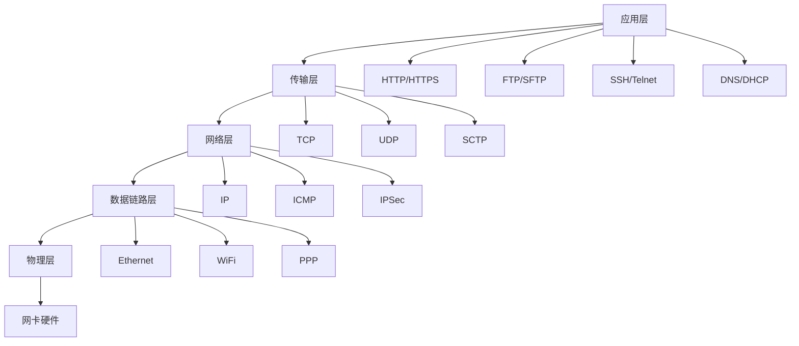

# Linux 网络管理

## 🌐 模块概述

网络管理是Linux系统管理的重要组成部分，涵盖网络配置、路由管理、防火墙配置、网络服务等关键内容。本模块基于TCP/IP协议栈和Linux网络子系统编写。

## 📚 核心内容

### 🔧 [网络基础配置](network-configuration.md)
- **网络接口管理** - 物理接口、虚拟接口配置
- **IP地址配置** - 静态IP、DHCP客户端配置
- **路由配置** - 静态路由、默认网关设置
- **DNS配置** - 域名解析和DNS服务器配置

### 🔀 [路由与交换](routing-switching.md)
- **路由表管理** - 路由添加、删除、修改
- **高级路由** - 策略路由、多路径路由
- **网桥配置** - Linux网桥和虚拟交换
- **VLAN管理** - 虚拟局域网配置

### 🛡️ [防火墙与安全](firewall-security.md)
- **iptables/netfilter** - 传统防火墙配置
- **firewalld** - 动态防火墙管理
- **nftables** - 现代防火墙框架
- **网络安全策略** - 访问控制和入侵防护

### 🚀 [网络服务](network-services.md)
- **SSH服务** - 安全远程访问配置
- **Web服务** - Apache、Nginx配置
- **DNS服务** - BIND域名服务配置
- **DHCP服务** - 动态主机配置协议

### 📊 [网络监控](network-monitoring.md)
- **流量监控** - 带宽使用和流量分析
- **连接监控** - TCP连接状态监控
- **性能分析** - 网络延迟和丢包分析
- **安全监控** - 入侵检测和异常监控

### 🔍 [故障诊断](network-troubleshooting.md)
- **连通性测试** - ping、traceroute诊断
- **端口扫描** - nmap、netcat网络探测
- **协议分析** - tcpdump、wireshark包分析
- **性能诊断** - 网络性能问题排查

## 🏗️ Linux网络架构

### 网络协议栈


### Linux网络子系统
```bash
# 网络命名空间
ip netns list                # 列出网络命名空间
ip netns add testns          # 创建网络命名空间
ip netns exec testns bash    # 在命名空间中执行命令

# 网络接口类型
ip link show                 # 显示所有网络接口
# 物理接口: eth0, enp0s3
# 虚拟接口: lo, veth, bridge, tun/tap
# 无线接口: wlan0, wlp3s0
```

## 🔧 核心工具命令

### 网络配置工具
```bash
# 现代网络工具 (iproute2)
ip addr         # IP地址管理
ip route        # 路由管理
ip link         # 链路管理
ip neigh        # ARP表管理

# 传统网络工具 (net-tools)
ifconfig        # 接口配置
route           # 路由配置
arp             # ARP表查看
netstat         # 网络连接状态
```

### 网络诊断工具
```bash
# 连通性测试
ping            # ICMP回音测试
ping6           # IPv6 ping测试
traceroute      # 路由跟踪
mtr             # 网络诊断工具

# 端口和服务检测
nmap            # 网络扫描
nc (netcat)     # 网络瑞士军刀
telnet          # Telnet客户端
ss              # 套接字统计
```

### 流量分析工具
```bash
# 数据包捕获
tcpdump         # 命令行包捕获
wireshark       # 图形化包分析
tshark          # Wireshark命令行版

# 流量监控
iftop           # 接口流量监控
nethogs         # 进程网络使用
vnstat          # 网络统计
bandwidthd      # 带宽监控
```

## 📋 网络管理清单

### 日常监控任务
- [ ] 检查网络接口状态和配置
- [ ] 监控网络流量和带宽使用
- [ ] 审查防火墙规则和日志
- [ ] 检查网络服务运行状态
- [ ] 验证DNS解析功能
- [ ] 监控网络连接数量
- [ ] 检查网络安全事件
- [ ] 分析网络性能指标

### 安全检查任务
- [ ] 防火墙规则审计
- [ ] 开放端口扫描和审查
- [ ] 网络流量异常检测
- [ ] 入侵检测系统检查
- [ ] SSL/TLS证书状态
- [ ] VPN连接状态验证
- [ ] 网络访问日志审查
- [ ] 安全补丁更新状态

## 🎯 网络配置实例

### 1. 静态IP配置
```bash
# 使用ip命令临时配置
ip addr add 192.168.1.100/24 dev eth0
ip route add default via 192.168.1.1

# 永久配置 (Ubuntu/Debian - Netplan)
cat > /etc/netplan/01-static-config.yaml << EOF
network:
  version: 2
  ethernets:
    eth0:
      addresses: [192.168.1.100/24]
      gateway4: 192.168.1.1
      nameservers:
        addresses: [8.8.8.8, 8.8.4.4]
EOF

netplan apply
```

### 2. 网桥配置
```bash
# 创建网桥
ip link add name br0 type bridge
ip link set dev br0 up

# 添加接口到网桥
ip link set dev eth0 master br0

# 配置网桥IP
ip addr add 192.168.1.10/24 dev br0
```

### 3. VLAN配置
```bash
# 创建VLAN接口
ip link add link eth0 name eth0.100 type vlan id 100
ip link set dev eth0.100 up

# 配置VLAN IP
ip addr add 10.0.100.1/24 dev eth0.100
```

### 4. 防火墙配置示例
```bash
# iptables基本规则
iptables -F  # 清空规则
iptables -P INPUT DROP
iptables -P FORWARD DROP
iptables -P OUTPUT ACCEPT

# 允许本地回环
iptables -I INPUT -i lo -j ACCEPT

# 允许已建立的连接
iptables -A INPUT -m state --state ESTABLISHED,RELATED -j ACCEPT

# 允许SSH
iptables -A INPUT -p tcp --dport 22 -j ACCEPT

# 允许HTTP和HTTPS
iptables -A INPUT -p tcp --dport 80 -j ACCEPT
iptables -A INPUT -p tcp --dport 443 -j ACCEPT

# 保存规则
iptables-save > /etc/iptables/rules.v4
```

## 🔍 网络故障排除流程

### 系统化诊断方法


### 故障诊断命令序列
```bash
# 1. 检查网络接口
ip link show
ip addr show

# 2. 检查路由
ip route show
ping -c 3 $(ip route | grep default | awk '{print $3}')

# 3. 检查DNS
nslookup google.com
dig google.com

# 4. 检查端口
ss -tlnp
netstat -tlnp

# 5. 检查防火墙
iptables -L -n
firewall-cmd --list-all  # firewalld

# 6. 检查服务
systemctl status networking
systemctl status NetworkManager
```

## 📊 网络性能监控

### 关键性能指标
| 指标 | 正常范围 | 监控工具 | 说明 |
|------|----------|----------|------|
| 带宽利用率 | <80% | iftop, vnstat | 网络带宽使用率 |
| 网络延迟 | <50ms | ping, mtr | 网络响应时间 |
| 数据包丢失率 | <0.1% | ping, mtr | 网络质量指标 |
| 连接数 | 视情况而定 | ss, netstat | TCP连接数量 |
| DNS解析时间 | <100ms | dig, nslookup | 域名解析延迟 |

### 性能监控脚本
```bash
#!/bin/bash
# 网络性能监控脚本

# 检查网络延迟
ping_test() {
    local target=${1:-"8.8.8.8"}
    local result=$(ping -c 4 $target | tail -1 | awk '{print $4}' | cut -d'/' -f2)
    echo "平均延迟到 $target: ${result}ms"
}

# 检查带宽使用
bandwidth_check() {
    local interface=${1:-"eth0"}
    local rx1=$(cat /sys/class/net/$interface/statistics/rx_bytes)
    local tx1=$(cat /sys/class/net/$interface/statistics/tx_bytes)
    sleep 1
    local rx2=$(cat /sys/class/net/$interface/statistics/rx_bytes)
    local tx2=$(cat /sys/class/net/$interface/statistics/tx_bytes)
    
    local rx_rate=$(( (rx2 - rx1) / 1024 ))
    local tx_rate=$(( (tx2 - tx1) / 1024 ))
    
    echo "接口 $interface - RX: ${rx_rate} KB/s, TX: ${tx_rate} KB/s"
}

# 检查连接数
connection_check() {
    local tcp_conn=$(ss -t state established | wc -l)
    local udp_conn=$(ss -u | wc -l)
    echo "TCP连接数: $tcp_conn, UDP连接数: $udp_conn"
}

# 执行检查
echo "=== 网络性能监控 ==="
ping_test "8.8.8.8"
ping_test "114.114.114.114"
bandwidth_check "eth0"
connection_check
```

## 🔐 网络安全配置

### 基础安全配置
```bash
# 禁用不必要的网络服务
systemctl disable telnet
systemctl disable rsh
systemctl disable rlogin

# 配置TCP Wrappers
echo "sshd: 192.168.1.0/24" >> /etc/hosts.allow
echo "ALL: ALL" >> /etc/hosts.deny

# 内核网络参数安全调优
cat > /etc/sysctl.d/99-network-security.conf << EOF
# IP转发控制
net.ipv4.ip_forward = 0

# SYN Flood防护
net.ipv4.tcp_syncookies = 1
net.ipv4.tcp_max_syn_backlog = 2048

# ICMP重定向
net.ipv4.conf.all.accept_redirects = 0
net.ipv4.conf.all.send_redirects = 0

# 源路由
net.ipv4.conf.all.accept_source_route = 0

# 时间戳请求响应
net.ipv4.icmp_echo_ignore_timestamps = 1

# 广播ping忽略
net.ipv4.icmp_echo_ignore_broadcasts = 1
EOF

sysctl -p /etc/sysctl.d/99-network-security.conf
```

### 网络入侵检测
```bash
# 安装fail2ban
apt install fail2ban  # Debian/Ubuntu
dnf install fail2ban  # Fedora/RHEL

# 基本配置
cat > /etc/fail2ban/jail.local << EOF
[DEFAULT]
bantime = 3600
findtime = 600
maxretry = 3
backend = systemd

[sshd]
enabled = true
port = 22
logpath = %(sshd_log)s
maxretry = 3
EOF

systemctl enable --now fail2ban
```

## 📚 学习资源

### 官方文档
- [Linux网络文档](https://www.kernel.org/doc/html/latest/networking/)
- [iproute2文档](https://wiki.linuxfoundation.org/networking/iproute2)
- [iptables文档](https://netfilter.org/documentation/)

### 网络协议标准
- [TCP/IP协议栈RFC](https://tools.ietf.org/rfc/)
- [IEEE网络标准](https://www.ieee.org/standards/)

### 实用指南
- [Linux网络管理员指南](https://tldp.org/LDP/nag2/index.html)
- [网络安全最佳实践](https://www.sans.org/reading-room/)

## 🚀 实践建议

### 实验环境
1. **虚拟网络** - 使用VirtualBox/VMware网络模拟
2. **容器网络** - Docker和Kubernetes网络实践
3. **云网络** - 公有云网络服务体验

### 实践项目
1. **企业网络配置** - 多子网、VLAN、防火墙配置
2. **负载均衡配置** - HAProxy、Nginx负载均衡
3. **VPN服务搭建** - OpenVPN、WireGuard配置
4. **网络监控系统** - Nagios、Zabbix网络监控

---

*开始您的网络管理学习之路：[网络基础配置](network-configuration.md)*
