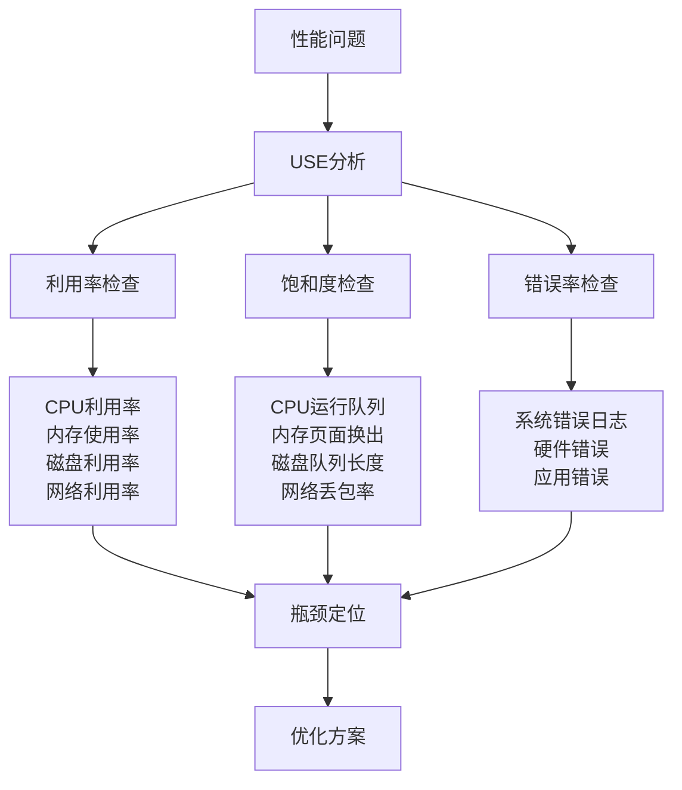
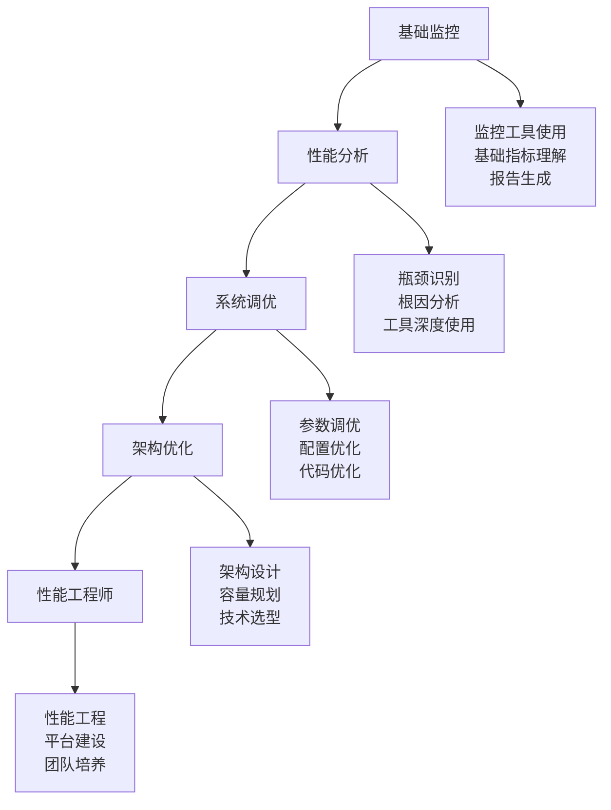

# Linux 性能优化与调优

## ⚡ 模块概述

Linux性能优化是系统管理的高级技能，涵盖性能分析、系统调优、瓶颈识别等关键内容。本模块基于Linux性能工程实践和业界调优经验编写，适用于性能工程师和高级系统管理员。

## 📚 核心内容

### 📊 [性能监控与分析](performance-monitoring.md)
- **系统性能指标** - CPU、内存、磁盘、网络关键指标
- **监控工具使用** - top、htop、iostat、vmstat等工具
- **性能基线建立** - 性能基准测试和基线数据收集
- **瓶颈识别方法** - 系统瓶颈定位和分析技术

### 🔧 [CPU性能优化](cpu-optimization.md)
- **CPU调度器调优** - CFS、RT调度器参数优化
- **CPU亲和性设置** - 进程CPU绑定和NUMA优化
- **中断优化** - 中断负载均衡和优化技术
- **多核处理优化** - 多核系统性能调优策略

### 💾 [内存性能优化](memory-optimization.md)
- **内存管理调优** - 虚拟内存参数优化
- **大页内存使用** - HugePage配置和使用场景
- **内存压缩优化** - zswap、zcache等技术应用
- **NUMA优化** - 非一致内存访问优化

### 💿 [存储I/O优化](storage-optimization.md)
- **I/O调度器选择** - 不同负载的调度器优化
- **文件系统调优** - ext4、XFS、Btrfs性能优化
- **磁盘队列优化** - 队列深度和合并策略调优
- **SSD优化配置** - 固态硬盘专用优化技术

### 🌐 [网络性能优化](network-optimization.md)
- **网络栈调优** - TCP/UDP协议栈参数优化
- **网卡性能优化** - 中断合并、RSS、TSO等技术
- **带宽和延迟优化** - 网络性能调优策略
- **高性能网络配置** - 10Gbps+网络环境优化

### 🔍 [应用性能分析](application-analysis.md)
- **应用性能剖析** - 程序热点分析和优化
- **数据库性能调优** - MySQL、PostgreSQL优化
- **Web服务器优化** - Apache、Nginx性能调优
- **容器性能优化** - Docker容器性能调优

## 🏗️ 性能分析方法论

### USE方法论 (Utilization, Saturation, Errors)


### 性能分析工具图谱
```bash
# Linux性能工具全景
#           网络         磁盘        内存        CPU
#      ┌─────────────┬──────────┬──────────┬──────────┐
#监控  │ ss, netstat │ iostat   │ free     │ top      │
#分析  │ tcpdump     │ iotop    │ pmap     │ perf     │
#调优  │ tc, ethtool │ tune2fs  │ sysctl   │ taskset  │
#      └─────────────┴──────────┴──────────┴──────────┘

# 查看系统性能概览
uptime                    # 负载均衡
free -h                   # 内存使用
df -h                     # 磁盘使用
iostat -x 1              # I/O统计
vmstat 1                 # 虚拟内存统计
```

## 🔧 性能分析工具

### 系统级监控工具
```bash
# CPU性能监控
top                       # 实时进程监控
htop                      # 增强版top
atop                      # 高级系统监控
nmon                      # 性能监控工具

# 内存分析工具
free -h                   # 内存使用情况
vmstat 1 10              # 虚拟内存统计
pmap -x PID              # 进程内存映射
smem                     # 详细内存使用

# 磁盘I/O分析
iostat -x 1              # I/O扩展统计
iotop -a                 # I/O进程监控
dstat -d                 # 磁盘统计
```

### 高级性能分析工具
```bash
# perf性能分析套件
perf top                 # 实时性能热点
perf record -g program   # 记录性能数据
perf report              # 分析性能报告
perf stat program        # 性能计数器统计

# SystemTap动态跟踪
stap -e 'probe kernel.function("vfs_read") { 
    printf("read from %s\n", execname()) }'

# ftrace内核跟踪
echo function > /sys/kernel/debug/tracing/current_tracer
echo 1 > /sys/kernel/debug/tracing/tracing_on
```

## 📋 性能优化清单

### 系统基础优化
- [ ] 更新到最新稳定内核版本
- [ ] 选择合适的内核调度器
- [ ] 优化内核启动参数
- [ ] 配置合适的文件系统
- [ ] 设置合理的swap策略
- [ ] 调整文件描述符限制
- [ ] 优化网络参数配置
- [ ] 配置系统资源限制

### 应用层优化
- [ ] 分析应用性能热点
- [ ] 优化数据库配置
- [ ] 调整Web服务器参数
- [ ] 配置缓存策略
- [ ] 优化应用并发处理
- [ ] 减少不必要的系统调用
- [ ] 使用性能更好的算法
- [ ] 配置连接池和资源池

## 🎯 性能调优实例

### 1. CPU密集型应用优化
```bash
# CPU绑定和调度优化
#!/bin/bash

# 获取CPU核心数
CORES=$(nproc)
echo "系统CPU核心数: $CORES"

# 设置CPU调度器为性能模式
for cpu in /sys/devices/system/cpu/cpu*/cpufreq/scaling_governor; do
    echo performance > $cpu 2>/dev/null || true
done

# 禁用不必要的内核功能
echo 0 > /proc/sys/kernel/numa_balancing
echo 1 > /proc/sys/kernel/sched_autogroup_enabled

# 设置进程优先级和CPU亲和性
APP_PID=$(pgrep myapp)
if [ ! -z "$APP_PID" ]; then
    # 设置高优先级
    renice -10 $APP_PID
    
    # 绑定到特定CPU核心
    taskset -cp 2-7 $APP_PID
    
    echo "应用进程 $APP_PID 已优化"
fi

# 中断负载均衡
echo 2 > /proc/irq/24/smp_affinity  # 网卡中断绑定到CPU1
echo 4 > /proc/irq/25/smp_affinity  # 磁盘中断绑定到CPU2
```

### 2. 内存密集型应用优化
```bash
# 内存优化配置
cat > /etc/sysctl.d/99-memory-tuning.conf << EOF
# 虚拟内存调优
vm.swappiness = 1
vm.dirty_ratio = 10
vm.dirty_background_ratio = 5
vm.dirty_expire_centisecs = 1000
vm.dirty_writeback_centisecs = 100

# 大页内存配置
vm.nr_hugepages = 1024
vm.hugetlb_shm_group = 1001

# 内存过量分配
vm.overcommit_memory = 1
vm.overcommit_ratio = 100

# NUMA策略
vm.zone_reclaim_mode = 0
EOF

# 应用配置
sysctl -p /etc/sysctl.d/99-memory-tuning.conf

# 为应用配置大页内存
echo "vm.nr_hugepages=2048" >> /etc/sysctl.conf
mkdir -p /mnt/hugepages
mount -t hugetlbfs hugetlbfs /mnt/hugepages
```

### 3. I/O密集型应用优化
```bash
# 存储I/O优化脚本
#!/bin/bash

# 检测磁盘类型并设置合适的调度器
for disk in $(lsblk -d -o NAME | grep -v NAME); do
    if [ -f /sys/block/$disk/queue/rotational ]; then
        rotational=$(cat /sys/block/$disk/queue/rotational)
        
        if [ "$rotational" = "0" ]; then
            # SSD优化
            echo mq-deadline > /sys/block/$disk/queue/scheduler
            echo 0 > /sys/block/$disk/queue/add_random
            echo 2 > /sys/block/$disk/queue/rq_affinity
            echo "SSD $disk 优化完成"
        else
            # HDD优化
            echo bfq > /sys/block/$disk/queue/scheduler
            echo 512 > /sys/block/$disk/queue/nr_requests
            echo "HDD $disk 优化完成"
        fi
    fi
done

# 文件系统优化
mount -o remount,noatime,nodiratime /
mount -o remount,commit=60 /home

# 内核I/O参数优化
echo 16384 > /sys/block/sda/queue/read_ahead_kb
echo 64 > /proc/sys/vm/dirty_background_ratio
echo 80 > /proc/sys/vm/dirty_ratio
```

### 4. 网络性能优化
```bash
# 网络性能调优配置
cat > /etc/sysctl.d/99-network-performance.conf << EOF
# TCP窗口缩放
net.ipv4.tcp_window_scaling = 1

# TCP接收/发送缓冲区
net.core.rmem_max = 268435456
net.core.wmem_max = 268435456
net.ipv4.tcp_rmem = 4096 87380 268435456
net.ipv4.tcp_wmem = 4096 65536 268435456

# TCP拥塞控制
net.ipv4.tcp_congestion_control = bbr
net.core.default_qdisc = fq

# 网络设备队列
net.core.netdev_max_backlog = 10000
net.core.netdev_budget = 600

# TCP快速打开
net.ipv4.tcp_fastopen = 3

# 减少TIME_WAIT套接字数量
net.ipv4.tcp_tw_reuse = 1
net.ipv4.tcp_fin_timeout = 15

# SYN队列大小
net.ipv4.tcp_max_syn_backlog = 8192
net.core.somaxconn = 65535
EOF

sysctl -p /etc/sysctl.d/99-network-performance.conf

# 网卡优化
ethtool -K eth0 tso on
ethtool -K eth0 gso on  
ethtool -K eth0 gro on
ethtool -C eth0 rx-usecs 100
```

## 📊 性能基准测试

### 系统基准测试套件
```bash
# 安装基准测试工具
apt install sysbench fio hdparm iperf3 stress-ng

# CPU性能测试
sysbench cpu --cpu-max-prime=20000 --threads=4 run

# 内存性能测试
sysbench memory --memory-block-size=1K --memory-scope=global \
    --memory-total-size=10G --threads=4 run

# 磁盘I/O测试
fio --name=random-rw --ioengine=libaio --iodepth=16 \
    --rw=randrw --bs=4k --direct=1 --size=1G --numjobs=4 \
    --runtime=60 --group_reporting

# 网络性能测试
# 服务器端
iperf3 -s

# 客户端
iperf3 -c server_ip -t 60 -P 4
```

### 性能监控脚本
```bash
#!/bin/bash
# 性能监控和报告脚本

LOG_FILE="/var/log/performance-monitor.log"
THRESHOLD_CPU=80
THRESHOLD_MEMORY=85
THRESHOLD_DISK=90

log_message() {
    echo "$(date '+%Y-%m-%d %H:%M:%S') - $1" | tee -a "$LOG_FILE"
}

# CPU使用率检查
check_cpu() {
    local cpu_usage=$(top -bn1 | grep "Cpu(s)" | awk '{print $2}' | cut -d'%' -f1)
    if (( $(echo "$cpu_usage > $THRESHOLD_CPU" | bc -l) )); then
        log_message "WARNING: High CPU usage: ${cpu_usage}%"
        
        # 显示CPU密集型进程
        ps aux --sort=-%cpu | head -10 | while read line; do
            log_message "  $line"
        done
    fi
}

# 内存使用检查
check_memory() {
    local mem_usage=$(free | grep Mem | awk '{printf "%.0f", $3/$2 * 100.0}')
    if [ $mem_usage -gt $THRESHOLD_MEMORY ]; then
        log_message "WARNING: High memory usage: ${mem_usage}%"
        
        # 显示内存使用详情
        log_message "Memory details:"
        free -h | tee -a "$LOG_FILE"
    fi
}

# 磁盘使用检查
check_disk() {
    df -h | grep -vE '^Filesystem|tmpfs|cdrom' | awk '{ print $5 " " $1 }' | \
    while read output; do
        usage=$(echo $output | awk '{print $1}' | cut -d'%' -f1)
        partition=$(echo $output | awk '{print $2}')
        
        if [ $usage -gt $THRESHOLD_DISK ]; then
            log_message "WARNING: High disk usage on $partition: ${usage}%"
        fi
    done
}

# I/O性能检查
check_io() {
    local io_wait=$(iostat -x 1 3 | tail -1 | awk '{print $10}')
    if (( $(echo "$io_wait > 20" | bc -l) )); then
        log_message "WARNING: High I/O wait: ${io_wait}%"
        
        # 显示I/O密集型进程
        iotop -ao -d 1 -n 3 | grep -v "Total DISK" | head -10 | \
        while read line; do
            log_message "  $line"
        done
    fi
}

# 主循环
main() {
    log_message "Performance monitoring started"
    
    while true; do
        check_cpu
        check_memory  
        check_disk
        check_io
        
        sleep 60  # 每分钟检查一次
    done
}

# 运行监控
main
```

## 📊 性能指标和目标

### 关键性能指标（KPIs）
| 指标类别 | 指标名称 | 理想值 | 警告阈值 | 严重阈值 |
|----------|----------|--------|----------|----------|
| CPU | CPU利用率 | <70% | 70-85% | >85% |
| CPU | 负载均衡 | <CPU核数 | CPU核数×1.5 | CPU核数×2 |
| 内存 | 内存使用率 | <75% | 75-85% | >85% |
| 内存 | Swap使用率 | 0% | 1-10% | >10% |
| 存储 | 磁盘使用率 | <80% | 80-90% | >90% |
| 存储 | I/O等待时间 | <10% | 10-20% | >20% |
| 网络 | 带宽利用率 | <70% | 70-85% | >85% |
| 网络 | 网络延迟 | <10ms | 10-50ms | >50ms |

### 应用性能目标
```bash
# Web应用性能目标
响应时间: <200ms (95th percentile)
吞吐量: >1000 RPS
错误率: <0.1%
可用性: 99.9%

# 数据库性能目标  
查询响应时间: <100ms
事务吞吐量: >500 TPS
连接池使用率: <80%
缓存命中率: >90%
```

## 📚 学习资源

### 权威书籍
- **《性能之巅》** - Brendan Gregg (Linux性能优化经典)
- **《Linux性能调优指南》** - 详细的调优实践
- **《系统性能调优》** - 企业级性能调优指南
- **《高性能Linux服务器构建实战》** - 实战经验总结

### 在线资源
- [Brendan Gregg's Blog](http://www.brendangregg.com/) - 性能分析专家博客
- [Linux Performance](http://www.linuxperformance.com/) - Linux性能专门网站
- [Performance Co-Pilot](https://pcp.io/) - 系统性能监控框架
- [Netflix Technology Blog](https://netflixtechblog.com/) - 大规模系统性能优化

### 工具和资源
- [perf-tools](https://github.com/brendangregg/perf-tools) - 性能分析工具集
- [FlameGraph](https://github.com/brendangregg/FlameGraph) - 火焰图生成工具
- [BCC Tools](https://github.com/iovisor/bcc) - eBPF性能工具
- [ftrace](https://www.kernel.org/doc/html/latest/trace/ftrace.html) - 内核跟踪框架

## 🚀 性能工程师发展路径

### 技能发展阶梯


### 专业认证
- **Linux性能分析师认证** - Linux Foundation
- **系统性能工程师认证** - 行业认证
- **云性能优化认证** - 云厂商认证
- **APM工具认证** - 监控工具厂商认证

---

*开始您的性能优化之旅：[性能监控与分析](performance-monitoring.md)*
