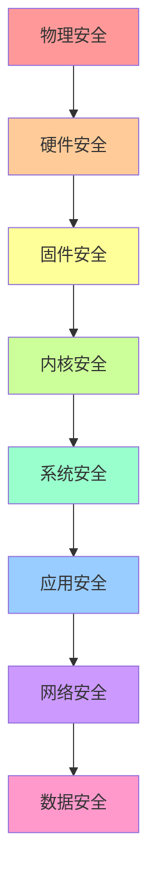

# Linux 安全管理

## 🔒 模块概述

Linux安全管理涵盖系统加固、访问控制、加密技术、入侵检测等关键领域。本模块基于安全基线标准、CIS基准和安全最佳实践编写，适用于企业级安全环境。

## 📚 核心内容

### 🛡️ [系统安全基础](system-security-basics.md)
- **安全威胁模型** - 常见威胁和攻击向量分析
- **安全策略制定** - 企业安全策略框架
- **风险评估** - 安全风险识别和评估方法
- **合规要求** - 行业标准和法规遵循

### 🔐 [访问控制](access-control.md)
- **身份认证** - 用户身份验证机制
- **权限管理** - 最小权限原则和权限分离
- **强制访问控制** - SELinux、AppArmor配置
- **多因素认证** - 2FA/MFA实施

### 🔑 [加密与密钥管理](encryption-key-management.md)
- **对称加密** - AES等对称加密算法应用
- **非对称加密** - RSA、ECC公钥加密体系
- **数字证书** - PKI体系和证书管理
- **密钥管理** - 密钥生成、存储、轮换

### 🚨 [入侵检测与防护](intrusion-detection.md)
- **入侵检测系统** - HIDS、NIDS部署配置
- **异常行为检测** - 用户行为分析和异常检测
- **安全事件响应** - 事件响应流程和应急处理
- **取证分析** - 数字取证和证据保全

### 🔍 [安全审计](security-auditing.md)
- **系统审计** - auditd配置和日志分析
- **权限审计** - 用户权限和访问审计
- **文件完整性** - 文件完整性监控和验证
- **合规检查** - 自动化合规性检查

### 🛠️ [安全工具](security-tools.md)
- **漏洞扫描** - Nessus、OpenVAS漏洞扫描
- **渗透测试** - Kali Linux渗透测试工具
- **安全加固** - 系统加固工具和脚本
- **安全监控** - SIEM系统和安全运营

## 🏗️ Linux安全架构

### 安全层次模型


### Linux安全机制
```bash
# 查看安全模块状态
cat /sys/kernel/security/lsm
# 可能输出: capability,yama,apparmor 或 capability,yama,selinux

# SELinux状态
getenforce          # 查看SELinux状态
sestatus            # 详细状态信息

# AppArmor状态  
aa-status           # 查看AppArmor状态
apparmor_status     # 详细状态信息

# 审计系统状态
systemctl status auditd
auditctl -l         # 查看审计规则
```

## 🔧 安全工具命令

### 访问控制工具
```bash
# 用户管理
useradd -m -s /bin/bash username    # 创建用户
usermod -L username                 # 锁定用户
passwd -e username                  # 强制密码过期

# 权限管理
sudo -l                            # 查看sudo权限
visudo                             # 编辑sudo配置
su - username                      # 切换用户

# SELinux管理
setsebool                          # 设置SELinux布尔值
semanage                           # SELinux策略管理
restorecon                         # 恢复文件上下文
```

### 加密工具
```bash
# 文件加密
gpg --symmetric file.txt           # 对称加密文件
gpg --encrypt -r user file.txt     # 公钥加密文件
gpg --decrypt file.txt.gpg         # 解密文件

# 磁盘加密
cryptsetup luksFormat /dev/sdb1    # 创建LUKS加密分区
cryptsetup luksOpen /dev/sdb1 encrypted  # 打开加密分区

# SSH密钥管理
ssh-keygen -t rsa -b 4096          # 生成RSA密钥
ssh-copy-id user@host              # 复制公钥到远程主机
```

### 监控和审计工具
```bash
# 系统审计
auditctl -w /etc/passwd -p wa      # 监控文件修改
ausearch -f /etc/passwd            # 搜索审计日志
aureport --summary                 # 审计报告

# 安全扫描
nmap -sS -O target_host            # 端口扫描和OS识别
nikto -h http://target             # Web漏洞扫描
```

## 📋 安全检查清单

### 日常安全任务
- [ ] 检查用户登录异常和失败尝试
- [ ] 审查sudo使用记录和权限变更
- [ ] 监控系统资源异常使用
- [ ] 检查网络连接和开放端口
- [ ] 验证关键文件完整性
- [ ] 分析安全日志和告警
- [ ] 更新安全补丁和签名
- [ ] 检查防火墙规则和配置

### 定期安全审计
- [ ] 用户权限审计和清理
- [ ] 系统配置安全基线检查
- [ ] 网络安全配置审查
- [ ] 应用程序安全扫描
- [ ] 数据加密状态检查
- [ ] 备份系统安全性验证
- [ ] 入侵检测系统测试
- [ ] 应急响应程序演练

## 🎯 安全配置实例

### 1. 系统基础加固
```bash
#!/bin/bash
# 系统安全基础加固脚本

# 禁用不必要的服务
systemctl disable telnet
systemctl disable rsh
systemctl disable rlogin
systemctl disable tftp

# 设置密码策略
cat > /etc/security/pwquality.conf << EOF
minlen = 12
minclass = 3
maxrepeat = 2
dcredit = -1
ucredit = -1
lcredit = -1
ocredit = -1
EOF

# 配置账户锁定策略
cat > /etc/security/faillock.conf << EOF
audit
silent
deny = 5
fail_interval = 900
unlock_time = 600
EOF

# 设置登录横幅
cat > /etc/issue << EOF
***************************************************************************
                            NOTICE TO USERS
This computer system is the private property of its owner, whether
individual, corporate or government. It is for authorized use only.
Users (authorized or unauthorized) have no explicit or implicit
expectation of privacy.
***************************************************************************
EOF

echo "基础加固配置完成"
```

### 2. SSH安全配置
```bash
# SSH服务安全配置
cat > /etc/ssh/sshd_config << EOF
# SSH服务端口（非标准端口）
Port 2222

# 协议版本
Protocol 2

# 禁用root直接登录
PermitRootLogin no

# 禁用密码认证（使用密钥认证）
PasswordAuthentication no
PubkeyAuthentication yes

# 禁用空密码登录
PermitEmptyPasswords no

# 限制用户和组
AllowUsers alice bob
DenyUsers baduser

# 会话配置
ClientAliveInterval 300
ClientAliveCountMax 2
LoginGraceTime 60

# 禁用X11转发（如不需要）
X11Forwarding no

# 禁用TCP转发（如不需要）
AllowTcpForwarding no

# 日志记录
LogLevel INFO
SyslogFacility AUTHPRIV
EOF

# 重启SSH服务
systemctl restart sshd
```

### 3. 防火墙配置
```bash
#!/bin/bash
# iptables防火墙安全配置

# 清空现有规则
iptables -F
iptables -X
iptables -t nat -F
iptables -t nat -X

# 设置默认策略
iptables -P INPUT DROP
iptables -P FORWARD DROP
iptables -P OUTPUT ACCEPT

# 允许本地回环
iptables -A INPUT -i lo -j ACCEPT
iptables -A OUTPUT -o lo -j ACCEPT

# 允许已建立的连接
iptables -A INPUT -m state --state ESTABLISHED,RELATED -j ACCEPT

# 允许SSH（非标准端口）
iptables -A INPUT -p tcp --dport 2222 -m state --state NEW -m recent --set --name SSH
iptables -A INPUT -p tcp --dport 2222 -m state --state NEW -m recent --update --seconds 60 --hitcount 4 --name SSH -j DROP
iptables -A INPUT -p tcp --dport 2222 -j ACCEPT

# 允许HTTP和HTTPS
iptables -A INPUT -p tcp --dport 80 -j ACCEPT
iptables -A INPUT -p tcp --dport 443 -j ACCEPT

# 防止SYN Flood攻击
iptables -A INPUT -p tcp --syn -m limit --limit 1/s --limit-burst 3 -j ACCEPT
iptables -A INPUT -p tcp --syn -j DROP

# 防止ping洪水攻击
iptables -A INPUT -p icmp --icmp-type echo-request -m limit --limit 1/s -j ACCEPT

# 记录被丢弃的包
iptables -A INPUT -m limit --limit 3/min --limit-burst 3 -j LOG --log-prefix "IPT INPUT drop: "
iptables -A OUTPUT -m limit --limit 3/min --limit-burst 3 -j LOG --log-prefix "IPT OUTPUT drop: "
iptables -A FORWARD -m limit --limit 3/min --limit-burst 3 -j LOG --log-prefix "IPT FORWARD drop: "

# 保存规则
iptables-save > /etc/iptables/rules.v4

echo "防火墙配置完成"
```

### 4. 审计系统配置
```bash
# 配置auditd审计规则
cat > /etc/audit/rules.d/audit.rules << EOF
# 删除所有现有规则
-D

# 设置缓冲区大小
-b 8192

# 设置失败模式
-f 1

# 监控重要文件修改
-w /etc/passwd -p wa -k identity
-w /etc/group -p wa -k identity
-w /etc/shadow -p wa -k identity
-w /etc/sudoers -p wa -k privilege-escalation

# 监控关键目录
-w /etc/ -p wa -k config-change
-w /bin/ -p wa -k binary-change
-w /sbin/ -p wa -k binary-change
-w /usr/bin/ -p wa -k binary-change
-w /usr/sbin/ -p wa -k binary-change

# 监控系统调用
-a always,exit -F arch=b64 -S chmod -S fchmod -S fchmodat -k permission-change
-a always,exit -F arch=b64 -S chown -S fchown -S fchownat -k permission-change

# 监控网络相关系统调用
-a always,exit -F arch=b64 -S socket -S bind -S connect -S listen -k network-access

# 监控进程执行
-a always,exit -F arch=b64 -S execve -k process-execution

# 监控文件删除
-a always,exit -F arch=b64 -S unlink -S unlinkat -S rename -S renameat -k file-deletion

# 锁定审计规则
-e 2
EOF

# 重启审计服务
systemctl restart auditd

echo "审计系统配置完成"
```

## 🔍 安全监控与检测

### 实时安全监控脚本
```bash
#!/bin/bash
# 安全监控脚本

LOG_FILE="/var/log/security-monitor.log"

log_message() {
    echo "$(date '+%Y-%m-%d %H:%M:%S') - $1" | tee -a "$LOG_FILE"
}

# 检查登录失败
check_login_failures() {
    local failures=$(journalctl -u ssh --since "10 minutes ago" | grep "Failed password" | wc -l)
    if [ $failures -gt 5 ]; then
        log_message "ALERT: $failures SSH login failures in last 10 minutes"
        
        # 获取攻击IP
        journalctl -u ssh --since "10 minutes ago" | grep "Failed password" | 
        awk '{print $(NF-3)}' | sort | uniq -c | sort -nr | head -5 | 
        while read count ip; do
            log_message "  IP: $ip attempted $count times"
        done
    fi
}

# 检查sudo使用
check_sudo_usage() {
    local sudo_count=$(journalctl --since "10 minutes ago" | grep "sudo:" | wc -l)
    if [ $sudo_count -gt 0 ]; then
        log_message "INFO: $sudo_count sudo commands executed in last 10 minutes"
        journalctl --since "10 minutes ago" | grep "sudo:" | tail -5 | 
        while IFS= read -r line; do
            log_message "  $line"
        done
    fi
}

# 检查异常进程
check_abnormal_processes() {
    # 检查CPU使用率高的进程
    local high_cpu=$(ps aux --sort=-%cpu | awk 'NR==2 {if($3>80) print $2,$11,$3}')
    if [ ! -z "$high_cpu" ]; then
        log_message "ALERT: High CPU process detected: $high_cpu"
    fi
    
    # 检查新的网络连接
    local new_connections=$(ss -tuln | grep LISTEN | wc -l)
    local expected_connections=10  # 根据实际情况调整
    if [ $new_connections -gt $expected_connections ]; then
        log_message "WARNING: More listening ports than expected: $new_connections"
    fi
}

# 检查文件系统变化
check_filesystem_changes() {
    # 检查重要文件的修改时间
    local passwd_mtime=$(stat -c %Y /etc/passwd)
    local shadow_mtime=$(stat -c %Y /etc/shadow)
    local current_time=$(date +%s)
    
    # 如果在最近10分钟内修改过
    if [ $((current_time - passwd_mtime)) -lt 600 ]; then
        log_message "ALERT: /etc/passwd modified recently"
    fi
    
    if [ $((current_time - shadow_mtime)) -lt 600 ]; then
        log_message "ALERT: /etc/shadow modified recently"
    fi
}

# 主监控循环
main() {
    log_message "Security monitoring started"
    
    while true; do
        check_login_failures
        check_sudo_usage
        check_abnormal_processes
        check_filesystem_changes
        
        sleep 300  # 每5分钟检查一次
    done
}

# 检查是否为root用户
if [ "$EUID" -ne 0 ]; then
    echo "This script must be run as root"
    exit 1
fi

# 运行监控
main
```

## 📊 安全指标和阈值

### 关键安全指标
| 指标 | 正常阈值 | 警告阈值 | 严重阈值 | 检查频率 |
|------|----------|----------|----------|----------|
| 登录失败次数 | <5/10分钟 | 5-10/10分钟 | >10/10分钟 | 实时 |
| sudo命令使用 | <20/小时 | 20-50/小时 | >50/小时 | 10分钟 |
| 新进程创建率 | <100/分钟 | 100-200/分钟 | >200/分钟 | 1分钟 |
| 文件修改频率 | <10/小时 | 10-30/小时 | >30/小时 | 5分钟 |
| 网络连接数 | <1000 | 1000-2000 | >2000 | 1分钟 |

### 安全评分系统
```bash
# 安全评分计算脚本
#!/bin/bash

calculate_security_score() {
    local score=100
    local details=""
    
    # 检查密码策略 (20分)
    if ! grep -q "minlen = 12" /etc/security/pwquality.conf 2>/dev/null; then
        score=$((score - 5))
        details="${details}密码长度要求不足(-5); "
    fi
    
    # 检查SSH配置 (20分)
    if grep -q "PermitRootLogin yes" /etc/ssh/sshd_config 2>/dev/null; then
        score=$((score - 10))
        details="${details}允许root SSH登录(-10); "
    fi
    
    if grep -q "PasswordAuthentication yes" /etc/ssh/sshd_config 2>/dev/null; then
        score=$((score - 5))
        details="${details}允许密码认证(-5); "
    fi
    
    # 检查防火墙状态 (20分)
    if ! systemctl is-active --quiet iptables && ! systemctl is-active --quiet firewalld; then
        score=$((score - 20))
        details="${details}防火墙未运行(-20); "
    fi
    
    # 检查审计系统 (20分)
    if ! systemctl is-active --quiet auditd; then
        score=$((score - 15))
        details="${details}审计系统未运行(-15); "
    fi
    
    # 检查SELinux/AppArmor (20分)
    if ! command -v getenforce >/dev/null 2>&1 && ! command -v aa-status >/dev/null 2>&1; then
        score=$((score - 20))
        details="${details}强制访问控制未配置(-20); "
    fi
    
    echo "安全评分: $score/100"
    echo "扣分详情: $details"
    
    if [ $score -ge 90 ]; then
        echo "安全等级: 优秀"
    elif [ $score -ge 80 ]; then
        echo "安全等级: 良好"
    elif [ $score -ge 70 ]; then
        echo "安全等级: 一般"
    else
        echo "安全等级: 需要改进"
    fi
}

calculate_security_score
```

## 📚 安全学习资源

### 官方文档和标准
- [CIS基准](https://www.cisecurity.org/cis-benchmarks/) - 安全配置基准
- [NIST网络安全框架](https://www.nist.gov/cyberframework) - 网络安全管理框架
- [SELinux文档](https://github.com/SELinuxProject/selinux/wiki) - SELinux官方文档
- [OWASP指南](https://owasp.org/) - Web应用安全指南

### 安全工具和资源
- [Kali Linux](https://www.kali.org/) - 渗透测试发行版
- [OSSEC](https://www.ossec.net/) - 开源HIDS系统
- [Lynis](https://cisofy.com/lynis/) - 系统安全审计工具
- [OpenSCAP](https://www.open-scap.org/) - 安全合规扫描

### 认证和培训
- **CompTIA Security+** - 基础安全认证
- **CISSP** - 信息安全专业认证
- **CEH** - 道德黑客认证
- **GCIH** - 事件处理认证

## 🚀 实践建议

### 实验环境
1. **虚拟实验室** - 使用虚拟机搭建安全测试环境
2. **容器安全** - 练习容器安全配置和扫描
3. **云安全** - 学习云平台安全最佳实践

### 实践项目
1. **企业安全基线** - 建立完整的安全配置基线
2. **入侵检测系统** - 部署和配置IDS/IPS系统
3. **安全合规检查** - 自动化安全合规扫描系统
4. **事件响应演练** - 模拟安全事件响应流程

---

*开始您的安全管理学习之路：[系统安全基础](system-security-basics.md)*
