# Linux 系统管理

## 📋 模块概述

系统管理是Linux运维的核心技能，涵盖用户管理、服务管理、软件包管理、系统监控、备份恢复等关键领域。本模块基于企业级Linux系统管理最佳实践编写。

## 📚 学习内容

### 👥 [用户与组管理](user-management.md)
- **用户账户管理** - 创建、修改、删除用户账户
- **组管理** - 用户组的创建和权限分配
- **权限系统** - 文件权限、特殊权限、ACL
- **sudo配置** - 权限提升和安全策略

### ⚙️ [服务与进程管理](service-management.md)
- **Systemd管理** - 现代init系统和服务管理
- **进程管理** - 进程监控、调度、信号处理
- **任务调度** - Cron、At、Systemd Timer
- **资源控制** - Cgroups资源限制和控制

### 📦 [软件包管理](package-management.md)
- **APT系统** - Debian/Ubuntu包管理
- **YUM/DNF系统** - Red Hat/Fedora包管理
- **源码安装** - 编译安装和依赖管理
- **容器化部署** - Docker和Podman应用部署

### 📊 [系统监控](system-monitoring.md)
- **性能监控** - CPU、内存、磁盘、网络监控
- **日志管理** - Systemd Journal、Rsyslog、日志轮转
- **监控工具** - top、htop、iotop、nethogs等
- **报警系统** - 阈值监控和自动报警

### 🔄 [备份与恢复](backup-recovery.md)
- **备份策略** - 全量备份、增量备份、差异备份
- **备份工具** - rsync、tar、dump/restore
- **系统恢复** - 启动修复、文件系统恢复
- **灾难恢复** - 系统重建和数据恢复

### 🔧 [系统配置管理](configuration-management.md)
- **配置文件管理** - 重要配置文件和模板
- **环境配置** - 系统环境变量和shell配置
- **自动化配置** - Ansible和配置管理工具
- **版本控制** - 配置文件的版本管理

## 🎯 学习路径

### 🔰 基础管理员 (2-3周)

```mermaid
graph LR
    A[用户管理] --> B[权限系统]
    B --> C[基本服务]
    C --> D[软件安装]
    D --> E[系统监控]
```


1. **用户与权限** - 掌握用户管理和权限控制
2. **基本服务** - 理解systemd和常用服务
3. **软件管理** - 熟练使用包管理器
4. **监控基础** - 使用基本监控命令

### 🔸 中级管理员 (1-2个月)

```mermaid
graph LR
    A[高级服务] --> B[性能调优]
    B --> C[日志分析]
    C --> D[备份策略]
    D --> E[安全配置]
```


1. **高级服务管理** - 复杂服务配置和故障排除
2. **性能调优** - 系统性能分析和优化
3. **日志管理** - 集中日志和分析
4. **备份恢复** - 完整的数据保护策略

### 🔺 高级管理员 (持续学习)

```mermaid
graph LR
    A[自动化运维] --> B[监控告警]
    B --> C[容器管理]
    C --> D[集群管理]
    D --> E[DevOps集成]
```


1. **自动化运维** - 使用Ansible等工具
2. **监控告警** - 企业级监控系统
3. **容器化** - Docker和Kubernetes管理
4. **DevOps** - CI/CD和基础设施即代码

## 🛠️ 核心工具和命令

### 用户管理工具
```bash
# 用户管理
useradd         # 创建用户
usermod         # 修改用户
userdel         # 删除用户
passwd          # 修改密码

# 组管理
groupadd        # 创建组
groupmod        # 修改组
groupdel        # 删除组
gpasswd         # 组密码管理

# 权限查看
id              # 查看用户身份
groups          # 查看用户组
getent          # 查看用户数据库
```

### 服务管理工具
```bash
# Systemd管理
systemctl       # 服务控制
journalctl      # 日志查看
systemd-analyze # 启动分析
loginctl        # 会话管理

# 进程管理
ps              # 进程查看
pgrep           # 进程查找
pkill           # 进程终止
jobs            # 任务管理
```

### 系统监控工具
```bash
# 性能监控
top             # 实时进程监控
htop            # 增强版top
iotop           # IO监控
nload           # 网络流量监控

# 系统信息
uname           # 系统信息
uptime          # 运行时间
df              # 磁盘使用
free            # 内存使用
```

## 📋 管理检查清单

### 日常维护任务
- [ ] 检查系统资源使用情况
- [ ] 审查系统日志和错误信息
- [ ] 更新软件包和安全补丁
- [ ] 验证备份任务执行状态
- [ ] 监控服务运行状态
- [ ] 检查磁盘空间使用情况
- [ ] 审查用户登录和权限
- [ ] 清理临时文件和日志

### 周期性任务
- [ ] 系统性能基线测试
- [ ] 备份数据完整性验证
- [ ] 安全补丁和更新规划
- [ ] 用户权限审计
- [ ] 服务配置备份
- [ ] 监控阈值调整
- [ ] 容量规划评估
- [ ] 文档更新维护

### 应急响应准备
- [ ] 系统故障应急预案
- [ ] 数据恢复程序测试
- [ ] 联系人和升级程序
- [ ] 备用系统和环境
- [ ] 关键配置文件备份
- [ ] 监控告警配置
- [ ] 日志分析工具
- [ ] 性能基线数据

## 🔧 企业级最佳实践

### 1. 用户管理策略
```bash
# 用户策略配置
cat > /etc/login.defs << 'EOF'
# 密码有效期
PASS_MAX_DAYS   90
PASS_MIN_DAYS   1
PASS_WARN_AGE   7

# 用户ID范围
UID_MIN         1000
UID_MAX         60000
GID_MIN         1000
GID_MAX         60000
EOF
```

### 2. 服务管理规范
```bash
# 服务模板示例
cat > /etc/systemd/system/myapp.service << 'EOF'
[Unit]
Description=My Application Service
After=network.target

[Service]
Type=simple
User=myapp
Group=myapp
ExecStart=/opt/myapp/bin/myapp
Restart=always
RestartSec=10

[Install]
WantedBy=multi-user.target
EOF
```

### 3. 监控配置标准
```bash
# 系统监控脚本
cat > /usr/local/bin/system-check.sh << 'EOF'
#!/bin/bash

# 检查系统负载
load=$(uptime | awk '{print $12}' | cut -d, -f1)
if (( $(echo "$load > 5.0" | bc -l) )); then
    echo "HIGH LOAD: $load" | logger -t system-monitor
fi

# 检查磁盘使用
df -h | awk '$5 > 85 {print "DISK FULL: " $1 " " $5}' | logger -t system-monitor

# 检查内存使用
mem_usage=$(free | grep Mem | awk '{printf "%.0f", $3/$2 * 100.0}')
if [ $mem_usage -gt 90 ]; then
    echo "HIGH MEMORY: ${mem_usage}%" | logger -t system-monitor
fi
EOF

chmod +x /usr/local/bin/system-check.sh
```

## 📊 系统管理指标

### 关键性能指标 (KPIs)
- **系统可用性**: 99.9%+ 目标
- **响应时间**: 应用响应 < 2秒
- **资源利用率**: CPU < 80%, 内存 < 85%
- **存储使用**: 磁盘使用 < 85%
- **备份成功率**: 99%+ 目标

### 监控阈值标准
| 指标 | 警告阈值 | 严重阈值 | 监控频率 |
|------|----------|----------|----------|
| CPU使用率 | 70% | 85% | 1分钟 |
| 内存使用率 | 80% | 90% | 1分钟 |
| 磁盘使用率 | 80% | 90% | 5分钟 |
| 系统负载 | CPU数×1.5 | CPU数×2 | 1分钟 |
| 网络延迟 | 100ms | 500ms | 30秒 |

## 🔒 安全管理要点

### 访问控制
```bash
# sudo配置示例
cat > /etc/sudoers.d/admin-users << 'EOF'
# 管理员组权限
%wheel ALL=(ALL) ALL

# 应用管理权限
%appmanagers ALL=(appuser) NOPASSWD: /bin/systemctl restart myapp
%appmanagers ALL=(appuser) NOPASSWD: /bin/systemctl status myapp

# 备份权限
backupuser ALL=(ALL) NOPASSWD: /usr/bin/rsync, /bin/tar
EOF
```

### 审计配置
```bash
# auditd规则示例
cat > /etc/audit/rules.d/audit.rules << 'EOF'
# 监控重要文件修改
-w /etc/passwd -p wa -k user-modify
-w /etc/group -p wa -k group-modify
-w /etc/shadow -p wa -k shadow-modify
-w /etc/sudoers -p wa -k sudoers-modify

# 监控系统调用
-a always,exit -F arch=b64 -S adjtimex -S settimeofday -k time-change
-a always,exit -F arch=b64 -S clock_settime -k time-change

# 监控网络配置
-w /etc/sysconfig/network-scripts/ -p wa -k network-config
EOF
```

## 📚 参考文档和资源

### 官方文档
- [Systemd文档](https://systemd.io/) - 现代init系统
- [Red Hat文档](https://access.redhat.com/documentation/) - 企业级指南
- [Ubuntu服务器指南](https://ubuntu.com/server/docs) - Ubuntu官方文档

### 工具文档
- [rsync手册](https://rsync.samba.org/documentation.html) - 备份同步工具
- [Ansible文档](https://docs.ansible.com/) - 自动化配置管理
- [Nagios文档](https://www.nagios.org/documentation/) - 监控系统

### 最佳实践指南
- [Linux系统管理员指南](https://tldp.org/LDP/sag/html/)
- [CIS基准](https://www.cisecurity.org/cis-benchmarks/) - 安全配置基准
- [NIST网络安全框架](https://www.nist.gov/cyberframework) - 安全管理框架

## 🚀 实战练习建议

### 环境搭建
1. **虚拟机环境** - 使用VirtualBox/VMware搭建测试环境
2. **容器环境** - 使用Docker练习容器化部署
3. **云环境** - 使用AWS/Azure/阿里云练习云管理

### 实践项目
1. **Web服务器部署** - 完整的LAMP/LEMP环境部署
2. **监控系统搭建** - 使用Prometheus+Grafana
3. **备份系统设计** - 完整的数据保护方案
4. **自动化运维** - 使用Ansible实现配置管理

---

*准备深入学习系统管理了吗？从 [用户与组管理](user-management.md) 开始您的管理员之路！*
