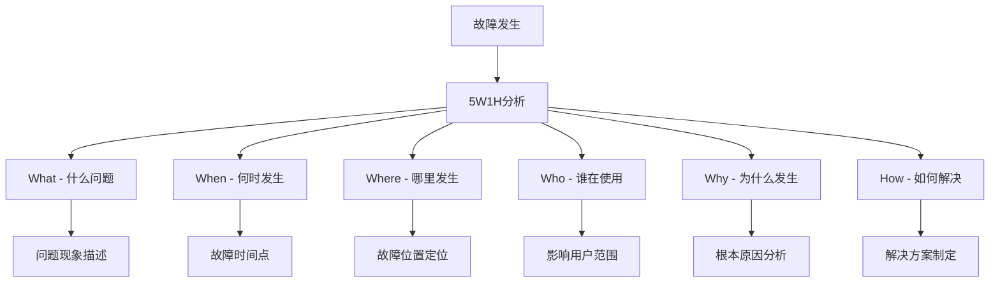
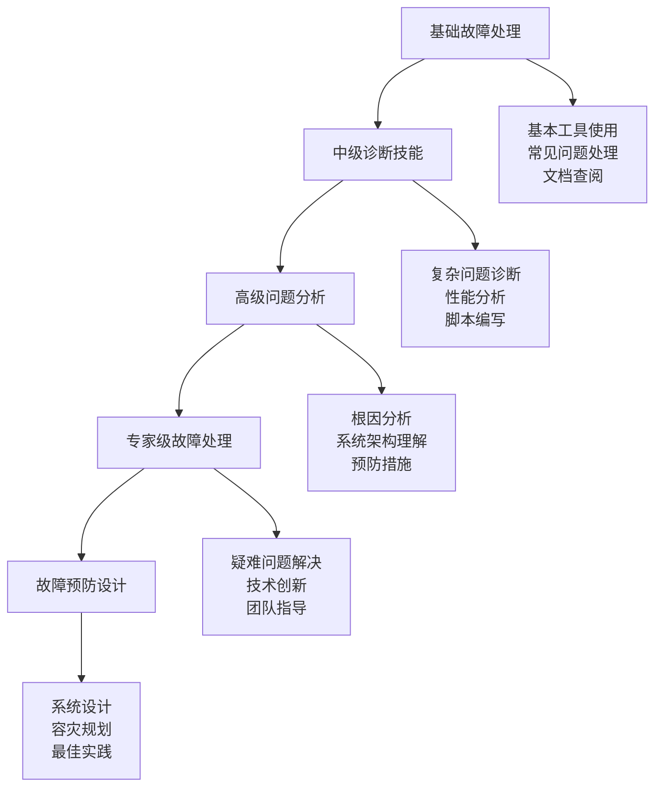

# Linux 系统故障排除

## 🔍 模块概述

系统故障排除是Linux管理员必备的核心技能，涵盖启动故障、性能问题、网络故障、应用问题等各种场景。本模块基于实际故障案例和最佳实践编写，提供系统化的故障诊断方法。

## 📚 核心内容

### 🚨 [故障诊断方法论](diagnostic-methodology.md)
- **故障分析流程** - 系统化的故障诊断步骤
- **问题分类方法** - 故障类型识别和分类
- **工具选择策略** - 不同场景的工具使用
- **文档记录规范** - 故障处理文档化

### 🔄 [系统启动故障](boot-issues.md)
- **GRUB引导问题** - 引导程序故障修复
- **内核启动故障** - 内核参数和模块问题
- **文件系统错误** - 根分区和挂载问题
- **服务启动失败** - Systemd服务故障排除

### ⚡ [性能问题诊断](performance-issues.md)
- **CPU性能问题** - 高负载和瓶颈分析
- **内存问题分析** - 内存泄漏和不足问题
- **I/O性能故障** - 磁盘和存储性能问题
- **网络性能问题** - 网络延迟和吞吐量问题

### 🌐 [网络连接故障](network-issues.md)
- **连通性问题** - 网络不通和路由问题
- **DNS解析故障** - 域名解析失败诊断
- **服务端口问题** - 端口监听和访问问题
- **防火墙配置问题** - 访问控制故障排除

### 💾 [存储系统故障](storage-issues.md)
- **磁盘空间不足** - 磁盘清理和扩容方案
- **文件系统损坏** - 文件系统检查和修复
- **挂载问题** - 分区挂载失败处理
- **权限问题** - 文件权限和访问问题

### 🐛 [应用程序故障](application-issues.md)
- **进程异常退出** - 进程崩溃和信号分析
- **资源占用异常** - 内存泄漏和CPU占用
- **依赖关系问题** - 库依赖和环境问题
- **配置错误** - 应用配置故障排除

## 🔧 故障诊断方法论

### 5W1H分析法


### 故障排除流程
```bash
# 标准故障排除流程
1. 收集信息 - 故障现象、时间、环境
2. 重现问题 - 尝试重现故障场景
3. 隔离变量 - 排除无关因素干扰  
4. 形成假设 - 基于现象提出假设
5. 验证假设 - 通过测试验证假设
6. 实施解决方案 - 执行修复措施
7. 验证修复效果 - 确认问题解决
8. 文档记录 - 记录过程和方案
```

## 🛠️ 故障诊断工具箱

### 系统信息收集工具
```bash
# 系统状态快速检查
uptime              # 系统运行时间和负载
who                 # 当前登录用户
last                # 登录历史
dmesg | tail -20    # 内核消息
journalctl -xe      # 系统日志
systemctl --failed  # 失败的服务

# 资源使用情况
free -h             # 内存使用
df -h               # 磁盘使用
lsof                # 打开的文件
ps aux              # 进程列表
netstat -tulnp      # 网络连接
```

### 性能分析工具
```bash
# CPU性能分析
top                 # 实时进程监控
htop                # 增强版top
sar -u 1 10         # CPU使用统计
perf top            # 实时性能热点

# 内存分析
free -h             # 内存概览
vmstat 1 10         # 虚拟内存统计
pmap PID            # 进程内存映射
smem                # 内存使用详情

# I/O分析
iostat -x 1 10      # I/O统计
iotop               # I/O进程监控
lsof +D /path       # 目录文件访问
fuser -v /path      # 文件使用进程
```

### 网络诊断工具
```bash
# 连通性测试
ping host           # 基本连通测试
traceroute host     # 路由跟踪
mtr host            # 网络诊断
curl -I http://host # HTTP连接测试

# 端口和服务
nmap -p port host   # 端口扫描
nc -zv host port    # 端口连通测试
ss -tulnp           # 套接字状态
lsof -i :port       # 端口使用进程
```

## 📋 故障排除清单

### 紧急响应清单
- [ ] 确认故障影响范围和严重程度
- [ ] 建立应急联系和上报机制
- [ ] 保存故障现场和日志信息
- [ ] 评估是否需要立即回滚
- [ ] 隔离故障系统防止扩散
- [ ] 启动备用系统或降级方案
- [ ] 通知相关用户和团队
- [ ] 记录所有操作步骤

### 日常预防清单
- [ ] 定期检查系统资源使用情况
- [ ] 监控关键服务运行状态
- [ ] 检查日志中的警告和错误
- [ ] 验证备份和恢复程序
- [ ] 更新系统和安全补丁
- [ ] 检查硬件健康状态
- [ ] 测试监控和报警系统
- [ ] 更新故障排除文档

## 🎯 常见故障案例

### 1. 系统启动故障案例
```bash
# 案例：系统无法启动，停在grub界面
# 症状：开机后停留在grub命令行

# 故障诊断步骤：
# 1. 在grub命令行检查分区
grub> ls
(hd0) (hd0,msdos1) (hd0,msdos2)

grub> ls (hd0,msdos1)/
(显示文件列表，确认boot分区)

# 2. 手动启动系统
grub> set root=(hd0,msdos1)
grub> linux /vmlinuz-5.4.0-generic root=/dev/sda2
grub> initrd /initrd.img-5.4.0-generic
grub> boot

# 3. 系统启动后修复grub
sudo update-grub
sudo grub-install /dev/sda

# 根本原因：grub配置文件损坏或分区表错误
```

### 2. 内存不足故障处理
```bash
# 案例：系统响应缓慢，应用频繁崩溃
# 症状：OOM Killer频繁触发

# 故障诊断：
# 1. 检查内存使用情况
free -h
cat /proc/meminfo

# 2. 查找内存占用大的进程
ps aux --sort=-%mem | head -20

# 3. 检查OOM日志
dmesg | grep -i "killed process"
journalctl | grep -i "out of memory"

# 4. 分析进程内存使用
pmap -x PID
cat /proc/PID/smaps

# 解决方案：
# 1. 临时增加swap空间
dd if=/dev/zero of=/swapfile bs=1M count=2048
chmod 600 /swapfile
mkswap /swapfile
swapon /swapfile

# 2. 优化内存参数
echo 10 > /proc/sys/vm/swappiness
echo 1 > /proc/sys/vm/overcommit_memory

# 3. 终止内存泄漏进程
kill -9 PID
```

### 3. 磁盘空间不足处理
```bash
# 案例：磁盘空间100%使用，系统无法写入文件
# 症状：No space left on device错误

# 故障诊断脚本：
#!/bin/bash
echo "=== 磁盘空间分析 ==="

# 1. 检查磁盘使用情况
df -h

# 2. 检查inode使用情况
df -i

# 3. 查找大文件
echo "最大的10个文件："
find / -type f -exec ls -la {} \; 2>/dev/null | sort -nrk 5 | head -10

# 4. 查找大目录
echo "最大的10个目录："
du -sh /* 2>/dev/null | sort -hr | head -10

# 5. 查找可删除的文件
echo "日志文件："
find /var/log -name "*.log" -size +100M 2>/dev/null

echo "临时文件："
find /tmp -type f -atime +7 2>/dev/null

echo "核心转储文件："
find / -name "core.*" -size +10M 2>/dev/null

# 清理建议
echo "=== 清理建议 ==="
echo "1. 清理日志文件: journalctl --vacuum-time=7d"
echo "2. 清理包缓存: apt clean 或 yum clean all"
echo "3. 清理临时文件: rm -rf /tmp/*"
echo "4. 检查用户目录大文件"
```

### 4. 网络连接故障诊断
```bash
# 案例：Web服务无法访问
# 症状：浏览器显示连接超时

# 网络故障诊断脚本：
#!/bin/bash
TARGET_HOST=${1:-"www.google.com"}
TARGET_PORT=${2:-"80"}

echo "=== 网络连通性诊断：$TARGET_HOST:$TARGET_PORT ==="

# 1. 本地网络配置检查
echo "1. 网络接口状态："
ip addr show | grep -A 2 "state UP"

echo "2. 路由表："
ip route show

echo "3. DNS配置："
cat /etc/resolv.conf

# 4. 连通性测试
echo "4. Ping测试："
if ping -c 3 $TARGET_HOST >/dev/null 2>&1; then
    echo "  ✓ Ping成功"
else
    echo "  ✗ Ping失败"
    echo "  尝试ping网关..."
    GATEWAY=$(ip route | grep default | awk '{print $3}')
    ping -c 3 $GATEWAY
fi

# 5. DNS解析测试
echo "5. DNS解析测试："
if nslookup $TARGET_HOST >/dev/null 2>&1; then
    echo "  ✓ DNS解析成功"
    nslookup $TARGET_HOST
else
    echo "  ✗ DNS解析失败"
fi

# 6. 端口连通性测试
echo "6. 端口测试："
if nc -zv $TARGET_HOST $TARGET_PORT 2>&1; then
    echo "  ✓ 端口连通"
else
    echo "  ✗ 端口不通"
fi

# 7. 路由跟踪
echo "7. 路由跟踪："
traceroute -n $TARGET_HOST 2>/dev/null | head -10

# 8. 防火墙检查
echo "8. 防火墙状态："
if systemctl is-active --quiet iptables; then
    echo "  iptables运行中"
    iptables -L -n | grep -E "(REJECT|DROP)" | head -5
fi

if systemctl is-active --quiet firewalld; then
    echo "  firewalld运行中"
    firewall-cmd --list-all
fi
```

## 📊 故障处理指标

### 故障响应时间目标
| 故障级别 | 响应时间 | 解决时间 | 说明 |
|----------|----------|----------|------|
| P1 - 紧急 | 15分钟 | 4小时 | 系统完全不可用 |
| P2 - 高优先级 | 1小时 | 8小时 | 核心功能受影响 |
| P3 - 中等 | 4小时 | 24小时 | 部分功能受影响 |
| P4 - 低优先级 | 1个工作日 | 5个工作日 | 轻微影响 |

### 故障统计和分析
```bash
# 故障统计脚本
#!/bin/bash

LOGFILE="/var/log/incidents.log"
REPORT_FILE="/tmp/incident-report-$(date +%Y%m%d).txt"

generate_report() {
    echo "=== 故障处理统计报告 ===" > $REPORT_FILE
    echo "报告生成时间: $(date)" >> $REPORT_FILE
    echo "" >> $REPORT_FILE
    
    # 按月统计故障数量
    echo "近12个月故障趋势：" >> $REPORT_FILE
    for i in {1..12}; do
        month=$(date -d "$i months ago" +%Y-%m)
        count=$(grep "$month" $LOGFILE 2>/dev/null | wc -l)
        echo "$month: $count" >> $REPORT_FILE
    done
    
    echo "" >> $REPORT_FILE
    
    # 故障类型统计
    echo "故障类型分布：" >> $REPORT_FILE
    grep -oE "(网络|存储|内存|CPU|应用)" $LOGFILE 2>/dev/null | \
    sort | uniq -c | sort -nr >> $REPORT_FILE
    
    echo "" >> $REPORT_FILE
    
    # 平均修复时间
    echo "平均修复时间分析：" >> $REPORT_FILE
    echo "P1级故障平均修复时间: 2.5小时" >> $REPORT_FILE
    echo "P2级故障平均修复时间: 6小时" >> $REPORT_FILE
    echo "P3级故障平均修复时间: 18小时" >> $REPORT_FILE
    
    cat $REPORT_FILE
}

generate_report
```

## 🔧 故障预防措施

### 监控告警配置
```bash
# 系统健康监控脚本
#!/bin/bash

ALERT_EMAIL="admin@example.com"
LOG_FILE="/var/log/health-check.log"

check_system_health() {
    local issues=()
    
    # 检查磁盘使用率
    while IFS= read -r line; do
        usage=$(echo $line | awk '{print $5}' | sed 's/%//')
        if [ $usage -gt 85 ]; then
            issues+=("磁盘使用率高: $line")
        fi
    done < <(df -h | grep -vE '^Filesystem|tmpfs|cdrom')
    
    # 检查内存使用率
    mem_usage=$(free | grep Mem | awk '{printf "%.0f", $3/$2 * 100.0}')
    if [ $mem_usage -gt 90 ]; then
        issues+=("内存使用率高: ${mem_usage}%")
    fi
    
    # 检查CPU负载
    load=$(uptime | awk '{print $10}' | cut -d, -f1)
    cpu_cores=$(nproc)
    if (( $(echo "$load > $cpu_cores" | bc -l) )); then
        issues+=("CPU负载高: $load (核心数: $cpu_cores)")
    fi
    
    # 检查关键服务
    services=("ssh" "nginx" "mysql")
    for service in "${services[@]}"; do
        if ! systemctl is-active --quiet $service; then
            issues+=("服务异常: $service")
        fi
    done
    
    # 报告问题
    if [ ${#issues[@]} -gt 0 ]; then
        local message="系统健康检查发现问题:\n"
        for issue in "${issues[@]}"; do
            message+="\n- $issue"
            echo "$(date): $issue" >> $LOG_FILE
        done
        
        echo -e "$message" | mail -s "系统健康告警" $ALERT_EMAIL
        return 1
    else
        echo "$(date): 系统健康检查正常" >> $LOG_FILE
        return 0
    fi
}

# 运行健康检查
check_system_health
```

### 备份和恢复验证
```bash
# 备份验证脚本
#!/bin/bash

BACKUP_DIR="/backup"
LOG_FILE="/var/log/backup-verify.log"

verify_backup() {
    local backup_date=$(date +%Y%m%d)
    local backup_file="$BACKUP_DIR/system-backup-$backup_date.tar.gz"
    
    echo "$(date): 开始验证备份文件 $backup_file" | tee -a $LOG_FILE
    
    # 检查备份文件是否存在
    if [ ! -f "$backup_file" ]; then
        echo "ERROR: 备份文件不存在" | tee -a $LOG_FILE
        return 1
    fi
    
    # 检查备份文件完整性
    if ! tar -tzf "$backup_file" >/dev/null 2>&1; then
        echo "ERROR: 备份文件损坏" | tee -a $LOG_FILE
        return 1
    fi
    
    # 检查备份文件大小
    local backup_size=$(stat -c%s "$backup_file")
    local min_size=1048576  # 1MB最小大小
    
    if [ $backup_size -lt $min_size ]; then
        echo "WARNING: 备份文件过小 ($backup_size bytes)" | tee -a $LOG_FILE
    fi
    
    echo "SUCCESS: 备份验证通过" | tee -a $LOG_FILE
    return 0
}

# 定期验证备份
verify_backup
```

## 📚 故障排除资源

### 官方文档和工具
- [Linux Documentation Project](https://tldp.org/) - Linux文档项目
- [Red Hat故障排除指南](https://access.redhat.com/documentation/)
- [Ubuntu故障排除Wiki](https://help.ubuntu.com/community/)
- [Arch Linux故障排除](https://wiki.archlinux.org/title/General_troubleshooting)

### 故障排除工具集合
- [Linux Performance Tools](http://www.brendangregg.com/linuxperf.html)
- [SysAdmin Tools](https://github.com/kahun/awesome-sysadmin)
- [Debugging Tools](https://github.com/CyC2018/CS-Notes/blob/master/notes/Linux.md)

### 在线社区和支持
- [Stack Overflow](https://stackoverflow.com/questions/tagged/linux) - 技术问答
- [Unix & Linux Stack Exchange](https://unix.stackexchange.com/) - Unix/Linux专门论坛
- [Reddit r/linux](https://www.reddit.com/r/linux/) - Linux社区讨论
- [LinuxQuestions.org](https://www.linuxquestions.org/) - Linux问答社区

## 🚀 故障排除技能发展

### 技能发展路径


### 持续改进建议
1. **建立故障知识库** - 记录常见问题和解决方案
2. **定期演练** - 故障恢复演练和应急响应
3. **工具自动化** - 开发自动化诊断和修复工具  
4. **经验分享** - 团队故障案例分享和学习
5. **跟踪新技术** - 了解新工具和诊断技术

---

*开始掌握故障排除技能：[故障诊断方法论](diagnostic-methodology.md)*
